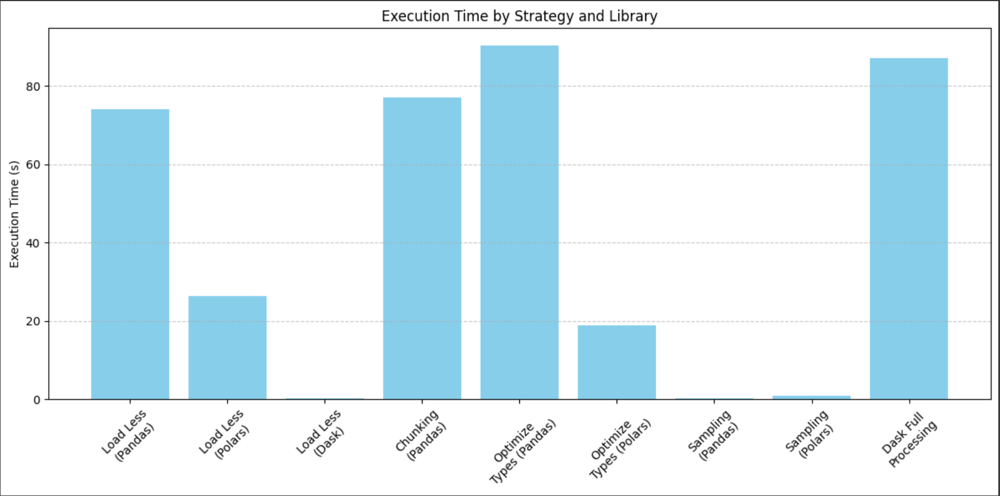
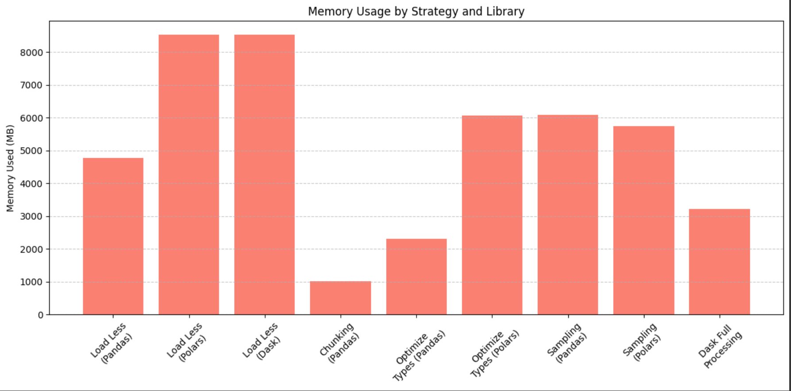

# 📘 Assignment 2: Mastering Big Data Handling  
### Group Members:
| Name              | Matric No       |
|-------------------|-----------------|
| CHE MARHUMI BIN CHE AB RAHIM   | A22EC0147      |

📅 **Submission Date:** 4 June 2025  

## 📌 Overview

This repository contains our submission for **Assignment 2: Mastering Big Data Handling**, where we explored strategies for efficiently working with large datasets that exceed traditional memory limits.

We used Python tools like **Pandas**, **Dask**, and **Polars** to process a dataset larger than 700MB, and compared performance across methods.

Our focus was on the **MyAnimeList final_animedataset.csv**, which includes rich data about users, anime titles, genres, and ratings — ideal for exploring big data handling techniques.

## 🧾 Dataset Used

| Property | Description |
|---------|-------------|
| **Name** | [MyAnimeList Dataset](https://www.kaggle.com/datasets/dbdmobile/myanimelist-dataset) |
| **Source** | Kaggle |
| **File Used** | `final_animedataset.csv` |
| **Size** | ~4.5 GB (full file), ~3+ GB usable data |
| **Columns Used** | `username`, `anime_id`, `my_score`, `genre`, `type`, `score` |
| **Domain** | Anime user reviews, ratings, and metadata |

---

## 🔍 Applied Strategies

We applied and benchmarked five key big data handling strategies:

1. **Load Less Data** – Load only necessary columns
2. **Use Chunking** – Process in batches using Pandas chunking
3. **Optimize Data Types** – Reduce memory usage with appropriate dtypes
4. **Sampling** – Use random sampling for fast prototyping
5. **Parallel Processing with Dask** – Leverage lazy evaluation and parallelism

---

## 📊 Performance Summary

| Strategy              | Library     | Execution Time (s) | Memory Used (MB) |
|-----------------------|-------------|--------------------|------------------|
| Load Less Data        | Pandas      | 74.03              | 4771.56          |
| Load Less Data        | Polars      | 26.33              | 8521.61          |
| Load Less Data        | Dask        | 0.24               | 8523.00          |
| Chunking              | Pandas      | 77.15              | 1016.05          |
| Optimize Types        | Pandas      | 90.25              | 2312.83          |
| Optimize Types        | Polars      | 18.88              | 6067.03          |
| Sampling              | Pandas      | 0.31               | 6077.17          |
| Sampling              | Polars      | 0.95               | 5742.82          |
| Dask Full Processing  | Dask        | 87.14              | 3212.63          |

> ⚠️ Note: Dask's fast time (0.24s) reflects lazy evaluation. Use `.compute()` to measure real load time.

---

## 📁 Folder Structure

| File           | Description | Link                          |
|----------------|-------------|-------------------------------|
| `big_data.md`  | Complete Markdown report showing dataset details, applied strategies, memory and time metrics, and final reflection |  |
| `big_data.ipynb` | Fully working Google Colab notebook with all strategies implemented | ) |

---

## 📈 Charts

- **Execution Time Comparison**  
  

- **Memory Usage Comparison**  
  

You can find the Python code to generate these charts inside **Task 4 notebook**.

---

## 🧪 Tools Used

| Tool/Library | Purpose |
|--------------|---------|
| 🐼 **Pandas** | For basic loading and processing |
| 🦖 **Polars** | For high-performance data loading and manipulation |
| 🚀 **Dask** | For out-of-core computation and parallel processing |
| 📊 **Matplotlib** | For visualizing execution time and memory usage |
| 🧮 **psutil** | For measuring memory consumption during operations |

---

## 🧾 Final Reflection

Through this assignment, we explored various big data handling strategies and compared their efficiency in terms of **execution time** and **memory usage**. We learned that:

- **Polars** offers the best performance in most scenarios due to its speed and optimized memory use.
- **Dask** is excellent for handling datasets larger than available RAM but requires understanding of lazy evaluation.
- **Pandas** remains user-friendly but struggles with large files unless combined with optimization techniques like column filtering or type conversion.
- **Chunking** and **sampling** are effective for early development and prototyping.

This hands-on experience helped us understand the trade-offs between different libraries and strategies when dealing with large-scale data.

---

## 📁 Repository Link

🔗 [GitHub Project Page](https://github.com/drshahizan/HPDP/tree/main/2425/assignment/A2/bdm/Solo%20Squad)

---

## 🧑‍💻 Developed by

**Solo Squad**  
A single-member team working on high-performance data processing using modern tools.

---

📌 *Made with ❤️ for HPDP Class — Dr. Shahizan bin Yusoff*

---
