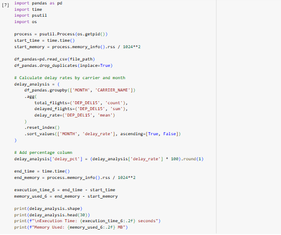
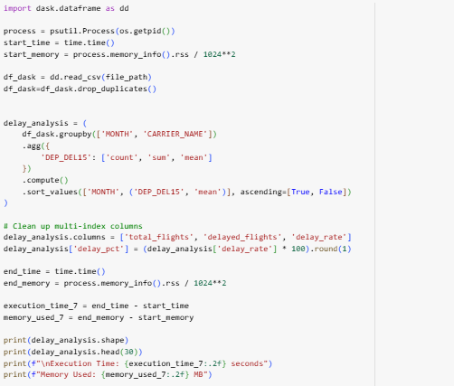
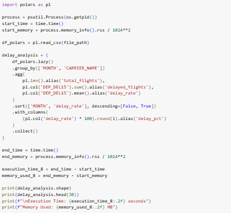
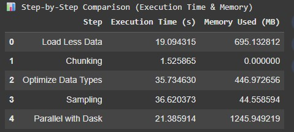
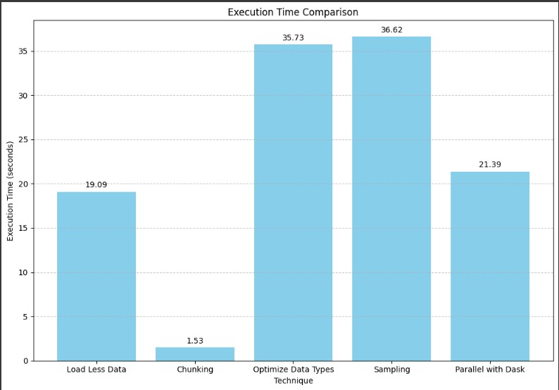
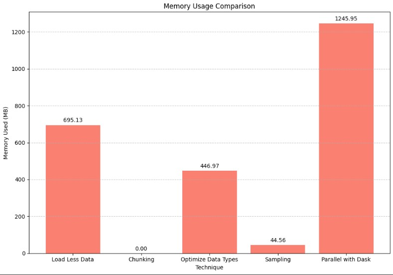
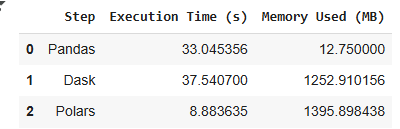
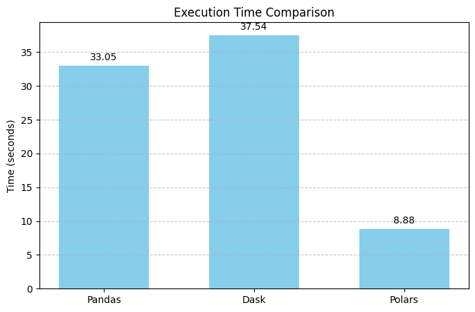
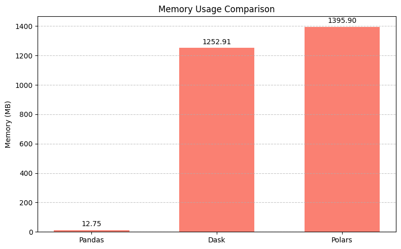

# 🧠 Big Data Analysis of 2019 Airline Delays with Weather & Airport Detail

This project explores **various strategies** for efficiently handling large-scale datasets and processing data using popular Python libraries: **Pandas**, **Dask**, and **Polars**. Through comparative evaluation, the goal is to identify techniques that improve **execution time** and **memory usage** for both data loading and processing tasks.

The performance evaluation is divided into two parts:

Part 1: Big Data Handling Strategies
  
**Objective**: Compare five strategic approaches for reading and optimizing large datasets using Pandas and Dask.

- 📌 Load Less Data  
- 📌 Use Chunking  
- 📌 Optimize Data Types  
- 📌 Sampling  
- 📌 Parallel Processing with Dask  

Part 2: Data Processing using 3 different libraries
  
**Objective**: Benchmark three Python libraries using traditional and optimized data processing pipelines.

- 🐼 **Pandas** (Traditional Processing)  
- 🧵 **Dask**   
- ⚡ **Polars** 
---

## 📂 Dataset Description

The dataset used in this project is full_data_flightdelay.csv (size: 1.27 GB), containing 6489062 of flight records from 2019. It simulates real-world big data challenges by combining flight schedules, weather conditions, and airline operations.

- Dataset: [2019 Airline Delays w/Weather and Airport Detail](https://www.kaggle.com/datasets/threnjen/2019-airline-delays-and-cancellations?resource=download)
- Size: 1.27 GB
- Records in dataset: 6489062

Below is a table describing 26 columns in the dataset:
| Column                          | Description                                                              |
| ------------------------------- | ------------------------------------------------------------------------ |
| `MONTH`                         | Month of the year (1-12)                                                 |
| `DAY_OF_WEEK`                   | Day of the week (1=Monday, 7=Sunday)                                     |
| `DEP_DEL15`                     | **Target:** Binary indicator (1 = Departure delayed over 15 mins)        |
| `DEP_TIME_BLK`                  | Departure time block                                                     |
| `DISTANCE_GROUP`                | Distance group to be flown by the aircraft                               |
| `SEGMENT_NUMBER`                | Segment index of the tail number for the day                             |
| `CONCURRENT_FLIGHTS`            | Flights departing concurrently within the same time block at the airport |
| `NUMBER_OF_SEATS`               | Number of seats on the aircraft                                          |
| `CARRIER_NAME`                  | Name of the airline carrier                                              |
| `AIRPORT_FLIGHTS_MONTH`         | Average monthly flights at the airport                                   |
| `AIRLINE_FLIGHTS_MONTH`         | Average monthly flights by the airline                                   |
| `AIRLINE_AIRPORT_FLIGHTS_MONTH` | Average monthly flights by the airline at the airport                    |
| `AVG_MONTHLY_PASS_AIRPORT`      | Average monthly passengers at the airport                                |
| `AVG_MONTHLY_PASS_AIRLINE`      | Average monthly passengers on the airline                                |
| `FLT_ATTENDANTS_PER_PASS`       | Flight attendants per passenger for the airline                          |
| `GROUND_SERV_PER_PASS`          | Ground service staff per passenger for the airline                       |
| `PLANE_AGE`                     | Age of the aircraft in years                                             |
| `DEPARTING_AIRPORT`             | Airport code for departure                                               |
| `LATITUDE`                      | Latitude of the departing airport                                        |
| `LONGITUDE`                     | Longitude of the departing airport                                       |
| `PREVIOUS_AIRPORT`              | Previous airport that aircraft departed from                                  |
| `PRCP`                          | Precipitation (inches) on the day of departure                           |
| `SNOW`                          | Snowfall (inches) on the day of departure                                |
| `SNWD`                          | Snow depth (inches) on the ground                                        |
| `TMAX`                          | Maximum temperature (°F) on the day of departure                         |
| `AWND`                          | Maximum wind speed (mph) on the day of departure                         |

---
## 🧪 Load and Inspect Data
Before applying the five optimization techniques, the full dataset was loaded using standard pandas.read_csv() to understand the baseline performance and structure of the data. This initial step allowed us to observe the raw resource usage when handling the full 1.27GB CSV file (full_data_flightdelay.csv) without any optimization.

Initial Loading Results:

- Execution Time: 35.45 seconds

- Memory Used: 3961.75 MB

  

This result highlights the performance limitations of loading large datasets without strategy. It also highlights the need to explore alternative methods for optimizing execution time and memory efficiency.

## 🧪 Strategy Implementations

We implemented **five data-loading and cleaning strategies** with Pandas, and used **Dask and Polars** for parallel and optimized processing:

###  Part 1: Big Data Handling Strategies
In this step-by-step comparison, five different data processing strategies were applied using only the Pandas library to evaluate their effectiveness in terms of execution time and memory usage. 

1. The **"Load Less Data"** strategy focused on minimizing the volume of data read into memory by selecting only necessary columns or filtering rows during import. This approach showed a balanced performance, with moderate execution time and memory usage. 
2. The **"Chunking"** method processed data in smaller batches using Pandas' `chunksize` parameter, which resulted in the fastest execution time and nearly zero memory usage, making it highly efficient for very large datasets that cannot be loaded entirely into memory. 
3. The **"Optimize Data Types"** strategy involved converting data columns to more memory-efficient types (such as changing float64 to float32 or object to category), which significantly reduced memory consumption but incurred a higher execution time due to the computational cost of conversion.
4. **"Sampling"** involved selecting a subset of the data to work with, reducing the memory footprint dramatically, but similar to data type optimization, it took longer to execute—likely due to the effort needed to create a representative sample. Lastly,
5. **"Parallel with Dask"**, while still using Pandas under the hood, distributed the workload across multiple cores. This led to better speed than loading all data at once, but it consumed the highest amount of memory due to the overhead from parallel processing.

Overall, each strategy has its trade-offs: chunking stands out as the most memory-efficient and fastest, while others like data type optimization and sampling are useful for long-term performance gains despite longer initial processing times.

### Part 2: Data Processing using 3 different libraries
In this part, the dataset undergoes data cleaning and analysis using Pandas, Dask, and Polars to compare their performance. The cleaning process included checking for null values and duplicates. Duplicated rows were found and removed , while no missing values were detected.

For the analysis, the data processing focused on evaluating airline performance by calculating the departure delay rate specifically the proportion of flights delayed more than 15 minutes. The analysis is grouped by month and carrier. The corresponding delay percentage was computed.

Each library was used to execute the same task, and the execution time and memory usage were recorded to assess their efficiency and identify which library handled the dataset most effectively for this type of analysis.

1. Pandas
  

What it does:
- Reads the full CSV into memory with pd.read_csv().

- Removes duplicates directly in memory.

- Groups data by MONTH and CARRIER_NAME, then:

- Counts total flights,

- Sums delayed flights (DEP_DEL15 == 1),

- Computes the average delay rate.

- Adds a delay percentage column.

2. Dask
  

What it does:
- Reads the CSV using lazy loading (doesn’t load all data at once).

- Drops duplicates in parallelized chunks.

- Groups data the same way as Pandas, but the operation is lazy until .compute() is called.

- Final result is converted to a Pandas DataFrame for output.

3. Polars
  

What it does:
- Uses Polars' lazy API for deferred computation.

- Groups and aggregates using efficient Polars expressions.

- Adds a calculated delay_pct column.

- Triggers execution with .collect() (similar to .compute() in Dask).

---

## 📊 Comparative Analysis 

A side-by-side comparison of each technique was conducted based on:

- **Execution Time (s)**
- **Memory Used (MB)**

###  Part 1: Big Data Handling Strategies

### 📈 Technique Comparison Chart

### Part 2: Data Processing using 3 different libraries
### 📈 Library Comparison Chart

---

## 📌 Conclusion & Reflection

In summary, **Chunking** had the best performance among the 5 big data handling techniques with the lowest exeuction time and memory usage. Meanwhile, **Sampling** was efficient in memory but still took longer time to process. **Parallel Processing** with Dask showed improvement in time but consumed significantly more memory. **Optimize Data Types** helped reduce memory but didn’t significantly improve time. Techniques like chunking and sampling significantly reduce memory usage and load time, making them practical choices for handling large datasets without overwhelming system resources.

For part 2, Polars was the fastest, with the execution time under 9 seconds, but required the highest memory. Pandas used the least memory, but its performance was noticeably slower.
Dask offered parallel processing but suffered in both speed and memory compared to the others, possibly due to overhead and compute operations. In conclusion, Polars is suitable for maximum speed when memory is not a constraint. Pandas should be used when working with smaller datasets or limited RAM while Dask should be applied in distributed environments or for chunk-based workloads where parallel execution is needed but compute power is sufficient.

| Method                         | Benefits                                        | Limitations                                          |
| ------------------------------ | ----------------------------------------------- | ---------------------------------------------------- |
| **Load Less Data**             | - Reduces overall memory usage                  | - Still takes time depending on file read scope      |
| **Chunking**                   | - Fastest loading time - Lowest memory usage | - Mostly beneficial for loading, not full processing |
| **Sampling**                   | - Low memory usage                              | - Slower processing compared to chunking             |
| **Optimize Data Types**        | - Significantly reduces memory usage            | - Minimal impact on execution time                   |
| **Parallel Processing (Dask)** | - Improved loading time via parallel execution  | - Very high memory consumption                       |

### Reflection
This assignment provided valuable insights into various techniques for handling big data. These methods demonstrated how different strategies affect execution time and memory usage, which is crucial when working with large-scale datasets.

Running the experiments on platforms like Google Colab highlighted practical limitations of cloud-based environments — limited resources can sometimes lead to runtime crashes, especially with large files or resource-intensive tasks. This underscores the importance of selecting strategies that align with the capabilities of the execution environment.

The comparison between Pandas, Dask, and Polars revealed that each library has strengths suited to specific use cases. Polars offers exceptional speed but at the cost of higher memory usage. Pandas is memory-efficient and well-suited for smaller datasets, though it is slower. Dask supports parallel processing and is beneficial in distributed settings but may incur additional overhead.

Overall, the experience emphasized the importance of scalable data processing strategies and the thoughtful selection of tools based on task complexity and system limitations.

---

## 🔗 Reference

1. [2019 Airline Delays w/Weather and Airport Detail](https://www.kaggle.com/datasets/threnjen/2019-airline-delays-and-cancellations?resource=download)
