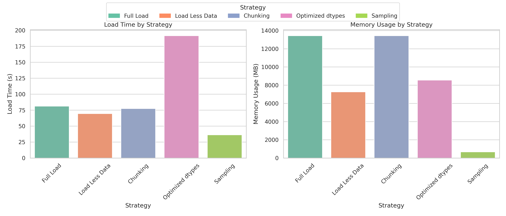
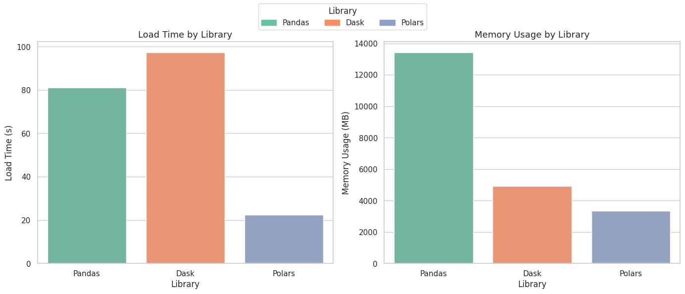

# 🎧 Big Data Handling Report: Spotify Charts Dataset

## 1. 📁 Dataset Overview  

### 🎵 Dataset: **Spotify Charts - Global & Regional**  
- **Source:** [Kaggle - Spotify Charts Dataset](https://www.kaggle.com/datasets/dhruvildave/spotify-charts)  
- **File Size:** ~3.48 GB  
- **Entries:** `26,173,514` rows and `9` columns  
- **Domain:** Music Streaming, Time Series  
- **Date Range:** Spanning from 2017 onward  

This dataset contains daily rankings for Spotify’s **Top 200** and **Viral 50** charts across multiple regions. Each row represents a song's rank on a specific chart in a specific region on a given date. It is ideal for exploring trends in music popularity and practicing large-scale data handling techniques.

---

### 📊 Dataset Snapshot

| Column Name | Description |
|-------------|-------------|
| `title`     | Name of the song as listed on Spotify. |
| `rank`      | The position of the song on the chart for the specific day and region. |
| `date`      | The chart date (daily granularity). |
| `artist`    | Name of the artist(s) of the song. |
| `url`       | Direct URL to the Spotify track. |
| `region`    | The geographical region (e.g., US, Global, Brazil). |
| `chart`     | The chart type – either **top200** or **viral50**. |
| `trend`     | Indicates if the song’s ranking is **new**, **re-entry**, or unchanged. |
| `streams`   | Number of times the song was streamed on that day in the region. |

> 📌 **Observation:**  
> The dataset includes a mix of categorical (`region`, `chart`, `trend`) and numerical (`rank`, `streams`) data. The text-heavy columns such as `title` and `artist` consume memory due to their string nature.

## 2. ⏱️📊 Measurement Techniques: Time, Memory & Sampling

To evaluate and compare the performance of various big data handling strategies, we used a consistent set of tools to measure **execution time**, **memory usage**, and **sampling behavior**.

### 🧪 Libraries Used

| Library  | Purpose                                                                                              |
| -------- | ---------------------------------------------------------------------------------------------------- |
| `time`   | To track how long each strategy took to complete.                                                    |
| `pandas` | For data manipulation and calculating memory usage using `DataFrame.memory_usage(deep=True)`.        |
| `gc`     | Used to manually trigger garbage collection after each experiment, ensuring cleaner memory tracking. |
| `random` | Used in the **sampling strategy** to randomly select \~5% of the dataset for efficient loading.      |

---

### ⏱️ Time Measurement Snippet

```python
import time

start_time = time.time()
# Data loading or processing code here
end_time = time.time()

print("Time Taken:", round(end_time - start_time, 2), "seconds")
```

---

### 🧠 Memory Usage Snippet

```python
memory_MB = df.memory_usage(deep=True).sum() / (1024 ** 2)
print("Memory Usage:", round(memory_MB, 2), "MB")
```

---

### 🧹 Garbage Collection Snippet

```python
import gc

# After processing
del df  # Remove DataFrame
gc.collect()  # Reclaim memory
```

---

### 🎯 Random Sampling Snippet

```python
import random
import pandas as pd

# Load ~5% of the dataset
df_sample = pd.read_csv('data.csv', skiprows=lambda i: i > 0 and random.random() > 0.05)
```

These tools allowed us to **objectively benchmark** each strategy and make data-driven decisions on which technique is more efficient for large-scale datasets.


## 3. 🐼 Traditional Data Load (Baseline)
As a baseline, we loaded the full dataset using the most common method — reading **all rows** and **all columns** into memory without any optimization. This represents the default approach many users take when first working with large CSV files.

### ✅ What Was Done

- Loaded the full dataset with **no column filtering** or **data type optimization**.
- Used standard `pandas.read_csv()` on the entire file.

### 🧾 Code Snippet

```python
df = pd.read_csv("spotify_data/charts.csv")
````

### 📈 Results

| Metric             | Value                         |
| ------------------ | ----------------------------- |
| 🔹 Load Time       | **81.13 seconds**             |
| 🔹 Memory Usage    | **13,431.49 MB** (\~13.43 GB) |
| 🔹 DataFrame Shape | `(26,173,514, 9)`             |

> 🧠 **Data Types**
All columns loaded in default types — most strings default to `object`, and numbers as `int64` or `float64`.
>

| Column  | Data Type |
|---------|-----------|
| title   | object    |
| rank    | int64     |
| date    | object    |
| artist  | object    |
| url     | object    |
| region  | object    |
| chart   | object    |
| trend   | object    |
| streams | float64   |


### 📌 Observation

This baseline method is **simple but very inefficient** for large-scale data.
The **full 9-column load** puts immense pressure on memory (13+ GB), especially due to multiple `object` columns (`title`, `artist`, `url`, etc.).
> ⚠️ While convenient for exploration, this method is **impractical** for use on machines with limited RAM or when working within platforms like **Google Colab**, where session crashes are common with datasets this size.


## 4. ⚙️ Big Data Handling Strategies

## 4.1 🧃 Load Less Data

One of the simplest yet most effective strategies for handling large datasets is to **load only the necessary columns** rather than the entire file. This reduces both **memory usage** and **I/O overhead** during the reading process.

### ✅ What Was Done

- Selected **only 5 relevant columns**: `title`, `rank`, `date`, `artist`, and `region`.
- Used the `usecols` parameter in `pandas.read_csv()` to load a subset of the data.

### 🧾 Code Snippet

```python
use_cols = ['title', 'rank', 'date', 'artist', 'region']
df_less = pd.read_csv('spotify_data/charts.csv', usecols=use_cols)
````

### 📈 Results

| Metric             | Value                      |
| ------------------ | -------------------------- |
| 🔹 Load Time       | **69.64 seconds**          |
| 🔹 Memory Usage    | **7266.65 MB** (\~7.27 GB) |
| 🔹 DataFrame Shape | `(26,173,514, 5)`          |

> 🧠 **Data Types**
> `title`, `artist`, `date`, `region` → `object` (string)
> `rank` → `int64`

---

### 📌 Observation

Column filtering offers a quick memory improvement and simplifies analysis by removing irrelevant data. However, the **massive row count (26M+)** and presence of **string-heavy columns** still result in **significant memory consumption**.
This step is a solid first move, but further strategies are needed to make the dataset more manageable.

## 4.2 🍰 Chunking

Instead of loading the entire dataset at once, **chunking** allows reading large files in smaller, manageable parts. This approach improves performance and makes it possible to **process datasets that might not fit in memory** all at once — especially useful in limited environments like Google Colab.

### ✅ What Was Done

- Used `pandas.read_csv()` with `chunksize=500000` to read the file in 53 smaller parts.
- Each chunk was stored in memory temporarily and concatenated after timing.
- Total row count and memory usage were tracked post-concatenation.

### 🧾 Code Snippet

```python
chunk_size = 500000
chunks = []
for chunk in pd.read_csv('spotify_data/charts.csv', chunksize=chunk_size):
    chunks.append(chunk)

df_full = pd.concat(chunks, ignore_index=True)
````

### 📈 Results

| Metric                  | Value                         |
| ----------------------- | ----------------------------- |
| 🔹 Chunks Processed     | **53**                        |
| 🔹 Total Rows Processed | **26,173,514**                |
| 🔹 Load Time            | **77.43 seconds**             |
| 🔹 Memory Usage         | **13,431.49 MB** (\~13.43 GB) |

> 🧠 **Data Types**
> Same as full load: `object` for strings, `int64`/`float64` for numbers.

---

### 📌 Observation

Chunking breaks the load process into smaller pieces, helping avoid **immediate memory spikes** and reducing the chance of **crashes or kernel failures**.
However, **concatenating all chunks at once** still results in high memory usage — similar to the traditional full load.
To fully benefit, chunking should ideally be combined with **streamed processing**, where each chunk is processed (e.g., filtered, aggregated) before moving to the next — avoiding full memory build-up.

This method is best when you want to **incrementally process** or **conditionally load** massive datasets.

## 4.3 ⚙️ Optimized Data

This strategy involves specifying **data types explicitly during the CSV load** to reduce memory usage. Converting some columns to **categorical types** and using smaller numeric types can significantly optimize RAM consumption.

### ✅ What Was Done

- Defined specific `dtype` mappings for columns (`int16` for `rank`, `category` for `region` and `chart`, `float32` for `streams`).
- Parsed the `date` column as a datetime object to optimize date handling.
- Loaded the entire dataset with these optimized data types.

### 🧾 Code Snippet

```python
dtypes = {
    'rank': 'int16',
    'chart': 'category',
    'region': 'category',
    'streams': 'float32'
}

df_opt = pd.read_csv(
    'spotify_data/charts.csv',
    dtype=dtypes,
    parse_dates=['date']
)
````

### 📈 Results

| Metric             | Value                      |
| ------------------ | -------------------------- |
| 🔹 Load Time       | **191.54 seconds**         |
| 🔹 Memory Usage    | **8557.44 MB** (\~8.56 GB) |
| 🔹 DataFrame Shape | `(26,173,514, 9)`          |

> 🧠 **Data Types**
> Key optimized columns:
>
> * `rank` → `int16`
> * `region`, `chart` → `category`
> * `streams` → `float32`
> * `date` → `datetime64[ns]`
>   Other columns remain as `object`.

---

### 📌 Observation

Explicitly defining data types during load **substantially reduces memory usage** (\~36% reduction compared to full traditional load).
However, this optimization comes at the cost of **longer load times**, likely due to type conversions and parsing overhead.
This method is effective for large datasets where memory is a bottleneck and **accurate type representation** benefits downstream processing or querying.

## 4.4 🎲 Sampling

Sampling involves loading a **random subset of rows** instead of the full dataset, which drastically reduces memory use and load time. This approach is useful for exploratory analysis when working with very large datasets.

### ✅ What Was Done

- Used a **5% random sample** of rows from the CSV file during loading.
- Employed the `skiprows` parameter with a lambda function and `random.random()` to randomly skip rows.

### 🧾 Code Snippet

```python
import random

df_sample = pd.read_csv(
    'spotify_data/charts.csv',
    skiprows=lambda i: i > 0 and random.random() > 0.05
)
````

### 📈 Results

| Metric             | Value             |
| ------------------ | ----------------- |
| 🔹 Load Time       | **36.32 seconds** |
| 🔹 Memory Usage    | **672.75 MB**     |
| 🔹 DataFrame Shape | `(1,311,034, 9)`  |

## 4.5 📚 Loading using Dask

Dask is a parallel computing library that extends Pandas-like syntax to larger-than-memory datasets. It reads data lazily and processes it in chunks, enabling scalable data loading and manipulation across multiple cores or even distributed systems.

### ✅ What Was Done

- Used Dask’s lazy `read_csv()` method to load dataset in chunks and computed the full dataframe with `.compute()`. Measured the time, memory, and shape post-load.

### 🧾 Code Snippet

```python
import dask.dataframe as dd

dask_df = dd.read_csv('spotify_data/charts.csv', dtype={'streams': 'float64'})
dask_df = dask_df.compute()
````

### 📈 Results

| Metric             | Value             |
| ------------------ | ----------------- |
| 🔹 Load Time       | **97.38 seconds** |
| 🔹 Memory Usage    | **4932.25 MB**     |
| 🔹 DataFrame Shape | `(26173514, 9)`  |

### 📌 Observation

Dask took a total of 97.38 seconds to load the dataset and used around 4,932.25 MB of memory. Even though Dask is designed for parallel and out-of-core processing, the .compute() step really stretches out the load time in this full load scenario. It shines when it comes to handling chunked or distributed data, but it does introduce some extra overhead for single-session loads.


## 4.6 📚 Loading using Polars

Polars is a lightning-fast DataFrame library crafted in Rust. It uses a columnar memory layout and takes advantage of multi-threading to deliver impressive speed and efficiency, especially when handling large datasets.

### ✅ What Was Done

- Used `pl.read_csv()` to efficiently load the data, taking full advantage of Polars’ impressive performance features. Gathered metrics on how long the load took, how much memory it used with `estimated_size()`, and the overall data structure.

### 🧾 Code Snippet

```python
import polars as pl

polars_df = pl.read_csv('spotify_data/charts.csv')
polars_time = end_time - start_time
polars_mem = polars_df.estimated_size('mb')

````

### 📈 Results

| Metric             | Value             |
| ------------------ | ----------------- |
| 🔹 Load Time       | **22.47 seconds** |
| 🔹 Memory Usage    | **3335.75 MB**     |
| 🔹 DataFrame Shape | `(26173514, 9)`  |


---

### 📌 Observation

Polars really outshined the other libraries by loading the dataset in just 22.47 seconds and using around 3,335.75 MB of memory. Thanks to its column-oriented data storage and a Rust-driven backend, it’s incredibly fast and efficient with memory. This makes Polars an excellent choice for handling large datasets where speed and minimal resource consumption are crucial.


---


## 5. 📊 Comparative Analysis
### 5.1 Comparative Analysis between Strategies


<p align="center"><em>Figure: Load Time and Memory Usage across different data loading strategies.</em></p>

### 📈 Analysis of Load Time and Memory Usage Charts

**🕒 Load Time by Strategy**  
The first chart shows that **Sampling** is the fastest strategy, as it only processes a small portion of the dataset (random sampling with `frac=0.05`, or 5%). **Load Less Data** and **Chunking** offer moderate performance, completing faster than a full load but slower than sampling. **Optimized dtypes** took the longest due to additional type conversions after loading.

**💾 Memory Usage by Strategy**  
In terms of memory, **Sampling** again performs best by loading only 5% of the dataset. **Load Less Data** also helps reduce memory by loading only selected columns. **Optimized dtypes** lowers memory usage compared to a full load but still consumes more than Sampling. **Chunking**, although loaded in parts, ends up using high memory after all chunks are concatenated.


| Strategy            | Time Taken (seconds) | Memory Usage (MB) | Ease of Processing                | Notes                                                                                 |
| ------------------- | -------------------- | ----------------- | -------------------------------- | ------------------------------------------------------------------------------------- |
| Traditional Load    | 81.13                | 13431.49          | Moderate                         | Loads entire dataset; high memory and time usage due to full data size               |
| Load Less Data      | 69.64                | 7266.65           | Easier                          | Loads only selected columns, reducing memory and load time significantly             |
| Chunking            | 77.43                | 13431.49          | Harder                         | Loads data in chunks to handle large data, but total memory usage similar to full load |
| Optimize Data Types | 191.54               | 8557.44           | Moderate to Hard                | Longer load time due to type conversion but memory reduced from full load             |
| Sampling            | 36.32                | 672.75            | Easiest                        | Loads small representative sample, drastically reducing time and memory               |

> **Note:**  
> - Ease of processing reflects how straightforward it is to handle and manipulate the data after loading, with Sampling being easiest and Chunking requiring more manual effort.  
> - Sampling offers the benefit of a representative subset for faster experimentation or prototyping but may not capture all variability in data.

### 5.2 Comparative Analysis between Libraries


<p align="center"><em>Figure: Load Time and Memory Usage across different data loading libraries.</em></p>

### 📈 Analysis of Load Time and Memory Usage Charts

**🕒 Load Time by Libraries**  
The left graph shows how long it took each library to load the entire 26 million-row Spotify dataset. Polars stood out as the fastest, wrapping up the load in just 22.47 seconds, thanks to its efficient execution engine built on Rust and its columnar data structure. Pandas followed with a time of 81.13 seconds, which, while not as quick, is still perfectly fine for many applications. Dask, designed for parallel and distributed tasks, surprisingly took the longest at 97.38 seconds, primarily due to the `.compute()` overhead during the final evaluation stage.

**💾 Memory Usage by Libraries**  
The chart on the right shows how much memory each library uses. Polars once again came out on top, using just 3335.75 MB, while Dask took second place at 4932.25 MB, thanks to its lazy evaluation and chunked processing. On the other hand, Pandas, which is known for being an eager in-memory processor, consumed the most memory at 13431.49 MB, making it the least efficient option for handling large datasets in this comparison.


| Library | Load Time (seconds) | Memory Usage (MB) | Performance Efficiency | Notes                                                                 |
|---------|---------------------|--------------------|-------------------------|-----------------------------------------------------------------------|
| Pandas  | 81.13               | 13,431.49          | Moderate                | High memory and moderately slow; not suitable for very large datasets |
| Dask    | 97.38               | 4,932.25           | Moderate to Low         | Parallelized, but slower due to lazy computation overhead in `.compute()` |
| Polars  | 22.47               | 3,335.75           | High                    | Fastest and most memory-efficient; ideal for large-scale data         |


> **Note:**  
> - While Pandas is a favorite among many for its rich features, it can struggle with large datasets due to high memory usage and slower loading times.  
> - Dask steps in with its ability to process data in parallel and is generally more memory-friendly than Pandas. However, its `.compute()` function can slow things down a bit, which might offset its benefits when you're importing data one piece at a time.
> - On the other hand, Polars stands out as the fastest and most memory-efficient library, making it an excellent choice for handling large-scale data processing tasks, especially when resources are tight.

## 6. 🧠 Conclusion & Reflection

### 🔑 Key Takeaways
* **Traditional loading (Pandas)** of large datasets is straightforward but can be very costly in both **time** and **memory**.
* **Loading less data** significantly reduces memory usage and improves speed, making it a practical first step for quick insights or testing.
* **Chunking** allows for scalable processing of large files without overwhelming memory, while still preserving full dataset access.
* **Optimizing data types during load** drastically cuts memory usage but may come with longer loading time due to parsing and type conversion.
* **Random sampling** provides a highly efficient way to analyze data quickly with minimal memory use, especially when full dataset access is not required.
* **Polars** stands out among all the libraries in this comparison, offering fast loading times and low memory usage, making it perfect for large-scale data analysis.
* **Dask**, which is built for scalability, can run into extra computational costs when it needs to load the entire dataset at once, making it less than ideal for tasks that require loading the whole dataset.

### ✅ Benefits vs ❗Limitations

| Strategy/Library            | Benefits                                                     | Limitations                                                        |
| -------------------- | ------------------------------------------------------------ | ------------------------------------------------------------------ |
| Full Load(Pandas)            | Simple, complete access to all data                  | High memory and time cost                                          |
| Load Less Data       | Fast and lightweight                                         | Doesn’t reflect entire dataset                                     |
| Chunking             | Memory-efficient, good for big data pipelines                | Requires extra logic to process incrementally                      |
| Optimized Data Types | Huge memory savings                                          | More complex setup, slower initial load                            |
| Sampling (Random)    | Very fast, minimal resource use, good for prototyping or EDA | Risk of missing important patterns if sample is not representative |
| Dask    | Scales well, handles out-of-core data | Slower due to lazy `.compute()` evaluation |
| Polars  | Extremely fast and memory-efficient | Still growing in community and ecosystem |


### 📘 What Have Been Learned from This Assignment

* Efficient **big data handling** isn't just about raw computing power — it’s about **strategy and technique**.
* Understanding the **trade-offs between memory, speed, and completeness** is key when dealing with large datasets.
* I gained hands-on experience with **chunking, data type optimization, and sampling**, all of which are essential techniques for real-world data engineering and analytics.
* Even without advanced tools like Dask or Polar, **plain pandas** combined with good practices can handle surprisingly large files.

