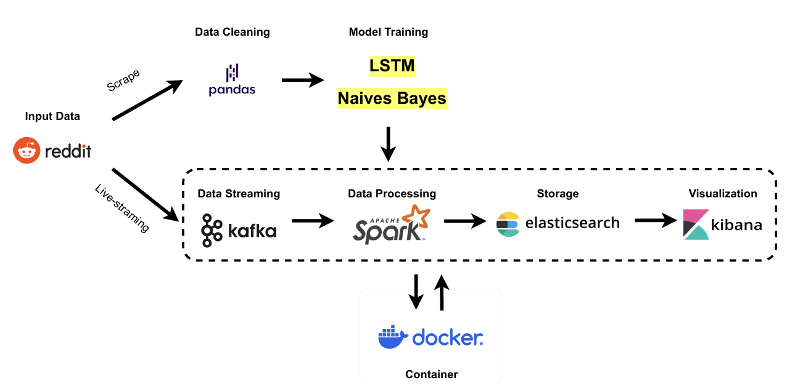

<h1 align="center">
  Real-Time Sentiment Analysis of Reddit Movie Comments
  <br>
</h1>

<table border="solid" align="center">
  <tr>
    <th>Name</th>
    <th>Matric Number</th>
  </tr>
  <tr>
    <td width=80%>CHEN PYNG HAW</td>
    <td>A22EC0042</td>
  </tr>
  <tr>
    <td width=80%>CHE MARHUMI BIN CHE AB RAHIM</td>
    <td>A22EC0147</td>
  </tr>
  <tr>
    <td width=80%>LEE YIK HONG</td>
    <td>A21BE0376</td>
  </tr>
  <tr>
    <td width=80%>WONG JUN JI</td>
    <td>A22EC0117</td>
  </tr>
</table>

---

### Links for related documents:
<table>
  <tr>
    <th>Documents</th>
    <th>Links</th>
  </tr>
  <tr>
    <td>Report</td>
    <td align="center">
      <a href="reports/final_report.pdf"></a>
    </td>
  </tr>
  <tr>
    <td>Presentation Slides</td>
    <td align="center">
      <a href="reports/presentation_slides.pptx"></a>
    </td>
  </tr>
  <tr>
    <td>Raw Data</td>
    <td align="center">
      <a href="data/raw_data.csv"></a>
    </td>
  </tr>
  <tr>
    <td>Cleaned Data</td>
    <td align="center">
      <a href="data/cleaned_data.csv"></a>
    </td>
  </tr>
  <tr>
    <td>Jupyter Notebook for Preprocessing</td>
    <td align="center">
      <a href="notebooks/preprocessing.ipynb"></a>
    </td>
  </tr>
  <tr>
    <td>Jupyter Notebook for Model Training</td>
    <td align="center">
      <a href="notebooks/model_training.ipynb"></a>
    </td>
  </tr>
</table>

---

## 📌 Introduction

This project showcases a real-time sentiment analysis pipeline designed to process and visualize opinions from Reddit, focusing on discussions within movie-related subreddits[cite: 19, 27]. By leveraging a powerful stack of big data technologies, including **Apache Kafka**, **Apache Spark**, and the **Elastic Stack** (Elasticsearch and Kibana), the system can ingest, analyze, and display sentiment from a continuous stream of Reddit comments[cite: 20, 367, 566]. The core of the analysis is a sentiment classification model that categorizes comments as positive, negative, or neutral[cite: 20, 568].

---

## 🎯 Objectives

The primary goals of this project are:

* **Data Collection and Preprocessing**: To gather a substantial dataset of Reddit comments and clean the text to prepare it for analysis[cite: 22].
* **Model Development and Comparison**: To train and evaluate two distinct sentiment analysis models: a classical **Multinomial Naïve Bayes** model and a more advanced **Bidirectional Long Short-Term Memory (Bi-LSTM)** network[cite: 23].
* **Real-Time Data Pipeline**: To build and deploy a Dockerized Apache-based architecture capable of performing near-real-time sentiment analysis on streaming data[cite: 24].
* **Interactive Visualization**: To create a dashboard that presents actionable insights and visual representations of the sentiment data[cite: 24].

---

## ⚙️ System Architecture

The project is built around a three-tier architecture that facilitates a seamless flow of data from ingestion to visualization[cite: 368].

1.  **Apache Kafka**: Acts as the central nervous system of the pipeline[cite: 372]. A Python-based producer script uses the Reddit API to fetch comments in real-time and streams them into a Kafka topic[cite: 373, 388]. This provides a scalable and fault-tolerant buffer for the incoming data[cite: 374, 390].

2.  **Apache Spark**: Serves as the processing engine[cite: 376]. Spark's Structured Streaming API consumes the data from the Kafka topic, performs necessary cleaning and transformations, and applies the trained sentiment analysis model to each comment[cite: 377, 378].

3.  **Elasticsearch and Kibana**: Form the storage and visualization layer[cite: 380]. The processed and sentiment-analyzed data from Spark is indexed in Elasticsearch, a powerful search and analytics engine[cite: 379, 382]. Kibana is then used to create interactive dashboards and visualizations, allowing for an in-depth exploration of the data[cite: 383, 405].

The entire architecture is containerized using **Docker**, ensuring portability and ease of deployment[cite: 24].

### Workflow Diagram



---

## 🚀 Getting Started

### Prerequisites

* Docker and Docker Compose
* Python 3.8+
* A Reddit API application with `client_id`, `client_secret`, and `user_agent`.

### Installation and Setup

1.  **Clone the repository:**
    ```bash
    git clone [https://github.com/your-username/Project-SentimentAnalysis.git](https://github.com/your-username/Project-SentimentAnalysis.git)
    cd Project-SentimentAnalysis
    ```

2.  **Create a `.env` file** in the root directory and add your Reddit API credentials:
    ```
    REDDIT_CLIENT_ID=your_client_id
    REDDIT_CLIENT_SECRET=your_client_secret
    REDDIT_USER_AGENT=your_user_agent
    ```

3.  **Build and start the Docker containers:**
    ```bash
    docker-compose up -d
    ```

### Running the Pipeline

1.  **Start the Kafka producer** to begin streaming Reddit comments:
    ```bash
    docker-compose exec spark python /opt/bitnami/spark/work/kafka_spark_pipeline/kafka_producer.py
    ```

2.  **Submit the Spark streaming job** to start processing the data:
    ```bash
    docker-compose exec spark spark-submit \
      --master spark://spark:7077 \
      --packages org.apache.spark:spark-sql-kafka-0-10_2.12:3.4.2,org.elasticsearch:elasticsearch-spark-30_2.12:8.13.4 \
      /opt/bitnami/spark/work/kafka_spark_pipeline/spark_streaming.py
    ```

### Accessing the Dashboard

* **Kibana**: Open your web browser and navigate to `http://localhost:5601`.
* **Spark Master UI**: You can monitor the status of your Spark cluster at `http://localhost:8080`.

---

## 📂 File Descriptions

* `README.md`: This file.
* `data/`: Contains the raw and cleaned datasets.
* `notebooks/`: Jupyter notebooks for data preprocessing and model training.
* `kafka_spark_pipeline/`: Contains the Python scripts for the Kafka producer and Spark streaming job.
* `dashboard/`: Includes Elasticsearch mappings and Kibana visualization configurations.
* `reports/`: The final project report and presentation slides.
* `requirements.txt`: A list of Python dependencies.
* `docker-compose.yml`: Defines the services, networks, and volumes for the Dockerized application.

---

## 📊 Results

The analysis of the Reddit comments yielded several key insights:

* **Sentiment Distribution**: The sentiment was fairly balanced, with a slight tendency towards neutral comments (33.52%)[cite: 461].
* **Top Subreddits**: The `r/movies` subreddit was the most active, followed by `r/BoxOffice` and `r/TrueFilm`[cite: 476, 492].
* **Comment Engagement**: The distribution of comment scores was highly skewed, with most comments receiving a low score[cite: 503].

### Kibana Dashboard


---

## 🛠️ Optimization and Comparison

Several optimization techniques were employed to enhance the performance of the sentiment analysis models:

* **Text Preprocessing**: A comprehensive cleaning pipeline was implemented to remove URLs, special characters, and normalize text, which significantly reduced noise[cite: 533, 534].
* **Neutral Class Labeling**: A confidence threshold was used to identify and label neutral comments, improving the accuracy of the models, especially for ambiguous text[cite: 536, 537, 538].
* **Efficient Feature Extraction**: TF-IDF (top 5,000 features) and word embeddings (20,000-word vocabulary) were used for the Naïve Bayes and Bi-LSTM models, respectively[cite: 540, 541].
* **Early Stopping**: This technique was used during the training of the Bi-LSTM model to prevent overfitting, with a patience of 2 on a 10% validation split[cite: 543].

### Model Comparison

| Model       | Accuracy    | Precision (Pos/Neg/Neu) | Recall (Pos/Neg/Neu)   | F1-Score (Pos/Neg/Neu) |
| :---------- | :---------- | :---------------------- | :--------------------- | :--------------------- |
| Naïve Bayes | 0.62        | 0.80 / 0.83 / 0.37      | 0.20 / 0.16 / 0.95     | 0.32 / 0.27 / 0.53     |
| Bi-LSTM     | **0.78** | **0.65 / 0.63 / 0.53** | **0.63 / 0.52 / 0.64** | **0.64 / 0.57 / 0.58** |

The **Bi-LSTM** model significantly outperformed the Naïve Bayes model by 16 percentage points in accuracy, demonstrating its ability to capture more complex patterns like sarcasm and code-switching in the text data[cite: 360, 554, 556].

---

## 🏁 Conclusion

This project successfully demonstrated the feasibility of building a real-time sentiment analysis pipeline using an integrated stack of Apache Kafka, Spark, and Elasticsearch[cite: 566]. The system is capable of ingesting, processing, and visualizing large volumes of streaming data from Reddit, providing valuable insights into public opinion on movies[cite: 567]. The Bi-LSTM model proved to be more balanced and nuanced compared to the Naïve Bayes model, which showed a strong bias towards classifying comments as neutral[cite: 571].

---

## 🚀 Future Work

* **Model Enhancement**: Fine-tuning the Bi-LSTM model's hyperparameters or employing pre-trained transformer models like BERT could further improve sentiment prediction accuracy[cite: 577].
* **Data Expansion**: The pipeline could be extended to include data from other social media platforms like Twitter or a wider range of subreddits to create a more comprehensive analysis[cite: 581].
* **Scalability Improvements**: Further optimizations could be made to the Spark and Kafka configurations, such as adjusting partition strategies, to enhance the scalability and real-time processing capabilities of the system[cite: 584].
