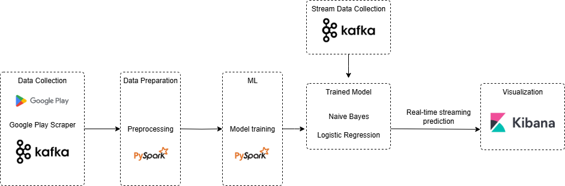

<h1 align="center"> 
  Group D - Grab App Reviews Sentiment Analysis
   
</h1>

<table border="solid" align="center">
  <tr>
    <th>Name</th>
    <th>Matric Number</th>
  </tr>
  <tr>
    <td width=80%>WAN NUR SOFEA BINTI MOHD HASBULLAH</td>
    <td>A22EC0115</td>
  </tr>
  <tr>
    <td width=80%>LOW YING XI</td>
    <td>A22EC0187</td>
  </tr>
  <tr>
    <td width=80%>MUHAMMAD ARIFF DANISH BIN HASHNAN</td>
    <td>A22EC0204</td>
  </tr>
  <tr>
    <td width=80%>MUHAMMAD IMAN FIRDAUS BIN BAHARUDDIN</td>
    <td>A22EC0216</td>
  </tr>
</table>

## 📂 Related Files

| Name                      | Description                                                  | Links |
| :------------------------ | :----------------------------------------------------------- | :---- |
| grab_reviews_raw.csv       | Unprocessed datasets.                                        | [View CSV](https://github.com/drshahizan/HPDP/blob/main/2425/project/p2/GroupD/data/raw_data/grab_reviews_raw.csv) |
| preprocessing.ipynb | Data cleaning, transformation, and feature engineering.      | [View Notebook](https://github.com/drshahizan/HPDP/blob/main/2425/project/p2/GroupD/notebooks/preprocessing.ipynb) |
| model_training.ipynb | Training and evaluating sentiment analysis models.           | [View Notebook](https://github.com/drshahizan/HPDP/blob/main/2425/project/p2/GroupD/notebooks/model_training.ipynb) |
| grab_reviews_LR.py | Overall processing and training           | [View Python](https://github.com/drshahizan/HPDP/blob/main/2425/project/p2/GroupD/notebooks/grab_reviews_LR.py) |
| kafka_producer.py | Python script for simulating data into Kafka.                | [View File](https://github.com/drshahizan/HPDP/blob/main/2425/project/p2/GroupD/kafka_spark_pipeline/kafka_producer.py) |
| spark_streaming.py | PySpark script for real-time sentiment analysis.             | [View File](https://github.com/drshahizan/HPDP/blob/main/2425/project/p2/GroupD/kafka_spark_pipeline/spark_streaming.py) |
| elastic_mappings.json | Elasticsearch mappings for indexing data.                    | [View File](https://github.com/drshahizan/HPDP/blob/main/2425/project/p2/GroupD/dashboard/elastic_mappings.json) |
| kibana_visualizations.ndjson | Kibana export file with pre-configured visualizations.       | [View File](https://github.com/drshahizan/HPDP/blob/main/2425/project/p2/GroupD/dashboard/kibana_visualizations.ndjson) |
| HPDP Report 2.pdf | Comprehensive project report.                                | [View File](https://github.com/drshahizan/HPDP/blob/main/2425/project/p2/GroupD/reports/HPDP%20Report%202.pdf) |
| Grab App.pptx | Presentation slides for stakeholders.                      | [View File](https://github.com/drshahizan/HPDP/blob/main/2425/project/p2/GroupD/reports/Grab%20APP.pptx) |    
| Pictures | All visualisation pictures.                      | [View Folder](https://github.com/drshahizan/HPDP/tree/main/2425/project/p2/GroupD/dashboard/Pictures) |  

## 🏗️ System Architecture

The architecture of this sentiment analysis project is designed to support efficient processing and real-time analysis of Grab App reviews. It consists of **five main phases**:

1. **Data Collection**
2. **Data Preparation**
3. **Model Training**
4. **Stream Data Collection**
5. **Visualization**

### 🔹 1. Data Collection

- Review data for the **Grab App** is extracted from the Google Play Store using the [`google-play-scraper`](https://github.com/danieliu/google-play-scraper) library.
- Apache Kafka is used as a **message broker**, allowing the collected review data to be sent to a Kafka topic for further processing.

### 🔹 2. Data Preparation

- The collected data is preprocessed using **Apache Spark (PySpark)**.
- Preprocessing steps include cleaning, normalizing, and structuring the text to prepare it for model training.
- PySpark efficiently handles large volumes of data streamed from Kafka.

### 🔹 3. Model Training

- Cleaned data is saved in **Parquet** format and split into training and testing datasets.
- Two supervised machine learning models are trained using PySpark:
  - **Naive Bayes**
  - **Logistic Regression**
- The models are evaluated using metrics such as **accuracy**, **F1 score**, and **confusion matrix**.

### 🔹 4. Stream Data Collection

- Real-time app reviews are continuously collected from Kafka (`grab_reviews_final` topic).
- Incoming data is preprocessed to match the format used during training.
- The trained model is loaded and applied to the streaming data to predict sentiment.

### 🔹 5. Visualization

- The sentiment predictions are indexed into **Elasticsearch** under the index `grab_reviews_sentiment`.
- **Kibana** is used to visualize the sentiment trends with dashboards showing the distribution of:
  - Positive reviews
  - Neutral reviews
  - Negative reviews

This architecture ensures scalable, near real-time sentiment analysis with a robust pipeline from data ingestion to insightful visualization.

## 🧰 Technologies Used

| Technology        | Description                                                                 |
|-------------------|-----------------------------------------------------------------------------|
| **Google Play Scraper** | Extracts user reviews from Google Play Store efficiently                   |
| **Apache Kafka**        | Distributed event streaming platform used for real-time data ingestion   |
| **Apache Spark (PySpark)** | Big data processing framework used for preprocessing and model training |
| **Parquet**             | Columnar storage format for efficient data storage and retrieval         |
| **Naive Bayes**         | Supervised ML algorithm used for sentiment classification                |
| **Logistic Regression** | ML model used for binary/multi-class sentiment classification     |
| **Elasticsearch**       | Real-time search and analytics engine for storing processed data          |
| **Kibana**              | Visualization tool for Elasticsearch data                                 |
| **Python**              | Primary programming language used across the entire pipeline              |

## 📊 Dashboard Visualizations
### 📈 Overall Dashboard

### 🕒 Review Trends

### 📉 User Trends

### 🧾 Number of Reviews

### 👥 Number of Users

### 😊 Overall Sentiment

### 📊 Sentiment Division

