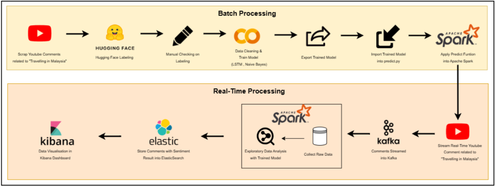
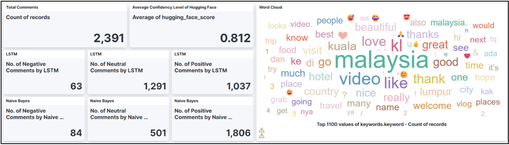
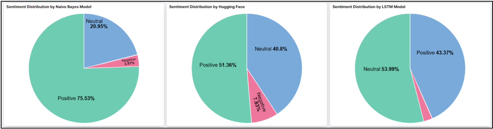
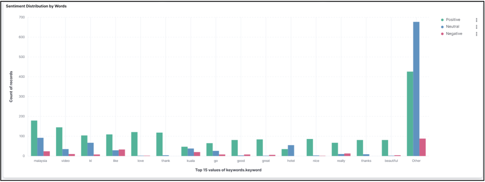
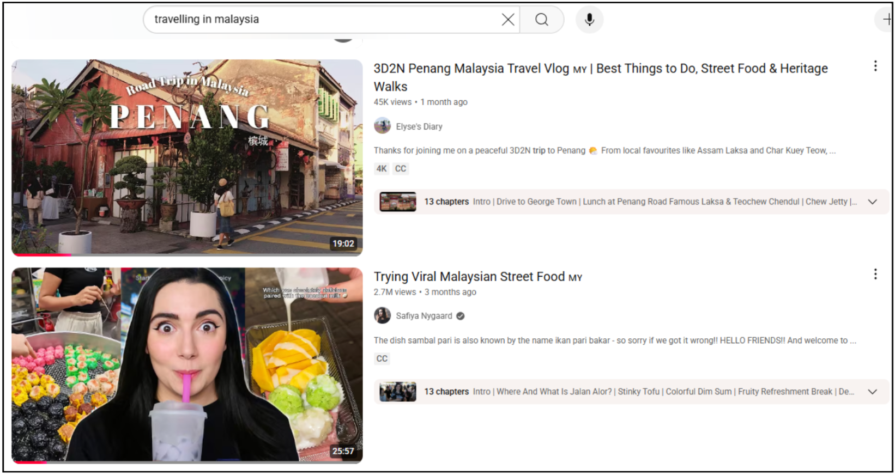
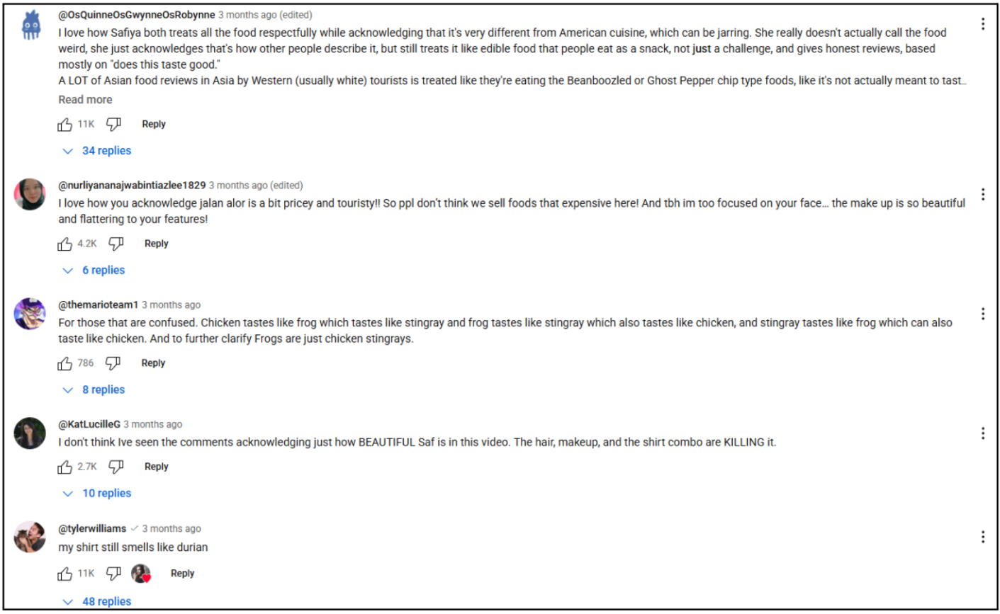

<h1 align="center"> 
  MasterData - Real-Time Sentiment on Youtube's Video Comments related to Traveling in Malaysia
   
</h1>

<table border="solid" align="center">
  <tr>
    <th>Name</th>
    <th>Matric Number</th>
  </tr>
  <tr>
    <td width=80%>BERNICE LIM JING XUAN</td>
    <td>A22EC0038</td>
  </tr>
  <tr>
    <td width=80%>KEK JESSLYN</td>
    <td>A22EC0057</td>
  </tr>
  <tr>
    <td width=80%>TAN JUN YUAN</td>
    <td>A22EC0107</td>
  </tr>
</table>

---

<table border="solid" align="center">
  <tr>
    <th>Materials</th>
    <th>Link</th>
  </tr>
  <tr>
    <td width=80%>BERNICE LIM JING XUAN</td>
    <td>A22EC0038</td>
  </tr>
  <tr>
    <td width=80%>KEK JESSLYN</td>
    <td>A22EC0057</td>
  </tr>
  <tr>
    <td width=80%>TAN JUN YUAN</td>
    <td>A22EC0107</td>
  </tr>
</table>

## Table of Contents

### 1.0 Introduction
- [1.1 Background](#11-background)
- [1.2 Objectives](#12-objectives)
- [1.3 Scope](#13-scope)

### 2.0 Data Acquisition & Preprocessing
- [2.1 Sources](#21-sources)
- [2.2 Tools](#22-tools)
- [2.3 Cleaning Steps](#23-cleaning-steps)

### 3.0 Sentiment Model Development
- [3.1 Model Choice](#31-model-choice)
- [3.2 Training Process](#32-training-process)
- [3.3 Evaluation](#33-evaluation)

### 4.0 Apache System Architecture
- [4.0 Apache System Architecture](#40-apache-system-architecture)
  
### 5.0 Analysis & Results
- [5.1 Key Findings](#51-key-findings)
- [5.2 Visualizations](#52-visualizations)
- [5.3 Insights](#53-insights)

### 6.0 Optimisation & Comparison
- [6.0 Optimisation & Comparison](#60-optimisation--comparison)

### 7.0 Conclusion & Future Work
- [7.0 Conclusion & Future Work](#70-conclusion--future-work)

### 8.0 References
- [8.0 References](#80-references)

### 9.0 Appendix
- [9.0 Appendix](#90-appendix)
---

### 1.0 Introduction

#### 1.1 Background

Over the last few years, Malaysia has registered a high rise in tourism due to a diversity of cultures, landscapes and present-day amenities. As the amount of digital content has increased, YouTube has turned into a potent window that travellers use to chart and report their experiences. 

The remarks made by viewers on travel-related videos do not just constitute a matter of personal opinion but can also become an excellent source of data to define public attitudes towards tourism in Malaysia.

This project explores the use of **real-time sentiment analysis** to comprehend how people feel about travelling in Malaysia by reviewing YouTube comments. An entire **big data pipeline** was created using Apache technologies to **ingest**, **process**, and **analyze** this comment data.

We used the **YouTube Data API** to retrieve comments from 10 YouTube videos featuring travel experiences in Malaysia. A total of **2730 raw comments** were collected, cleaned, and manually categorized into **positive**, **neutral**, and **negative** sentiments. Any inconsistencies were re-labelled using the **Hugging Face pre-trained transformer model** and manually verified.

Two models—**Naive Bayes** and **LSTM**—were trained and evaluated for classification performance. Then, a streaming data pipeline was developed using **Dockerized Apache Kafka** to send new YouTube comments into **Apache Spark Structured Streaming** for real-time predictions with all three models: Naive Bayes, LSTM, and Hugging Face. Results were stored in **Elasticsearch** and visualized on a **Kibana dashboard**.

#### 1.2 Objectives

The main objectives of this project are:

- ✅ Build a **real-time sentiment analysis pipeline** focused on YouTube travel comments in Malaysia  
- ⚙️ Use **Apache Kafka** for real-time data ingestion  
- 🔄 Use **Apache Spark** for real-time sentiment classification  
- 🗃️ Store processed results in **Elasticsearch**  
- 📊 Visualize trends using **Kibana dashboards**  
- 🧠 Apply multiple models (Naive Bayes, LSTM, Hugging Face) to classify sentiments as **positive**, **neutral**, or **negative**

#### 1.3 Scope

This project involves the following components:

- Collecting comments from selected YouTube travel videos using the **YouTube API**
- Cleaning and preprocessing using **NLP techniques**
- Training and evaluating three sentiment models: **Naive Bayes**, **LSTM**, and **Hugging Face Transformer**
- Developing a real-time data pipeline using **Kafka**, **Spark**, and **Elasticsearch**
- Displaying live sentiment results with **Kibana**
- Focusing analysis on **public opinion about travel in Malaysia**

---

### 2.0 Data Acquisition & Preprocessing

#### 2.1 Sources

Comments were collected from over 20 YouTube videos related to Malaysian travel experiences. These videos were chosen for their relevance, popularity, and location diversity.

**Sample URLs:**

- https://www.youtube.com/watch?v=fqlaE_NSjS0  
- https://www.youtube.com/watch?v=UKy1WGdlXdg  
- https://www.youtube.com/watch?v=S2NDPhOeSfI  
- https://www.youtube.com/watch?v=kNR61myFC1s  
- https://www.youtube.com/watch?v=KH3wGlxHg_4  
- https://www.youtube.com/watch?v=Qx4KNva9DWk  
- https://www.youtube.com/watch?v=G1UrANBKY_k  
- https://www.youtube.com/watch?v=ze6M63y8Rm4  
- https://www.youtube.com/watch?v=ajxkQYxLNdY  
- https://www.youtube.com/watch?v=g6fb0yzziMM  
- https://www.youtube.com/watch?v=Xv0velteJnc  
- https://www.youtube.com/watch?v=LtPBMvHa8Y8  
- https://www.youtube.com/watch?v=stSMG6tvsrw  
- https://www.youtube.com/watch?v=EVG-IH8cMYs  
- https://www.youtube.com/watch?v=jgK-sFaxr6E  
- https://www.youtube.com/watch?v=jobgAn1GQrI  
- https://www.youtube.com/watch?v=GrECQdICe6A  

#### 2.2 Tools

- **YouTube Data API v3** – for comment extraction  
- **Python** – scripting and preprocessing  
- **Apache Kafka** – real-time streaming  
- **Google Colab** – model training  
- **Jupyter Notebook** – EDA and experimentation  
- **NLTK**, **spaCy**, **Hugging Face Transformers** – for NLP

#### 2.3 Cleaning Steps

- Converted text to **lowercase**
- Removed **emojis**, **special characters**, and **URLs**
- **Tokenized** comments into individual words
- Removed **English stopwords**
- Applied **stemming/lemmatization**
- **Labeled** comments manually and corrected with **Hugging Face transformer model**

---

### 3.0 Sentiment Model Development

#### 3.1 Model Choice

Three models were selected and compared:

- **Naive Bayes Classifier (Scikit-learn)**  
  - A fast and interpretable baseline model

- **LSTM Neural Network (TensorFlow)**  
  - Captures the **sequential nature** of language in comments

- **Hugging Face Transformer**  
  - Pretrained model: `cardiffnlp/twitter-roberta-base-sentiment`  
  - Trained on **social media sentiment** and used directly for inference

#### 3.2 Training Process

- Dataset: **2730 cleaned comments**
- Split into **training** and **testing** sets
- **Naive Bayes**: Trained on **TF-IDF** features
- **LSTM**: Used **GloVe word embeddings** + padded sequences
- **Hugging Face**: Used out-of-the-box for inference

#### 3.3 Evaluation

- **Naive Bayes Accuracy**: ~79%  
- **LSTM Accuracy**: ~85%  
- **Hugging Face**: Used as a **reference model only**

---
### 4.0 Apache System Architecture

**Figure 1: System Architecture Diagram**

  

The system is divided into two main pipelines: **Batch Processing** and **Real-Time Processing**, both working together to analyze YouTube comments related to “Travelling in Malaysia”.

**Batch Processing:**

- **Scraping & Labeling:** YouTube comments are scraped and labeled using Hugging Face models, followed by manual verification to ensure accuracy.  
- **Model Training:** Cleaned and labeled data is used to train sentiment classification models which are LSTM and Naive Bayes.  
- **Model Deployment:** The trained model is exported, imported into a Python prediction script, and integrated into Apache Spark for further use.

**Real-Time Processing:**

- **Streaming:** New comments are streamed in real time via Apache Kafka.  
- **Sentiment Analysis:** Apache Spark consumes these streams, applies the trained sentiment model, and processes the data.  
- **Storage & Visualization:** Processed comments with sentiment results are stored in Elasticsearch and visualized using Kibana dashboards for real-time trend monitoring.

---

### 5.0 Analysis & Results

#### 5.1 Key Findings

The sentiment analysis was performed on a total of 2,391 comments, with an average model confidence score of 0.812 from the Hugging Face model, indicating generally reliable sentiment predictions. Three models, Naive Bayes, Hugging Face, and LSTM were used to classify comments into positive, neutral, and negative categories.  
From the Naïve Bayes model, the sentiment distribution showed a dominant 75.53% positive, 20.95% neutral, and only 3.51% negative comments. The Hugging Face model was comparatively balanced, with 51.36% positive, 40.8% neutral, and 7.83% negative. Meanwhile, the LSTM model predicted a higher number of neutral comments at 53.99%, followed by 43.37% positive, and 2.64% negative.  
The word cloud analysis revealed that 'Malaysia', 'video', 'KL', 'love', and 'thank' were among the most frequently mentioned keywords, suggesting topics of interest and recurring themes in the comments. Additionally, the sentiment distribution by keywords indicates that words such as 'Malaysia', 'video', 'love', and 'thank' are predominantly associated with positive sentiments.

#### 5.2 Visualizations

We used Kibana to do visualizations. We did some analysis on the total number of comments that had been scrapped, average of hugging face score and some perspectives of LSTM and Naive Bayes model. Besides, we use a word cloud to show which word is frequently used. We did pie charts on different models such as Naive Bayes, Hugging Face and LSTM Model to know their distribution on each type of sentiment (negative, neutral, positive). Not only that, a histogram is constructed to know what are the Top 15 appearance keywords.

**Figure 2: Dashboard Part 1**  

  

**Figure 3: Dashboard Part 2**  

  

**Figure 4: Dashboard Part 3**

  

#### 5.3 Insights

The overall perception in the data set is found as mostly positive and has been emphasized by Naive Bayes model that found more than three-quarters in the comments as positive. Overall, it implies that the general attitude towards the comments is rather positive and appraisive, as well as encouraging and affirming. Hugging Face and the LSTM models however present a less optimistic picture where a larger percentage of neutral remarks, denoting a different sense of sentiment based on the sensitivity and requirements of a specified model.  
The abundance of words like the names of the country of residence (Malaysia), the city (KL), and the notion of love in the word cloud and the positive connotations attached to them indicate a great level of national pride and curiosity of the citizens regarding local tourist information, and the loving interaction with the audience. Moreover, positive tones are also used due to the words such as ‘thank, beautiful, and so on, which makes it obvious that much of the audience contact is pleasant and is considered to be appreciative.  
One of the major insights is variation of model behavior. As opposed to Naive Bayes, which is optimistic, LSTM is more objective towards the comments. This implies that the choice of models can also affect the sentiment analysis significantly and has to be addressed when forming the conclusions or making the business decisions based on the sentiment information.

---

### 6.0 Optimisation & Comparison

In this part, the application of the batch data processing technique as well as the use of live stream data processing in sentiment analysis was compared, and the usage of various models of machine learning was also tested: Naive Bayes, LSTM, and Hugging Face.

When looking at the comparison of batch data and a live example of data, the two methods are used to accommodate functionality in different operations. Batch data processing tabulates significant amounts of the comments at preset frequencies and this alone makes it fit to be used in conducting periodic reports, trend extraction, and historical mining. It is also effective in processing capabilities, as the calculations could be carried out outside of rush time, and complex, resource- intensive models could be deployed without the requirement to be time critical. Batch processing, however, is not real-time sensitive and hence can not be used where there is a need to monitor sentiments immediately or handle a crisis-like situation.

Conversely, live stream data processing can monitor in real time the incoming comments and as soon as a shift in sentiment is noted, a viral topic is identified, or there is a prospect of negative publicity, it can be taken into account. This is especially useful in social media handling, internet marketing campaigns and PR exercises. The trade-off, however, is that it is demanding, as it requires optimised simpler models and infrastructure that will respond to a flow of constant data without latency. Moreover, in live stream applications, there is also an unavoidable need whereby the models used need to be able to make quick predictions, albeit at the cost of maintaining an ever so slightly less accurate result than more involved models.

The comparison of the three models of sentiment analysis demonstrated significant differences among the models regarding their performance and their tendency to predict. The Naive Bayes model is a classical probabilistic classifier whose results came out faster and consumed very little computational power. It presented considerable bias towards positive based on the fact that 75.53 percent of the comments were identified as positive and there was a low sensitivity of it describing subtle or mixed opinions which defaulted to positive labels.

As one of the deep learning models, the LSTM (Long Short-Term Memory) showed a better accuracy of capturing the contextual sentiment and the order of words in comments. It foresaw a more even split with 43.37% positive sentiments and 53.99% neutral remarks and this reflects its ability to search for a more neutral or ambiguous tone. It, however, took more computational power and time and therefore proved more convenient in batch processing unless there is infrastructure for deep learning inference in real time.

The Hugging Technique model that considers the transformer-based architectures provided a compromise between accuracy and responsiveness. It formed a relatively neutral spread of the sentiments where 51.36 were positive, 40.8 were neutral and 7.83 were negative. It averaged a confidence of 0.812, with a variable confidence range of 0.695–0.928 due to a batch setting (and 0.677–0.928 when working with live data), offering itself as reliable when non-real-time applications are required.

In short, the best structure is the one that targets an operational goal. Naive Bayes is suggested where lightweight and fast predictions during the real-time environment are needed and not much importance is placed on accuracy. LSTM is the best in a more detailed sentiment analysis in batch decisions. The Hugging Face models offer a general purpose that can maintain both the accuracy and the speed of processing that can be used in both live and batch applications, provided they have the infrastructure to support them.

  <table border="1" style="border-collapse: collapse; text-align: center;">
    <caption><strong>Table 1: Batch vs Live Stream Data Processing</strong></caption>
    <tr>
      <th>Aspect</th>
      <th>Batch Processing</th>
      <th>Live Stream Processing</th>
    </tr>
    <tr>
      <td>Definition</td>
      <td>Periodic processing of large comment datasets</td>
      <td>Continuous, real-time processing of incoming comments</td>
    </tr>
    <tr>
      <td>Use Cases</td>
      <td>Trend analysis, historical insights, periodic sentiment reporting</td>
      <td>Live sentiment tracking, social media alerts, crisis response</td>
    </tr>
    <tr>
      <td>Advantages</td>
      <td>
        - High accuracy models 
        - Lower urgency 
        - Scheduled runs
      </td>
      <td>
        - Immediate feedback 
        - Time-sensitive sentiment detection
      </td>
    </tr>
    <tr>
      <td>Limitations</td>
      <td>
        - No real-time feedback 
        - Delayed results
      </td>
      <td>
        - Requires fast, optimized models 
        - Higher infrastructure demand
      </td>
    </tr>
    <tr>
      <td>Best Model Types</td>
      <td>LSTM, Hugging Face (transformers)</td>
      <td>Naive Bayes, Optimized Hugging Face</td>
    </tr>
  </table>

  <table border="1" style="border-collapse: collapse; text-align: center;">
    <caption><strong>Table 2: Sentiment Model Comparison</strong></caption>
    <tr>
      <th>Model</th>
      <th>Type</th>
      <th>Strengths</th>
      <th>Limitations</th>
      <th>Sentiment Distribution (%)</th>
    </tr>
    <tr>
      <td>Naive Bayes</td>
      <td>Probabilistic (classical)</td>
      <td>
        Fast and lightweight 
        Low computation cost
      </td>
      <td>
        Biased toward positivity 
        Poor nuance handling
      </td>
      <td>
        Positive: 75.53 
        Neutral: 20.95 
        Negative: 3.51
      </td>
    </tr>
    <tr>
      <td>LSTM</td>
      <td>Deep Learning (RNN)</td>
      <td>
        High accuracy 
        Good at capturing word sequence/context
      </td>
      <td>
        Slower 
        High resource demand
      </td>
      <td>
        Positive: 43.37 
        Neutral: 53.99 
        Negative: 2.64
      </td>
    </tr>
    <tr>
      <td>Hugging Face</td>
      <td>Transformer-based</td>
      <td>
        Balanced output 
        Suitable for both batch and live setups
      </td>
      <td>
        Requires optimization for real-time inference
      </td>
      <td>
        Positive: 51.36 
        Neutral: 40.8 
        Negative: 7.83
      </td>
    </tr>
  </table>

---

### 7.0 Conclusion & Future Work

In conclusion, this project has proven as a success in the creation of a real-time sentiment analysis pipeline of YouTube comments owing to travel experiences in Malaysia. The combination of Apache Kafka, Spark, Elasticsearch, and Kibana through a Dockerized architecture offered us the possibility to create a performative and scalable big data architecture that could manage to ingest, process, and visualise a live sentiment trend. By having various sentiment classification models (Naive Bayes, LSTM and the transformer model offered by Hugging Face) available it was possible to compare the accuracy and behaviour in detail and the model offered by Hugging Face was found to be the most accurate in its predictions and giving a suitably balanced result of sentiment in its viewpoints.

The result of the analysis showed that the overall public perception of traveling in Malaysia is more than positive since the keywords linked to the positive attitude are occasionally repeated like, Malaysia, love, beautiful, and thanks. The presentation of real-time data streaming, as well as the visualisation in Kibana dashboards, was very effective in presenting data in real-time that can be acted upon, demonstrating the practical application of incorporating the real-time analytics in the tourism marketing approach or any other PR efforts.

In future research, there are a few aspects that may be expanded and improved. To begin with, The trending data should be extended to other platforms, such as Twitter, Instagram, or TripAdvisor to obtain a more comprehensive picture of how the people view Malaysian tourism. Second, the sentiment analysis could include the multi-language data of the Malay and Mandarin comments, both languages used in Malaysia, to make it better reflect the diverse linguistic environment of people online in Malaysia. Also, to enhance processing of live inference streams, it may be advisable to optimise the model serving to support real-time inference i.e., to possibly containerised LSTM and transformer model with efficient serving modules such as TensorFlow Serving or TorchServe or alike.

Finally, future variants of this project may include: topic modelling or aspect-based sentiment analysis (ABSA) to determine those aspects of travelling e.g. food, accommodation, attraction or transportation that is associated with positive or negative feelings. This would enable the tourism stakeholders to have more result-driven and actionable information that they would use in improving the experience with the visitors as well as improving the reputation of Malaysia as a travel destination to the digital world.

---

### 8.0 References

- Apache Software Foundation. (n.d.). Apache Kafka. https://kafka.apache.org/  
- Apache Software Foundation. (n.d.). Apache Spark. https://spark.apache.org/  
- Barbieri, F., Camacho-Collados, J., Espinosa-Anke, L., & Neves, L. (2020). TweetEval: Unified benchmark and comparative evaluation for tweet classification. In Findings of the Association for Computational Linguistics: EMNLP 2020 (pp. 1644–1650). https://aclanthology.org/2020.findings-emnlp.148/  
- Elastic. (n.d.). Elasticsearch. https://www.elastic.co/elasticsearch/  
- Elastic. (n.d.). Kibana. https://www.elastic.co/kibana/  
- Google Developers. (n.d.). YouTube Data API v3. https://developers.google.com/youtube/v3  
- Hugging Face. (n.d.). CardiffNLP/twitter-roberta-base-sentiment. https://huggingface.co/cardiffnlp/twitter-roberta-base-sentiment  
- Pedregosa, F., Varoquaux, G., Gramfort, A., Michel, V., Thirion, B., Grisel, O., ... & Duchesnay, E. (2011). Scikit-learn: Machine learning in Python. Journal of Machine Learning Research, 12, 2825–2830.  
- TensorFlow. (n.d.). TensorFlow: An end-to-end open-source machine learning platform. https://www.tensorflow.org/

---
### 9.0 Appendix
-All codes and resources can be found here → 
 <a href="https://github.com/Jesslyn19/Youtube_SentimentAnalysis" target="_blank">
    https://github.com/Jesslyn19/Youtube_SentimentAnalysis
  </a>

 

  

<b>Figure 4:</b> Examples of videos related to “Travelling in Malaysia” on YouTube

  

<b>Figure 5:</b> Examples of comments under videos related to “Travelling in Malaysia” on YouTube

