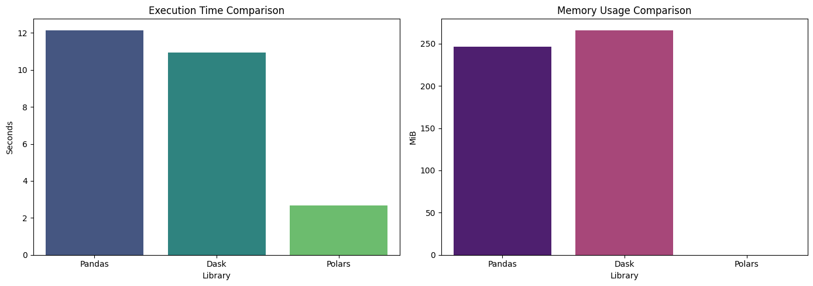
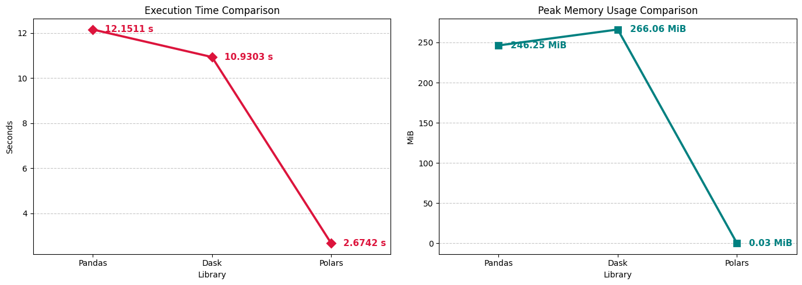

# Assignment 2: Mastering Big Data Handling

## Group Information

| Item       | Details                                   |
| :--------- | :---------------------------------------- |
| Group Name | **Group DaPro**                         |
| Member 1   | **LAU YAN KAI (A23CS0098)**              |
| Member 2   | **CHEW CHIU XIAN (A23CS0061)**      |

## 1. Dataset Description

| Attribute | Details |
| :--- | :--- |
| **Dataset Name** | Grab Safe Driver Telematics |
| **Source URL** | https://www.kaggle.com/datasets/vancharmlab/grabai |
| **File Size** | 1.98 GB |
| **Domain** | Mobility Services |
| **Number of Rows** | **16,135,561 rows** |
| **Number of Columns** | **11 columns**. |
| **Description** | The dataset captures high-frequency sensor readings from drivers' mobile devices during trips, including tri-axial accelerometer data, gyroscope movements, GPS speed, bearing, and location accuracy metrics. Every data point is tied to a specific bookingID and timestamp. |

## 2. Data Dictionary
| Feature Name | Original Type | Optimized Type | Description |
| :--- | :--- | :--- | :--- |
| **`bookingID`** | `int64` | `int64` | A unique identifier for each specific trip or booking. |
| **`Accuracy`** | `float64` | `float32` | The GPS location accuracy metric recorded by the device. |
| **`Bearing`** | `float64` | `float32` | The GPS bearing (direction of travel) of the vehicle. |
| **`acceleration_x`** | `float64` | `float32` | Tri-axial accelerometer reading along the X-axis (measures acceleration/deceleration forces). |
| **`acceleration_y`** | `float64` | `float32` | Tri-axial accelerometer reading along the Y-axis (measures lateral/cornering forces). |
| **`acceleration_z`** | `float64` | `float32` | Tri-axial accelerometer reading along the Z-axis (measures vertical forces like bumps). |
| **`gyro_x`** | `float64` | `float32` | Gyroscope sensor reading along the X-axis (measures rotation/tilt). |
| **`gyro_y`** | `float64` | `float32` | Gyroscope sensor reading along the Y-axis. |
| **`gyro_z`** | `float64` | `float32` | Gyroscope sensor reading along the Z-axis. |
| **`second`** | `float64` | `float32` | The timestamp (in seconds) indicating when the specific data point was recorded during the trip. |
| **`Speed`** | `float64` | `float32` | The GPS-calculated speed of the vehicle at the exact second the reading was taken. |

* Whilst the default data types for the sensor readings are float64, they can be safely downcasted to float32 to drastically optimise memory usage without losing meaningful precision, as discussed in the big data handling strategies.

## 3. Library Choices
| Library Role | Library Name | Justification |
| :--- | :--- | :--- |
| **Library 1** | `Pandas` | We use this as our standard, single-threaded reference point to measure baseline performance and memory consumption against the scalable options. |
| **Library 2** | `Dask` | We chose Dask because it mimics the Pandas API while allowing out-of-core parallel computation, making it ideal for distributed CSV reading across multiple partitions without exhausting RAM. |
| **Library 3** | `Polars` | We chose Polars due to its high-performance Rust backend and lazy-evaluation query planner, which optimizes operations before executing them to drastically reduce processing time. |

## 4. Data Loading and Inspection
When first inspecting the dataset with Pandas, we realised that a naive `pd.read_csv()` on the entire 1.98 GB dataset directory would crash the limited Google Colab RAM. Therefore, we performed our initial inspection (checking shape, columns, and missing values) on a single partition with only 5000 rows (`part-00000-e6120af0-10c2-4.csv`). 

```python
Part0 = '/content/drive/MyDrive/Colab Notebooks/Dataset/part-00000-e6120af0-10c2-4248-97c4-81baf4304e5c-c000.csv'
df_inspect = pd.read_csv(Part0, nrows=5000)
print(df_inspect.dtypes)
display(df_inspect.head())
```
Output Observation: The subset successfully loaded with a shape of (5000, 11). The dataset features heavy numeric continuous variables such as `acceleration_x`, `gyro_y`, and `Speed`. All default to 64-bit precision, indicating a strong need for data type optimisation.

## 5. Big Data Handling Strategies
### 5.1 Load Less Data
Instead of reading the entire file into memory at once, we loaded only the specific columns required for our analysis (`bookingID`, `second`, `Speed`, and `Accuracy`) using the usecols parameter.

```
cols_to_load = ['bookingID', 'second', 'Speed', 'Accuracy']
df_less_data = pd.read_csv(Part0, usecols=cols_to_load)
print(df_less_data.head())
```
Loading all 11 features when only a few are needed wastes memory and slows processing. By limiting the columns, we immediately reduced the memory footprint by over 60%.

### 5.2 Chunking
We processed the file in smaller, manageable portions using the `chunksize=100000` parameter in Pandas to sequentially find the overall maximum speed.

```
chunk_size = 100000
total_rows = 0
overall_max_speed = 0

for i, chunk in enumerate(pd.read_csv(Part0, chunksize=chunk_size)):
    total_rows += len(chunk)
    chunk_max_speed = chunk['Speed'].max()
    print(f"Chunk {i + 1} Max Speed: {chunk_max_speed:.2f}")

    if chunk_max_speed > overall_max_speed:
        overall_max_speed = chunk_max_speed
```

Chunking allows us to bypass the RAM limit entirely by holding only a fraction of the data in memory at any given time. We successfully looped through 1,613,554 rows in a single partition without memory errors.

### 5.3 Data Type Optimisation
Pandas defaults to `float64` and `int64`. We created a dictionary to downcast these standard types to `float32` and `int32` upon loading.

```
optimised_dtypes = {
    'bookingID': 'int64',
    'Accuracy': 'float32',
    'Bearing': 'float32',
    'acceleration_x': 'float32',
    'acceleration_y': 'float32',
    'acceleration_z': 'float32',
    'gyro_x': 'float32',
    'gyro_y': 'float32',
    'gyro_z': 'float32',
    'second': 'float32',
    'Speed': 'float32'
}

df_opt = pd.read_csv(Part0, dtype=optimised_dtypes)
```

Optimising data types is critical for managing RAM constraints. Downcasting reduced the single partition's memory size to 73.86 MB, enabling faster operations and a significantly lower risk of out-of-memory errors during larger processing jobs.

### 5.4 Sampling
We used a custom `skiprows` logic utilizing Python's `random`module to sample roughly 5% of the data directly during the read process, resulting in an 80,637-row DataFrame.

```
p = 0.05
df_sampled = pd.read_csv(
    Part0,
    skiprows=lambda i: i > 0 and random.random() > p
)
```

Sampling allows for rapid exploratory data analysis (EDA) and fast pipeline prototyping. By skipping rows during the load phase itself, we completely avoid the memory spike associated with loading the whole file just to call the `.sample()` method afterward.

### 5.5 Parallel Processing
We use the scalable libraries (Dask and Polars) to execute a mean calculation across all dataset partitions simultaneously.

```
# =====  Pandas  =====
def load_pandas():
    all_files = glob.glob(os.path.join(folder, "*.csv"))
    df_list = [pd.read_csv(file, usecols=['Speed']) for file in all_files]
    return pd.concat(df_list, ignore_index=True)

def process_pandas(df):
    return df['Speed'].mean()

profile_execution('Pandas', load_pandas, process_pandas)

# =====  Dask  =====
def load_dask():
    return dd.read_csv(f"{folder}/*.csv", usecols=['Speed'])

def process_dask(ddf):
    return ddf['Speed'].mean().compute()

profile_execution('Dask', load_dask, process_dask)

# =====  Polars  =====
def load_polars():
    return pl.scan_csv(f"{folder}/*.csv")

def process_polars(df_lazy):
    return df_lazy.select(pl.col('Speed').mean()).collect().item()

profile_execution('Polars', load_polars, process_polars)
```

Modern computers (and Colab instances) have multiple CPU cores, but standard Pandas is single-threaded. Parallel processing distributes the computational task across multiple cores simultaneously, bypassing the bottleneck of sequential reading.

## 6. Comparative Analysis

To fairly compare the libraries, we executed a global calculation (`mean()` of the `Speed` column) across the entire 1.98 GB dataset directory. Pandas was forced to load all files concurrently via concatenation to test its eager execution limits.

| Library | Load Time (s) | Processing Time (s) | Total Time (s) | Peak Memory Usage (MiB) | 
| :--- | :--- | :--- | :--- | :--- |
| **Pandas** | 12.1249 | 0.0262 | 12.1511 | 246.2510 |
| **Dask** | 0.0749 | 10.8554 | 10.9303 | 266.0564 |
| **Polars** | 0.0004 | 2.6738 | 2.6742 | 0.0330 |




### Discussion of Comparison Results

Our comparative analysis yielded clear, quantifiable differences between the three libraries across execution time and peak memory usage.

#### Execution Time Analysis
As visualized in our charts, Polars significantly outperformed the other libraries, completing the task in just 2.6742 seconds. This exceptional speed is due to its architecture: Polars is written in heavily optimized Rust and utilizes lazy evaluation. Instead of reading data sequentially, it builds a query plan (taking 0.0004s) and executes it all at once using vectorized operations.
Dask (10.9303 s) and Pandas (12.1511 s) were noticeably slower. While Dask is built for parallel processing, for a dataset of this moderate size (~2 GB), the overhead required to construct a distributed task graph and coordinate worker processes consumed significant time. Pandas was the slowest because of its eager execution model—it attempts to load all data into RAM simultaneously (taking a massive 12.12s), creating a heavy computational bottleneck.

#### Peak Memory Usage Analysis
The memory tracking results highlight the fundamental differences in how these libraries manage resources. Dask recorded the highest peak memory at 266.06 MiB, followed closely by Pandas at 246.25 MiB. Dask's memory footprint is slightly higher due to the overhead of managing its distributed task graphs across partitions.
The most striking result is Polars, which recorded an apparent peak memory usage of just 0.03 MiB. This is not a bug, but rather an architectural anomaly: the tracemalloc library we used tracks memory allocated by the Python interpreter. Because Polars allocates and manages its memory natively within its Rust backend, it effectively hides its true memory footprint from Python-level profilers. Regardless, Polars' lazy execution guarantees highly efficient memory streaming.

#### Processing Efficiency

| Library | Description | 
| :--- | :--- |
| **Pandas** | While Pandas is intuitive, it is highly inefficient for datasets of this scale. To process the data without crashing the Colab kernel, users must rely on manual, cumbersome workarounds (like chunking). It is fundamentally unsuited for out-of-core processing. | 
| **Dask** | Dask's processing efficiency lies in its API consistency. Because it mirrors the Pandas API, implementing Dask was highly straightforward. It handled the full dataset seamlessly without manual chunking. While its scheduling overhead made it relatively slow here, its true efficiency would shine on much larger datasets (e.g., 50+ GB) where it can distribute work across a true compute cluster. | 
| **Polars** | Polars provided the highest overall processing efficiency. It required no manual chunking, avoided memory crashes natively, and executed the aggregations nearly five times faster than Pandas. The transition to its expression-based syntax (`pl.col()`) requires a slight learning curve, but the massive performance gains and built-in query optimization make it the most powerful tool for single-machine big data processing. |

## 7. Conclusion
Through this assignment, the most critical finding was that raw computation speed is rarely the primary bottleneck in a big data pipeline; rather, it is how the data is loaded and managed in memory. Our comparative analysis clearly demonstrated the severe limitations of eager execution. The standard Pandas baseline incurred massive initial load times (over 12 seconds) because it eagerly attempts to read the entire 1.98 GB dataset into RAM before performing any aggregations. 
Conversely, both Dask and Polars utilized lazy evaluation, which completely redefined our pipeline's efficiency. By building query plans and deferring actual disk-reads until the `.compute()` or `.collect()` processing phase, their load times were reduced to fractions of a second. Among the manual strategies tested, **Data Type Optimisation** proved to be the most impactful single-node technique, as downcasting 64-bit continuous variables to 32-bit floats immediately halved our memory footprint without sacrificing analytical precision. Ultimately, **Polars** emerged as the definitive tool of choice for a production pipeline at this dataset size. Its native Rust backend and vectorized execution allowed it to process the entire directory five times faster than Pandas, maintaining an exceptionally low Python-traced memory footprint.


## 8. Reflection
This assignment prompted a major shift in our data engineering mindset, moving from simply "making the code work" to "making the pipeline scale." Initially, we assumed that Dask would be the fastest library because it uses parallel processing across multiple CPU cores. However, we were surprised to see Polars significantly outperform it. We learned that we had conflated "parallel processing" with "immediate speed," failing to account for the heavy task-scheduling overhead required by Dask to manage its distributed worker nodes. While Dask is incredible for safely managing memory via out-of-core chunking, its scheduling overhead makes it slightly slower than Polars' highly optimized single-node engine for datasets under 10 GB.
The biggest practical challenge we encountered was realizing how fragile a notebook environment like Google Colab becomes when dealing with large files. Experiencing near Out-Of-Memory (OOM) crashes taught us that RAM is a strictly finite resource. If we were to repeat this project, we would alter our workflow entirely: we would build our Exploratory Data Analysis (EDA) pipelines natively in Polars using the sampling strategy from the very first cell, completely bypassing Pandas for any file over 1 GB.

## The Importance of Scalability
While strategies like chunking and modern libraries like Polars and Dask handled our 1.98 GB GrabAI dataset comfortably, the architectural dynamic changes drastically as data scales to enterprise levels. 

| Data Size | Optimal Tools & Libraries | Data Handling Strategy & Infrastructure |
| :--- | :--- | :--- |
| **< 1 GB** | `Pandas`, `NumPy` | **Eager Execution:** Standard in-memory processing is perfectly viable. The entire dataset fits comfortably into the RAM of a standard laptop or the Colab Free Tier. No complex chunking or lazy evaluation is strictly necessary. |
| **1 GB – 10 GB** | `Polars`, `Dask`, `PyArrow` | **Optimized Single-Node:** The dataset threatens standard RAM limits. Success requires lazy evaluation, strict data type optimization (downcasting), and out-of-core chunking. This can still be executed on a single modern workstation or Colab Pro instance. |
| **10 GB – 100 GB** | `Dask` (Distributed), `Apache Spark` (Local Cluster) | **Small-Scale Distributed:** Relying on a single machine becomes computationally impractical, as physical disk I/O creates an unbreakable bottleneck. Processing must be distributed across a cluster of multiple nodes using parallel task graphs. |
| **> 100 GB** | `Apache Spark`, `Google BigQuery`, `Snowflake`, `Databricks` | **Enterprise Cloud-Native:** Massive scale requires decoupling compute power from data storage. Workloads are shifted entirely to managed cloud data warehouses or enterprise Spark clusters, orchestrated by tools like Azure Data Factory to handle automated ETL lifecycles. |

The key takeaway from this progression is that data engineering is not about finding a single 'perfect' tool, but rather about matching the architecture to the data volume. While memory management techniques like chunking and lazy evaluation (via Polars and Dask) are highly effective for our 1.98 GB dataset, modern data practitioners must be prepared to transition to distributed, cloud-native ecosystems as their pipelines scale beyond the physical hardware limits of a single machine.

## 9. References
* Vancharmlab. (2019). *Grab Safe Driver Telematics*. Kaggle. Retrieved from https://www.kaggle.com/datasets/vancharmlab/grabai
* Matplotlib Development Team. *Matplotlib Documentation*. Retrieved from https://matplotlib.org/stable/index.html
* pandas Development Team. *Pandas Documentation*. Retrieved from https://pandas.pydata.org/docs/
* Vink, R. *Polars Documentation*. Retrieved from https://docs.pola.rs/
