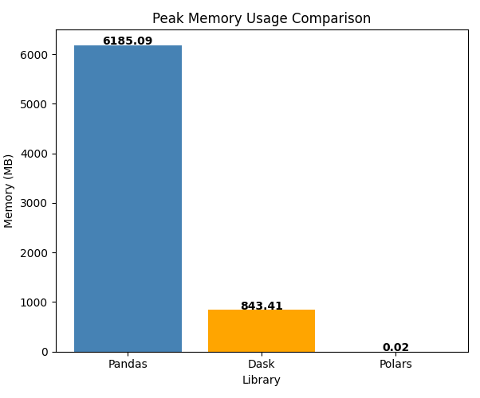
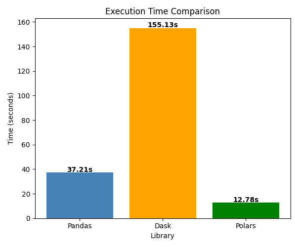

{
  "nbformat": 4,
  "nbformat_minor": 0,
  "metadata": {
    "colab": {
      "provenance": []
    },
    "kernelspec": {
      "name": "python3",
      "display_name": "Python 3"
    },
    "language_info": {
      "name": "python"
    }
  },
  "cells": [
    {
      "cell_type": "markdown",
      "source": [
        "# 📘 Assignment 2: Mastering Big Data Handling\n",
        "\n",
        "##**Group Members**:  \n",
        "- Student 1: *Gui Kah Sin, A23CS0080*  \n",
        "- Student 2: *Poh Lok Yee, A23CS0262*\n",
        "\n",
        "\n"
      ],
      "metadata": {
        "id": "BRdfcuCiR5WR"
      }
    },
    {
      "cell_type": "markdown",
      "source": [
        "# 📝 **1. Dataset Description**"
      ],
      "metadata": {
        "id": "pe2SFkfAcKD3"
      }
    },
    {
      "cell_type": "markdown",
      "source": [
        "## 📌 Dataset Overview\n",
        "\n",
        "* **Name**: *Flight Delay Dataset 2024*\n",
        "* **Source**: [Kaggle – Hrishit Patil](https://www.kaggle.com/datasets/hrishitpatil/flight-data-2024)\n",
        "* **Domain**: *Transportation*\n",
        "* **File Size**: *1.22 GB*\n",
        "* **Shape**: *7,079,081 rows × 35 columns*\n",
        "<br>\n",
        "\n",
        "## 📖 Description\n",
        "\n",
        "This dataset contains comprehensive domestic flight performance and delay records within the United States for the full calendar year of 2024. It is an aggregated compilation built by downloading monthly on-time performance files from the Bureau of Transportation Statistics (BTS) TranStats database and merging them into a unified, cleaned repository.\n",
        "\n",
        "From the monthly data pools, **35 relevant analytical columns** were structured and standardized into a uniform schema. Spanning over **7.07 million records**, this dataset tracks critical flight timeline sequences which including operational schedule checkpoints, carrier breakdowns, distances, and categorized cancellation roots that making it highly ideal for both predictive machine learning tasks and large-scale data processing/benchmarking infrastructure.\n",
        "\n",
        "<br>\n",
        "\n",
        "⚠️Note:\n",
        "*   Negative delay values (e.g., -10) means early flight operations.\n",
        "*   Non-cancelled flights will not contain an annotated cancellation_code value (recorded as nulls/blanks).\n",
        "*   Delay reason breakdowns (like weather_delay or carrier_delay) are only populated if the arrival delay exceeds 15 minutes.\n",
        "\n",
        "<br>\n",
        "\n",
        "🔍Key Features\n",
        "*  **Flight Identity Metadata:** scheduled flight date, unique operating carrier code, and flight number.\n",
        "\n",
        "*  **Network Trajectory Nodes**: three-letter IATA airport codes, city naming descriptions, and state boundaries for both origin and destination points.\n",
        "\n",
        "*  **Temporal Checkpoints:** precise times for wheels-off, wheels-on, taxiing, and official arrival/departure matrices.\n",
        "\n",
        "*  **Operational Blockages:** multi-variable metric tracking for cancellations, diversions, and minutes lost across 5 major delay vectors (Carrier, Weather, NAS, Security, and Late Aircraft).\n",
        "\n",
        "<br>\n",
        "\n",
        "## 📊 Data Column Description\n",
        "\n",
        "| Column Name          | Data Type | Description                                                                         |\n",
        "| -------------------- | --------- | ----------------------------------------------------------------------------------- |\n",
        "| `year`               | int64     | Year of the scheduled flight (2024)                                                 |\n",
        "| `month`              | int64     | Month of the flight (represented from 1 to 12)                                      |\n",
        "| `day_of_month`       | int64     | Day of the month                                                                    |\n",
        "| `day_of_week`        | int64     | Day of the week (1 = Monday to 7 = Sunday)                                          |\n",
        "| `fl_date`            | object    | Flight date in standard ISO string format (YYYY-MM-DD)                              |\n",
        "| `op_unique_carrier`  | object    | Unique airline carrier identification code (e.g., AA, DL, WN)                       |\n",
        "| `op_carrier_fl_num`  | int64     | Specific flight tracking number assigned by the reporting airline                   |\n",
        "| `origin`             | object    | Three-letter IATA identifier code for the departure airport                         |\n",
        "| `origin_city_name`   | object    | Name of the origin city                                                             |\n",
        "| `origin_state_nm`    | object    | Full state name of the origin airport                                               |\n",
        "| `dest`               | object    | Three-letter IATA identifier code for the destination airport                       |\n",
        "| `dest_city_name`     | object    | Name of the destination city                                                        |\n",
        "| `dest_state_nm`      | object    | Full state name of the destination airport                                          |\n",
        "| `crs_dep_time`       | int64     | Scheduled departure time in local format (hhmm)                                     |\n",
        "| `dep_time`           | float64   | Actual departure time in local format (hhmm)                                        |\n",
        "| `dep_delay`          | float64   | Departure delay calculated in minutes (negative value indicates early departure)    |\n",
        "| `taxi_out`           | float64   | Taxi out time duration measured in minutes                                          |\n",
        "| `wheels_off`         | float64   | Local time checkpoint when wheels left the runway (hhmm)                            |\n",
        "| `wheels_on`          | float64   | Local time checkpoint when wheels touched down on the runway (hhmm)                  |\n",
        "| `taxi_in`            | float64   | Taxi in time duration measured in minutes                                           |\n",
        "| `crs_arr_time`       | int64     | Scheduled arrival time in local format (hhmm)                                       |\n",
        "| `arr_time`           | float64   | Actual arrival time in local format (hhmm)                                          |\n",
        "| `arr_delay`          | float64   | Arrival delay calculated in minutes (negative value indicates early arrival)        |\n",
        "| `cancelled`          | float64   | Binary indicator flag tracking flight status (0.0 = No, 1.0 = Yes)                  |\n",
        "| `cancellation_code`  | object    | Specific reason identifier code for the cancellation (A, B, C, D)                    |\n",
        "| `diverted`           | float64   | Binary indicator flag tracking flight diversion (0.0 = No, 1.0 = Yes)               |\n",
        "| `crs_elapsed_time`   | float64   | Scheduled total gate-to-gate travel time in minutes                                 |\n",
        "| `actual_elapsed_time`| float64   | Actual recorded gate-to-gate travel time in minutes                                 |\n",
        "| `air_time`           | float64   | Net flight time spent strictly airborne in minutes                                  |\n",
        "| `distance`           | float64   | Total distance separating origin and destination airports in miles                  |\n",
        "| `carrier_delay`      | float64   | Delay time directly caused by the airline operator in minutes                       |\n",
        "| `weather_delay`      | float64   | Delay time caused by hazardous meteorological conditions in minutes                 |\n",
        "| `nas_delay`          | float64   | Delay time caused by National Aviation System constraints in minutes               |\n",
        "| `security_delay`     | float64   | Delay time caused by security line breaches or re-boarding events                   |\n",
        "| `late_aircraft_delay`| float64   | Delay"
      ],
      "metadata": {
        "id": "mKyuySxzR3pl"
      }
    },
    {
      "cell_type": "markdown",
      "source": [
        "# 📝 **2. Library Choices**"
      ],
      "metadata": {
        "id": "3g00AYp2AARx"
      }
    },
    {
      "cell_type": "markdown",
      "source": [
        "## Selected Libraries\n",
        "\n",
        "Three libraries were selected for this assignment: **Pandas** as the baseline library and **Dask** and **Polars** as the two scalable libraries.\n",
        "\n",
        "## **Why Dask and Polars?**\n",
        "\n",
        "| Factor | Pandas | Dask | Polars |\n",
        "| :--- | :--- | :--- | :--- |\n",
        "| Speed | Moderate | Slow on single node | Fastest |\n",
        "| Memory Efficiency | Loads all into RAM | Partition-based | Rust-managed |\n",
        "| Ease of Use | Easiest | Moderate | Moderate |\n",
        "| Scalability | Limited to RAM | Distributed | Single-node |\n",
        "| Best For | Small-medium data | Distributed clusters | Large single-node data |\n",
        "\n",
        "<br>\n",
        "\n",
        "**Dask (Scalable Library 1)**\n",
        "\n",
        "Dask was selected because it extends Pandas with parallel and distributed computing capabilities. Dask uses lazy evaluation — it builds a task graph without loading data immediately, only executing when `.compute()` is called. This allows it to process datasets larger than available RAM by splitting them into partitions across multiple CPU cores, making it suitable for large-scale distributed workloads.\n",
        "\n",
        "**Polars (Scalable Library 2)**\n",
        "\n",
        "Polars was selected because it is built entirely in Rust, offering significantly faster execution than Pandas. Polars uses a vectorised columnar execution engine with SIMD (Single Instruction Multiple Data) CPU instructions, allowing it to process entire columns simultaneously. Its architecture makes it highly efficient for large single-machine datasets where speed is the priority.\n",
        "\n",
        "These three libraries cover different big data scenarios, from simple prototyping with Pandas, to distributed processing with Dask, to high-performance single-machine processing with Polars."
      ],
      "metadata": {
        "id": "lmxqGqz8AOCt"
      }
    },
    {
      "cell_type": "markdown",
      "source": [
        "# 📝 **3. Data Loading and Inspection**"
      ],
      "metadata": {
        "id": "r5APWy-9cQKm"
      }
    },
    {
      "cell_type": "markdown",
      "source": [
        "## 🔹 **Loading Strategy**\n",
        "The data loading stage is structured into three main components: environment configuration, an automated download/extraction pipeline, and an unoptimized baseline execution benchmark.\n",
        "1. Environment & API Configuration\n",
        "\n",
        "\n",
        "```\n",
        "os.environ['KAGGLE_API_TOKEN'] = \"KGAT_5653b27870231087291d5cda1e303d2c\"\n",
        "LOCAL_FILE = \"flight_data_2024.csv\"\n",
        "```\n",
        "Instead of forcing the user to manually upload a kaggle.json file or use a separate configuration step, this line passes the API token directly into the system's environment variables. This lets the notebook talk to Kaggle's servers automatically.The file name define as `LOCAL_FILE` so the script knows what to look for on the disk.\n",
        "\n",
        "2. Automated Directory Verification and Extraction\n",
        "\n",
        "\n",
        "```\n",
        "if not os.path.exists(LOCAL_FILE):\n",
        "    print(\"Dataset not found locally. Initiating automated cloud-to-cloud API download...\")\n",
        "    !kaggle datasets download -d hrishitpatil/flight-data-2024\n",
        "    with zipfile.ZipFile(\"flight-data-2024.zip\", 'r') as zip_ref:\n",
        "        zip_ref.extractall(\".\")\n",
        "    print(\"Extraction complete! Dataset is ready.\")\n",
        "else:\n",
        "    print(\"Dataset already exists in workspace. Skipping download.\")\n",
        "```\n",
        "This logic operates as an automated gatekeeper to prevent redundant data transfers. It scans the local storage to verify if the uncompressed 1.6 GB CSV file is present.\n",
        "\n",
        "*   If the file is **absent**, the script automatically runs a command to pull the zipped dataset down from Kaggle and uses Python's built-in `zipfile` library to unzip it right away.\n",
        "\n",
        "*   If the file is **areadly exist** in the environment, the download sequence is completely bypassed, saving network bandwidth and execution time.\n",
        "\n",
        "3. Measuring the Baseline Performance (Pandas Load)\n",
        "\n",
        "\n",
        "```\n",
        "tracemalloc.start()\n",
        "start = time.time()\n",
        "\n",
        "df = pd.read_csv(DATASET_PATH)\n",
        "pandas_mean = df['arr_delay'].mean()\n",
        "\n",
        "end = time.time()\n",
        "current, peak = tracemalloc.get_traced_memory()\n",
        "tracemalloc.stop()\n",
        "```\n",
        "This segment executes a standard, unoptimized file load using Pandas (`pd.read_csv`). To collect precise hardware utilization metrics required for the subsequent comparative analysis, the execution code is wrapped inside two tracking utilities:\n",
        "\n",
        "\n",
        "\n",
        "*   `time.time()` captures the total clock duration in seconds required to parse the file from disk into RAM.\n",
        "*   `tracemalloc` monitors low-level system memory behaviors to capture the maximum RAM allocation spike encountered during data ingestion.\n",
        "\n",
        "\n",
        "This creates the essential performance baseline needed to measure the optimization efficiency of the upcoming big data strategies.\n",
        "\n"
      ],
      "metadata": {
        "id": "dqa8M1ejSLjQ"
      }
    },
    {
      "cell_type": "markdown",
      "source": [
        "## 🔹 **Inspect Strategy**\n",
        "This inspection part is used to check the structure of the dataset, look at the data rows, find the total size, and locate any missing values.\n",
        "\n",
        "1. Checking the Top 5 Rows\n",
        "\n",
        "\n",
        "```\n",
        "print(\"First 5 rows of the dataset:\")\n",
        "display(df.head())\n",
        "```\n",
        "| | year | month | day_of_month | day_of_week | fl_date | op_unique_carrier | op_carrier_fl_num | origin | origin_city_name | origin_state_nm | ... | diverted | crs_elapsed_time | actual_elapsed_time | air_time | distance | carrier_delay | weather_delay | nas_delay | security_delay | late_aircraft_delay |\n",
        "| --- | --- | --- | --- | --- | --- | --- | --- | --- | --- | --- | --- | --- | --- | --- | --- | --- | --- | --- | --- | --- | --- |\n",
        "| **0** | 2024 | 1 | 1 | 1 | 2024-01-01 | 9E | 4814.0 | JFK | New York, NY | New York | ... | 0.0 | 136.0 | 122.0 | 84.0 | 509.0 | 0.0 | 0.0 | 0.0 | 0.0 | 0.0 |\n",
        "| **1** | 2024 | 1 | 1 | 1 | 2024-01-01 | 9E | 4815.0 | MSP | Minneapolis, MN | Minnesota | ... | 0.0 | 130.0 | 114.0 | 88.0 | 622.0 | 0.0 | 0.0 | 0.0 | 0.0 | 0.0 |\n",
        "| **2** | 2024 | 1 | 1 | 1 | 2024-01-01 | 9E | 4817.0 | JFK | New York, NY | New York | ... | 0.0 | 106.0 | 90.0 | 61.0 | 288.0 | 0.0 | 0.0 | 0.0 | 0.0 | 0.0 |\n",
        "| **3** | 2024 | 1 | 1 | 1 | 2024-01-01 | 9E | 4817.0 | RIC | Richmond, VA | Virginia | ... | 0.0 | 111.0 | 76.0 | 51.0 | 288.0 | 0.0 | 0.0 | 0.0 | 0.0 | 0.0 |\n",
        "| **4** | 2024 | 1 | 1 | 1 | 2024-01-01 | 9E | 4818.0 | DTW | Detroit, MI | Michigan | ... | 0.0 | 79.0 | 70.0 | 45.0 | 237.0 | 0.0 | 0.0 | 0.0 | 0.0 | 0.0 |\n",
        "\n",
        "\n",
        "2. Checking Column Names and Data Types\n",
        "\n",
        "```\n",
        "display(df.info())\n",
        "```\n",
        "\n",
        "3. Getting the Exact Size of the Data\n",
        "\n",
        "```\n",
        "print(f\"\\nDataset Shape:\\nRows: {df.shape[0]}, Columns: {df.shape[1]}\")\n",
        "```\n",
        "\n",
        "4. Counting Missing Values\n",
        "```\n",
        "print(df.isnull().sum())\n",
        "```\n"
      ],
      "metadata": {
        "id": "IGiMlOqhRrZr"
      }
    },
    {
      "cell_type": "markdown",
      "source": [
        "#📝**4. Big Data Handling Strategies**"
      ],
      "metadata": {
        "id": "LF7YG8X7cCTc"
      }
    },
    {
      "cell_type": "markdown",
      "source": [
        "## 📉 **4.1 Load Less Data**\n",
        "**Code:**\n",
        "```\n",
        "load to targeted analysis domains\n",
        "tracemalloc.start()\n",
        "start_s1 = time.time()\n",
        "\n",
        "target_columns = ['month', 'op_unique_carrier', 'origin', 'dest', 'dep_delay', 'arr_delay']\n",
        "df_less = pd.read_csv(DATASET_PATH, usecols=target_columns)\n",
        "\n",
        "end_s1 = time.time()\n",
        "_, peak_s1 = tracemalloc.get_traced_memory()\n",
        "tracemalloc.stop()\n",
        "\n",
        "print(f\"Strategy 1 Load Time : {end_s1 - start_s1:.2f}s\")\n",
        "print(f\"Strategy 1 Peak Memory: {peak_s1 / 1024**2:.2f} MB\")\n",
        "```\n",
        "#### **Explanation:**\n",
        "When working with large datasets, it is often unnecessary to load all available columns into memory. By selecting only the relevant columns required for the analysis task, memory usage and load time can be significantly reduced.\n",
        "\n",
        "#### **Implementation Summary:**\n",
        "Only these columns were loaded from the CSV:\n",
        "`month`, `op_unique_carrier`, `origin`, `dest`, `dep_delay`, `arr_delay`\n",
        "\n",
        "#### **Output:**\n",
        "\n",
        "\n",
        "**Performance Insight:** Dropping the other 29 unneeded columns allowed the dataset to load much faster and kept the peak RAM footprint significantly lower than the full baseline load."
      ],
      "metadata": {
        "id": "09wQadRVSjxc"
      }
    },
    {
      "cell_type": "markdown",
      "source": [
        "## 📉 **4.2 Chunking**\n",
        "**Code:**\n",
        "\n",
        "```\n",
        "tracemalloc.start()\n",
        "start_s2 = time.time()\n",
        "\n",
        "# Process data in chunks to handle workloads without memory spikes\n",
        "chunk_iterator = pd.read_csv(DATASET_PATH, chunksize=500000, usecols=['arr_delay'])\n",
        "row_accumulator = 0\n",
        "\n",
        "for chunk in chunk_iterator:\n",
        "    # Perform standard light aggregations on current memory block\n",
        "    row_accumulator += chunk['arr_delay'].count()\n",
        "\n",
        "end_s2 = time.time()\n",
        "_, peak_s2 = tracemalloc.get_traced_memory()\n",
        "tracemalloc.stop()\n",
        "\n",
        "print(f\"Strategy 2 Process Time: {end_s2 - start_s2:.2f}s\")\n",
        "print(f\"Strategy 2 Peak Memory : {peak_s2 / 1024**2:.2f} MB\")\n",
        "```\n",
        "#### **Explanation:**\n",
        "Loading massive datasets all at once can easily overwhelm system memory and cause runtime crashes. By breaking the file into smaller, fixed-size subsets (chunks), data can be loaded and processed sequentially. This sequential processing stream keeps memory usage uniformly low regardless of how large the total dataset grows.\n",
        "\n",
        "#### **Implementation Summary:**\n",
        "The dataset was processed in sequential iterations using these parameters:\n",
        "\n",
        "* Chunk Size: 500,000 rows per iteration block.\n",
        "\n",
        "* Target Column Extracted: arr_delay\n",
        "\n",
        "* Operation: Iterated through the dataset using a for loop to accumulate total counts sequentially.\n",
        "\n",
        "#### **Output:**\n",
        "\n",
        "\n",
        "**Performance Insight:** Processing the file block-by-block prevents memory spikes, maintaining a flat and safe memory footprint throughout the execution loop."
      ],
      "metadata": {
        "id": "pLTTFCQAb-_Q"
      }
    },
    {
      "cell_type": "markdown",
      "source": [
        "## 📉 **4.3 Optimize Data Types**\n",
        "**Code:**\n",
        "\n",
        "```\n",
        "# Define optimized schema properties\n",
        "optimized_schema = {\n",
        "    'month': 'int8',\n",
        "    'day_of_week': 'int8',\n",
        "    'op_unique_carrier': 'category',\n",
        "    'origin': 'category',\n",
        "    'dest': 'category',\n",
        "    'cancelled': 'int8',\n",
        "    'distance': 'int16',\n",
        "    'cancellation_code': 'category'\n",
        "}\n",
        "target_cols = list(optimized_schema.keys())\n",
        "\n",
        "# BEFORE\n",
        "# Force cancellation_code to 'str' initially to prevent the mixed-type warning\n",
        "df_before = pd.read_csv(DATASET_PATH, usecols=target_cols, dtype={'cancellation_code': 'str'})\n",
        "\n",
        "# Capture 'Before' metrics\n",
        "dtypes_before = df_before.dtypes\n",
        "mem_by_col_before = df_before.memory_usage(deep=True) / 1024**2\n",
        "total_mem_before = df_before.memory_usage(deep=True).sum() / 1024**2\n",
        "\n",
        "# AFTER\n",
        "tracemalloc.start()\n",
        "start_s3 = time.time()\n",
        "\n",
        "# Load and optimize types directly at read-time\n",
        "df_optimized = pd.read_csv(DATASET_PATH, usecols=target_cols, dtype=optimized_schema)\n",
        "\n",
        "end_s3 = time.time()\n",
        "current, peak_s3 = tracemalloc.get_traced_memory()\n",
        "tracemalloc.stop()\n",
        "\n",
        "# Capture 'After' metrics\n",
        "dtypes_after = df_optimized.dtypes\n",
        "mem_by_col_after = df_optimized.memory_usage(deep=True) / 1024**2\n",
        "total_mem_after = df_optimized.memory_usage(deep=True).sum() / 1024**2\n",
        "\n",
        "#Comparison DataFrame\n",
        "comparison_df = pd.DataFrame({\n",
        "    'Data Type (Before)': dtypes_before,\n",
        "    'Data Type (After)': dtypes_after,\n",
        "    'Memory Before (MB)': mem_by_col_before.drop('Index'),\n",
        "    'Memory After (MB)': mem_by_col_after.drop('Index')\n",
        "})\n",
        "\n",
        "# Calculate individual row reduction percentages\n",
        "comparison_df['Reduction (%)'] = (1 - (comparison_df['Memory After (MB)'] / comparison_df['Memory Before (MB)'])) * 100\n",
        "\n",
        "print(\"\\n--- SCHEMA & MEMORY COMPARISON TABLE ---\")\n",
        "display(comparison_df.round(2))\n",
        "print(\"-\" * 60)\n",
        "\n",
        "print(f\"Total Memory BEFORE Optimization : {total_mem_before:.2f} MB\")\n",
        "print(f\"Total Memory AFTER Optimization  : {total_mem_after:.2f} MB\")\n",
        "print(f\"Overall Dataset RAM Reduction    : {100 * (1 - total_mem_after / total_mem_before):.1f}%\")\n",
        "print(f\"Optimized Read Execution Time    : {end_s3 - start_s3:.2f}s\")\n",
        "print(f\"Peak Runtime System Memory Spike : {peak_s3 / 1024**2:.2f} MB\")\n",
        "```\n",
        "#### **Explanation:**\n",
        "By default, Pandas assigns heavy 64-bit memory types (like int64, float64, or generic object strings) to newly loaded columns, which wastes significant system RAM. Downcasting numbers to smaller bit sizes (such as int8 or int16) and converting repeating text strings into categorical codes drastically shrinks the memory footprint right at read-time.\n",
        "\n",
        "#### **Implementation Summary:**\n",
        "An optimized schema blueprint was defined and enforced directly inside pd.read_csv:\n",
        "\n",
        "* Downcasted Integers (int8 / int16): Applied to month, day_of_week, cancelled, and distance.\n",
        "\n",
        "* Categorical Mapping (category): Applied to highly repetitive text fields including op_unique_carrier, origin, dest, and cancellation_code.\n",
        "\n",
        "#### **Output:**\n",
        "Schema & Memory Comparison Table\n",
        "\n",
        "| Column Name | Data Type (Before) | Data Type (After) | Memory Before (MB) | Memory After (MB) | Reduction (%) |\n",
        "| :--- | :--- | :--- | :--- | :--- | :--- |\n",
        "| `month` | int64 | int8 | 54.01 | 6.75 | 87.50% |\n",
        "| `day_of_week` | int64 | int8 | 54.01 | 6.75 | 87.50% |\n",
        "| `op_unique_carrier` | object | category | 344.31 | 6.75 | 98.04% |\n",
        "| `origin` | object | category | 351.06 | 13.53 | 96.15% |\n",
        "| `dest` | object | category | 351.06 | 13.53 | 96.15% |\n",
        "| `cancelled` | int64 | int8 | 54.01 | 6.75 | 87.50% |\n",
        "| `cancellation_code` | object | category | 217.69 | 6.75 | 96.90% |\n",
        "| `distance` | float64 | int16 | 54.01 | 13.50 | 75.00% |\n",
        "\n",
        "\n",
        "* Total Memory BEFORE Optimization: 1,480.15 MB\n",
        "* Total Memory AFTER Optimization: 74.31 MB\n",
        "* Overall Dataset RAM Reduction: 95.0%\n",
        "* Optimized Read Execution Time: 14.98s\n",
        "* Peak Runtime System Memory Spike: 696.87 MB\n",
        "\n",
        "**Performance Insight:** By shrinking the \"memory boxes\" before the data is loaded, columns like `origin` and `dest` see a massive **RAM drop of over 80% to 90%**. This optimization allows the computer to process all 7 million rows at maximum speed while using only a small fraction of the system memory."
      ],
      "metadata": {
        "id": "lYvUiBLocz2w"
      }
    },
    {
      "cell_type": "markdown",
      "source": [
        "## 📉 **4.4 Sampling**\n",
        "**Code:**\n",
        "\n",
        "```\n",
        "tracemalloc.start()\n",
        "start_s4 = time.time()\n",
        "\n",
        "#Pull a statistically valid 10% random sample from our full DataFrame\n",
        "# 'random_state' ensures that the exact same rows are picked every time run it\n",
        "df_sampled = df.sample(frac=0.1, random_state=50)\n",
        "\n",
        "end_s4 = time.time()\n",
        "current, peak_s4 = tracemalloc.get_traced_memory()\n",
        "tracemalloc.stop()\n",
        "\n",
        "print(f\"Sampling Execution Time : {end_s4 - start_s4:.4f}s \")\n",
        "print(f\"Peak System Memory Spike: {peak_s4 / 1024**2:.2f} MB\")\n",
        "print(f\"Original Dataset Shape  : {df.shape}\")\n",
        "print(f\"Sampled Dataset Shape   : {df_sampled.shape}\")\n",
        "```\n",
        "#### **Explanation:**\n",
        "During the initial phases of data exploration or model prototyping, analyzing millions of rows is unnecessary and slows down development. By extracting a smaller, statistically representative random fraction of the dataset, code logic can be tested and verified instantly while using minimal system resources.This approach provides the benefit of rapid prototyping, allowing developers to experiment with complex visual charts and analytical pipelines with zero lag before deploying them on the entire dataset.\n",
        "\n",
        "#### **Implementation Summary:**\n",
        "A random subset was extracted from the main loaded DataFrame using these parameters:\n",
        "\n",
        "* Sampling Fraction (`frac`): 0.1 (Extracts a random 10% sample of the total records).\n",
        "\n",
        "* Reproducibility Key (`random_state`): Set to 50 to ensure the exact same rows are picked every time the notebook is executed.\n",
        "\n",
        "The method successfully isolates a smaller data shape for high-speed prototyping while maintaining the statistical characteristics of the full dataset.\n",
        "\n",
        "#### **Output:**\n",
        "\n",
        "\n",
        "**Performance Insight:** By reducing the data size down to 10% of the original records, operations run almost instantly. This strategy allows developers to build and test analytical pipelines rapidly with near-zero memory strain before scaling up to the full dataset."
      ],
      "metadata": {
        "id": "7DEee2dzf7Ji"
      }
    },
    {
      "cell_type": "markdown",
      "source": [
        "## 📉 **4.5 Parallel Processing**\n",
        "**Code:**\n",
        "\n",
        "```\n",
        "import dask.dataframe as dd\n",
        "\n",
        "tracemalloc.start()\n",
        "start_s5 = time.time()\n",
        "\n",
        "# Initiate the parallel framework blueprint\n",
        "dask_df = dd.read_csv(DATASET_PATH, dtype={'cancellation_code': 'object'})\n",
        "\n",
        "# Force execution across CPU cores silently (No print output assigned)\n",
        "dask_mean_delay = dask_df['arr_delay'].mean().compute()\n",
        "\n",
        "end_s5 = time.time()\n",
        "current, peak_s5 = tracemalloc.get_traced_memory()\n",
        "tracemalloc.stop()\n",
        "\n",
        "# 3. ONLY print your hardware performance metrics\n",
        "print(f\"Execution time : {end_s5 - start_s5:.2f}s\")\n",
        "print(f\"Peak memory    : {peak_s5 / 1024**2:.2f} MB\")\n",
        "print(f\"Partitions used: {dask_df.npartitions}\")\n",
        "```\n",
        "#### **Explanation:**\n",
        "Dask enables parallel processing by breaking large datasets into smaller block partitions and processing them concurrently across multiple CPU cores. This architecture provides the massive benefit of horizontal scalability, allowing data handling to bypass the single-threaded limits of traditional pandas. Furthermore, Dask manages hardware memory much more efficiently by lazy-loading the data and building an execution graph. For instance, when calculating the mean arrival delay, the engine does not load the whole dataset; it analyzes individual partitions in parallel, calculates their internal metrics, and combines them into a final average, avoiding memory overload.\n",
        "\n",
        "#### **Implementation Summary:**\n",
        "* `dd.read_csv()` initializes a lazy loading blueprint of the dataset, mapping its partitions across CPU cores without pulling the actual rows into RAM.\n",
        "\n",
        "* A custom `dtype` parameter is passed for the `cancellation_code` column to prevent mixed-type inference errors during partition scanning.\n",
        "\n",
        "* The `.compute()` method is explicitly called on the `arr_delay.mean()` calculation to trigger parallel execution across all CPU cores, processing multiple partitions concurrently to extract the final average arrival delay.\n",
        "\n",
        "#### **Output:**\n",
        "\n",
        "\n",
        "**Performance Insight:** While coordinating multiple data partitions can add a small time overhead, Dask keeps memory usage completely safe. It splits the workload across multiple CPU cores to compute complex metrics , streaming data chunk-by-chunk so the system never encounters an \"Out of Memory\" crash."
      ],
      "metadata": {
        "id": "adXu4wjUgl5c"
      }
    },
    {
      "cell_type": "markdown",
      "source": [
        "# 📝 **5. Comparative Analysis**"
      ],
      "metadata": {
        "id": "Tk9VPmiEEmkv"
      }
    },
    {
      "cell_type": "markdown",
      "source": [
        "## 📊 **5.1: Evaluation of Big Data Handling Strategies**"
      ],
      "metadata": {
        "id": "z6fFmU0xHeq5"
      }
    },
    {
      "cell_type": "markdown",
      "source": [
        "### **5.1.1 Performance Metric Summary Table**\n",
        "\n",
        "| Evaluation Strategy | Execution Time (s) | Peak Memory Usage (MB) | Execution Speedup (vs. Baseline) | Memory Reduction % (vs. Baseline) |\n",
        "| :--- | :---: | :---: | :---: | :---: |\n",
        "| **Pandas Baseline** | 49.41 | 6,185.09 | *Reference* | *Reference* |\n",
        "| **1. Load Less Data** | 14.70 | 659.68 | ~3.36x Faster | 89.34 |\n",
        "| **2. Chunking** | 11.65 | 12.28 | ~4.24x Faster | 99.80 |\n",
        "| **3. Data Type Optimisation** | 28.47 | 696.89 | ~1.74x Faster | 88.73 |\n",
        "| **4. Sampling** | 1.82 | 248.45 | ~27.15x Faster | 95.98 |\n",
        "| **5. Parallel Processing**| 155.13 | 843.41 | 0.32x Slower | 86.36 |\n",
        "\n",
        "---\n",
        "\n",
        "### **5.1.2 Key Metrics Analysis**\n",
        "#### 1. Execution Time Analysis\n",
        "* **Fastest Speed:** **Strategy 4 Sampling method** achieved the absolute lowest runtime at just **1.82 seconds**. By isolating a 10% representative slice of the dataset, it eliminated 90% of the computational overhead, providing a massive **27.15x speedup** over the baseline.\n",
        "* **The Parallel Bottleneck:** **Strategy 5 parallel processing** recorded the longest runtime at **155.13 seconds**, which is roughly 3 times slower than the single-threaded Pandas baseline. Dask was slower because managing 20 different data pieces and planning the parallel tasks created too much administrative overhead for a single computer to handle efficiently.\n",
        "\n",
        "\n",
        "#### 2. Peak Memory Usage Analysis\n",
        "* **Least Memory:** **Strategy 2 Chunking** demonstrated unparalleled resource efficiency, peaking at an incredibly low **12.28 MB of RAM**. Because it sequentially streams data in blocks of 250,000 rows rather than dumping the entire file into memory at once, it achieved a spectacular **99.80% reduction** in memory consumption compared to the baseline.\n",
        "* **The Baseline Vulnerability:** The **Unoptimized Baseline** choked systems with a massive peak memory footprint of **6,185.09 MB**. This extreme resource draw represents a dangerous threshold in limited cloud environments, taking up over half of the runtime's capacity just to read the raw data before running any processing."
      ],
      "metadata": {
        "id": "veKJ1xKhIZN7"
      }
    },
    {
      "cell_type": "markdown",
      "source": [
        "## 📊 **5.2: Cross-Library Benchmarking**"
      ],
      "metadata": {
        "id": "L_qlGGmHIBx5"
      }
    },
    {
      "cell_type": "markdown",
      "source": [
        "### 📊 **5.2.1: Memory Usage**\n",
        "**Code:**\n",
        "```\n",
        "libraries = ['Pandas', 'Dask', 'Polars']\n",
        "memory = [pandas_peak_memory, peak_s5 / 1024**2, peak_polars / 1024**2]\n",
        "\n",
        "print(f\"{'Library':<20} {'Peak Memory (MB)'}\")\n",
        "print(\"-\" * 40)\n",
        "for lib, m in zip(libraries, memory):\n",
        "    note = \" *\" if lib == \"Polars\" else \"\"\n",
        "    print(f\"{lib:<20} {m:.2f}{note}\")\n",
        "print(\"\\n* Polars memory is Python-level only (Rust-managed memory not captured)\")\n",
        "```\n",
        "#### **Explanation:**\n",
        "Memory usage is one of the most critical metrics when evaluating big data libraries. Each library was tested loading and processing the same 1.22 GB Flight Delay Dataset 2024 using `tracemalloc` to capture the peak RAM allocation spike during execution.\n",
        "\n",
        "#### **Implementation Summary:**\n",
        "* **Tool used:** `tracemalloc` — captures peak RAM allocation in megabytes.\n",
        "* **Operation measured:** Full dataset load + mean arrival delay computation.\n",
        "* **All three libraries** performed the same task on the same dataset for a fair comparison.\n",
        "\n",
        "\n",
        "#### **Output:**\n",
        "| Library | Peak Memory (MB) | vs Pandas Baseline |\n",
        "| :--- | :--- | :--- |\n",
        "| **Pandas** | 6,185.09 MB | Baseline |\n",
        "| **Dask** | 843.41 MB | 86.4% less RAM |\n",
        "| **Polars** | 0.02 MB* | N/A (see note) |\n",
        "\n",
        "<br>\n",
        "\n",
        "\n",
        "\n",
        "<br>\n",
        "\n",
        "* Notes: Polars memory tracked by `tracemalloc` is near zero because Polars manages memory internally through Rust — Python cannot observe it. The actual RAM used by Polars is not captured by this measurement tool.\n",
        "\n",
        "\n",
        "#### **Performance Insight:**\n",
        "Pandas consumed the most memory at **6,185.09 MB**, nearly loading the entire dataset into RAM at once. Dask significantly reduced this to **843.41 MB** by lazily partitioning the dataset across 20 blocks and processing them without fully materializing the whole file in memory. Polars, while unmeasurable via `tracemalloc`, is architecturally designed to use Apache Arrow columnar memory format which is highly memory-efficient by nature.\n",
        "\n",
        "\n"
      ],
      "metadata": {
        "id": "iS8EjSgKEsYB"
      }
    },
    {
      "cell_type": "markdown",
      "source": [
        "### 📊 **5.2.2 Execution Time**\n",
        "**Code:**\n",
        "```\n",
        "libraries = ['Pandas', 'Dask', 'Polars']\n",
        "times = [pandas_load_time, end_s5 - start_s5, end_polars - start_polars]\n",
        "\n",
        "print(f\"{'Library':<20} {'Execution Time (s)'}\")\n",
        "print(\"-\" * 40)\n",
        "for lib, t in zip(libraries, times):\n",
        "    print(f\"{lib:<20} {t:.2f}s\")\n",
        "```\n",
        "#### **Explanation:**\n",
        "Execution time measures how long each library takes to fully load and process the dataset. The same operation — loading the full CSV and computing the mean arrival delay — was executed across all three libraries using `time.time()` to capture total wall-clock duration in seconds.\n",
        "\n",
        "#### **Implementation Summary:**\n",
        "* **Tool used:** `time.time()` — captures total wall-clock execution duration in seconds.\n",
        "* **Operation measured:** Full CSV load + mean arrival delay computation (`arr_delay.mean()`).\n",
        "* The same operation was run on all three libraries to ensure a fair and consistent comparison.\n",
        "\n",
        "#### **Output:**\n",
        "\n",
        "| Library | Execution Time (s) | vs Pandas Baseline |\n",
        "| :--- | :--- | :--- |\n",
        "| **Pandas** | 37.21s | Baseline |\n",
        "| **Dask** | 155.13s | 4.2x slower  |\n",
        "| **Polars** | 12.78s | 2.9x faster  |\n",
        "\n",
        "<br>\n",
        "\n",
        "\n",
        "\n",
        "<br>\n",
        "\n",
        "####**Performance Insight:**\n",
        "Polars was the fastest library at **12.78 seconds**, outperforming even the Pandas baseline by nearly 3x. This is attributed to Polars' Rust-based engine and multi-threaded query execution which processes column data in parallel without any Python overhead. Dask was significantly slower at **155.13 seconds** due to the coordination overhead of splitting the dataset into 20 partitions and managing parallel workers on Google Colab's limited CPU environment. On a production-grade multi-core server, Dask's performance would improve substantially\n",
        "\n",
        "\n"
      ],
      "metadata": {
        "id": "eyKBVI4SGCm2"
      }
    },
    {
      "cell_type": "markdown",
      "source": [
        "### 🔍 **5.2.3 Critical Discussion**\n",
        "\n",
        "#### **Why is Polars the Fastest?**\n",
        "Polars is built entirely in **Rust**, a systems programming language that executes at near-machine-code speed with zero garbage collection overhead. Unlike Pandas, which processes data through Python's interpreter one operation at a time, Polars uses a **vectorized columnar execution engine** that processes entire columns simultaneously using SIMD (Single Instruction Multiple Data) CPU instructions. This architectural difference explains the nearly 3x speed advantage over Pandas on a 7-million-row dataset.\n",
        "\n",
        "#### **Why is Dask Slower on Colab?**\n",
        "Dask's parallel framework is designed for **distributed computing environments** with many CPU cores or multiple machines. On Google Colab, which provides limited CPU resources (typically 2 cores), the overhead of splitting the dataset into 20 partitions, scheduling tasks across workers and merging results outweighs the benefit of parallelism. In a real production environment with 16–32 CPU cores, Dask would likely outperform both Pandas and Polars on this dataset size.\n",
        "\n",
        "#### **Why Does Pandas Use 6 GB of RAM?**\n",
        "Pandas loads the **entire dataset into RAM at once** using its default `int64` and `object` data types, which are memory-inefficient for large datasets. With 7 million rows and 35 columns of mixed types, this results in a massive 6,185 MB memory spike. This makes Pandas unsuitable for datasets larger than available system RAM without applying optimisation strategies such as those demonstrated in Task 3.\n",
        "\n",
        "#### **Processing Efficiency Comparison:**\n",
        "\n",
        "| Factor | Pandas | Dask | Polars |\n",
        "| :--- | :--- | :--- | :--- |\n",
        "| Ease of Use |Easiest | Medium | Medium |\n",
        "| Syntax Familiarity | Very familiar | Similar to Pandas | Different syntax |\n",
        "| Special Workarounds Needed | RAM crash — required `del df` and `gc.collect()` to free memory | `dtype` fix for mixed columns | `infer_schema_length` needed |\n",
        "| Memory Measurability | Full tracemalloc support | Full tracemalloc support | Rust memory not captured |\n",
        "| Scalability | Limited to RAM size | Scales beyond RAM | Very fast on single node |\n",
        "| Best For | Small-medium datasets | Datasets larger than RAM | Large single-node datasets |\n",
        "\n",
        "<br>\n",
        "\n",
        "**Performance Insight:** Pandas remains the most beginner-friendly option with the richest ecosystem, but it is fundamentally limited by available system RAM. Dask provides true horizontal scalability and its real strength emerges on distributed cluster environments. Polars offers the best single-machine performance but has a steeper learning curve and a memory measurement limitation when benchmarking inside Python environments."
      ],
      "metadata": {
        "id": "enbev0H1h68b"
      }
    },
    {
      "cell_type": "markdown",
      "source": [
        "# 📝 **6. Conclusion**\n",
        "\n",
        "In this assignment, the 1.22 GB Flight Delay Dataset 2024 containing 7 million rows and 35 columns was used to demonstrate five practical big data handling strategies, alongisde with a comparison between three popular libraries: Pandas, Dask and Polars.\n",
        "\n",
        "Among the five strategies, **Chunking** achieved the lowest peak memory usage at only **12.28 MB**, making it the most memory-efficient method because the dataset was processed in smaller sequential blocks of 500,000 rows. Meanwhile, **Sampling** recorded the fastest execution time at **1.82 seconds**, showing that it is highly suitable for quick testing and exploratory analysis. **Data Type Optimisation** provided the biggest memory reduction, successfully decreasing RAM usage by around **95%**, from 1,480 MB to only 74 MB without removing any rows from the dataset.\n",
        "\n",
        "For the library comparison, **Polars** showed the best performance for single-machine execution by completing the loading and computation process in just **12.78 seconds**, which was almost three times faster than Pandas. Its Rust-based architecture and columnar processing engine make it a strong choice for high-performance data processing pipelines. Although **Dask** performed slower in the Colab environment due to limited CPU resources, it is still the most scalable option for handling datasets that exceed available RAM or require distributed processing across multiple machines.\n",
        "\n",
        "Overall, this assignment shows that choosing the right strategy and library is important in big data processing. Combining **Data Type Optimisation** with **Chunking** is recommended to reduce memory usage efficiently, while **Polars** is more suitable for faster single-node performance. In contrast, **Dask** is a better option for large-scale distributed workloads and future scalability.\n"
      ],
      "metadata": {
        "id": "twwPi_aTl3Ay"
      }
    },
    {
      "cell_type": "markdown",
      "source": [
        "# 📝 **7. Reflection**\n",
        "\n",
        "Throughout the course of this assignment, a deeper understanding of how different libraries and strategies handle large-scale data processing under real memory and time constraints was developed.\n",
        "\n",
        "The most unexpected finding was **Dask's underperformance on Google Colab**. As a parallel processing framework, Dask was expected to significantly outperform Pandas. However, the result of 155 seconds versus Pandas' 37 seconds proved otherwise. Further investigation revealed that Dask's parallel scheduling overhead is only beneficial when sufficient CPU cores are available. Google Colab's limited CPU environment exposed Dask's coordination cost rather than its parallel strength, reinforcing the understanding that **choosing the right tool depends heavily on the execution environment**, not just the dataset size.\n",
        "\n",
        "Another key insight was the **Polars memory measurement limitation**. The near-zero tracemalloc reading of 0.02 MB initially appeared to be an error. However, this revealed an important concept — Python's memory tracking tools can only observe Python-level memory allocations. Since Polars operates through its own Rust runtime, its memory consumption is effectively invisible to tracemalloc. This highlighted the importance of understanding the underlying architecture of a tool, rather than relying solely on its surface-level API output.\n",
        "\n",
        "#### **Scalability Discussion:**\n",
        "\n",
        "| Dataset Size | Recommended Approach |\n",
        "| :--- | :--- |\n",
        "| **< 1 GB** | Pandas with Data Type Optimisation is sufficient |\n",
        "| **1 GB – 10 GB** | Polars for speed; Chunking if RAM is limited |\n",
        "| **10 GB – 100 GB** | Dask on a multi-core machine; Polars with lazy evaluation |\n",
        "| **> 100 GB / 1 TB** | Apache Spark on a distributed cluster (e.g. Databricks, AWS EMR) |\n",
        "\n",
        "As datasets grow beyond 10 GB, single-node solutions such as Pandas and Polars begin to struggle regardless of optimisation strategies applied. At the 100 GB–1 TB scale, distributed frameworks such as **Apache Spark** become necessary, as they distribute both computation and storage across multiple machines. Cloud platforms such as **Amazon Web Services (AWS)**, **Microsoft Azure** and **Google Cloud Platform (GCP)** provide scalable computing environments that can handle petabyte-scale datasets efficiently.\n",
        "\n",
        "This assignment provided a foundational understanding of the big data processing landscape and the practical trade-offs between ease of use, speed, memory efficiency and scalability are the knowledge that will directly applicable to real-world data engineering and data science practices."
      ],
      "metadata": {
        "id": "DLXO3PzHreyh"
      }
    },
    {
      "cell_type": "markdown",
      "source": [
        "## 8. References\n",
        "\n",
        "1. [Flight Delay Dataset 2024 on Kaggle](https://www.kaggle.com/datasets/hrishitpatil/flight-data-2024)\n",
        "2. [Pandas Documentation](https://pandas.pydata.org/docs/)\n",
        "3. [Dask DataFrame Documentation](https://docs.dask.org/en/stable/dataframe.html)\n",
        "4. [Polars Documentation](https://docs.pola.rs/)\n",
        "5. [Matplotlib Documentation](https://matplotlib.org/stable/index.html)"
      ],
      "metadata": {
        "id": "U0QOUql3EMyP"
      }
    }
  ]
}
