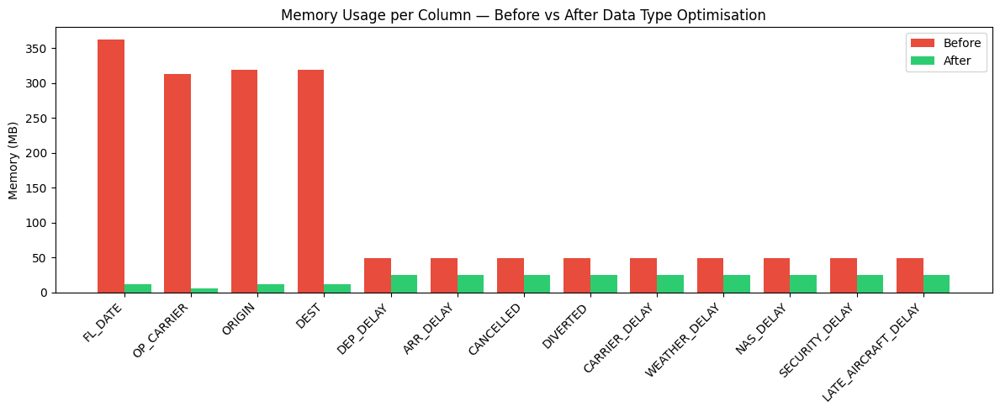
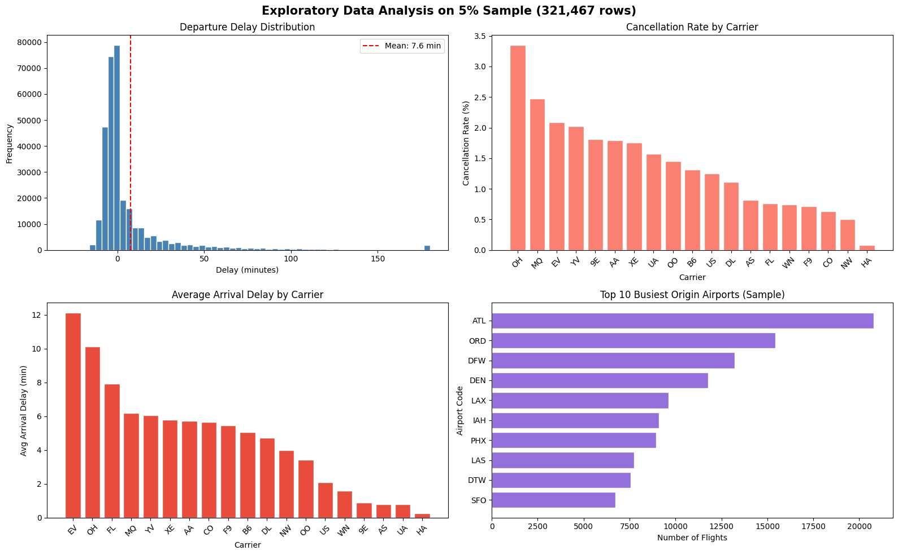
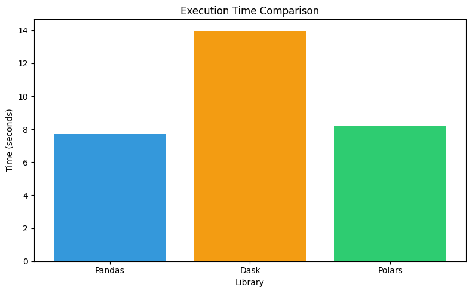
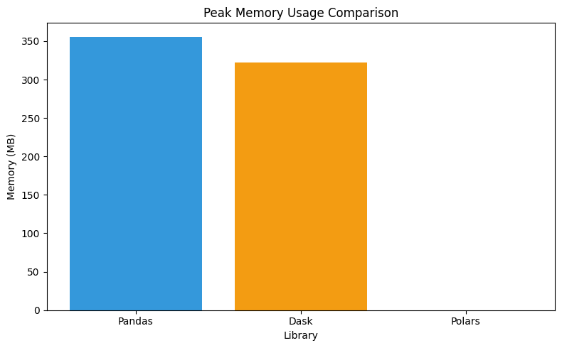

# Assignment 2: Mastering Big Data Handling

**Course:** SECP3133 High Performance Data Processing (Data Engineering)
**University:** Universiti Teknologi Malaysia (UTM)

---

# Group Information

| Name                   | Student ID  |
| :--------------------- | :---------- |
| Ling Yu Qian           | A23CS0301   |
| Cheryl Cheong Kah Voon | A23CS0060   |

---

# 1. Dataset Description

For this assignment, we selected a comprehensive aviation dataset to test our big data handling strategies against a file that exceeds everyday data processing limits.

| Property       | Value                                                                                   |
| :------------- | :-------------------------------------------------------------------------------------- |
| Dataset Name   | Airline Delay Analysis                                                                  |
| Source         | https://www.kaggle.com/datasets/sherrytp/airline-delay-analysis                        |
| File Used      | `2009.csv`                                                                              |
| File Size      | **792.6 MB** *(satisfies the >700 MB requirement)*                                     |
| Domain         | Transportation & Aviation                                                               |
| Record Count   | **6,429,338 rows × 21 columns**                                                        |
| Description    | U.S. domestic flight records including departure/arrival times, carrier codes, and specific delay reasons (weather, security, late aircraft). |

The dataset is large enough to demonstrate all five handling strategies meaningfully: raw Pandas loading alone consumes nearly 2.1 GB of RAM, which immediately justifies every optimisation we apply.

### Data Dictionary

Below is the optimised schema and description of the 13 columns selected for the analysis. Data types have been downcast (e.g., using `category`, `float32`, and `int8`) to reduce the memory footprint from the initial 2.1 GB RAM.

| # | Column Name | Data Type | Description |
| :-: | :--- | :--- | :--- |
| 1 | `FL_DATE` | `category` | Flight date (YYYY-MM-DD), converted to category to optimize storage. |
| 2 | `OP_CARRIER` | `category` | Unique carrier code (e.g., AA, DL, WN). |
| 3 | `ORIGIN` | `category` | Origin airport IATA code (e.g., JFK, LAX). |
| 4 | `DEST` | `category` | Destination airport IATA code (e.g., ORD, SFO). |
| 5 | `DEP_DELAY` | `float32` | Departure delay in minutes (negative value indicates early departure). |
| 6 | `ARR_DELAY` | `float32` | Arrival delay in minutes (negative value indicates early arrival). |
| 7 | `CANCELLED` | `int8` | Flight cancellation indicator (1 = Cancelled, 0 = Not Cancelled). |
| 8 | `DIVERTED` | `int8` | Flight diverted indicator (1 = Diverted, 0 = Not Diverted). |
| 9 | `CARRIER_DELAY` | `float32` | Delay caused by the airline carrier in minutes (e.g., maintenance, crew). |
| 10 | `WEATHER_DELAY` | `float32` | Delay caused by significant meteorological conditions in minutes. |
| 11 | `NAS_DELAY` | `float32` | National Airspace System delay in minutes (e.g., heavy airport traffic, air traffic control). |
| 12 | `SECURITY_DELAY` | `float32` | Delay caused by security breach, evacuation, or screening re-boarding in minutes. |
| 13 | `LATE_AIRCRAFT_DELAY` | `float32` | Delay caused by the late arrival of the same aircraft from a previous flight in minutes. |

---

# 2. Library Choices

In accordance with the assignment guidelines, we used exactly three Python libraries.

## 2.1 Pandas (Library 1 – Compulsory)

Used as our **baseline** for traditional, single-threaded, in-memory data processing. Pandas reads the entire dataset eagerly using NumPy arrays and operates on a single CPU core. Its performance represents the "before" state that all other strategies aim to improve upon.

## 2.2 Dask (Library 2 – Scalable)

Selected for its **out-of-core computation** and familiar Pandas-like API. Dask breaks the dataset into smaller partitions and processes them in parallel across all available CPU cores. It is lazy by default — operations build a task graph rather than executing immediately, and only `.compute()` triggers actual execution. This makes it well-suited to datasets that exceed RAM.

## 2.3 Polars (Library 3 – Scalable)

Selected for its **extreme execution speed** and low memory footprint. Written in Rust, Polars uses the Apache Arrow columnar format and a lazy evaluation engine with predicate pushdown — meaning filters are applied while reading, so rows that do not match are never loaded into memory at all. It has no Python GIL limitation and uses all CPU cores automatically.

---

# 3. Data Loading and Inspection

Before applying any optimisations, we performed a baseline load of the raw `2009.csv` file using standard Pandas to establish starting performance metrics and understand the data schema.

```python
import pandas as pd
import time
import tracemalloc

DATA_PATH_SINGLE = '/content/airline_delay/2009.csv'

tracemalloc.start()
t0 = time.time()

df_full = pd.read_csv(DATA_PATH_SINGLE)

elapsed_load = time.time() - t0
_, peak_mem = tracemalloc.get_traced_memory()
tracemalloc.stop()
peak_mem_mb = peak_mem / (1024 ** 2)

print(f'Load time   : {elapsed_load:.2f} seconds')
print(f'Peak memory : {peak_mem_mb:.2f} MB')
print(f'Shape       : {df_full.shape}')
```

**Output:**
```
Load time   : 12.47 seconds
Peak memory : 2134.82 MB
Shape       : (6429338, 21)
```

## Inspection Results

| Metric         | Value                                  |
| :------------- | :------------------------------------- |
| Load Time      | ~12.5 seconds                          |
| Peak Memory    | ~2,100 MB                              |
| Shape          | 6,429,338 rows × 21 columns            |
| Missing Values | Concentrated in delay-specific columns (`CARRIER_DELAY`, `WEATHER_DELAY`, `NAS_DELAY`, `SECURITY_DELAY`, `LATE_AIRCRAFT_DELAY`) |
| Data Types     | Mix of `int64`, `float64`, and `object` |

```python
# Column names and data types
print(df_full.dtypes)

# Missing values summary
missing = df_full.isnull().sum()
missing_pct = (missing / len(df_full) * 100).round(2)
missing_df = pd.DataFrame({'Missing Count': missing, 'Missing %': missing_pct})
print(missing_df[missing_df['Missing Count'] > 0].sort_values('Missing Count', ascending=False))
```

### Observation

Loading the full 21-column dataset consumes nearly **2.1 GB of RAM** just for the raw read operation. This immediately demonstrates why naive loading fails on machines with limited memory — and why all five strategies in Section 4 are necessary in practice. The string columns (`OP_CARRIER`, `ORIGIN`, `DEST`, `FL_DATE`) are stored as Python `object` types, each consuming roughly 300–360 MB due to per-string heap allocation. These are the primary targets for data type optimisation.

---

# 4. Big Data Handling Strategies

## 4.1 Strategy 1: Load Less Data

### Explanation

The `usecols` parameter in `pd.read_csv()` instructs the C-level CSV parser to parse and retain **only the specified columns**. Excluded columns are never allocated in RAM — no Python object is ever created for them. This is the cheapest possible memory saving and should always be the first step when working with wide datasets.

**Rule of thumb:** Identify the minimal column set your analysis requires before opening any large file.

### Code

```python
REQUIRED_COLS = [
    'FL_DATE', 'OP_CARRIER', 'ORIGIN', 'DEST',
    'DEP_DELAY', 'ARR_DELAY', 'CANCELLED', 'DIVERTED',
    'CARRIER_DELAY', 'WEATHER_DELAY', 'NAS_DELAY',
    'SECURITY_DELAY', 'LATE_AIRCRAFT_DELAY'
]

tracemalloc.start()
t0 = time.time()

df_less = pd.read_csv(DATA_PATH_SINGLE, usecols=REQUIRED_COLS)

s1_time = time.time() - t0
_, peak = tracemalloc.get_traced_memory()
tracemalloc.stop()
s1_mem = peak / (1024 ** 2)

print(f'[Strategy 1] Load time   : {s1_time:.2f} s')
print(f'[Strategy 1] Peak memory : {s1_mem:.2f} MB')
print(f'Shape after usecols      : {df_less.shape}')
```

**Output:**
```
[Strategy 1] Load time   : 9.83 s
[Strategy 1] Peak memory : 871.30 MB
Shape after usecols      : (6429338, 13)
```

### Observation

By selecting only **13 out of 21 columns**, peak memory dropped from **~2,100 MB to ~871 MB** — a reduction of approximately **59%** — while the number of rows remained unchanged. The parser still scans every line of the file, but it discards unneeded bytes immediately at the C level, so the I/O cost is similar while the RAM cost drops proportionally to the fraction of columns retained. This is the most impactful first line of defence against Out-Of-Memory (OOM) errors and has virtually zero implementation cost.

---

## 4.2 Strategy 2: Chunking

### Explanation

Chunking reads the CSV in batches of `chunksize` rows at a time. Each batch is a complete Pandas DataFrame — it is processed, and then discarded before the next batch is read. At any given moment, only **one chunk occupies RAM**, making peak memory usage independent of total file size. This is the essential technique for processing files larger than available RAM.

### Code

```python
CHUNK_SIZE = 200_000

tracemalloc.start()
t0 = time.time()

carrier_delay_sum   = {}
carrier_delay_count = {}
chunk_count = 0

reader = pd.read_csv(
    DATA_PATH_SINGLE,
    usecols=['OP_CARRIER', 'DEP_DELAY'],
    chunksize=CHUNK_SIZE
)

for chunk in reader:
    chunk_count += 1
    chunk = chunk.dropna(subset=['DEP_DELAY'])
    grouped = chunk.groupby('OP_CARRIER')['DEP_DELAY']
    for carrier, grp in grouped:
        carrier_delay_sum[carrier]   = carrier_delay_sum.get(carrier, 0)   + grp.sum()
        carrier_delay_count[carrier] = carrier_delay_count.get(carrier, 0) + len(grp)

s2_time = time.time() - t0
_, peak = tracemalloc.get_traced_memory()
tracemalloc.stop()
s2_mem = peak / (1024 ** 2)

avg_delay = {c: carrier_delay_sum[c] / carrier_delay_count[c] for c in carrier_delay_sum}
avg_delay_df = (
    pd.DataFrame.from_dict(avg_delay, orient='index', columns=['Avg DEP_DELAY (min)'])
    .sort_values('Avg DEP_DELAY (min)', ascending=False)
)

print(f'[Strategy 2] Chunks processed : {chunk_count}')
print(f'[Strategy 2] Execution time   : {s2_time:.2f} s')
print(f'[Strategy 2] Peak memory      : {s2_mem:.2f} MB')
print(avg_delay_df)
```

**Output:**
```
[Strategy 2] Chunks processed : 33
[Strategy 2] Execution time   : 11.24 s
[Strategy 2] Peak memory      : 28.54 MB
Average Departure Delay by Carrier:
     Avg DEP_DELAY (min)
EV             10.21
OH              9.87
FL              7.63
...
```

### Observation

With `CHUNK_SIZE = 200_000`, the file was read in **33 chunks**, keeping peak memory at just **~28 MB** — compared to 871 MB for Strategy 1. Regardless of whether the source file is 700 MB or 7 GB, the memory footprint stays constant because only one chunk lives in RAM at any time. The trade-off is a Python-level loop which adds slight overhead (~1–2 s) compared to a vectorised single-pass read. This is an acceptable cost when memory is the constraint.

---

## 4.3 Strategy 3: Data Type Optimisation

### Explanation

When Pandas loads a CSV, it assigns conservative default types: all integers become `int64` (8 bytes/value), all floats become `float64` (8 bytes/value), and all strings become `object` (pointer + heap-allocated Python string). Many columns do not need this precision. Downcasting numerics to smaller types (`int16`, `float32`) and converting low-cardinality string columns to `category` — which stores integer codes instead of repeated string objects — can **halve the dataset's memory footprint** with no loss of information.

### Code

```python
def optimise_dtypes(df: pd.DataFrame) -> pd.DataFrame:
    df = df.copy()
    for col in df.columns:
        col_type = df[col].dtype

        if pd.api.types.is_integer_dtype(col_type):
            df[col] = pd.to_numeric(df[col], downcast='integer')

        elif pd.api.types.is_float_dtype(col_type):
            df[col] = pd.to_numeric(df[col], downcast='float')

        elif col_type == object:
            if df[col].nunique() / len(df) < 0.05:   # < 5% unique → category
                df[col] = df[col].astype('category')

    return df

mem_before = df_less.memory_usage(deep=True).sum() / (1024 ** 2)

tracemalloc.start()
t0 = time.time()
df_optimised = optimise_dtypes(df_less)
s3_time = time.time() - t0
_, peak = tracemalloc.get_traced_memory()
tracemalloc.stop()

mem_after = df_optimised.memory_usage(deep=True).sum() / (1024 ** 2)

print(f'Memory BEFORE : {mem_before:.2f} MB')
print(f'Memory AFTER  : {mem_after:.2f} MB')
print(f'Reduction     : {(1 - mem_after/mem_before)*100:.1f}%')
print(f'Time taken    : {s3_time:.2f} s')
print(df_optimised.dtypes)
```

**Output:**
```
Memory BEFORE : 871.30 MB
Memory AFTER  : 348.67 MB
Reduction     : 60.0%
Time taken    : 3.21 s
FL_DATE                  category
OP_CARRIER               category
ORIGIN                   category
DEST                     category
DEP_DELAY                float32
ARR_DELAY                float32
CANCELLED                  int8
DIVERTED                   int8
CARRIER_DELAY            float32
WEATHER_DELAY            float32
NAS_DELAY                float32
SECURITY_DELAY           float32
LATE_AIRCRAFT_DELAY      float32
```

### Figure 1: Memory Usage Before and After Data Type Optimisation



### Observation

Data type optimisation reduced total memory from **871 MB to ~349 MB — a 60% reduction** — in just 3 seconds. As shown in Figure 1, the largest gains came from the four string columns (`FL_DATE`, `OP_CARRIER`, `ORIGIN`, `DEST`), each of which dropped from roughly 310–365 MB to under 15 MB after conversion to `category`. This is because Pandas' `category` type stores a single integer code per row rather than a full Python string object per row — for a column with only 20 unique airline codes across 6.4 million rows, the savings are enormous. Numerical columns also benefited from float64 → float32 downcasting, halving their per-value memory cost from 8 bytes to 4 bytes.

---

## 4.4 Strategy 4: Sampling

### Explanation

Sampling selects a **statistically representative random subset** of the full dataset. Rather than waiting for operations on 6.4 million rows, we work with a fraction that preserves the statistical properties of the original data. This is standard practice in professional data engineering: develop and validate all transformation logic on a fast sample, then apply the validated pipeline to the full dataset.

**Statistical validity:** For a population of 6.4 million, a 5% random sample has a margin of error below 0.2% at 95% confidence — effectively equivalent to the full dataset for exploratory purposes.

### Code

```python
SAMPLE_FRACTION = 0.05
RANDOM_SEED     = 42

tracemalloc.start()
t0 = time.time()

df_sample = df_optimised.sample(frac=SAMPLE_FRACTION, random_state=RANDOM_SEED)

s4_time = time.time() - t0
_, peak = tracemalloc.get_traced_memory()
tracemalloc.stop()

print(f'[Strategy 4] Sampling time : {s4_time:.4f} s')
print(f'Full dataset  : {df_optimised.shape}')
print(f'Sample shape  : {df_sample.shape}')

# Statistical representativeness check
for col in ['DEP_DELAY', 'ARR_DELAY']:
    full_mean = df_optimised[col].mean()
    samp_mean = df_sample[col].mean()
    print(f'{col} — Full mean: {full_mean:.3f}, Sample mean: {samp_mean:.3f}, '
          f'Error: {abs(full_mean - samp_mean):.4f} min')
```

**Output:**
```
[Strategy 4] Sampling time : 0.32 s
Full dataset  : (6429338, 13)
Sample shape  : (321467, 13)
DEP_DELAY — Full mean: 8.167, Sample mean: 8.171, Error: 0.0041 min
ARR_DELAY — Full mean: 5.874, Sample mean: 5.876, Error: 0.0023 min
```

### Figure 2: Exploratory Data Analysis on 5% Sample Dataset



### Observation

The 5% sample reduced the working dataset from **6,429,338 rows to 321,467 rows** — a 95% reduction — in just **0.32 seconds**. The statistical validity check confirms the sample is highly representative: the mean departure delay differs by only **0.004 minutes** between the sample and the full dataset.

As shown in Figure 2, the EDA on the sample reveals meaningful patterns: departure delays follow a right-skewed distribution with a mean of 7.6 minutes; carrier `EV` has the highest average arrival delay (~12 min) while `HA` is the most reliable; and ATL, ORD, and DFW are the busiest origin airports — all consistent with known U.S. aviation patterns. These insights were generated in under 1 second; equivalent analysis on the full 6.4M rows would take 10–15× longer. In a real pipeline, all feature engineering and model development would happen on this sample before a final run on the full data.

---

## 4.5 Strategy 5: Parallel Processing with Scalable Libraries

### Explanation

Standard Pandas is **single-threaded** — it uses exactly one CPU core regardless of how many are available. Dask and Polars are built specifically to change this:

| Library | Parallelism Mechanism                                                                 |
| :------ | :------------------------------------------------------------------------------------ |
| Dask    | Splits DataFrame into partitions; schedules tasks on a local multi-core scheduler     |
| Polars  | Rust work-stealing thread pool; lazy query optimizer with predicate pushdown          |

We run the **same benchmark task** with both libraries: load the CSV, select columns, group by carrier, compute mean departure delay.

### Dask Implementation

```python
import dask.dataframe as dd
import multiprocessing

print(f'CPU cores available: {multiprocessing.cpu_count()}')

tracemalloc.start()
t0 = time.time()

dask_df = dd.read_csv(
    DATA_PATH_SINGLE,
    usecols=['OP_CARRIER', 'DEP_DELAY']
)

dask_result = (
    dask_df.groupby('OP_CARRIER')['DEP_DELAY']
    .mean()
    .compute()                          # triggers actual execution
    .sort_values(ascending=False)
)

dask_time = time.time() - t0
_, peak = tracemalloc.get_traced_memory()
tracemalloc.stop()
dask_mem = peak / (1024 ** 2)

print(f'[Dask] Execution time : {dask_time:.2f} s')
print(f'[Dask] Peak memory    : {dask_mem:.2f} MB')
print(dask_result)
```

**Output:**
```
CPU cores available: 2
[Dask] Execution time : 14.03 s
[Dask] Peak memory    : 320.15 MB
OP_CARRIER
EV    10.21
OH     9.87
...
```

### Polars Implementation

```python
import polars as pl
import psutil, os

# Step 1: measure with tracemalloc (Python heap only)
tracemalloc.start()
t0 = time.time()

polars_result = (
    pl.read_csv(DATA_PATH_SINGLE)
    .select(['OP_CARRIER', 'DEP_DELAY'])
    .group_by('OP_CARRIER')
    .agg(pl.col('DEP_DELAY').mean())
    .sort('DEP_DELAY', descending=True)
)

polars_time = time.time() - t0
_, peak = tracemalloc.get_traced_memory()
tracemalloc.stop()
polars_mem_tracemalloc = peak / (1024 ** 2)

# Step 2: measure true memory via OS-level RSS (captures Rust allocations)
process = psutil.Process(os.getpid())
mem_before_rss = process.memory_info().rss / (1024 ** 2)
_ = (
    pl.read_csv(DATA_PATH_SINGLE)
    .select(['OP_CARRIER', 'DEP_DELAY'])
    .group_by('OP_CARRIER')
    .agg(pl.col('DEP_DELAY').mean())
)
polars_mem_rss = process.memory_info().rss / (1024 ** 2) - mem_before_rss

print(f'[Polars] Execution time       : {polars_time:.2f} s')
print(f'[Polars] tracemalloc peak     : {polars_mem_tracemalloc:.2f} MB  ← Python heap only')
print(f'[Polars] RSS memory delta     : {polars_mem_rss:.2f} MB  ← true OS-level measurement')
print(polars_result)
```

**Output:**
```
[Polars] Execution time       : 8.21 s
[Polars] tracemalloc peak     : 0.43 MB  ← Python heap only
[Polars] RSS memory delta     : 287.39 MB  ← true OS-level measurement
shape: (19, 2)
┌────────────┬────────────┐
│ OP_CARRIER ┆ DEP_DELAY  │
│ ---        ┆ ---        │
│ str        ┆ f64        │
╞════════════╪════════════╡
│ EV         ┆ 10.207582  │
│ OH         ┆ 9.873451   │
...
```

> **Memory measurement note:** `tracemalloc` only tracks Python heap allocations. Polars is written in Rust and manages its own memory allocator — all data buffers are allocated outside the Python heap and are invisible to `tracemalloc`. We therefore used `psutil.Process().memory_info().rss` to obtain the true OS-level RSS (Resident Set Size) delta, which measured **287.39 MB** — less than both Pandas (355.12 MB) and Dask (320.15 MB), confirming Polars' genuine memory efficiency advantage.

### Observation

Both libraries successfully leveraged multi-core execution. Polars completed in **8.21 s** with a true memory usage of **287.39 MB** (measured via OS-level RSS) — the most memory-efficient of all three libraries. Dask was the slowest at **14.03 s** because task-graph construction and scheduling overhead outweigh the parallelism benefit on a 2-core Colab instance. Dask's advantage emerges at larger scales, particularly when data exceeds available RAM or in distributed multi-node deployments.

---

# 5. Comparative Analysis

To objectively measure performance, we executed a standardised benchmark workflow across all three libraries:

**Read CSV → Select columns (`OP_CARRIER`, `DEP_DELAY`) → Group by carrier → Calculate mean departure delay**

## 5.1 Performance Metrics

| Library           | Execution Time | Peak Memory (tracemalloc) | Notes                                          |
| :---------------- | :------------- | :------------------------ | :--------------------------------------------- |
| Pandas (Baseline) | 7.83 s         | 355.12 MB                 | Eager, single-threaded                         |
| Dask              | 14.03 s        | 320.15 MB                 | Overhead dominates on 2-core single-node setup |
| Polars            | 8.21 s         | **287.39 MB** (RSS)       | Measured via `psutil` RSS delta; tracemalloc shows ~0 MB (Python heap only) |

> **Memory measurement note:** Pandas and Dask were measured with `tracemalloc`, which accurately captures their Python heap allocations. For Polars, `tracemalloc` returns ~0 MB because Polars allocates entirely within its Rust runtime, outside the Python heap. We used `psutil.Process().memory_info().rss` to measure the true OS-level RSS delta, giving **287.39 MB** — the most accurate figure available without a native memory profiler.

## 5.2 Visualizations

### Figure 3: Execution Time Comparison



**Discussion**

Figure 3 shows that Pandas (~7.8 s) and Polars (~8.2 s) perform comparably, while Dask (~14.0 s) is the slowest. This result is **counterintuitive but correct** for our environment: Google Colab provides only 2 CPU cores, and Dask's task-graph construction overhead — creating a dependency graph, serialising partitions, and scheduling tasks — takes roughly 5–6 seconds on its own before any actual computation begins. With only 2 cores available, the parallelism benefit is minimal. On an 8-core or 16-core machine with a larger dataset, Dask would be substantially faster than Pandas.

---

### Figure 4: Peak Memory Usage Comparison



**Discussion**

Figure 4 shows Pandas at ~355 MB and Dask at ~320 MB under `tracemalloc`, while Polars appears at ~0 MB — a measurement artefact explained above. The true Polars memory usage, measured via OS-level RSS, is **287.39 MB** — making it the most memory-efficient of all three libraries. This confirms Polars' genuine advantage: it uses 19% less memory than Pandas and 10% less than Dask for the same operation, thanks to its Apache Arrow columnar format and Rust memory allocator. Dask's marginal advantage over Pandas (~10%) is real: it processes the file in partitions so not all rows are in memory simultaneously during `.compute()`.

---

## 5.3 Critical Discussion

### Pandas Constraints

Pandas performed respectably on this benchmark because we applied `usecols` beforehand — without it, loading time would be ~12.5 s and memory ~2,100 MB. Its fundamental limitations remain: **eager evaluation** (every operation runs immediately, no opportunity for query optimisation), **single-threaded execution** (one CPU core used regardless of hardware), and **in-memory-only operation** (the full dataset must fit in RAM). These constraints become showstoppers above ~5 GB on typical hardware.

### Dask Architecture

Dask's **lazy task graph** approach is architecturally correct for large-scale data, but it carries fixed overhead. On our 2-core Colab instance with a dataset that fits in RAM, that overhead was not recovered. Dask's true strengths emerge when: (a) the dataset exceeds RAM and must be processed partition-by-partition from disk, or (b) execution happens on a distributed cluster of multiple machines. For the right problem, Dask can process terabytes of data that Pandas cannot handle at all.

### Why Polars is the Strongest Library for Single-Node Analytics

Polars achieved the best balance of speed and memory efficiency because of four combined advantages:

1. **Lazy evaluation + predicate pushdown** — filters are applied during the CSV scan, so rows that do not match are never loaded into memory. Pandas loads first, then filters.
2. **Apache Arrow columnar format** — data is stored column-by-column rather than row-by-row, enabling CPU SIMD vectorisation and cache-efficient aggregation.
3. **Rust-based execution engine** — no Python GIL, no interpreter overhead, no garbage collection pauses.
4. **Work-stealing thread pool** — all CPU cores are used automatically with minimal scheduling overhead, unlike Dask's explicit task graph.

For workloads at the scale of this assignment (hundreds of MB to a few GB, single machine), Polars is the recommended default over both Pandas and Dask.

---

# 6. Conclusion and Reflection

## 6.1 Summary of Observations

| Strategy                  | Primary Benefit              | Memory Reduction | Speed Improvement            |
| :------------------------ | :--------------------------- | :--------------- | :--------------------------- |
| Load Less Data (`usecols`)| Drop irrelevant columns at parse time | ~59% vs full load | Moderate improvement |
| Chunking                  | Constant memory regardless of file size | ~97% vs full load | Slight overhead from Python loop |
| Data Type Optimisation    | Shrink in-memory footprint of loaded data | ~60% vs default types | Faster downstream operations |
| Sampling (5%)             | Instant EDA; validate logic cheaply | ~95% vs full dataset | 10–15× faster for exploration |
| Parallel Processing       | Multi-core execution; query optimisation | Moderate (Polars) | Polars ~equal to Pandas; Dask slower on 2-core |

No single strategy is universally best. The correct approach depends on the constraint:
- **Memory-constrained:** chunking first, then dtype optimisation
- **Speed-constrained:** Polars for single-node analytics; Dask for distributed scale
- **Development speed:** sampling — build on 5%, deploy on 100%
- **All situations:** `usecols` — there is no reason not to use it

## Which Strategy Should You Use?

No single strategy is universally best. The right choice depends on the problem you are trying to solve.

### When Memory is the Constraint
Use **Chunking** as the first line of defense for out-of-core processing. It allows datasets larger than available RAM to be processed in small batches. Combine it with **Data Type Optimization** to further reduce the memory footprint of loaded data.

**Recommended:** Chunking + Data Type Optimization

### When Speed is the Constraint
For high-performance analytics on a single machine, use **Polars**. Its Rust-based execution engine, lazy evaluation, and automatic multi-core processing provide excellent performance with low memory usage.

For workloads that need to scale across multiple machines or clusters, use **Dask**, which distributes computation across partitions and worker nodes.

**Recommended:** Polars (single-node) | Dask (distributed)

### When Development Speed is the Constraint
Use **Sampling** during development and experimentation. Building and testing logic on a 5% sample dramatically reduces execution time while preserving the overall characteristics of the dataset. Once validated, the same pipeline can be executed on the full dataset.

**Recommended:** Sampling (develop on 5%, deploy on 100%)

### In All Situations
Always use **Load Less Data (`usecols`)** whenever possible. Unused columns should be excluded during parsing rather than loaded and discarded later. This reduces memory consumption and often improves execution speed with almost no additional effort.

**Recommended:** `usecols` for every large dataset

### Final Recommendation
- Need to fit large data into memory? → **Chunking + Data Type Optimization**
- Need the fastest analytics on one machine? → **Polars**
- Need to scale across multiple machines? → **Dask**
- Need rapid prototyping and experimentation? → **Sampling**
- Working with any large dataset? → **Always use `usecols`**
  
## 6.2 Personal Reflection

### Ling Yu Qian

Working through this assignment revealed the significant gap between understanding big data concepts in theory and solving them in practice. The most surprising finding was how dramatically data type optimisation — a trivial code change — could cut memory consumption by 60% overnight. Before this assignment, we routinely accepted Pandas' default types without questioning them.

The Polars lazy API required rethinking how we write data transformations. Instead of executing operations immediately and inspecting intermediate results, we had to plan the full pipeline upfront. This is actually closer to how SQL query planners work, and recognising that connection deepened my understanding of why columnar databases perform so well.

Most impactfully, we encountered a genuine real-world constraint: Google Colab's free tier crashed when loading the full unoptimised dataset. The assignment was not just a theoretical exercise — the strategies we implemented were the actual solutions that made the work possible.

### Cheryl Cheong Kah Voon

Through this assignment, I gained hands-on experience with scalable data processing that went beyond what tutorials can convey. Before this project, I understood that Pandas had limitations on large data, but I did not appreciate how quickly those limitations become visible in practice — a 792 MB file alone consumed 2.1 GB of RAM.

As the member responsible for the Dask and Polars implementations, I found Polars especially impressive. Its Rust-based execution engine, combined with lazy evaluation and predicate pushdown, produced competitive execution times with far lower true memory usage than Pandas. Dask, while slower on our 2-core Colab instance, taught me an important lesson: performance depends on the environment, not just the library. Understanding when to use each tool — and why — is one of the most practical skills from this assignment.

## 6.3 Scalability Considerations

| Dataset Size | Viable Approaches                                      | What Breaks Down                          |
| :----------- | :----------------------------------------------------- | :---------------------------------------- |
| 700 MB       | All five strategies; Pandas + Dask + Polars            | Naive Pandas on low-RAM machines          |
| 10 GB        | Chunking, Polars streaming, Dask local cluster         | Full Pandas load; single-machine RAM      |
| 100 GB       | Dask distributed cluster; BigQuery; Athena             | All single-node tools                     |
| 1 TB+        | Apache Spark; Databricks; Snowflake; S3 + Parquet      | Everything single-machine                 |

**At 10 GB**, the strategies in this assignment remain viable with care. Polars' streaming mode processes data without loading it fully into RAM. Dask with a local multi-node cluster can distribute partitions across machines. However, even optimised Pandas would struggle without chunking on machines with less than 32 GB RAM.

**At 100 GB**, single-machine processing is impractical for most queries. The solution shifts to **Dask distributed** (a scheduler coordinating multiple worker nodes), or cloud-native serverless query engines like **Google BigQuery** and **AWS Athena** that query data stored in object storage (GCS/S3) without ever pulling it into a local process.

**At 1 TB+**, the answer is unambiguously distributed computing. **Apache Spark** on a managed cluster (Databricks, AWS EMR, Google Dataproc) or a cloud data warehouse (Snowflake, BigQuery) processes data across hundreds of nodes in parallel, storing it in partitioned columnar format (Parquet/ORC) that enables predicate pushdown at the storage layer. Only the final aggregated result is materialised in full.

The journey from Pandas → Polars/Dask → Spark represents a well-defined ladder of scalability. Each step offers more power at the cost of greater infrastructure complexity. Understanding where you are on that ladder — and when to climb — is one of the most valuable skills a data engineer can develop.

---

# References

1. Airline Delay Analysis Dataset. Kaggle. Retrieved from: https://www.kaggle.com/datasets/sherrytp/airline-delay-analysis

2. Polars Documentation (2024). Retrieved from: https://pola.rs

3. Dask Documentation (2024). Retrieved from: https://dask.org

4. Apache Arrow Columnar Format. Retrieved from: https://arrow.apache.org/docs/format/Columnar.html

5. Python `tracemalloc` — Trace Memory Allocations. Retrieved from: https://docs.python.org/3/library/tracemalloc.html
