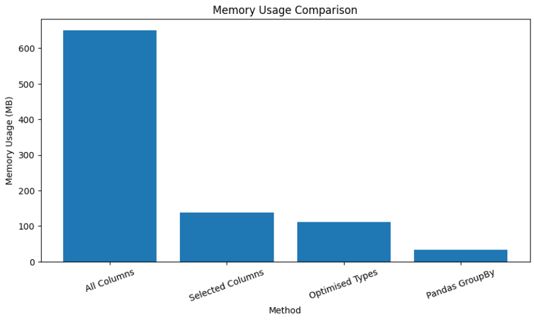
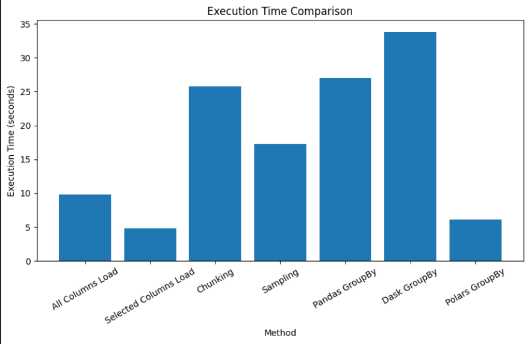

# Assignment 2: Mastering Big Data Handling

## Group Information

| Item       | Details                                   |
| :--------- | :---------------------------------------- |
| Course     | SECP3133 High Performance Data Processing |
| Assignment | Assignment 2: Mastering Big Data Handling |
| Member 1   | **LEE YIN SHEN - A23CS0236**              |
| Member 2   | **BRENDAN CHIA YAN FEI - A23CS0211**      |

---

## 1. Dataset Description

This assignment uses a large Airbnb listings dataset named `airbnb_listings.csv`. The dataset contains listing information from Airbnb, including host details, listing descriptions, property types, room types, location information, prices, review counts, availability, and ratings.

The dataset is suitable for this assignment because it is larger than 700 MB and contains a mixture of numerical, categorical, and text-based columns. This makes it appropriate for applying different big data handling strategies such as loading fewer columns, chunking, data type optimisation, sampling, and scalable processing using Dask and Polars.

| Attribute         | Description                                                |
| :---------------- | :--------------------------------------------------------- |
| Dataset Name      | Airbnb Listings Dataset                                    |
| File Name         | `airbnb_listings.csv`                                      |
| Source            | **https://www.kaggle.com/datasets/joebeachcapital/airbnb** |
| Domain            | Hospitality / Travel Accommodation                         |
| File Size         | 1846.24 MB                                                 |
| Number of Rows    | 494,954                                                    |
| Number of Columns | 89                                                         |
| File Format       | CSV                                                        |
| Separator         | Semicolon `;`                                              |

The dataset is large enough to demonstrate the limitations of traditional Pandas processing and the benefits of using scalable data processing techniques.

---

## 2. Library Choices

Three Python libraries were used in this assignment:

| Library | Role in Assignment                   | Reason for Selection                                                                                      |
| :------ | :----------------------------------- | :-------------------------------------------------------------------------------------------------------- |
| Pandas  | Baseline library                     | Pandas is the traditional data analysis library used as the main comparison point.                        |
| Dask    | Scalable parallel processing library | Dask can process large datasets using partitions and parallel computation.                                |
| Polars  | High-performance dataframe library   | Polars is designed for speed and supports lazy execution, which can optimise queries before running them. |

Pandas was used as the traditional baseline because it is widely used for data analysis. Dask and Polars were selected as scalable alternatives because they are designed to handle larger datasets more efficiently than standard Pandas.

---

## 3. Environment Setup

The project was developed in Google Colab. The dataset was stored in Google Drive and accessed directly from the notebook.

```python
from google.colab import drive
drive.mount('/content/drive')
```

The required libraries were imported as follows:

```python
import os
import time
import pandas as pd
import dask.dataframe as dd
import polars as pl
import matplotlib.pyplot as plt
```

A helper function was created to calculate dataframe memory usage:

```python
def get_memory_mb(df):
    return df.memory_usage(deep=True).sum() / (1024**2)
```

Another helper function was created to clean the `Price` column by removing dollar signs and commas before converting it into a numeric format:

```python
def clean_price_column(df, col="Price"):
    df[col] = (
        df[col]
        .astype(str)
        .str.replace("$", "", regex=False)
        .str.replace(",", "", regex=False)
    )
    df[col] = pd.to_numeric(df[col], errors="coerce")
    return df
```

---

## 4. Data Loading and Initial Inspection

The dataset was first checked to confirm that the file existed and that its size met the assignment requirement.

```python
working_file = "/content/drive/MyDrive/HPDP_A2/airbnb_listings.csv"

print("File exists:", os.path.exists(working_file))
print("File size:", round(os.path.getsize(working_file) / (1024**2), 2), "MB")
```

### Output

```text
File exists: True
File size: 1846.24 MB
```

The dataset size is 1846.24 MB, which is above the minimum 700 MB requirement.

To count the total number of rows, the dataset was read in chunks. This avoids loading the full file into memory at once.

```python
chunk_size = 100000
total_rows = 0

start = time.time()

for chunk in pd.read_csv(working_file, sep=';', chunksize=chunk_size):
    total_rows += len(chunk)

end = time.time()

print("Total rows:", total_rows)
print("Total columns:", 89)
print("Execution time:", round(end - start, 2), "seconds")
```

### Output

```text
Total rows: 494954
Total columns: 89
Execution time: 48.16 seconds
```

During loading, Pandas produced warnings about mixed data types in some columns. This shows that the dataset has inconsistent column values and requires careful handling, especially when working with a large CSV file.

---

## 5. Selected Columns for Analysis

The original dataset contains 89 columns. For the main analysis, 20 important columns were selected. These columns include listing information, host details, location, property details, price, availability, and review information.

```python
selected_cols = [
    "ID",
    "Name",
    "Description",
    "Host Since",
    "Host Response Time",
    "City",
    "Country",
    "Latitude",
    "Longitude",
    "Property Type",
    "Room Type",
    "Accommodates",
    "Bathrooms",
    "Bedrooms",
    "Beds",
    "Price",
    "Minimum Nights",
    "Availability 365",
    "Number of Reviews",
    "Review Scores Rating"
]
```

These columns were chosen because they are useful for understanding listing characteristics and performing meaningful analysis while reducing unnecessary memory usage.

---

## 6. Big Data Handling Strategies

### 6.1 Strategy 1: Load Less Data

#### Explanation

The first strategy is to load only the columns needed for analysis instead of loading the full dataset. This reduces memory usage and loading time because unnecessary columns are skipped during the read operation.

This is one of the easiest and most effective big data handling strategies. If a dataset has many columns but only some of them are required, loading fewer columns can significantly reduce memory consumption.

#### Code: Loading All Columns Sample

```python
start = time.time()

df_all_sample = pd.read_csv(
    working_file,
    sep=';',
    nrows=100000
)

end = time.time()

all_columns_time = end - start
all_columns_memory = get_memory_mb(df_all_sample)

print("All columns sample shape:", df_all_sample.shape)
print("All columns memory usage:", round(all_columns_memory, 2), "MB")
print("All columns loading time:", round(all_columns_time, 2), "seconds")
```

#### Output

```text
All columns sample shape: (100000, 89)
All columns memory usage: 649.52 MB
All columns loading time: 9.85 seconds
```

#### Code: Loading Selected Columns Sample

```python
start = time.time()

df_less_sample = pd.read_csv(
    working_file,
    sep=';',
    usecols=selected_cols,
    nrows=100000
)

end = time.time()

less_columns_time = end - start
less_columns_memory = get_memory_mb(df_less_sample)

print("Selected columns sample shape:", df_less_sample.shape)
print("Selected columns memory usage:", round(less_columns_memory, 2), "MB")
print("Selected columns loading time:", round(less_columns_time, 2), "seconds")
```

#### Output

```text
Selected columns sample shape: (100000, 20)
Selected columns memory usage: 138.69 MB
Selected columns loading time: 4.81 seconds
```

#### Memory Reduction Calculation

```python
memory_saved = all_columns_memory - less_columns_memory
memory_reduction = (memory_saved / all_columns_memory) * 100

print("Memory saved:", round(memory_saved, 2), "MB")
print("Memory reduction:", round(memory_reduction, 2), "%")
```

#### Output

```text
Memory saved: 510.83 MB
Memory reduction: 78.65 %
```

#### Discussion

Loading only 20 selected columns instead of all 89 columns reduced memory usage from 649.52 MB to 138.69 MB for 100,000 rows. This saved 510.83 MB of memory, giving a memory reduction of 78.65%.

The loading time also improved from 9.85 seconds to 4.81 seconds. This shows that column selection is a very effective first step when working with large datasets.

---

### 6.2 Strategy 2: Chunking

#### Explanation

Chunking means reading a large file in smaller portions instead of loading the entire dataset into memory at once. This is useful when the full dataset is too large to fit comfortably in memory.

For this strategy, the dataset was processed in chunks of 100,000 rows. The analysis calculated the average number of reviews for each room type.

#### Code

```python
chunk_size = 100000

room_review_sum = {}
room_count = {}

start = time.time()

for chunk in pd.read_csv(
    working_file,
    sep=';',
    usecols=["Room Type", "Number of Reviews"],
    chunksize=chunk_size
):
    chunk["Number of Reviews"] = pd.to_numeric(
        chunk["Number of Reviews"],
        errors="coerce"
    )

    grouped = chunk.groupby("Room Type")["Number of Reviews"].agg(["sum", "count"])

    for room_type, row in grouped.iterrows():
        room_review_sum[room_type] = room_review_sum.get(room_type, 0) + row["sum"]
        room_count[room_type] = room_count.get(room_type, 0) + row["count"]

end = time.time()

chunking_time = end - start

chunk_result = {
    room_type: room_review_sum[room_type] / room_count[room_type]
    for room_type in room_review_sum
}

print("Average number of reviews by room type:")
print(chunk_result)
print("Chunking execution time:", round(chunking_time, 2), "seconds")
```

#### Output

```text
Average number of reviews by room type:
{
    'Entire home/apt': 17.186313980880247,
    'Private room': 16.22202360916045,
    'Shared room': 11.108401387179773,
    '9': nan
}

Chunking execution time: 25.82 seconds
```

#### Discussion

Chunking allowed the full dataset to be processed without loading all rows into memory at once. This is useful for large datasets because only one chunk exists in memory at a time.

The result shows that `Entire home/apt` listings had the highest average number of reviews, followed by `Private room` and `Shared room`.

One unusual value, `9`, appeared in the `Room Type` column. This likely indicates dirty or inconsistent data in the dataset. This is a common issue when working with real-world big datasets.

The chunking method took 25.82 seconds. Although it was not the fastest method, it was memory-safe and suitable for processing large files in limited-memory environments.

---

### 6.3 Strategy 3: Data Type Optimisation

#### Explanation

When Pandas loads data, it often uses default data types such as `int64`, `float64`, and `object`. These types may use more memory than necessary.

Data type optimisation reduces memory usage by converting columns into more efficient types. For example, repeated text values can be converted into `category`, and large numeric types can be downcast into smaller numeric types such as `float32` or `int32`.

#### Code: Load Selected Columns

```python
df_opt = pd.read_csv(
    working_file,
    sep=';',
    usecols=selected_cols,
    nrows=100000
)

before_opt_memory = get_memory_mb(df_opt)

print("Before optimisation memory:", round(before_opt_memory, 2), "MB")
print(df_opt.dtypes)
```

#### Output

```text
Before optimisation memory: 138.69 MB

ID                        int64
Name                     object
Description              object
Host Since               object
Host Response Time       object
City                     object
Country                  object
Latitude                float64
Longitude               float64
Property Type            object
Room Type                object
Accommodates            float64
Bathrooms               float64
Bedrooms                float64
Beds                    float64
Price                   float64
Minimum Nights          float64
Availability 365        float64
Number of Reviews       float64
Review Scores Rating    float64
dtype: object
```

#### Code: Convert Categorical Columns

```python
category_cols = [
    "Name",
    "Host Response Time",
    "City",
    "Country",
    "Property Type",
    "Room Type"
]

for col in category_cols:
    if col in df_opt.columns:
        df_opt[col] = df_opt[col].astype("category")
```

#### Code: Downcast Numeric Columns

```python
integer_cols = [
    "ID",
    "Accommodates",
    "Minimum Nights",
    "Availability 365",
    "Number of Reviews"
]

float_cols = [
    "Latitude",
    "Longitude",
    "Bathrooms",
    "Bedrooms",
    "Beds",
    "Price",
    "Review Scores Rating"
]

for col in integer_cols:
    if col in df_opt.columns:
        df_opt[col] = pd.to_numeric(df_opt[col], errors="coerce", downcast="integer")

for col in float_cols:
    if col in df_opt.columns:
        df_opt[col] = pd.to_numeric(df_opt[col], errors="coerce", downcast="float")
```

#### Code: Measure Optimised Memory

```python
after_opt_memory = get_memory_mb(df_opt)
opt_memory_saved = before_opt_memory - after_opt_memory
opt_reduction = (opt_memory_saved / before_opt_memory) * 100

print("Before optimisation:", round(before_opt_memory, 2), "MB")
print("After optimisation:", round(after_opt_memory, 2), "MB")
print("Memory saved:", round(opt_memory_saved, 2), "MB")
print("Reduction percentage:", round(opt_reduction, 2), "%")

print(df_opt.dtypes)
```

#### Output

```text
Before optimisation: 138.69 MB
After optimisation: 110.82 MB
Memory saved: 27.87 MB
Reduction percentage: 20.09 %

ID                         int32
Name                    category
Description               object
Host Since                object
Host Response Time      category
City                    category
Country                 category
Latitude                 float32
Longitude                float32
Property Type           category
Room Type               category
Accommodates             float64
Bathrooms                float32
Bedrooms                 float32
Beds                     float32
Price                    float32
Minimum Nights           float64
Availability 365         float64
Number of Reviews        float64
Review Scores Rating     float32
dtype: object
```

#### Discussion

Data type optimisation reduced memory usage from 138.69 MB to 110.82 MB. This saved 27.87 MB, which is a further reduction of 20.09%.

This strategy is useful because it reduces memory usage without removing rows or columns from the dataset. It is especially useful when preparing a dataset for repeated analysis or production pipelines.

However, data type optimisation requires understanding the data. If a column is downcast incorrectly, it may cause data loss or inaccurate results. Therefore, this strategy should be applied carefully after inspecting the dataset.

---

### 6.4 Strategy 4: Sampling

#### Explanation

Sampling means using a smaller subset of the dataset for faster analysis and development. Instead of running every experiment on the full dataset, a sample can be used to test code and explore patterns quickly.

In this assignment, 300,000 rows were first loaded from the dataset, then a 10% random sample was taken. This produced a sample of 30,000 rows.

#### Code

```python
start = time.time()

df_sample_base = pd.read_csv(
    working_file,
    sep=';',
    usecols=selected_cols,
    nrows=300000
)

sample_df = df_sample_base.sample(frac=0.1, random_state=42)

end = time.time()

sampling_time = end - start

print("Original sample shape:", df_sample_base.shape)
print("10% sampled shape:", sample_df.shape)
print("Sampling execution time:", round(sampling_time, 2), "seconds")
```

#### Output

```text
Original sample shape: (300000, 20)
10% sampled shape: (30000, 20)
Sampling execution time: 17.25 seconds
```

#### Code: Analysis on Sample

```python
sample_df = clean_price_column(sample_df)

sample_price_result = sample_df.groupby("Room Type")["Price"].mean()

sample_price_result
```

#### Output

```text
Room Type
Entire home/apt    173.172152
Private room        77.623273
Shared room         63.626118
Name: Price, dtype: float64
```

#### Discussion

The sampling strategy made it possible to perform quick analysis on a smaller dataset. The result showed that `Entire home/apt` listings had the highest average price, followed by `Private room` and `Shared room`.

Sampling is useful during the early stages of analysis because it allows faster experimentation. However, sampling should not fully replace full-dataset processing because a sample may not capture all patterns, especially rare cases or outliers.

---

### 6.5 Strategy 5: Parallel and Lazy Processing with Dask and Polars

#### Explanation

The final strategy used scalable libraries to process the dataset more efficiently. Dask and Polars were compared with Pandas using the same type of analysis: calculating the average number of reviews by room type.

Dask supports parallel processing by dividing the dataset into partitions. Polars supports high-performance processing and lazy execution, where the query is planned and optimised before execution.

---

#### 6.5.1 Dask Processing

```python
import dask.dataframe as dd
import time

dask_cols = ["Room Type", "Number of Reviews"]

start = time.time()

ddf = dd.read_csv(
    working_file,
    sep=';',
    usecols=dask_cols,
    assume_missing=True,
    on_bad_lines='skip',
    blocksize=None
)

dask_result = ddf.groupby("Room Type")["Number of Reviews"].mean().compute()

end = time.time()

dask_time = end - start

print(dask_result)
print("Dask execution time:", round(dask_time, 2), "seconds")
```

#### Output

```text
Room Type
9                        NaN
Entire home/apt    17.186314
Private room       16.222024
Shared room        11.108401
<NA>                     NaN
Name: Number of Reviews, dtype: float64

Dask execution time: 33.84 seconds
```

#### Discussion

Dask successfully processed the full dataset and produced the same main results as the Pandas and chunking approaches. However, Dask took 33.84 seconds, which was slower than Pandas and Polars in this experiment.

This may be because the dataset size, although large, was still manageable on a single machine. Dask has some overhead because it needs to create task graphs and manage partitions. Dask is often more useful when the dataset is much larger or when running on a distributed cluster.

---

#### 6.5.2 Polars Lazy Processing

```python
import polars as pl
import time

start = time.time()

polars_result = (
    pl.scan_csv(
        working_file,
        separator=';'
    )
    .select(selected_cols)
    .group_by("Room Type")
    .agg(
        pl.col("Number of Reviews").mean().alias("Average Number of Reviews")
    )
    .collect()
)

end = time.time()

polars_time = end - start

print(polars_result)
print("Polars execution time:", round(polars_time, 2), "seconds")
```

#### Output

```text
shape: (5, 2)
┌─────────────────┬───────────────────────────┐
│ Room Type       ┆ Average Number of Reviews │
│ ---             ┆ ---                       │
│ str             ┆ f64                       │
╞═════════════════╪═══════════════════════════╡
│ null            ┆ null                      │
│ 9               ┆ null                      │
│ Entire home/apt ┆ 17.186314                 │
│ Private room    ┆ 16.222024                 │
│ Shared room     ┆ 11.108401                 │
└─────────────────┴───────────────────────────┘

Polars execution time: 6.09 seconds
```

#### Discussion

Polars was the fastest library in this experiment, completing the groupby operation in 6.09 seconds. Its lazy execution allowed the query to be optimised before running. This made Polars much faster than both Pandas and Dask for this specific task.

Polars is suitable for high-performance local processing when the dataset fits within the limits of the machine. It is especially useful when speed is important.

---

## 7. Pandas Baseline GroupBy Comparison

To compare Pandas with Dask and Polars, Pandas was also used to calculate the average number of reviews by room type using the full dataset but only two columns.

```python
start = time.time()

df_pandas_compare = pd.read_csv(
    working_file,
    sep=';',
    usecols=["Room Type", "Number of Reviews"]
)

pandas_result = df_pandas_compare.groupby("Room Type")["Number of Reviews"].mean()

end = time.time()

pandas_compare_time = end - start
pandas_compare_memory = get_memory_mb(df_pandas_compare)

print(pandas_result)
print("Pandas execution time:", round(pandas_compare_time, 2), "seconds")
print("Pandas memory usage:", round(pandas_compare_memory, 2), "MB")
```

### Output

```text
Room Type
9                        NaN
Entire home/apt    17.186314
Private room       16.222024
Shared room        11.108401
Name: Number of Reviews, dtype: float64

Pandas execution time: 26.95 seconds
Pandas memory usage: 33.46 MB
```

### Discussion

The Pandas baseline completed the full-dataset groupby operation in 26.95 seconds using 33.46 MB for the two selected columns. This result was faster than Dask but slower than Polars.

This shows that Pandas can still perform well when only a small number of columns are loaded. However, Pandas becomes memory-heavy when many columns are loaded, as shown in the earlier all-column sample test.

---

## 8. Comparative Analysis

### 8.1 Overall Comparison Table

| Method                           | Dataset Used                   | Memory Usage        | Execution Time | Purpose                      |
| :------------------------------- | :----------------------------- | :------------------ | :------------- | :--------------------------- |
| Pandas - All Columns Sample      | 100,000 rows × 89 columns      | 649.52 MB           | 9.85 s         | Baseline full-column loading |
| Pandas - Selected Columns Sample | 100,000 rows × 20 columns      | 138.69 MB           | 4.81 s         | Load less data               |
| Pandas - Chunking                | Full dataset in chunks         | Low, chunk-based    | 25.82 s        | Process large file safely    |
| Pandas - Data Type Optimisation  | 100,000 rows × 20 columns      | 110.82 MB           | N/A            | Reduce memory usage          |
| Pandas - Sampling                | 300,000 rows, then 10% sample  | Reduced sample size | 17.25 s        | Fast prototyping             |
| Pandas - Baseline GroupBy        | Full dataset, 2 columns        | 33.46 MB            | 26.95 s        | Traditional comparison       |
| Dask - GroupBy                   | Full dataset, 2 columns        | Partition-based     | 33.84 s        | Parallel processing          |
| Polars - Lazy GroupBy            | Full dataset, selected columns | Lazy / efficient    | 6.09 s         | High-speed processing        |

---

### 8.2 Memory Usage Comparison

| Method                         | Memory Usage |
| :----------------------------- | -----------: |
| Pandas All Columns Sample      |    649.52 MB |
| Pandas Selected Columns Sample |    138.69 MB |
| Pandas Optimised Types         |    110.82 MB |
| Pandas GroupBy, 2 Columns      |     33.46 MB |

The largest memory usage came from loading 100,000 rows with all 89 columns, which used 649.52 MB. After selecting only 20 columns, memory usage dropped to 138.69 MB. After data type optimisation, memory usage dropped further to 110.82 MB.

This shows that the most effective memory-saving strategy was column selection. Data type optimisation also helped, but the improvement was smaller compared to removing unnecessary columns.

---

### 8.3 Execution Time Comparison

| Method                       | Execution Time |
| :--------------------------- | -------------: |
| Pandas All Columns Load      |         9.85 s |
| Pandas Selected Columns Load |         4.81 s |
| Chunking                     |        25.82 s |
| Sampling                     |        17.25 s |
| Pandas GroupBy               |        26.95 s |
| Dask GroupBy                 |        33.84 s |
| Polars Lazy GroupBy          |         6.09 s |

Polars was the fastest method for the full-dataset groupby task, completing the operation in 6.09 seconds. Pandas took 26.95 seconds, while Dask took 33.84 seconds.

Dask was slower in this experiment because of the overhead involved in task scheduling and partition management. Dask is more useful when working with much larger datasets or distributed computing environments. For this dataset and task, Polars was more efficient.

---

### 8.4 Memory Usage Comparison Chart

The memory usage comparison chart shows the difference between loading all columns, loading selected columns, applying data type optimisation, and loading only two columns for the Pandas groupby comparison.



From the chart, the all-column Pandas sample used the most memory at 649.52 MB. After selecting only 20 columns, memory usage dropped to 138.69 MB. Data type optimisation reduced the memory usage further to 110.82 MB.

---

### 8.5 Execution Time Comparison Chart

The execution time comparison chart shows the runtime difference between the main data handling strategies and library comparisons.



From the chart, Polars Lazy GroupBy achieved the fastest full-dataset groupby execution time at 6.09 seconds. Dask took the longest at 33.84 seconds, mainly because of partition management and task scheduling overhead.

---

### 8.6 Critical Analysis

The results show that different strategies are useful for different purposes.

Column selection was the most effective first step for reducing memory usage. By reducing the dataset from 89 columns to 20 columns, memory usage decreased by 78.65%. This shows that unnecessary columns can create a large memory burden when working with big datasets.

Chunking was useful for safely processing the full dataset without loading everything into memory. Although it was not the fastest method, it allowed the dataset to be processed in a controlled way. This is important when working in environments such as Google Colab, where memory is limited.

Data type optimisation provided an additional memory reduction of 20.09%. This method is useful after selecting relevant columns because it reduces the memory footprint without reducing the number of rows. However, it requires careful inspection of the data to avoid incorrect type conversions.

Sampling was useful for fast prototyping. It allowed analysis to be performed on 30,000 rows instead of hundreds of thousands of rows. This is useful during development, but final conclusions should still be validated using the full dataset.

For scalable libraries, Polars performed best in terms of speed. It completed the groupby task in 6.09 seconds, much faster than Pandas and Dask. This is likely because Polars is designed for high-performance dataframe operations and uses lazy execution to optimise the query plan.

Dask was slower than expected in this experiment. Although Dask supports parallel and distributed processing, it has overhead from task scheduling and partition management. For this dataset and this particular groupby operation, the overhead was greater than the benefit. However, Dask may become more useful with much larger datasets or when running on a distributed cluster.

---

## 9. Benefits and Limitations of Each Strategy

| Strategy               | Benefits                                                                | Limitations                                                          |
| :--------------------- | :---------------------------------------------------------------------- | :------------------------------------------------------------------- |
| Load Less Data         | Very easy to apply; significantly reduces memory and loading time       | Requires knowing which columns are needed before loading             |
| Chunking               | Allows processing of large files without loading everything into memory | Code is more complex; can be slower                                  |
| Data Type Optimisation | Reduces memory without removing data                                    | Requires careful inspection; incorrect conversion may cause problems |
| Sampling               | Speeds up testing and exploration                                       | Sample may not fully represent the entire dataset                    |
| Dask                   | Can handle larger-than-memory datasets and supports parallelism         | Can be slower for smaller tasks due to overhead                      |
| Polars                 | Very fast and memory-efficient; supports lazy execution                 | Some syntax differs from Pandas; may require learning new APIs       |

---

## 10. Conclusion and Reflection

This assignment demonstrated several practical strategies for handling a large dataset using Python. The Airbnb dataset was 1846.24 MB and contained 494,954 rows with 89 columns, making it suitable for testing big data handling techniques.

The most effective memory-saving strategy was loading fewer columns. Reducing the dataset from 89 columns to 20 columns reduced memory usage from 649.52 MB to 138.69 MB for a 100,000-row sample. This shows that selecting only relevant columns is one of the simplest and most powerful methods for handling large datasets.

Data type optimisation also helped reduce memory usage. After converting suitable columns into smaller numeric types and categorical types, memory usage decreased from 138.69 MB to 110.82 MB. This shows that memory can be improved further even after column selection.

For full-dataset processing, Polars gave the best performance. It completed the groupby task in 6.09 seconds, compared to 26.95 seconds for Pandas and 33.84 seconds for Dask. This shows that Polars is highly effective for fast local processing.

Dask was slower than Pandas in this experiment, but this does not mean Dask is weak. Dask is designed for larger and more distributed workloads. In this case, the overhead of Dask may have been too high compared to the size and complexity of the task.

From this assignment, I learned that big data handling is not only about using powerful libraries. Simple decisions such as selecting fewer columns, choosing suitable data types, and processing data in chunks can have a major impact on performance. I also learned that different tools are suitable for different situations. Pandas is simple and familiar, Dask is useful for scalable and distributed processing, and Polars is very fast for local high-performance analysis.

If the dataset were 10 GB, chunking, Dask, and Polars lazy processing would become more important. Pandas full loading would likely become impractical due to memory limits. If the dataset were 100 GB or 1 TB, a single-machine approach may no longer be enough. In that case, distributed systems such as Dask clusters, Apache Spark, or cloud-based data processing platforms would be more suitable.

Overall, this assignment helped me understand the importance of memory management, execution time measurement, and choosing the right tool for large-scale data processing.

---

## References

1. Airbnb Listings Dataset: [Airbnb dataset](https://www.kaggle.com/datasets/joebeachcapital/airbnb)
2. Pandas Documentation: https://pandas.pydata.org/docs/
3. Dask DataFrame Documentation: https://docs.dask.org/en/stable/dataframe.html
4. Polars Documentation: https://docs.pola.rs/
5. Matplotlib Documentation: https://matplotlib.org/stable/index.html

---
