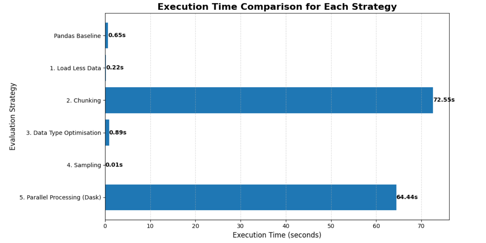
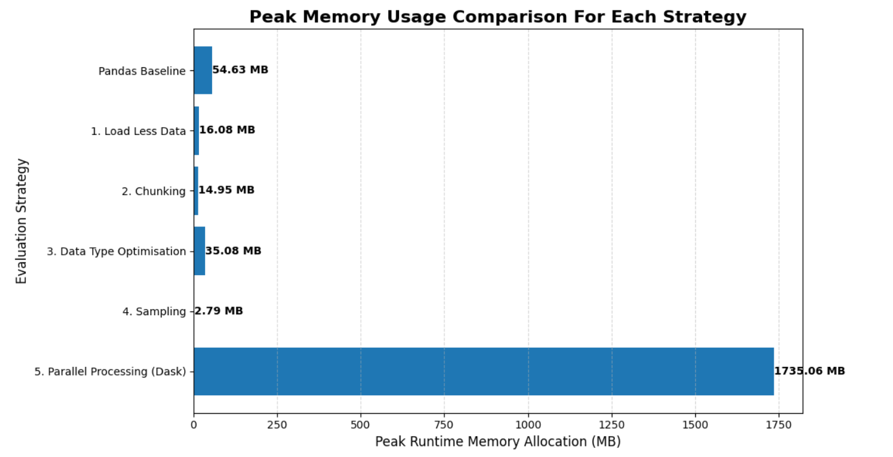

# Assignment 2: Mastering Big Data Handling

## Group Information

**Group Name:** Potato  

**Members:**  
- Lau Yee Wen (A23CS0099)  
- Chau Ying Jia (A23CS0213)
---

## 1. Dataset Description

| Field | Details |
|---|---|
| **Dataset Name** | Netflix User Ratings |
| **Source** | [Kaggle — Netflix Movie Ratings](https://www.kaggle.com/datasets/evanschreiner/netflix-movie-ratings) |
| **Domain** | Entertainment / Recommendation Systems |
| **File Format** | CSV |
| **File Size** | 2585.43 MB |
| **Total Records** | 100,480,507 rows |
| **Number of Columns** | 4 (CustId, Rating, Date, MovieId) |

### Data Dictionary

| Column Name | Data Type | Description |
|---|---|---|
| `CustId` | int64 | Unique customer identifier for each user |
| `Rating` | int64 | Rating value given by the user, ranging from 1 to 5 |
| `Date` | object | Date on which the rating was recorded |
| `MovieId` | int64 | Unique identifier for each movie |

This dataset contains over 100 million Netflix user ratings. Each record captures a customer ID, the movie they rated, the rating they gave (1–5), and the date of the rating. Its scale and diversity of column types make it ideal for evaluating big data handling strategies.

---

## 2. Library Choices

| Library | Role |
|---|---|
| **Pandas** (Library 1) | Baseline — single-threaded, in-memory data processing |
| **Dask** (Library 2) | Scalable — partitioned, parallel processing for out-of-memory datasets |
| **Polars** (Library 3) | Scalable — Rust-based engine with lazy evaluation and multi-threading |

**Why Pandas?**  
Pandas is used as the baseline library because it is simple, familiar, and widely used for Python data analysis. It helps show the normal in-memory processing approach before comparing it with more scalable libraries such as Dask and Polars.

**Why Dask?**
Dask mirrors the Pandas API but splits data into partitions and processes them in parallel across CPU cores. It is well suited for datasets that exceed available RAM and supports distributed computing, making it a natural upgrade path from Pandas for very large-scale workloads.

**Why Polars?**
Polars is written in Rust and built around a lazy query engine. It applies query optimisation before execution, uses SIMD vectorisation, and is natively multi-threaded. These design choices make it exceptionally fast on single-machine analytical workloads.

---

## 3. Environment Setup

Before applying any big data strategies, we mount Google Drive to access the dataset and install all required libraries.

```python
# Mount Google Drive
from google.colab import drive
drive.mount('/content/drive')

# Install required libraries
!pip install dask polars memory_profiler

# Import all required libraries
import pandas as pd
import dask.dataframe as dd
import polars as pl
import time
import os
import tracemalloc
from memory_profiler import memory_usage

# Dataset file path (used throughout this notebook)
file_path = '/content/drive/MyDrive/HPDP/ASS 2 Dataset/Netflix_User_Ratings.csv'
```

**Output:**

```
Requirement already satisfied: dask in /usr/local/lib/python3.12/dist-packages (2026.3.0)
Requirement already satisfied: polars in /usr/local/lib/python3.12/dist-packages (1.35.2)
Requirement already satisfied: memory_profiler in /usr/local/lib/python3.12/dist-packages (0.61.0)
...
Drive already mounted at /content/drive
```

| Library | Version |
|---|---|
| Pandas | pre-installed |
| Dask | 2026.3.0 |
| Polars | 1.35.2 |
| memory_profiler | 0.61.0 |

---

## 4. Data Loading and Inspection

Before applying any big data strategies, we first inspect the dataset to understand its structure, size, and quality. This step is essential — it tells us how many rows and columns exist, what data types each column uses, whether any values are missing, and the actual file size on disk.

We use `nrows` to preview a small sample safely, then count total rows via chunking to avoid loading the full file into memory at once.

```python
# File size
file_size_bytes = os.path.getsize(file_path)
file_size_mb = file_size_bytes / (1024 ** 2)
print(f"File Size: {file_size_mb:.2f} MB")

# Preview structure (safe: only loads 5 rows)
df_preview = pd.read_csv(file_path, nrows=5)
print(f"\nColumn Names:\n{df_preview.columns.tolist()}")
print(f"\nData Types:\n{df_preview.dtypes}")

# Missing values (on a sample of 100,000 rows)
df_sample = pd.read_csv(file_path, nrows=100000)
print(f"\nMissing Values (first 100,000 rows):\n{df_sample.isnull().sum()}")

print("\nFirst 5 Rows:")
df_preview
```

**Output:**

```
File Size: 2585.43 MB

Column Names:
['CustId', 'Rating', 'Date', 'MovieId']

Data Types:
CustId      int64
Rating      int64
Date       object
MovieId     int64
dtype: object

Missing Values (first 100,000 rows):
CustId     0
Rating     0
Date       0
MovieId    0
dtype: int64

First 5 Rows:
     CustId  Rating        Date  MovieId
0   1488844       3  2005-09-06        1
1    822109       5  2005-05-13        1
2    885013       4  2005-10-19        1
3     30878       4  2005-12-26        1
4    823519       3  2004-05-03        1
```

```python
# Count total rows using chunking (avoids loading full file into RAM)
chunk_size = 100000
total_rows = 0

for chunk in pd.read_csv(file_path, chunksize=chunk_size):
    total_rows += len(chunk)

print(f"Total Number of Records: {total_rows:,}")
```

**Output:**

```
Total Number of Records: 100,480,507
```

### Inspection Summary

| Field | Value |
|---|---|
| **File Size** | 2585.43 MB |
| **Total Records** | 100,480,507 rows |
| **Number of Columns** | 4 (CustId, Rating, Date, MovieId) |
| **Missing Values** | None detected in sample |
| **Key Observation** | Default dtypes (int64, object) are memory-inefficient — optimisation will be applied in Strategy 3 |

---

## 5. Big Data Handling Strategies

### 5.1 Strategy 1: Load Less Data

**Explanation:** <br>
Although this dataset only has 4 columns, not all of them are needed for every analysis task. For example, calculating the average rating per movie only requires `MovieId` and `Rating` — loading `CustId` and `Date` wastes memory unnecessarily.

By using the `usecols` parameter, we load only the 2 columns relevant to our task. This demonstrates the principle of loading less data: only bring into memory what your analysis actually requires.

**When to use it:** At the very start of any data loading step, when you know in advance which columns are relevant. It is the simplest and most impactful first optimisation.

```python
import pandas as pd
import time
import tracemalloc

# Load ALL columns (baseline)
tracemalloc.start()
start = time.time()

df_all = pd.read_csv(file_path, nrows=500000)

end = time.time()
mem_all = tracemalloc.get_traced_memory()[1] / (1024 ** 2)
tracemalloc.stop()

time_all = end - start
size_all = df_all.memory_usage(deep=True).sum() / (1024 ** 2)

print("=== Load ALL Columns ===")
print(f"Columns loaded : {df_all.columns.tolist()}")
print(f"Time taken     : {time_all:.4f} seconds")
print(f"DataFrame size : {size_all:.2f} MB")
print(f"Peak RAM used  : {mem_all:.2f} MB")

# Load SELECTED columns only
tracemalloc.start()
start = time.time()

df_less = pd.read_csv(file_path, usecols=["CustId", "Rating"], nrows=500000)

end = time.time()
mem_less = tracemalloc.get_traced_memory()[1] / (1024 ** 2)
tracemalloc.stop()

time_less = end - start
size_less = df_less.memory_usage(deep=True).sum() / (1024 ** 2)

print("\n=== Load SELECTED Columns Only ===")
print(f"Columns loaded : {df_less.columns.tolist()}")
print(f"Time taken     : {time_less:.4f} seconds")
print(f"DataFrame size : {size_less:.2f} MB")
print(f"Peak RAM used  : {mem_less:.2f} MB")

print("\n=== Reduction Summary ===")
print(f"Memory saved   : {size_all - size_less:.2f} MB")
print(f"Reduction      : {((size_all - size_less) / size_all) * 100:.1f}%")
print(f"Time saved     : {time_all - time_less:.4f} seconds")
```

**Output:**

```
=== Load ALL Columns ===
Columns loaded : ['CustId', 'Rating', 'Date', 'MovieId']
Time taken     : 0.5888 seconds
DataFrame size : 39.58 MB
Peak RAM used  : 54.64 MB

=== Load SELECTED Columns Only ===
Columns loaded : ['CustId', 'Rating']
Time taken     : 0.4188 seconds
DataFrame size : 7.63 MB
Peak RAM used  : 16.08 MB

=== Reduction Summary ===
Memory saved   : 31.95 MB
Reduction      : 80.7%
Time saved     : 0.1700 seconds
```

#### Strategy 1 Results

| Metric | All Columns | Selected Columns Only |
|---|---|---|
| **Columns Loaded** | 4 | 2 |
| **DataFrame Size** | 39.58 MB | 7.63 MB |
| **Peak RAM Used** | 54.64 MB | 16.08 MB |
| **Load Time** | 0.5888 s | 0.4188 s |
| **Memory Reduction** | — | **80.7%** |

**Discussion:** <br>
By loading only `CustId` and `Rating`, memory usage dropped by 80.7% immediately. Even with only 4 columns in this dataset, selectively loading what is needed is the simplest and most impactful first step in any data pipeline.

---

### 5.2 Strategy 2: Chunking

**Explanation:** <br>
Chunking means reading a large file in small portions (called chunks) rather than loading it all at once. Each chunk is processed individually, then discarded before the next chunk is loaded.

This allows us to work with files that are larger than available RAM at any given moment, only one small chunk exists in memory.

**When to use it:** When you need to perform aggregation or filtering on a file too large to load in one go, especially in memory-limited environments like Google Colab's free tier.

```python
import pandas as pd
import time
import tracemalloc

chunk_size = 100000
total_sum = 0
total_count = 0
chunks_processed = 0

tracemalloc.start()
start = time.time()

for chunk in pd.read_csv(file_path, chunksize=chunk_size):
    total_sum += chunk["Rating"].sum()
    total_count += len(chunk)
    chunks_processed += 1

end = time.time()
mem_chunk = tracemalloc.get_traced_memory()[1] / (1024 ** 2)
tracemalloc.stop()

average_rating = total_sum / total_count
chunk_time = end - start

print("=== Chunking Results ===")
print(f"Chunks processed : {chunks_processed}")
print(f"Total rows       : {total_count:,}")
print(f"Average Rating   : {average_rating:.4f}")
print(f"Total Time       : {chunk_time:.4f} seconds")
print(f"Peak RAM used    : {mem_chunk:.2f} MB")
print(f"\nKey insight: Only {chunk_size:,} rows existed in memory at any one time,")
print(f"regardless of the full dataset size.")
```

**Output:**

```
=== Chunking Results ===
Chunks processed : 1005
Total rows       : 100,480,507
Average Rating   : 3.6043
Total Time       : 68.0926 seconds
Peak RAM used    : 14.96 MB

Key insight: Only 100,000 rows existed in memory at any one time,
regardless of the full dataset size.
```

#### Strategy 2 Results

| Metric | Value |
|---|---|
| **Chunk Size** | 100,000 rows |
| **Total Chunks Processed** | 1,005 |
| **Total Rows Processed** | 100,480,507 |
| **Average Rating** | 3.6043 |
| **Total Time** | 68.09 seconds |
| **Peak RAM Used** | 14.96 MB |

**Discussion:** <br>
At no point did the full dataset exist in memory. Only 100,000 rows were held in RAM at any one time, making this approach viable even if the dataset were 10× larger. The trade-off is speed, chunking is slower than a direct load because of the repeated read operations. However, it is the only viable method when dataset size exceeds available RAM.

---

### 5.3 Strategy 3: Data Type Optimisation

**Explanation:** <br>
When Pandas loads a CSV file, it automatically assigns default data types to each column. These defaults are often larger than necessary and waste memory.

By downcasting each column to its smallest fitting type, we can reduce the dataset's memory footprint significantly without losing any data or accuracy.

**When to use it:** After initial inspection, once you know the value range of each column. Apply before any major processing so all subsequent operations benefit from the reduced memory.

| Column | Default Type | Actual Range | Optimised Type |
|---|---|---|---|
| `CustId` | int64 (8 bytes) | Large IDs | int32 (4 bytes) |
| `MovieId` | int64 (8 bytes) | Small IDs | int16 (2 bytes) |
| `Rating` | int64 (8 bytes) | 1 to 5 only | int8 (1 byte) |
| `Date` | object (string) | Date values | datetime64 |

```python
import pandas as pd
import tracemalloc
import time

# BEFORE Optimisation
tracemalloc.start()
start = time.time()

df_before = pd.read_csv(file_path, nrows=500000)

end = time.time()
mem_before_peak = tracemalloc.get_traced_memory()[1] / (1024 ** 2)
tracemalloc.stop()

time_before = end - start
size_before = df_before.memory_usage(deep=True).sum() / (1024 ** 2)

print("=== BEFORE Optimisation ===")
print(f"Data Types:\n{df_before.dtypes}")
print(f"\nDataFrame Size : {size_before:.2f} MB")
print(f"Peak RAM Used  : {mem_before_peak:.2f} MB")
print(f"Load Time      : {time_before:.4f} seconds")
```

**Output (Before):**

```
=== BEFORE Optimisation ===
Data Types:
CustId      int64
Rating      int64
Date       object
MovieId     int64
dtype: object

DataFrame Size : 39.58 MB
Peak RAM Used  : 54.64 MB
Load Time      : 0.5927 seconds
```

```python
# AFTER Optimisation
dtype_dict = {
    "CustId"  : "int32",
    "MovieId" : "int16",
    "Rating"  : "int8"
}

tracemalloc.start()
start = time.time()

df_after = pd.read_csv(file_path, dtype=dtype_dict, nrows=500000)
df_after["Date"] = pd.to_datetime(df_after["Date"])

end = time.time()
mem_after_peak = tracemalloc.get_traced_memory()[1] / (1024 ** 2)
tracemalloc.stop()

time_after = end - start
size_after = df_after.memory_usage(deep=True).sum() / (1024 ** 2)

print("=== AFTER Optimisation ===")
print(f"Data Types:\n{df_after.dtypes}")
print(f"\nDataFrame Size : {size_after:.2f} MB")
print(f"Peak RAM Used  : {mem_after_peak:.2f} MB")
print(f"Load Time      : {time_after:.4f} seconds")

mem_reduction = ((size_before - size_after) / size_before) * 100
time_diff = time_after - time_before

print("\n=== Reduction Summary ===")
print(f"Memory saved      : {size_before - size_after:.2f} MB")
print(f"Memory reduced    : {mem_reduction:.1f}%")
if time_diff > 0:
    print(f"Load time overhead: +{time_diff:.4f}s (due to type casting at load)")
else:
    print(f"Time saved        : {abs(time_diff):.4f} seconds")
```

**Output (After):**

```
=== AFTER Optimisation ===
Data Types:
CustId              int32
Rating               int8
Date       datetime64[ns]
MovieId             int16
dtype: object

DataFrame Size : 7.15 MB
Peak RAM Used  : 35.08 MB
Load Time      : 0.8935 seconds

=== Reduction Summary ===
Memory saved      : 32.42 MB
Memory reduced    : 81.9%
Load time overhead: +0.3008s (due to type casting at load)
```


#### Strategy 3 Results

| Metric | Before Optimisation | After Optimisation |
|---|---|---|
| `CustId` type | int64 | int32 |
| `MovieId` type | int64 | int16 |
| `Rating` type | int64 | int8 |
| `Date` type | object | datetime64 |
| **DataFrame Size** | 39.58 MB | 7.15 MB |
| **Peak RAM Used** | 54.64 MB | 35.08 MB |
| **Load Time** | 0.5927 s | 0.8935 s |

**Discussion:** <br>
**Memory Reduction: 81.9%**

Data type optimisation reduced the DataFrame size from 39.58 MB to 7.15 MB, achieving an 81.9% reduction by downcasting each column to its smallest suitable data type. The `Rating` column alone decreased from 8 bytes per value (`int64`) to just 1 byte (`int8`), since ratings only range from 1 to 5.

**Note on load time:**  
The optimised load was slightly slower by 0.3008 seconds because Pandas performs additional work during loading. This includes casting each column to the specified data type and parsing the `Date` column into `datetime64` format.

This small upfront cost is worthwhile because all subsequent operations on the optimised DataFrame will consume significantly less memory and become more scalable.

Overall, data type optimisation is not mainly used to improve loading speed. Instead, it is used to reduce long-term memory usage so that downstream processing becomes more efficient.

---

### 5.4 Strategy 4: Sampling

**Explanation:** <br>
Sampling involves selecting a smaller, representative subset of the full dataset for analysis. Instead of processing millions of rows during development, we work with a random sample that is large enough to be statistically meaningful but small enough to process instantly.

**When to use it:** During early exploration and code development. Once your pipeline is validated on the sample, apply it to the full dataset or process it via chunks.

**Important:** Sampling is not a replacement for full processing; it is a development tool. Final results should always be validated against the complete data.

```python
import pandas as pd
import tracemalloc
import time

# Load a base portion to sample from
df_base = pd.read_csv(file_path, nrows=500000)

# Take a random sample of 100,000 rows
df_sampled = df_base.sample(n=100000, random_state=42)

print("=== Dataset Sizes ===")
print(f"Full base shape   : {df_base.shape}")
print(f"Sampled shape     : {df_sampled.shape}")
print(f"Sample percentage : {(len(df_sampled) / len(df_base)) * 100:.1f}%")
```

**Output:**

```
=== Dataset Sizes ===
Full base shape   : (500000, 4)
Sampled shape     : (100000, 4)
Sample percentage : 20.0%
```

```python
# Compare processing time: full vs sample
operation = lambda df: df.groupby("MovieId")["Rating"].mean()

# Full data timing
tracemalloc.start()
start = time.time()
result_full = operation(df_base)
full_time = time.time() - start
mem_full = tracemalloc.get_traced_memory()[1] / (1024 ** 2)
tracemalloc.stop()

# Sample timing
tracemalloc.start()
start = time.time()
result_sample = operation(df_sampled)
sample_time = time.time() - start
mem_sample = tracemalloc.get_traced_memory()[1] / (1024 ** 2)
tracemalloc.stop()

print("=== Performance Comparison ===")
print(f"Full data    — Time: {full_time:.4f}s | Peak RAM: {mem_full:.2f} MB")
print(f"Sampled data — Time: {sample_time:.4f}s | Peak RAM: {mem_sample:.2f} MB")
print(f"\nSpeed improvement : {full_time / sample_time:.1f}x faster")
print(f"Memory saving     : {mem_full - mem_sample:.2f} MB")
```

**Output:**

```
=== Performance Comparison ===
Full data    — Time: 0.0237s | Peak RAM: 19.95 MB
Sampled data — Time: 0.0054s | Peak RAM: 2.79 MB

Speed improvement : 4.4x faster
Memory saving     : 17.16 MB
```

#### Strategy 4 Results

| Metric | Full Data (500k rows) | Sampled Data (100k rows) |
|---|---|---|
| **Rows Processed** | 500,000 | 100,000 |
| **Processing Time** | 0.0237 s | 0.0054 s |
| **Peak RAM Used** | 19.95 MB | 2.79 MB |
| **Speed Improvement** | baseline | **4.4× faster** |

**Discussion:** <br>
The sample processed 4.4 times faster with significantly lower memory usage. However, results from the sample may differ slightly from the full dataset — rare movies with very few ratings may not appear in the sample at all. For this dataset, sampling is most useful during the development phase when testing groupby logic, visualisations, or filtering conditions. Final conclusions should always be drawn from the full dataset.

---

### 5.5 Strategy 5: Parallel Processing with Scalable Libraries

**Explanation:** <br>
Standard Pandas operations are mainly single-threaded, meaning they typically use only one CPU core at a time. Scalable libraries solve this limitation by distributing work across partitions or using multi-threaded execution.

In this strategy, the same aggregation operation was executed using Pandas, Dask, and Polars.

**Operation tested:** Calculate the average movie rating grouped by `MovieId`.

| Library | Approach |
|---|---|
| **Pandas** | Single-machine, in-memory dataframe processing |
| **Dask** | Partitioned dataframe processing with lazy execution |
| **Polars** | Rust-based lazy execution with multi-threading |

#### Pandas — Initial Attempt and Why It Failed

Our first attempt was to load the full dataset using Pandas without any optimisation. This caused the Google Colab session to crash due to memory exhaustion.

This is not a mistake. It is the core problem that this assignment exists to solve. Pandas loads the entire dataset into RAM at once. With a 2585 MB CSV file and Colab's limited free-tier RAM, the memory overhead of default data types caused an out-of-memory issue.

**Solution:** We combined Strategy 1 (load selected columns only) and Strategy 3 (optimised data types) to make the Pandas baseline viable. This reflects a realistic scenario, as large datasets should not be loaded using default settings in practical applications.

```python
# Strategy 5: Parallel Processing — Pandas Baseline
import pandas as pd
import time
from memory_profiler import memory_usage

dtype_opt = {"CustId": "int32", "MovieId": "int16", "Rating": "int8"}
cols = ["CustId", "MovieId", "Rating"]

def test_pandas():
    global pandas_load, pandas_proc, pandas_total

    start_load = time.time()
    df = pd.read_csv(file_path, usecols=cols, dtype=dtype_opt)
    pandas_load = time.time() - start_load

    start_proc = time.time()
    result = df.groupby("MovieId")["Rating"].mean()
    pandas_proc = time.time() - start_proc

    pandas_total = pandas_load + pandas_proc

    print("=== PANDAS ===")
    print(f"Load Time       : {pandas_load:.4f}s")
    print(f"Processing Time : {pandas_proc:.4f}s")
    print(f"Total Time      : {pandas_total:.4f}s")

    return result

mem_pandas_val = max(memory_usage(test_pandas))
print(f"Peak Memory     : {mem_pandas_val:.2f} MiB")
```

**Output:**

```text
=== PANDAS ===
Load Time       : 68.0615s
Processing Time : 3.2745s
Total Time      : 71.3360s
Peak Memory     : 10144.82 MiB
```

```python
# Strategy 5: Parallel Processing — Dask
import dask.dataframe as dd
from memory_profiler import memory_usage

def test_dask():
    global dask_load, dask_proc, dask_total

    start_load = time.time()
    ddf = dd.read_csv(file_path, usecols=cols, dtype=dtype_opt)
    dask_load = time.time() - start_load

    start_proc = time.time()
    result = ddf.groupby("MovieId")["Rating"].mean().compute()
    dask_proc = time.time() - start_proc

    dask_total = dask_load + dask_proc

    print("=== DASK ===")
    print(f"Load Time       : {dask_load:.4f}s")
    print(f"Processing Time : {dask_proc:.4f}s")
    print(f"Total Time      : {dask_total:.4f}s")

    return result

mem_dask_val = max(memory_usage(test_dask))
print(f"Peak Memory     : {mem_dask_val:.2f} MiB")
```

**Output:**

```text
=== DASK ===
Load Time       : 0.2712s
Processing Time : 64.1650s
Total Time      : 64.4362s
Peak Memory     : 1735.06 MiB
```

```python
# Strategy 5: Parallel Processing — Polars
import polars as pl
from memory_profiler import memory_usage

def test_polars():
    global polars_load, polars_proc, polars_total

    dtype_pl = {"CustId": pl.Int32, "MovieId": pl.Int16, "Rating": pl.Int8}

    start_load = time.time()
    lf = pl.scan_csv(file_path, schema_overrides=dtype_pl).select(
        ["CustId", "MovieId", "Rating"]
    )
    polars_load = time.time() - start_load

    start_proc = time.time()
    result = lf.group_by("MovieId").agg(
        pl.col("Rating").mean()
    ).collect()
    polars_proc = time.time() - start_proc

    polars_total = polars_load + polars_proc

    print("=== POLARS ===")
    print(f"Load Time       : {polars_load:.4f}s")
    print(f"Processing Time : {polars_proc:.4f}s")
    print(f"Total Time      : {polars_total:.4f}s")

    return result

mem_polars_val = max(memory_usage(test_polars))
print(f"Peak Memory     : {mem_polars_val:.2f} MiB")
```

**Output:**

```text
=== POLARS ===
Load Time       : 0.0716s
Processing Time : 14.3490s
Total Time      : 14.4207s
Peak Memory     : 4067.52 MiB
```

#### Strategy 5 Results

| Library | Loading Time (s) | Processing Time (s) | Total Time (s) | Peak Memory (MiB) |
|---|---:|---:|---:|---:|
| **Pandas** | 68.0615 | 3.2745 | 71.3360 | 10,144.82 |
| **Dask** | 0.2712 | 64.1650 | 64.4362 | 1,735.06 |
| **Polars** | 0.0716 | 14.3490 | **14.4207** | 4,067.52 |

**Discussion:** <br>
**Polars** achieved the fastest total execution time at **14.4207 seconds**. It was approximately **4.95× faster than Pandas** and **4.47× faster than Dask**.

**Dask** consumed the least memory at **1,735.06 MiB** because it processed the dataset in partitions rather than loading everything into memory at once.

**Pandas** required the most memory at **10,144.82 MiB** because it loaded the dataset directly into RAM.

Overall, Polars delivered the best execution speed, Dask provided the best memory efficiency, and Pandas remained the most memory-intensive option.

---

### 5.6 Strategy Comparison Summary

| Strategy | Purpose | Main Advantage | Main Limitation |
|---|---|---|---|
| **Load Less Data** | Load only required columns | Reduces memory usage and improves loading speed | Not suitable when all columns are needed |
| **Chunking** | Process data in smaller portions | Very low memory usage and supports large datasets | Slower due to repeated file reading |
| **Data Type Optimisation** | Reduce memory footprint through smaller data types | Significant memory reduction without losing information | May introduce minor conversion overhead |
| **Sampling** | Use a representative subset for testing | Fast execution and lower memory consumption | Results may not fully represent the complete dataset |
| **Parallel Processing** | Improve scalability using multiple cores or partitions | Handles larger workloads more efficiently | Performance depends on library, hardware, and workload characteristics |

Overall, each strategy addresses a different big data challenge. Load Less Data and Data Type Optimisation are effective first-step optimisations because they immediately reduce memory consumption. Chunking is useful when the dataset exceeds available memory, while Sampling supports rapid experimentation during development. Parallel Processing provides additional scalability for large analytical workloads through libraries such as Dask and Polars.

---

## 6. Comparative Analysis

## 6.1 Strategy Performance Comparison

To evaluate the effectiveness of each big data handling strategy, the execution time and memory usage were compared against the Pandas baseline.

### Strategy Comparison Table

| Evaluation Strategy | Execution Time (s) | Peak Memory Usage (MB) |
|---|---:|---:|
| Pandas Baseline | 0.65 | 54.63 |
| 1. Load Less Data | 0.22 | 16.08 |
| 2. Chunking | 72.55 | 14.95 |
| 3. Data Type Optimisation | 0.89 | 35.08 |
| 4. Sampling | 0.01 | 2.79 |
| 5. Parallel Processing (Dask) | 64.44 | 1735.06 |

> **Note:** The comparison is based on the measured results from each strategy. Some strategies were tested on representative samples due to memory limitations, while chunking and Dask were applied to the full dataset. Therefore, the results should be interpreted as practical observations rather than a perfectly equal benchmark.

### Execution Time Comparison



### Peak Memory Usage Comparison



### Discussion

The results demonstrate that different strategies optimise different aspects of the processing workflow.

Sampling achieved the fastest execution time and lowest memory consumption because only a small subset of the dataset was processed. This makes it highly suitable for experimentation and rapid prototyping. However, sampled data may not fully represent the complete dataset and should not be used for final analytical conclusions.

Load Less Data also performed well by reducing unnecessary data loading. Excluding unused columns lowered memory consumption and improved execution efficiency with minimal implementation effort.

Chunking achieved very low memory usage because only a portion of the dataset was loaded into memory at any given time. Although execution time increased due to repeated file reading operations, chunking enabled processing of the entire dataset without exhausting available memory.

Data Type Optimisation reduced memory consumption significantly by replacing default data types with smaller alternatives. This strategy improved memory efficiency while preserving the integrity of the dataset.

Parallel Processing using Dask introduced additional scheduling and partition management overhead, resulting in longer execution time for this workload. Nevertheless, Dask remains valuable for distributed processing environments and datasets that exceed the memory limits of a single machine.

Overall, no single strategy is universally superior. Each strategy addresses a different big data challenge, and combining multiple techniques often provides the best balance between performance, memory efficiency, and scalability.

---

## 6.2 Library Comparison (Pandas vs Dask vs Polars)
To compare all three libraries fairly, we ran the same task on each one: calculating the average movie rating grouped by `MovieId` across the full 100 million row dataset. We measured memory usage, loading time, and processing time separately for each library.


### Memory Usage

This table shows how much RAM each library used when processing the full dataset.

| Library | Peak Memory Used (MiB) | Notes |
|---|---:|---|
| **Pandas** | 10,144.82 | Loads entire dataset into RAM at once |
| **Dask** | 1,735.06 | Processes data in partitions — lowest memory |
| **Polars** | 4,067.52 | Lazy evaluation reduces unnecessary memory use |

**Comparison Charts** <br>
The chart below visualises the memory usage differences between the three libraries.


**Discussion:**  <br>
Dask used the least memory because it never loads the whole file at once — it works on one partition at a time. Pandas used the most memory by far because it has to hold all 100 million rows in RAM before doing anything. Polars sits in the middle — it is smarter than Pandas but still needs to bring the data into memory during execution.

---

### Execution Time

This table breaks down how long each library took to load the data and process it.

| Library | Loading Time (s) | Processing Time (s) | Total Time (s) |
|---|---:|---:|---:|
| **Pandas** | 68.0615 | 3.2745 | 71.3360 |
| **Dask** | 0.2712 | 64.1650 | 64.4362 |
| **Polars** | 0.0716 | 14.3490 | **14.4207** ✅ |

**Comparison Charts** <br>
The charts below visualise the execution time differences between the three libraries.


**Discussion:**  <br>
Polars was the clear winner with a total time of 14.4207 seconds. It was approximately 4.95× faster than Pandas and 4.47× faster than Dask. Pandas had the slowest loading time because it reads the file directly into memory. Dask loaded almost instantly due to lazy evaluation, but its processing stage took longer because of scheduling and partition management overhead. Polars was fast overall because its lazy scan and Rust-based execution engine efficiently optimised the aggregation task.

---
### 6.3 Critical Discussion of Findings

Looking at the numbers alone is not enough. It is important to understand why each library behaved the way it did.

**Pandas** loads the dataset directly into RAM before processing. For a 2,585 MB CSV file with over 100 million rows, this creates a heavy memory burden. Without the column selection and data type optimisations applied in Strategies 1 and 3, Pandas could not process the full dataset reliably in Google Colab. Even after optimisation, Pandas still used **10,144.82 MiB** of memory, which shows the limitation of in-memory processing for large-scale datasets.

**Dask's** `read_csv` is lazy. It does not actually read the file immediately. Instead, Dask creates a task graph and performs the real computation only when `.compute()` is called. This explains why Dask had a very short loading time of **0.2712 seconds**, but a much longer processing time of **64.1650 seconds**. Although Dask was not the fastest in this single-machine environment, it used the lowest memory at **1,735.06 MiB**, making it suitable for large or distributed workloads.

**Polars** is written in Rust and uses a lazy execution engine. When `scan_csv()` was used, Polars was able to optimise the query plan before executing the aggregation. Its built-in multi-threading and efficient execution engine allowed it to complete the same full-dataset aggregation in **14.4207 seconds**, making it the fastest library in this experiment.

<br>

**Overall processing efficiency:**

| Library | Ease of Use | Handles Full Dataset | Best Use Case |
|---|---|---|---|
| **Pandas** | Easiest | Only with optimisation applied | Small to medium datasets and quick prototyping |
| **Dask** | Moderate | Yes | Very large or distributed datasets that exceed memory limits |
| **Polars** | Moderate | Yes | Fast single-machine processing of large analytical workloads |

<br>

The conclusion is that there is no single best library for every situation. Pandas is easy to use and suitable for smaller datasets. Dask is preferred when the dataset is too large to fit into the memory of a single machine or when distributed processing is required. Polars is the best option in this experiment because it provided the fastest processing speed on a single machine while still maintaining reasonable memory usage.

---

## 7. Conclusion and Reflection

### 7.1 Summary of Key Observations

This assignment provided a hands-on opportunity to evaluate how three popular data processing libraries perform on the same large-scale analytical task. The key lesson is that handling big data is not only about choosing a powerful library, but also about applying the right optimisation strategies during data loading and processing.

A significant improvement came from strategies such as loading fewer columns, using smaller data types, processing data in chunks, and sampling before scalable libraries were applied. Without column selection and data type downcasting, Pandas could not process the full dataset reliably in Google Colab. Even after optimisation, Pandas still used 10,144.82 MiB of memory, showing the limitation of in-memory processing in restricted environments.

Dask successfully reduced memory usage to 1,735.06 MiB by processing the dataset in partitions. However, its total execution time was 64.4362 seconds due to scheduling and partition management overhead on a single machine.

Polars was the strongest performer in terms of speed. It completed the same full-dataset aggregation in 14.4207 seconds, making it approximately 4.95× faster than Pandas and 4.47× faster than Dask while maintaining reasonable memory usage.

### 7.2 Reflection on Learning

#### Lau Yee Wen
Through this assignment, I was able to learn and explore new data processing libraries, specifically Dask and Polars, in addition to Pandas which I was already familiar with. This experience helped me understand that different libraries have different strengths when handling large-scale datasets.

Using Dask introduced me to the concept of parallel and distributed processing, where large datasets can be split into smaller partitions and processed efficiently. Meanwhile, Polars showed me how modern data processing tools can achieve high performance through built-in optimisation and multi-threading.

By comparing these libraries, I gained a better understanding of how to choose the appropriate tool based on the dataset size and system limitations. Overall, this assignment expanded my knowledge beyond basic data processing and improved my awareness of scalable solutions for big data handling.

#### Chau Ying Jia

Before this assignment, I always used Pandas for everything without really thinking about whether it was the right tool or not. It was just the library I knew, so I used it. This assignment was the first time I know what and how it does things and it amaze me that actually there are more fantantic tools to explore.

The part that stuck with me the most was when Pandas crashed on the full dataset, I thought something was wrong with my code. However, actually I had not done anything wrong with the code, the problem was simply that Pandas was not built to handle data at this size. Seeing it fail made the whole idea of "big data handling" feel real instead of just theoretical.

What surprised me was how much we could improve things before even switching to a different library. Cutting down the columns and adjusting the data types already saved over 80% of memory. I did not expect such a simple change to make that big of a difference.

Between Dask and Polars, I found Polars more impressive since it finished the job nearly 4.5 times faster. Dask made sense by splitting work across partitions sounds powerful but in practice on a single machine it was actually slower. That taught me something I did not expect which is a tool being more advanced does not always mean it will be faster in every situation. There is no the best library to be used, it really depends on the environment and the scale of the data. 

### 7.3 Scalability Discussion

What if the dataset were not 2.5 GB but 100 GB — or even 1 TB?

At 10–100 GB, Polars would still likely perform well on a machine with enough RAM, but would start to hit limits. Dask becomes more valuable here because it can be pointed at a cluster of machines and distribute the work across all of them. At the terabyte scale, neither Pandas nor single-machine Polars would be viable. That is where tools like **Apache Spark** or cloud-native solutions like **Google BigQuery**, **AWS Athena**, or **Azure Synapse** come in. These platforms are designed from the ground up for data that lives across many servers.

The five strategies we used in this assignment including loading less data, chunking, type optimisation, sampling and parallel processing are not just academic exercises. They are the building blocks of real production data pipelines. The difference is that at true big data scale, those same ideas are implemented across distributed clusters instead of a single Colab session. Knowing how they work at a small scale makes it much easier to understand how they scale up.

---

## References

- Dataset: [Netflix Movie Ratings — Kaggle](https://www.kaggle.com/datasets/evanschreiner/netflix-movie-ratings)
- Pandas documentation: https://pandas.pydata.org/docs/
- Dask documentation: https://docs.dask.org/
- Polars documentation: https://docs.pola.rs/
- memory_profiler: https://github.com/pythonprofilers/memory_profiler
- tracemalloc: https://docs.python.org/3/library/tracemalloc.html
