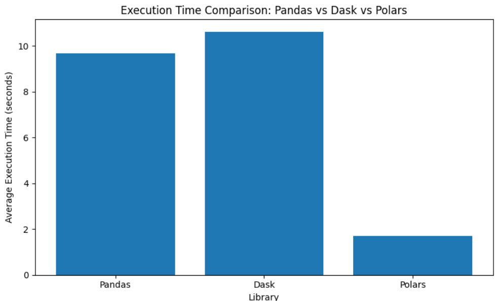
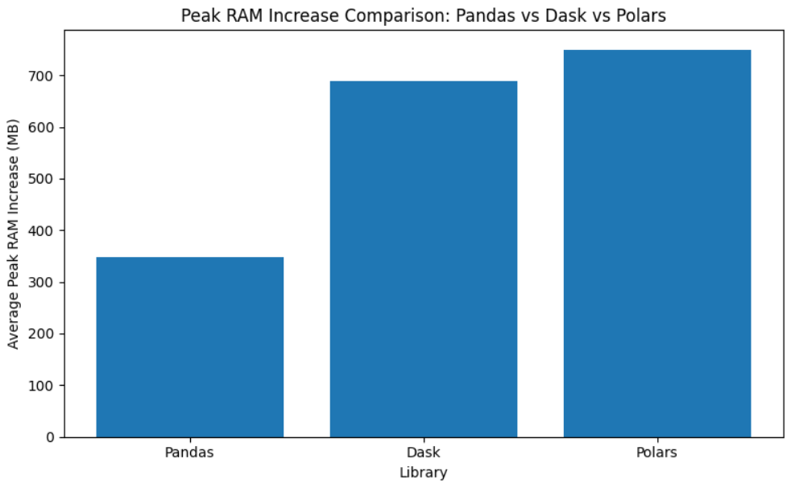

# Assignment 2: Mastering Big Data Handling

## Group Information

| Name | Matric No. | Role |
|---|---|---|
| NEO LI XIN | A23CS0253 | Student A: Baseline & Setup Lead |
| ELIJAH SHE YU SHENG | A23CS0073 | Student B: Scalability & Performance Lead |

---

## 1. Dataset Description

The dataset used for this assignment is the **Shopee Logistics Performance March** dataset from the **Kaggle Open Shopee Code League Logistics** competition. This dataset was selected because the extracted CSV file is larger than 700 MB, which satisfies the minimum dataset size requirement for this assignment. It is also suitable for big data handling because it contains millions of delivery records and text-heavy address columns that can increase memory usage during processing.

| Item | Description |
|---|---|
| Dataset Name | Shopee Logistics Performance March |
| Source | Kaggle - Open Shopee Code League Logistics |
| File Name | `delivery_orders_march.csv` |
| Compressed File | `delivery_orders_march.csv.zip` |
| Compressed Size | Approximately 381 MB |
| Extracted CSV Size | Approximately 721 MB |
| Number of Records | 3,176,313 rows |
| Number of Columns | 6 columns |
| Domain | E-commerce Logistics |

The dataset contains delivery order records for Shopee logistics operations in March. Each record represents one delivery order and includes the order ID, pickup timestamp, first delivery attempt timestamp, second delivery attempt timestamp, buyer address, and seller address. The dataset is meaningful for performance testing because the timestamp columns support delivery-time analysis, while the address columns create additional memory pressure due to long text values.

| Column | Description |
|---|---|
| `orderid` | Unique order identifier for each delivery order. |
| `pick` | Timestamp showing when the order was picked up. |
| `1st_deliver_attempt` | Timestamp of the first delivery attempt. |
| `2nd_deliver_attempt` | Timestamp of the second delivery attempt, if available. |
| `buyeraddress` | Buyer delivery address. |
| `selleraddress` | Seller address. |

---

## 2. Library Choices

This assignment uses exactly three Python libraries. **Pandas** is used as the compulsory baseline library, while **Dask** and **Polars** are selected as scalable libraries for performance comparison.

| Library | Role | Reason for Selection |
|---|---|---|
| Pandas | Baseline library | Pandas is the compulsory baseline and is widely used for data loading, inspection, and data analysis. |
| Dask | Scalable library | Dask can read large CSV files in partitions and execute dataframe operations using parallel processing. |
| Polars | Scalable library | Polars is designed for high-performance dataframe processing using a Rust-based execution engine and lazy query optimisation. |

Pandas is simple and suitable for baseline analysis, but it normally loads data directly into memory. This becomes a limitation when the dataset grows larger. Dask improves scalability by splitting the dataset into partitions and delaying execution until `.compute()` is called. Polars improves performance through columnar processing, lazy execution, and query optimisation.

---

## 3. Data Loading and Initial Inspection

Before applying optimisation strategies, the dataset was inspected using Pandas. A small sample was loaded first to understand the structure of the dataset without consuming too much memory.

The initial inspection focused on:

- dataset shape;
- column names;
- data types;
- missing values;
- first few records.

```python
import pandas as pd

sample_df = pd.read_csv(csv_path, nrows=10000)
print(sample_df.shape)
print(sample_df.dtypes)
print(sample_df.isnull().sum())
sample_df.head()
```

The full dataset contains **3,176,313 rows** and **6 columns**. The address columns are object/string columns and consume more memory compared with numeric timestamp columns. The `2nd_deliver_attempt` column contains many missing values because not all orders required a second delivery attempt.

This inspection step is important because data type optimisation and column selection should only be applied after understanding the structure and purpose of each column.

---

## 4. Big Data Handling Strategies

Five big data handling strategies were implemented. The first four strategies were implemented using Pandas, while the fifth strategy used the scalable libraries Dask and Polars.

---

### 4.1 Strategy 1: Load Less Data

#### Explanation

The first strategy is to load only the columns needed for the analysis instead of reading the full dataset into memory. The delivery-time analysis only requires the order ID and timestamp columns. Therefore, the text-heavy address columns can be excluded during processing.

This strategy reduces memory usage because long address columns are not loaded into RAM. It can also reduce execution time because fewer columns are read from the CSV file.

#### Code

```python
use_cols = ["orderid", "pick", "1st_deliver_attempt", "2nd_deliver_attempt"]

df_less = pd.read_csv(csv_path, usecols=use_cols)
print(df_less.shape)
print(df_less.memory_usage(deep=True).sum() / (1024 * 1024))
```

#### Output and Discussion

The selected-column dataframe still contains all **3,176,313 rows**, but only **4 required columns** are loaded. This is more efficient than loading all 6 columns because `buyeraddress` and `selleraddress` are not needed for delivery-time analysis. Since address columns are long text fields, excluding them provides a clear memory-saving benefit.

---

### 4.2 Strategy 2: Chunking

#### Explanation

Chunking means reading the dataset in smaller portions instead of loading the whole CSV file at once. This is useful when the dataset is too large to fit comfortably in memory. Each chunk is processed separately, and only the aggregated result is kept.

In this assignment, chunking was used to count the total number of rows, count missing second delivery attempts, and calculate the average delivery time between pickup and first delivery attempt.

#### Code

```python
chunk_size = 100000
total_rows = 0
missing_second_attempt = 0
delivery_hours_sum = 0
valid_delivery_count = 0

for chunk in pd.read_csv(csv_path, usecols=use_cols, chunksize=chunk_size):
    total_rows += len(chunk)
    missing_second_attempt += chunk["2nd_deliver_attempt"].isnull().sum()

    delivery_hours = (chunk["1st_deliver_attempt"] - chunk["pick"]) / 3600
    delivery_hours_sum += delivery_hours.sum()
    valid_delivery_count += delivery_hours.notnull().sum()

average_delivery_hours = delivery_hours_sum / valid_delivery_count

print(total_rows)
print(missing_second_attempt)
print(average_delivery_hours)
```

#### Output and Discussion

| Metric | Result |
|---|---:|
| Total rows processed | 3,176,313 |
| Missing `2nd_deliver_attempt` values | 1,819,311 |
| Average delivery time from pickup to first attempt | 104.449 hours |

Chunking proves that the dataset can be processed without keeping the entire file in memory at the same time. This strategy is especially useful in Google Colab because Colab has limited RAM.

---

### 4.3 Strategy 3: Data Type Optimisation

#### Explanation

Pandas may automatically assign larger data types than necessary, such as `float64` for timestamp columns. Data type optimisation reduces memory usage by assigning smaller but still suitable data types.

In this dataset, timestamp columns can be stored using smaller numeric types. The `orderid` column is kept as `int64` because it represents unique identifiers and should not lose precision.

#### Code

```python
dtype_map = {
    "orderid": "int64",
    "pick": "int32",
    "1st_deliver_attempt": "float32",
    "2nd_deliver_attempt": "float32"
}

df_optimised = pd.read_csv(csv_path, usecols=use_cols, dtype=dtype_map)
print(df_optimised.dtypes)
print(df_optimised.memory_usage(deep=True).sum() / (1024 * 1024))
```

#### Output and Discussion

Data type optimisation reduces the memory footprint of the selected columns by avoiding unnecessary 64-bit numeric types. This allows the same dataset to use less RAM and makes later processing more efficient. This strategy is important because memory optimisation should be applied before large-scale processing begins.

---

### 4.4 Strategy 4: Sampling

#### Explanation

Sampling selects a smaller subset of the dataset for quick testing and exploratory analysis. It is useful during early development because code can be tested faster before being applied to the full dataset.

A chunk-based sampling method was used instead of loading the full dataset first. This is more appropriate for big data because it avoids reading the entire CSV into memory just to create a sample.

#### Code

```python
sample_chunks = []
sample_fraction = 0.05

for chunk in pd.read_csv(csv_path, usecols=use_cols, chunksize=100000):
    sample_chunks.append(chunk.sample(frac=sample_fraction, random_state=42))

df_sample = pd.concat(sample_chunks, ignore_index=True)
print(df_sample.shape)
```

#### Output and Discussion

A 5% sample gives approximately **158,816 rows** from the original 3,176,313 rows. This is large enough for rapid testing but much faster to process than the full dataset. Sampling does not replace full-data processing in the final analysis, but it helps speed up debugging, prototyping, and exploratory analysis.

---

### 4.5 Strategy 5: Parallel Processing with Scalable Libraries

#### Explanation

The fifth strategy uses scalable libraries to process the same analysis task more efficiently. Dask and Polars were compared with the Pandas baseline.

The same operation was performed using all three libraries:

1. load selected columns;
2. count total rows;
3. count missing values in `2nd_deliver_attempt`;
4. calculate average delivery time between pickup and first delivery attempt;
5. measure execution time and RAM usage.

#### Pandas Code

```python
def pandas_analysis():
    df = pd.read_csv(csv_path, usecols=use_cols)
    total_rows = len(df)
    missing_second = df["2nd_deliver_attempt"].isnull().sum()
    avg_delivery_hours = ((df["1st_deliver_attempt"] - df["pick"]) / 3600).mean()
    return total_rows, missing_second, avg_delivery_hours
```

#### Dask Code

```python
import dask.dataframe as dd

def dask_analysis():
    ddf = dd.read_csv(csv_path, usecols=use_cols)
    total_rows = len(ddf)
    missing_second = ddf["2nd_deliver_attempt"].isnull().sum().compute()
    avg_delivery_hours = ((ddf["1st_deliver_attempt"] - ddf["pick"]) / 3600).mean().compute()
    return total_rows, missing_second, avg_delivery_hours
```

#### Polars Code

```python
import polars as pl

def polars_analysis():
    result = (
        pl.scan_csv(csv_path)
        .select(use_cols)
        .select([
            pl.len().alias("total_rows"),
            pl.col("2nd_deliver_attempt").is_null().sum().alias("missing_second_attempt"),
            ((pl.col("1st_deliver_attempt") - pl.col("pick")) / 3600).mean().alias("avg_delivery_hours")
        ])
        .collect()
    )
    return result
```

#### Output and Discussion

Dask processes the file in partitions and can use parallel execution, making it more scalable than Pandas for larger datasets. Polars uses lazy execution and query optimisation, allowing it to avoid unnecessary work and read only the required columns. Both scalable libraries are more suitable than Pandas when the dataset size increases significantly.

---

## 5. Comparative Analysis

The comparative analysis measured execution time and memory usage for Pandas, Dask, and Polars using the same analytical workload. Each benchmark was executed three times, and the reported values represent the average results to improve reliability and reduce the effect of runtime fluctuations.

### 5.1 Benchmark Results

The following results were collected from three benchmark runs. Actual values may vary slightly depending on hardware specifications, runtime allocation, and background processes.

| Library | Avg Execution Time (s) | Avg RAM Change (MB) | Avg Peak RAM Increase (MB) |
| ------- | ---------------------: | ------------------: | -------------------------: |
| Pandas  |                  9.671 |             340.352 |                    347.371 |
| Dask    |                 10.618 |             672.445 |                    687.837 |
| Polars  |                  1.695 |             734.286 |                    749.777 |

### 5.2 Execution Time Comparison

Figure 5.1 illustrates the average execution time recorded for each library across three benchmark runs.



**Figure 5.1:** Average execution time comparison between Pandas, Dask, and Polars.

The results show that Polars achieved the fastest execution time at 1.695 seconds, significantly outperforming both Pandas and Dask. Pandas completed the workload in 9.671 seconds, while Dask required 10.618 seconds. Although Dask supports partition-based processing and scalability, the overhead associated with task scheduling and lazy computation may reduce performance benefits for workloads that can still be processed on a single machine.

### 5.3 Peak RAM Increase Comparison

Figure 5.2 illustrates the average peak RAM increase recorded for each library across three benchmark runs.



**Figure 5.2:** Average peak RAM increase comparison between Pandas, Dask, and Polars.

The memory comparison shows that Pandas recorded the lowest average peak RAM increase at 347.371 MB. Dask and Polars required substantially more memory, with peak RAM increases of 687.837 MB and 749.777 MB respectively. These results demonstrate that higher processing speed does not necessarily correspond to lower memory consumption.

## 6. Critical Analysis

### Table 6.1 Summary of Benchmark Results

| Library | Execution Time (s) | Peak RAM Increase (MB) | Key Advantage                          |
| ------- | -----------------: | ---------------------: | -------------------------------------- |
| Pandas  |              9.671 |                347.371 | Simplicity and memory efficiency       |
| Dask    |             10.618 |                687.837 | Scalability and distributed processing |
| Polars  |              1.695 |                749.777 | Fastest execution performance          |

The benchmark results show that Polars achieved the fastest average execution time of 1.695 seconds, significantly outperforming Pandas (9.671 seconds) and Dask (10.618 seconds). This highlights the efficiency of Polars for data processing tasks on a single machine. Although Dask supports parallel and distributed processing, its performance in this experiment was affected by the additional overhead of task scheduling and partition management, resulting in a slightly slower execution time than Pandas.

In terms of memory usage, Pandas recorded the lowest average peak RAM increase at 347.371 MB, while Dask and Polars used 687.837 MB and 749.777 MB respectively. These results show that faster execution does not always lead to lower memory consumption. Overall, each library has its own strengths: Pandas is suitable for simple data analysis, Dask is ideal for scalable and distributed workloads, and Polars provides the best execution performance for analytical tasks. Therefore, the most suitable choice depends on the required balance between speed, memory efficiency, scalability, and ease of use.

## 7. Conclusion and Scalability Reflection

This assignment highlights the importance of selecting appropriate big data processing techniques to improve performance and manage memory efficiently. The results showed that Polars achieved the fastest execution time, Pandas had the lowest peak memory usage, and Dask provided better scalability through partition-based processing.

Each library is suitable for different scenarios. Polars is ideal for fast in-memory processing, Pandas is convenient for general data analysis, and Dask is better suited for handling larger datasets that require distributed processing. As dataset sizes increase from gigabytes to terabytes, more advanced solutions such as Dask, Apache Spark, and cloud-based platforms become necessary. Using efficient storage formats such as Parquet can also improve performance and reduce storage requirements.

In conclusion, no single library is the best in all situations. The choice depends on the required balance between performance, memory efficiency, scalability, and ease of use.


---

## References
1. Kaggle Open Shopee Code League Logistics Dataset. (https://www.kaggle.com/competitions/open-shopee-code-league-logistic)
