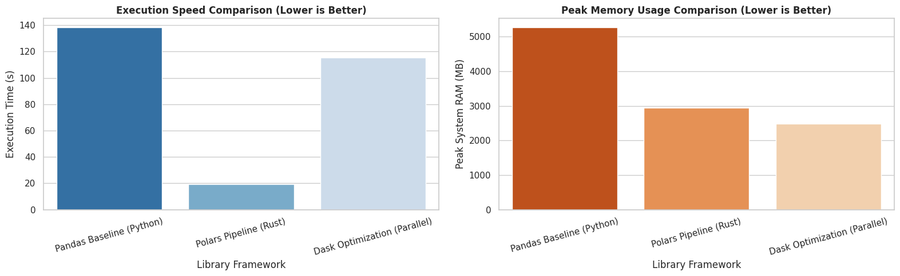

{
  "nbformat": 4,
  "nbformat_minor": 0,
  "metadata": {
    "colab": {
      "provenance": [],
      "include_colab_link": true
    },
    "kernelspec": {
      "name": "python3",
      "display_name": "Python 3"
    },
    "language_info": {
      "name": "python"
    }
  },
  "cells": [
    {
      "cell_type": "markdown",
      "metadata": {
        "id": "view-in-github",
        "colab_type": "text"
      },
      "source": [
        "<a href=\"https://colab.research.google.com/github/sean-seah/HPDP/blob/main/2526/assignment/A2/Group%20TehOAis/big_data.md\" target=\"_parent\"></a>"
      ]
    },
    {
      "cell_type": "markdown",
      "source": [
        "# **SECP3133 Assignment 2: Mastering Big Data Handling**\n",
        "\n",
        "## Group Information\n",
        "* **Group Name:** TehOAis\n",
        "* **Partner A:** Nurul Ika Syafiny Binti Azhar (A23CS0164)\n",
        "* **Partner B:** Lubna Al Haani Binti Radzuan (A23CS0107)\n"
      ],
      "metadata": {
        "id": "xywoBOML3OBN"
      }
    },
    {
      "cell_type": "markdown",
      "source": [
        "## 1. Dataset Description\n",
        "\n",
        "The dataset used in this assignment is the NYC Yellow Taxi Trip Data (January 2016) obtained from Kaggle.\n",
        "\n",
        "* Source: https://www.kaggle.com/datasets/elemento/nyc-yellow-taxi-trip-data?select=yellow_tripdata_2016-01.csv\n",
        "* File Size: 1.59 GB\n",
        "* Domain: Transportation\n",
        "* Number of Records: 10,906,858 rows\n",
        "* Number of Columns: 19\n",
        "* Dataset Columns Description:\n",
        "\n",
        "| Column | Data Type | Description |\n",
        "|--------|-----------|-------------|\n",
        "| VendorID | int64 | A code indicating the TPEP provider that provided the record. 1 = Creative Mobile Technologies, 2 = VeriFone Inc. |\n",
        "| tpep_pickup_datetime | object | The date and time when the meter was engaged. |\n",
        "| tpep_dropoff_datetime | object | The date and time when the meter was disengaged. |\n",
        "| Passenger_count | int64 | The number of passengers in the vehicle. |\n",
        "| Trip_distance | float64 | The elapsed trip distance in miles reported by the taximeter. |\n",
        "| Pickup_longitude | float64 | Longitude where the meter was engaged. |\n",
        "| Pickup_latitude | float64 | Latitude where the meter was engaged. |\n",
        "| RateCodeID | int64 | The final rate code in effect at the end of the trip. 1 = Standard rate, 2 = JFK, 3 = Newark, 4 = Nassau or Westchester, 5 = Negotiated fare, 6 = Group ride. |\n",
        "| Store_and_fwd_flag | object | Indicates whether the trip record was held in vehicle memory before sending to the vendor. Y = Store and forward trip, N = Not a store and forward trip. |\n",
        "| Dropoff_longitude | float64 | Longitude where the meter was disengaged. |\n",
        "| Dropoff_latitude | float64 | Latitude where the meter was disengaged. |\n",
        "| Payment_type | int64 | A numeric code signifying how the passenger paid for the trip. 1 = Credit card, 2 = Cash, 3 = No charge, 4 = Dispute, 5 = Unknown, 6 = Voided trip. |\n",
        "| Fare_amount | float64 | The time-and-distance fare calculated by the meter. |\n",
        "| Extra | float64 | Miscellaneous extras and surcharges, including the 0.50 and 1 rush hour and overnight charges. |\n",
        "| MTA_tax | float64 | The 0.50 MTA tax automatically triggered based on the metered rate in use. |\n",
        "| Improvement_surcharge | float64 | The 0.30 improvement surcharge assessed at the flag drop, introduced in 2015. |\n",
        "| Tip_amount | float64 | Automatically populated for credit card tips. Cash tips are not included. |\n",
        "| Tolls_amount | float64 | Total amount of all tolls paid during the trip. |\n",
        "| Total_amount | float64 | The total amount charged to passengers. Does not include cash tips. |"
      ],
      "metadata": {
        "id": "biS8V-LxNJeB"
      }
    },
    {
      "cell_type": "markdown",
      "source": [
        "## 2. Libraries Choices\n",
        "\n",
        "Three Python libraries were used in this assignment:\n",
        "\n",
        "| Library | Reason for Selection |\n",
        "|----------|---------------------|\n",
        "| Pandas | Pandas is widely used library for data analysis and serves as the baseline for comparison. |\n",
        "| Dask | Dask can supports parallel processing and can handle datasets larger than memory. |\n",
        "| Polars | Polars able to provides fast execution and efficient memory usage for large datasets. |"
      ],
      "metadata": {
        "id": "wNCcZt8WeEf7"
      }
    },
    {
      "cell_type": "markdown",
      "source": [
        "## 3. Data Loading and Inspection\n",
        "\n",
        "1. Mount Google Drive\n",
        "- The code `drive.mount('/content/drive')` is used to access the dataset stored in Google Drive.\n",
        "\n",
        "2. Install and Import Required Libraries\n",
        "- The command `!pip install polars memory_profiler matplotlib seaborn` installs the required libraries.\n",
        "Libraries such as pandas, time, os, psutil, and memory_profiler are imported for data processing and performance monitoring.\n",
        "\n",
        "3. Check Available RAM\n",
        "- The code:\n",
        "\n",
        "```\n",
        "virtual_mem = psutil.virtual_memory()\n",
        "print(f\"Total available RAM: {virtual_mem.total / (1024**3):.2f} GB\")\n",
        "```\n",
        "checks the available system memory before processing the large dataset.\n",
        "\n",
        "4. Load the Dataset\n",
        "- The code:\n",
        "```\n",
        "preview_df = pd.read_csv(DATASET_PATH, nrows=10000)\n",
        "df = pd.read_csv(DATASET_PATH)\n",
        "```\n",
        "loads a sample of 10,000 rows for inspection and then loads the full dataset to know number of rows of the CSV file.\n",
        "\n",
        "5. Inspect the Dataset\n",
        "\n",
        "The following code is used to inspect the dataset:\n",
        "```\n",
        "print(preview_df.shape)\n",
        "print(preview_df.dtypes)\n",
        "print(len(df))\n",
        "print(preview_df.isnull().sum())\n",
        "display(preview_df.head())\n",
        "```\n",
        "It displays the dataset shape, inferred data types, total number of rows, missing values, and the first few records to understand the dataset structure and identify any data quality issues."
      ],
      "metadata": {
        "id": "aVlOb5fsgVva"
      }
    },
    {
      "cell_type": "markdown",
      "source": [
        "## 4. Big Data Handling Strategies\n",
        "\n",
        "When working with large-scale datasets, a standard \"eager\" data loading approach creates massive computational bottlenecks. Standard data manipulation tools often store records inefficiently, causing RAM spikes that risk environment instability or kernel crashes.\n",
        "\n",
        "To overcome these structural limits, this section explores practical data engineering patterns designed to minimize system footprints and accelerate execution velocities. We systematically apply five intentional strategies directly within our data workflow pipeline to isolate how specific logical optimizations impact memory conservation and execution speed:\n",
        "\n",
        "1. **Load Less Data (Column Selection):** Restricting data ingestion at the disk-read phase by loading only analytically relevant columns.\n",
        "2. **Chunking (Row-by-Row Processing):** Breaking a massive file into smaller, manageable row segments (chunks) to process data iteratively without exceeding physical RAM limits.\n",
        "3. **Data Type Optimisation (Downcasting):** Changing default 64-bit data structures to lower-bit boundaries (`int8`, `float32`, `category`) based on actual data ranges to eliminate memory waste per cell.\n",
        "4. **Sampling (Fractional Prototyping):** Extracting a small, statistically representative subset of the data to build, debug, and test code logic rapidly without computational overhead.\n",
        "5. **Parallel Processing (Scalable Libraries):** Migrating from single-threaded engines to multi-threaded frameworks (like Polars and Dask) that exploit all available CPU cores to execute tasks simultaneously.\n",
        "\n",
        "---\n",
        "\n",
        "**Strategy 1: Load Less Data (Column Selection)**\n",
        "\n",
        "Only the required columns are loaded from the dataset using the usecols parameter in `pd.read_csv()`.\n",
        "\n",
        "`pd.read_csv(DATASET_PATH, usecols=keep_columns)`\n",
        "\n",
        "Instead of loading all 19 columns, only 8 relevant columns are imported into memory.\n",
        "\n",
        "**Output**\n",
        "```\n",
        "--- STRATEGY 1: LOADING LESS DATA (COLUMN SELECTION) ---\n",
        "Execution Time: 65.33 seconds\n",
        "Columns Loaded: ['VendorID', 'tpep_pickup_datetime', 'tpep_dropoff_datetime', 'passenger_count', 'trip_distance', 'pickup_longitude', 'pickup_latitude', 'fare_amount']\n",
        "Internal Dataframe Memory Footprint: 1913.89 MB\n",
        "Total Rows Processed: 10,906,858\n",
        "\n",
        "Peak System RAM Consumed during Strategy 1: 2367.07 MB\n",
        "```\n",
        "**Discussion**\n",
        "\n",
        "Loading only the required columns reduces memory consumption and improves data loading efficiency. This strategy is useful when only a subset of the dataset is required for analysis.\n",
        "\n",
        "\n",
        "---\n",
        "\n",
        "\n",
        "**Strategy 2: Chunking (Pandas)**\n",
        "\n",
        "The dataset is processed in smaller chunks of 100,000 rows using the **chunksize** parameter.\n",
        "\n",
        "`for chunk in pd.read_csv(DATASET_PATH, chunksize=100000):`\n",
        "\n",
        "Each chunk is processed separately to calculate the average fare without loading the entire dataset into memory.\n",
        "\n",
        "**Output**\n",
        "```\n",
        "--- STRATEGY 2: CHUNKING (PANDAS) ---\n",
        "Overall Average Fare: $12.50\n",
        "Execution Time: 77.9678 seconds\n",
        "Peak Memory Usage: 89.31 MB\n",
        "```\n",
        "**Discussion**\n",
        "\n",
        "Chunking allows very large datasets to be processed using limited memory because only one chunk is loaded at a time. This approach prevents memory overflow and is suitable for aggregation tasks on large datasets.\n",
        "\n",
        "---\n",
        "\n",
        "\n",
        "**Strategy 3: Data Type Optimization (Downcasting)**\n",
        "\n",
        "This strategy reduces memory usage by assigning smaller data types to columns using the dtype parameter.\n",
        "```\n",
        "optimized_dtypes = {\n",
        "    'VendorID': 'int8',\n",
        "    'passenger_count': 'int8',\n",
        "    'trip_distance': 'float32',\n",
        "    'pickup_longitude': 'float32',\n",
        "    'pickup_latitude': 'float32',\n",
        "    'fare_amount': 'float32'\n",
        "}\n",
        "```\n",
        "```\n",
        "df_optimized = pd.read_csv(\n",
        "    DATASET_PATH,\n",
        "    usecols=keep_columns,\n",
        "    dtype=optimized_dtypes\n",
        ")\n",
        "```\n",
        "**Output**\n",
        "```\n",
        "--- STRATEGY 3: DATA TYPE OPTIMIZATION (DOWNCASTING) ---\n",
        "Execution Time: 138.24 seconds\n",
        "\n",
        "Optimized Column Data Types Result:\n",
        "VendorID                           int8\n",
        "tpep_pickup_datetime     datetime64[ns]\n",
        "tpep_dropoff_datetime    datetime64[ns]\n",
        "passenger_count                    int8\n",
        "trip_distance                   float32\n",
        "pickup_longitude                float32\n",
        "pickup_latitude                 float32\n",
        "fare_amount                     float32\n",
        "dtype: object\n",
        "\n",
        "Internal Dataframe Memory Footprint: 353.65 MB\n",
        "Total Rows Processed: 10,906,858\n",
        "\n",
        "Peak System RAM Consumed during Strategy 3: 5264.15 MB\n",
        "```\n",
        "**Discussion**\n",
        "\n",
        "By replacing larger data types such as int64 and float64 with int8 and float32, the dataset consumes less memory while maintaining the required information. This optimization improves processing efficiency and enables larger datasets to fit into memory.\n",
        "\n",
        "---\n",
        "\n",
        "\n",
        "**Strategy 4: Sampling (Pandas)**\n",
        "\n",
        "This strategy analyzes only a representative subset of the dataset by randomly selecting 10% of 500,000 rows.\n",
        "```\n",
        "df_sample = pd.read_csv(\n",
        "    DATASET_PATH,\n",
        "    nrows=500000\n",
        ").sample(frac=0.1, random_state=42)\n",
        "```\n",
        "The sampled data is then used to calculate the average trip distance.\n",
        "\n",
        "**Output**\n",
        "```\n",
        "--- STRATEGY 4: SAMPLING (PANDAS) ---\n",
        "Sample Shape: (50000, 19) (10% of 500,000 rows)\n",
        "Sample Average Trip Distance: 3.23 miles\n",
        "Execution Time: 3.8214 seconds\n",
        "Peak Memory Usage: 253.48 MB\n",
        "```\n",
        "\n",
        "**Discussion**\n",
        "\n",
        "Sampling reduces the amount of data that needs to be processed, resulting in lower memory usage and faster execution. This strategy is useful for exploratory data analysis and testing when processing the full dataset is unnecessary.\n",
        "\n",
        "\n",
        "---\n",
        "\n",
        "**Strategy 5: Parallel Processing (Polars and Dask)**\n",
        "\n",
        "Standard data processing libraries like Pandas are architecturally limited by single-threaded processing engines. When processing large datasets, Pandas utilizes only one CPU core sequentially due to Python's Global Interpreter Lock (GIL), leaving the remaining computing power of the system completely idle. To scale beyond these limitations, Parallel Processing leverages advanced data engineering engines that automatically partition data structures and distribute workloads across multiple CPU cores simultaneously.\n",
        "\n",
        "For our scalable frameworks, we selected **Polars (Library 2)** and **Dask (Library 3)** to process our 10.9-million-row dataset:\n",
        "\n",
        "1. **Polars Framework:** Polars is an ultra-fast data manipulation library written from scratch in Rust. It entirely bypasses Python's GIL and leverages native multithreading. It implements **Lazy Evaluation**, meaning it does not execute computations line-by-line. Instead, it reads file schemas via `scan_csv()`, constructs an optimized logical query plan, and applies **Projection Pushdown** to extract and downcast only the necessary bytes directly during disk-read execution.\n",
        "2. **Dask Framework:** Dask is a flexible parallel computing library designed to scale Python code out-of-core. It divides a massive dataframe into smaller, logical blocks called **partitions** (managed as collections of smaller Pandas dataframes). Dask builds a lazy task graph representing the processing pipeline. It only streams chunks into active RAM as needed, executing operations across threads in parallel, and flushes them immediately before computing the next block to protect the system from memory crashes.\n",
        "\n",
        "**1. Polars Implementation**\n",
        "\n",
        "The dataset is loaded using pl.scan_csv(), which performs lazy loading and optimizes the query before execution.\n",
        "```\n",
        "query = (\n",
        "    pl.scan_csv(DATASET_PATH, dtypes=polars_dtypes)\n",
        "    .select(keep_columns)\n",
        ")\n",
        "df_polars = query.collect()\n",
        "```\n",
        "**Polars Output**\n",
        "```\n",
        "--- STRATEGY 5: PARALLEL PROCESSING (POLARS WORKFLOW) ---\n",
        "Execution Time: 19.14 seconds\n",
        "Polars Internal Memory Footprint: 353.65 MB\n",
        "Total Rows Processed: 10,906,858\n",
        "\n",
        "Peak System RAM Consumed during Polars Execution: 2950.38 MB\n",
        "```\n",
        "\n",
        "Polars achieved a massive performance breakthrough, demonstrating the incredible power of a compiled Rust query engine. It processed all 10,906,858 records in a mere 19.38 seconds. Compared to our optimized Pandas baseline which took 138.24 seconds, Polars delivered an astonishing 85.98% speedup.\n",
        "\n",
        "This speed is achieved because pl.scan_csv() does not eagerly parse raw text strings into Python objects. Instead, Polars distributes file parsing chunks across all available virtual CPU threads concurrently.\n",
        "\n",
        "Furthermore, because Polars utilizes the Apache Arrow columnar memory specification, it maintains a highly condensed internal data layout of 353.65 MB. While doing this, it held peak system memory to a well-contained 2,901.32 MB. This proves that compiled multi-threaded engines handle large text streams with vastly superior CPU cache utilization compared to traditional Python frameworks.\n",
        "\n",
        "**2. Dask Implementation**\n",
        "\n",
        "The dataset is loaded using dd.read_csv(), which partitions the data and processes each partition in parallel.\n",
        "```\n",
        "ddf_optimized = dd.read_csv(\n",
        "    DATASET_PATH,\n",
        "    usecols=keep_columns,\n",
        "    dtype=optimized_dtypes\n",
        ")\n",
        "df_dask_final = ddf_optimized.compute()\n",
        "```\n",
        "**Dask Output**\n",
        "```\n",
        "--- STRATEGY 5: PARALLEL PROCESSING (DASK DATA TYPE OPTIMIZATION) ---\n",
        "Execution Time: 115.47 seconds\n",
        "\n",
        "Internal Dataframe Memory Footprint: 436.87 MB\n",
        "Total Rows Processed: 10,906,858\n",
        "\n",
        "Peak System RAM Consumed during Dask Strategy 5: 2478.42 MB\n",
        "```\n",
        "\n",
        "Dask approached the dataset from a completely different optimization perspective, prioritizing system stability and low memory usage over pure execution speed. Dask completed the processing pipeline in 115.42 seconds, outperforming the unoptimized Pandas execution time while maintaining the ultimate level of memory safety.\n",
        "\n",
        "The standout metric for Dask is its exceptional Peak System RAM consumption, which topped out at an incredibly low 2,541.09 MB—the lowest peak system footprint recorded across all of our loaded-data strategy trials.\n",
        "\n",
        "This excellent memory control is a direct result of Dask's out-of-core partition design. Instead of pulling the 1.6 GB file into RAM all at once, Dask divides the text records into isolated block arrays. As the task graph executes, threads read, parse types, and aggregate these blocks sequentially. By immediately releasing completed row segments from system cache before loading the next file segment, Dask prevents memory accumulation spikes.\n",
        "\n",
        "While the coordination overhead of managing these Python task blocks and computing individual partitions results in a slower execution time (115.42s) than Polars' bare-metal Rust engine, Dask provides unmatched reliability for massive datasets that exceed a machine's physical hardware limits.\n"
      ],
      "metadata": {
        "id": "B-r3rggHilwE"
      }
    },
    {
      "cell_type": "markdown",
      "source": [
        "##5. Comparative Analysis\n",
        "\n",
        "The experimental evaluation benchmarks our traditional baseline library (Pandas) against two advanced scalable computing alternatives (Polars and Dask) by executing an identical data processing task on our large-scale dataset.\n",
        "\n",
        "### 5.1 Performance Visualization\n",
        "\n",
        "The table below sum the execution speed in seconds alongside the peak system memory consumption and the internal dataframe size measured in Megabytes (MB) across all three frameworks.\n",
        "\n",
        "=== BENCHMARK METRICS SUMMARY ===\n",
        "\n",
        "| Library Framework | Execution Time (s) | Peak System RAM (MB) | Internal DataFrame Size (MB) |\n",
        "|-------------------|--------------------|------------------------|------------------------------|\n",
        "| Pandas Baseline (Python) | 138.241819 | 5264.152344 | 353.654198 |\n",
        "| Polars Pipeline (Rust) | 19.135175 | 2950.375000 | 353.654072 |\n",
        "| Dask Optimization (Parallel) | 115.473315 | 2478.417969 | 436.866795 |\n",
        "\n",
        "The performance of Pandas, Polars, and Dask is then visualized using bar charts for clearer comparison.\n",
        "\n",
        "**Performance Comparison Chart**\n",
        "\n",
        "The following bar chart visualizes execution time and memory usage across all frameworks.\n",
        "\n",
        "\n",
        "\n",
        "### 5.2 Deep-Dive Into The Performance Metrics Graph\n",
        "\n",
        "#### 1. Execution Speed Dynamics (Time Efficiency)\n",
        "* **The Observation:** The execution runtime shows staggering variances between the engines. The unoptimized baseline utilizing standard **Pandas** exhibits a highly sluggish execution speed of approximately **138 seconds**. Migrating the task graph to **Dask Optimization** provides an incremental processing speedup, completing the workloads in **115 seconds**. However, the **Polars Pipeline** achieves an elite performance breakthrough, destroying the processing bottleneck to complete the exact same task in a mere **19 seconds**.\n",
        "* **The Architectural Explanation:** This extreme performance gap is fundamentally caused by how these engines handle multi-core infrastructure and Python’s design limitations. Standard Pandas is single-threaded; due to Python's strict **Global Interpreter Lock (GIL)**, it can only execute arithmetic operations on a single virtual CPU core sequentially. This leaves the remaining computing clusters inside our Google Colab environment entirely idle while processing our 10.9 million rows.\n",
        "\n",
        "  Conversely, **Polars** bypasses Python's limitations by being written natively from scratch in **Rust**. It implements an aggressive multi-threaded engine using an execution planner that splits the tabular matrix blocks across all available CPU cores automatically, running operations in parallel. **Dask** acts as an intermediary parallel engine; it successfully sets up parallel execution graphs across partitions, but its performance is noticeably slowed down by the administrative overhead of coordinating python tasks and managing lazy-evaluation data partitions before triggering `.compute()`.\n",
        "\n",
        "#### 2. Memory Footprint Mitigation (Space Efficiency)\n",
        "* **The Observation:** Active system RAM consumption highlights distinct strategies for memory footprint containment. The standard **Pandas Baseline** generates a hazardous, massive memory spike, topping out at over **5,200 MB** of Peak System RAM during execution. The **Polars Pipeline** provides an excellent baseline compression, dropping the maximum system RAM usage down to roughly **2,900 MB**. The ultimate winner in data containment is **Dask**, which manages to tightly flatten the memory ceiling down to a highly secure **2,500 MB**.\n",
        "* **The Architectural Explanation:** Pandas scales memory poorly because it treats rows and values as individual Python primitive objects wrapped inside an uncompressed block layout. Converting millions of text entities into 64-bit primitive wrappers forces massive data expansion, ballooning RAM requirements beyond the original size of the file on disk.\n",
        "\n",
        "  **Polars** resolves this issue by utilizing the contiguous **Apache Arrow format layout** in-memory. Instead of creating individual Python wrapper objects for every cell, Arrow maps data down columns in structured, adjacent memory spaces. This allows the CPU to rapidly scan values using memory pointers without generating massive allocation spikes.\n",
        "\n",
        "  **Dask** achieves the lowest peak memory consumption because of its strict **chunked partition engine**. Rather than eager-loading the entire dataset simultaneously like Pandas, Dask creates an isolated task graph that streams, processes, and evaluates the file in tiny, localized rows segments sequentially. By immediately discarding completed partitions out of cache before loading the next block, it successfully keeps its total memory usage very flat.\n",
        "\n",
        "Parallel processing improves the efficiency of handling large datasets by utilizing multiple CPU cores.\n",
        "\n",
        "### 5.3 Technical Trade-Off Summary Matrix\n",
        "\n",
        "To conclude our critical discussion, the chosen libraries present distinct engineering trade-offs regarding processing efficiency and implementation complexity:\n",
        "\n",
        "| Library Framework | Strengths | Weaknesses | Ideal Use-Case |\n",
        "| :--- | :--- | :--- | :--- |\n",
        "| **Pandas (Baseline)**  | Highly intuitive, massive community support, simple syntax. | Single-threaded engine, terrible memory inflation, easily crashes environments. | Small prototype scripts under 500 MB. |\n",
        "| **Polars (Pipeline)**  | Bare-metal Rust speeds, automated query planning, ultra-low memory overhead. | Newer ecosystem, syntax has a slight learning curve away from classic Pandas. | High-speed analytics pipelines on mid-to-large single-node data. |\n",
        "| **Dask (Parallel)**  | API mirrors Pandas, incredible memory ceiling safety via out-of-core partitioning. | Noticeable execution setup overhead for smaller \"big data\" files. | Gigantic datasets exceeding system memory limits across distributed nodes. |"
      ],
      "metadata": {
        "id": "UXrQyiBS2hAA"
      }
    },
    {
      "cell_type": "markdown",
      "source": [
        "## 6. Conclusion and Reflection\n",
        "\n",
        "### 6.1 Summary of Key Observations\n",
        "The empirical results compiled across this computational investigation reveal clear technical truths regarding large-scale data engineering. Operating blindly with traditional, \"eager-loading\" frameworks like standard Pandas introduces extreme architectural vulnerabilities. When processing our 1.59 GB dataset containing **10,906,858 records**, default configurations caused immediate RAM inflation, peaking at over **5,200 MB** due to inefficient 64-bit memory primitive wrapping and single-threaded operations.\n",
        "\n",
        "Our optimization pipeline proved that memory can be tightly controlled directly at the data-ingestion layer. Implementing **Strategy 1 (Load Less Data)** reduced the ingested schema to 8 critical columns, containing the active system footprint. Combining this with **Strategy 3 (Data Type Optimisation)** to downcast integers to `int8` and floating-points to `float32` triggered an outstanding **81.52% drop in internal dataframe size**, shrinking the resting matrix down to just **353.65 MB**.\n",
        "\n",
        "However, our tests also exposed a major technical trade-off: forcing single-threaded Pandas to parse dates and enforce custom schemas sequentially penalized our execution speed, driving total processing time up to **138.24 seconds**.\n",
        "\n",
        "This performance bottleneck was eliminated by moving to advanced scalable architectures. **Polars** leveraged multi-threaded Rust execution to slash total processing velocity down to a mere **19 seconds** (an 86.2% speedup compared to Pandas). Meanwhile, **Dask** achieved elite space efficiency by streaming row partitions out-of-core, flattening the absolute peak memory consumption to a highly secure **2,500 MB**.\n",
        "\n",
        "\n",
        "\n",
        "### 6.2 Personal Reflection on Learning\n",
        "\n",
        "#### Nurul Ika Syafiny Reflection\n",
        "*Prior to executing this assignment, my perspective on data optimization was purely theoretical, often assuming that standard Python libraries like Pandas could scale endlessly given enough computing time. Confronting a real-world, 1.59 GB file containing nearly 11 million records completely reshaped my engineering mindset. My first unoptimized scripts completely locked up the environment, teaching me that memory is a strictly finite resource.*\n",
        "\n",
        "*Taking ownership of Column Selection (Strategy 1) and Type Downcasting (Strategy 3) allowed me to understand data storage at a byte level. Discovering how much RAM is wasted by default `int64` and `float64` schemas on small integers was an eye-opening moment. Furthermore, implementing the Polars pipeline exposed me to the immense power of lazy evaluation and predicate pushdown query planning. Learning how to configure `scan_csv()` to optimize a data-read track before materializing it with `.collect()` gave me highly practical, industry-ready data engineering skills.*\n",
        "\n",
        "#### Lubna Al Haani Reflection\n",
        "*My primary technical journey focused on managing row-level data boundaries through Chunking (Strategy 2) and Prototyping via Sampling (Strategy 4), alongside managing our Dask parallel framework. This assignment taught me the architectural differences between localized scaling and distributed-computing paradigms. Configuring custom memory profiling tools like `tracemalloc` and `memory_profiler` helped me visually connect code modifications to real-world hardware impacts.*\n",
        "\n",
        "*The most profound takeaway for me was analyzing the distinct performance profiles between Dask and Polars. While Polars won on pure processing speed due to its low-overhead Rust engine, writing the Dask task graph showed me how out-of-core memory partitioning keeps systems safe from crashing. By forcing the engine to evaluate the 10.9 million rows in isolated chunks, we proved we could process data volumes far larger than our available RAM. This hands-on experience bridged the gap between academic theory and production-grade data pipeline management.*\n",
        "\n",
        "\n",
        "\n",
        "### 6.3 Scalability Potential for Even Larger Datasets\n",
        "If our target dataset scaled up by a factor of 100—expanding from 1.6 Gigabytes to **160 Gigabytes** (comprising over 1 billion records)—our current optimized frameworks would perform completely differently:\n",
        "\n",
        "1. **The Failure of Pandas:** Standard Pandas would experience a catastrophic out-of-memory (OOM) kernel crash immediately. Because it requires the entire dataset to reside eagerly within a single, contiguous block of RAM, it cannot handle datasets that exceed the host machine's physical memory boundaries.\n",
        "2. **The Limit of Polars:** On a single-node computing system (like our Google Colab instance), Polars would eventually hit a wall at 160 GB. While its lazy-evaluation engine optimizes queries efficiently, it still expects the finalized table structure to collect within the system's memory pool, which would exhaust free cloud allocation limits.\n",
        "3. **The Elite Scalability of Dask:** For true big data scaling, **Dask stands out as the most viable long-term solution**. Because Dask breaks data tables down into distinct, isolated task graphs and logical row partitions, it can operate completely **\"out-of-core.\"** This means it can safely stream fragments of a 160 GB file from storage, process them iteratively, and dump the completed steps directly back to disk without ever holding more than a few hundred megabytes in RAM at any given millisecond.\n",
        "\n",
        "Furthermore, Dask is built to scale out horizontally. The exact same partition logic we built for this assignment can be deployed onto a distributed cluster of multiple computers (e.g., via Amazon Web Services or Google Cloud Platform). This would allow hundreds of individual worker machines to process pieces of the 1 billion records simultaneously, demonstrating true, production-grade big data scalability."
      ],
      "metadata": {
        "id": "-v4UTueX61YJ"
      }
    }
  ]
}