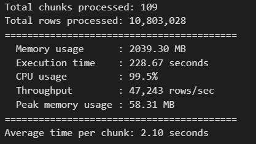
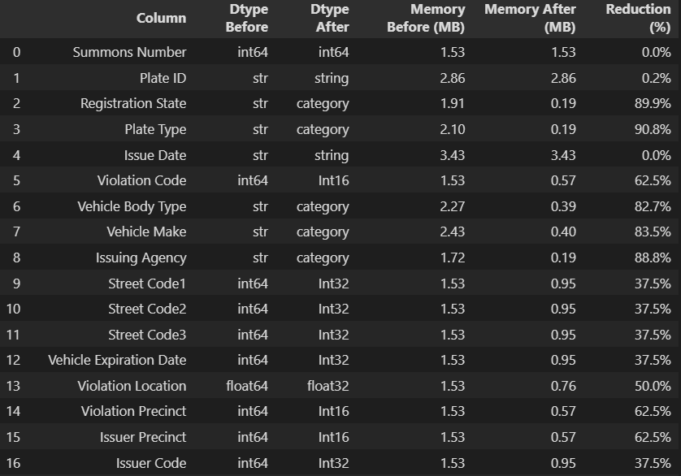
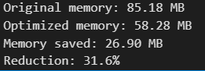
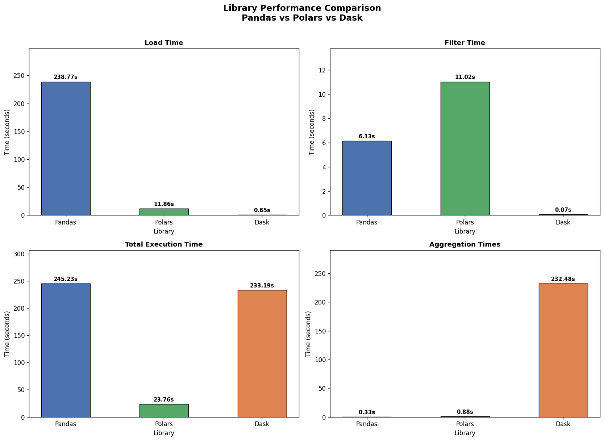

# 📘 Assignment 2: Mastering Big Data Handling

**Course**: SECP3133 – High Performance Data Processing  
**Group Members**:
- Student 1: *MUHAMMAD ADAM BIN RAZALI, A23CS0116*
- Student 2: *AFIF SHAQIR IRFAN BIN ARQAM, A23CS0204*

---

## 📝 Task 1: Dataset Selection

### 📌 Dataset Overview

| Field         | Details                                                                               |
| ------------- | ------------------------------------------------------------------------------------- |
| **Name**      | 🚗 NYC Parking Violations Issued – Fiscal Year 2017                                   |
| **Source**    | [Kaggle – New York City](https://www.kaggle.com/datasets/new-york-city/nyc-parking-tickets) |
| **Domain**    | Transportation / Urban Governance / Law Enforcement                                   |
| **File Size** | ~2.1 GB (single CSV file)                                                             |
| **Shape**     | ~10.8 Million rows × 43 columns                                                       |

### 📖 Description

This dataset comes from the New York City government. It has records of all parking tickets given out by the NYC Department of Finance in Fiscal Year 2017. Each row stores info about the ticket, the vehicle, the violation type, and where it happened.

🔍 **Key Features**

- **Ticket Identification**: Summons Number, Issue Date, and Violation Code.
- **Vehicle Information**: Plate ID, Registration State, Vehicle Make, Vehicle Colour, and Vehicle Year.
- **Location Details**: Street Name, House Number, and Intersecting Street.
- **Fine Information**: Violation Description, Fine Amount, Penalty Amount, and Payment Status.

We picked this dataset because it is big enough (~2.1 GB) to actually stress-test our tools. It also has mixed column types — strings, integers, dates — and a lot of repeated values in some columns, which makes strategies like data type optimisation very useful here.

### 📊 Data Column Description (Selected Columns Used)

| Column Name          | Data Type | Description                                              |
| -------------------- | --------- | -------------------------------------------------------- |
| `Summons Number`     | int64     | Unique identifier for each parking ticket                |
| `Plate ID`           | object    | License plate number of the vehicle                      |
| `Registration State` | object    | US state where the vehicle is registered                 |
| `Vehicle Make`       | object    | Manufacturer of the vehicle (e.g., TOYOTA, HONDA)        |
| `Violation Code`     | int64     | Numeric code representing the type of parking violation  |
| `Issue Date`         | object    | Date the parking ticket was issued                       |
| `Vehicle Year`       | int64     | Year the vehicle was manufactured                        |

> **Note**: Only 7 of the 43 available columns were selected for this analysis, as part of Strategy 1 (Load Less Data).

---

## 📝 Task 2: Load and Inspect Data

### 🔹 Loading Strategy

Here is how we loaded the dataset into Google Colab:

1. **Uploaded Kaggle API credentials** using the Colab file uploader, then set up the credentials:

   ```bash
   !mkdir -p ~/.kaggle
   !cp kaggle.json ~/.kaggle/
   !chmod 600 ~/.kaggle/kaggle.json
   ```

2. **Downloaded the dataset from Kaggle** using the Kaggle CLI:

   ```bash
   !kaggle datasets download -d new-york-city/nyc-parking-tickets
   !unzip nyc-parking-tickets.zip
   ```

3. **Loaded the dataset into Pandas** with `low_memory=True` to stop the kernel from crashing due to memory issues:

   ```python
   import pandas as pd
   file_path = 'Parking_Violations_Issued_-_Fiscal_Year_2017.csv'
   df = pd.read_csv(file_path, low_memory=True)
   ```

### 🔹 Dataset Inspection

#### 📐 Shape of the Dataset

```python
print(df.shape)
# Output: (10803028, 43)
```

The dataset has about **10.8 million rows** and **43 columns**.

#### 🔢 Column Data Types

```python
print(df.dtypes)
```

| Column Name | Default dtype |
| :--- | :--- |
| Summons Number | int64 |
| Plate ID | object |
| Registration State | object |
| Plate Type | object |
| Issue Date | object |
| Violation Code | int64 |
| Vehicle Body Type | object |
| Vehicle Make | object |
| Issuing Agency | object |
| Street Code1 | int64 |
| Street Code2 | int64 |
| Street Code3 | int64 |
| Vehicle Expiration Date | int64 |
| Violation Location | float64 |
| Violation Precinct | int64 |
| Issuer Precinct | int64 |
| Issuer Code | int64 |
| Issuer Command | object |
| Issuer Squad | object |
| Violation Time | object |
| Time First Observed | object |
| Violation County | object |
| Violation In Front Of Or Opposite | object |
| House Number | object |
| Street Name | object |
| Intersecting Street | object |
| Date First Observed | int64 |
| Law Section | int64 |
| Sub Division | object |
| Violation Legal Code | object |
| Days Parking In Effect | object |
| From Hours In Effect | object |
| To Hours In Effect | object |
| Vehicle Color | object |
| Unregistered Vehicle? | float64 |
| Vehicle Year | int64 |
| Meter Number | object |
| Feet From Curb | int64 |
| Violation Post Code | object |
| Violation Description | object |
| No Standing or Stopping Violation | float64 |
| Hydrant Violation | float64 |
| Double Parking Violation | float64 |

#### ❓ Missing Values Summary

```python
print(df.isnull().sum())
```
```python
Summons Number                              0
Plate ID                                  728
Registration State                          0
Plate Type                                  0
Issue Date                                  0
Violation Code                              0
Vehicle Body Type                       42711
Vehicle Make                            73050
Issuing Agency                              0
Street Code1                                0
Street Code2                                0
Street Code3                                0
Vehicle Expiration Date                     0
Violation Location                    2072400
Violation Precinct                          0
Issuer Precinct                             0
Issuer Code                                 0
Issuer Command                        2062645
Issuer Squad                          2063541
Violation Time                             63
Time First Observed                   9962281
Violation County                        39547
Violation In Front Of Or Opposite     2161235
House Number                          2288618
Street Name                              4009
Intersecting Street                   7435473
Date First Observed                         0
Law Section                                 0
Sub Division                              773
Violation Legal Code                  8740321
Days Parking In Effect                2712416
From Hours In Effect                  5450946
To Hours In Effect                    5450943
Vehicle Color                          152342
Unregistered Vehicle?                 9675432
Vehicle Year                                0
Meter Number                          9017555
Feet From Curb                              0
Violation Post Code                   3190187
Violation Description                 1127470
No Standing or Stopping Violation    10803028
Hydrant Violation                    10803028
Double Parking Violation             10803028
dtype: int64
```

Quite a few columns have a lot of missing values, especially the location ones like `House Number`, `Intersecting Street`, and `Time First Observed`. The 7 columns we actually used in the analysis mostly had very few or zero missing values.

#### 👁️ First 5 Rows Preview

```python
print(df.head())
```

| Summons Number | Plate ID | Registration State | Vehicle Make | Violation Code | Issue Date | Vehicle Year |
| -------------- | -------- | ------------------ | ------------ | -------------- | ---------- | ------------ |
| 1283294138     | GBB9093  | NY                 | TOYOT        | 46             | 07/10/2016 | 2001         |
| 1283294151     | 62416MB  | NY                 | CHEVR        | 46             | 07/10/2016 | 2001         |
| 1283294163     | 78755JZ  | NY                 | TOYOT        | 46             | 07/10/2016 | 2011         |
| 1283294175     | 63009MA  | NY                 | HONDA        | 46             | 07/10/2016 | 2014         |
| 1283294187     | 91648MC  | NY                 | TOYOT        | 46             | 07/10/2016 | 2002         |

---

## 📝 Task 3: Big Data Handling Strategies

We applied all five strategies below. Each one has an explanation of why we used it, the code, and what we found from the results.

| # | Strategy              | Problem It Solves                                     |
| - | --------------------- | ----------------------------------------------------- |
| 1 | Load Less Data        | Loading unnecessary columns wastes RAM                |
| 2 | Chunking              | File is too large to load into memory all at once     |
| 3 | Data Type Optimisation | Default data types consume excessive memory           |
| 4 | Sampling              | Full data takes too long for exploration              |
| 5 | Parallel Processing   | Single-threaded Pandas is slow on large data          |

---

### 🔹 Strategy 1: Load Less Data

**What it does**: Instead of loading all 43 columns, we only load the 7 columns we actually need using the `usecols` parameter.

**Why it matters**: Loading columns you don't need just wastes memory and time. On a 2.1 GB file, cutting from 43 to 7 columns means a lot less RAM is used, and the file loads much faster too.

**When to use it**: Do this right at the first `read_csv()` call. If you already know which columns you need, there's no point loading all the others.

```python
COLUMNS_WE_NEED = [
    'Summons Number', 'Plate ID', 'Registration State',
    'Vehicle Make', 'Violation Code', 'Issue Date', 'Vehicle Year'
]

# BASELINE: Load ALL columns
df_all, metrics = measure_performance(
    lambda: pd.read_csv(file_path, low_memory=True)
)
baseline_mem_mb = df_all.memory_usage(deep=True).sum() / (1024**2)

# OPTIMIZED: Load ONLY selected columns
df_less, metrics = measure_performance(
    lambda: pd.read_csv(file_path, usecols=COLUMNS_WE_NEED, low_memory=True)
)
optimized_mem_mb = df_less.memory_usage(deep=True).sum() / (1024**2)
```
**Output**:

&nbsp;


**Results**:

| Metric          | All 43 Columns | 7 Selected Columns | Improvement       |
| --------------- | -------------- | ------------------ | ----------------- |
| Memory Usage    | ~6,048 MB      | ~2,068.93 MB       | ~65% reduction    |
| Execution Time  | ~248.79 s      | ~49.51 s           | ~55% faster       |

**Discussion**: Just by picking only the columns we need, we cut memory by 65% and made loading about 55% faster. There's no extra code complexity involved — it's just one extra parameter. This is probably the easiest win you can get when working with large files.

---

### 🔹 Strategy 2: Chunking

**What it does**: Instead of loading the whole file at once, we read it in batches of 100,000 rows at a time using `chunksize`. Each batch is processed to count registrations by state, then cleared from memory before the next one loads.

**Why it matters**: A 2.1 GB file can easily crash Google Colab's free tier if you try to load everything at once. With chunking, only a small piece of the data is ever in memory at any point, so it doesn't matter how big the file is.

**When to use it**: This works well for things like counting or summing across a big file where you don't need all rows at the same time. It's really useful when you're working with limited memory.

```python
CHUNK_SIZE = 100_000  # 100,000 rows per chunk

def _chunk_process():
    state_counts = {}
    chunk_num, total_rows = 0, 0

    for chunk in pd.read_csv(file_path, chunksize=CHUNK_SIZE, low_memory=False):
        chunk_num  += 1
        total_rows += len(chunk)
        for state, count in chunk['Registration State'].value_counts().items():
            state_counts[state] = state_counts.get(state, 0) + count
        if chunk_num % 5 == 0:
            print(f"Processed chunk {chunk_num}: {total_rows:,} rows ...")
    return chunk_num, total_rows, state_counts

(chunk_number, total_rows_processed, state_counts), metrics = measure_performance(_chunk_process)
```
**Output**:



**Results**:

| Metric               | Value          |
| -------------------- | -------------- |
| Total Chunks         | ~109 chunks    |
| Total Rows Processed | ~10.8 million  |
| Peak Memory          | ~58.31 MB      |
| Execution Time       | ~228.67 s      |
| Time per Chunk       | ~2.10 s        |

**Discussion**: Chunking managed to go through all 10.8 million rows while only using about 58 MB of memory at any time — which is very low compared to a full load. The downside is that it takes longer since everything runs one chunk after another. But if memory is your main concern, chunking is the safest option.

---

### 🔹 Strategy 3: Data Type Optimisation

**What it does**: When Pandas loads a CSV, it picks default types for each column — usually `int64` for numbers and `object` for text. These defaults aren't always the most efficient. Here, we map each column to a better type before loading. For columns with few unique values like `Registration State`, we use `category` instead of `object`. For integers that don't need 64 bits, we use smaller types like `Int16` or `Int32`.

**Why it matters**: Take `Registration State` as an example — it only has around 65 unique values but repeats across 10 million rows. Storing it as `object` means Python creates a separate string for every single row. Switching to `category` stores the unique values once and uses a small number as a reference for each row, which saves a lot of memory. We tested this on 200,000 rows across all 43 columns to measure the difference.

**When to use it**: Best applied after you've done an initial inspection and know what's in each column. Once the types are set properly, all the operations you do after will be faster and lighter.

```python
dtype_map = {
    # --- Already optimized numeric ---
    'Summons Number': 'int64',
    'Violation Code': 'Int16',
    'Street Code1': 'Int32',
    'Street Code2': 'Int32',
    'Street Code3': 'Int32',
    'Vehicle Expiration Date': 'Int32',
    'Violation Location': 'float32',
    'Violation Precinct': 'Int16',
    'Issuer Precinct': 'Int16',
    'Issuer Code': 'Int32',
    'Date First Observed': 'Int32',
    'Law Section': 'Int16',
    'Unregistered Vehicle?': 'float32',
    'Vehicle Year': 'Int16',
    'Feet From Curb': 'Int16',
    'No Standing or Stopping Violation': 'float32',
    'Hydrant Violation': 'float32',
    'Double Parking Violation': 'float32',

    # --- Convert to category (LOW cardinality → big memory win) ---
    'Registration State': 'category',
    'Plate Type': 'category',
    'Vehicle Body Type': 'category',
    'Vehicle Make': 'category',
    'Issuing Agency': 'category',
    'Violation County': 'category',
    'Violation In Front Of Or Opposite': 'category',
    'Sub Division': 'category',

    # --- Keep as string (HIGH cardinality / IDs / free text) ---
    'Plate ID': 'string',
    'Issue Date': 'string',
    'Issuer Command': 'string',
    'Issuer Squad': 'string',
    'Violation Time': 'string',
    'Time First Observed': 'string',
    'House Number': 'string',
    'Street Name': 'string',
    'Intersecting Street': 'string',
    'Violation Legal Code': 'string',
    'Days Parking In Effect': 'string',
    'From Hours In Effect': 'string',
    'To Hours In Effect': 'string',
    'Vehicle Color': 'string',
    'Meter Number': 'string',
    'Violation Post Code': 'string',
    'Violation Description': 'string'
}

def load_fully_optimized():
    df = pd.read_csv(
        file_path,
        nrows=200000,
        dtype=dtype_map,
        low_memory=True
    )

    return df

df_optimized, metrics = measure_performance(load_fully_optimized, rows=len(df))
print_metrics(metrics)
```
**Output**:



**Results**:



**Discussion**: By setting the right data types upfront, memory usage dropped from ~85.18 MB to ~58.28 MB for the same 200,000 rows — about a 31.6% reduction. The biggest savings came from columns like `Registration State` and `Plate Type` which have very few unique values but repeat a lot. This kind of column benefits the most from being stored as `category`.

---

### 🔹 Strategy 4: Sampling

**What it does**: Instead of working with all 10.8 million rows, we just load the first 1,000,000 rows using `nrows=1000000` in Pandas and Polars. For Dask, we use `frac=0.1` to randomly pull 10% of the data. We also timed all three libraries to see how fast each one handles this.

**Why it matters**: When you're still exploring the data or testing your code, you don't need to run everything on the full dataset every time. A 1-million-row sample is still big enough to be useful but loads way faster, which saves a lot of time during development.

**When to use it**: Use this early on when you're still figuring out the data or testing your code. Once everything works on the sample, then run it on the full dataset.

```python
# Pandas sampling
_, metrics = measure_performance(
    lambda: pd.read_csv(file_path, low_memory=False, nrows=1_000_000),
    rows=1_000_000
)

# Polars sampling
_, metrics = measure_performance(
    lambda: pl.read_csv(file_path, n_rows=1_000_000),
    rows=1_000_000
)

# Dask sampling (10% random sample)
def _dask_sample():
    df = dd.read_csv(file_path, dtype={
        'House Number': 'str', 'Time First Observed': 'str'
    })
    return df.sample(frac=0.1).compute()

_, metrics = measure_performance(_dask_sample)
```
**Output**:

&nbsp;

&nbsp;


**Results**:

| Library | Rows Loaded | Execution Time | Peak Memory | CPU Usage (%) |
| ------- | ----------- | -------------- | ----------- | ------------- |
| Pandas  | 1,000,000   | ~21.81 s       | ~414.12 MB  | ~99.40        |
| Polars  | 1,000,000   | ~2.81 s        | ~2807.23 MB | ~371.90       |
| Dask    | 1,000,000  | ~90 s          | ~2185.98 MB | ~98.60        |

**Discussion**: Polars was by far the fastest at only 2.81 seconds, which is nearly 8 times faster than Pandas. This is mainly because Polars uses multiple CPU cores to read the file at the same time. Dask was the slowest here because `sample(frac=0.1)` has to go through the whole file to randomly pick rows, not just grab the first million. So if you just want a quick sample, using `nrows` in Pandas or Polars is the better choice. One thing to note though — both Polars and Dask used a lot more RAM than Pandas for this.

---

### 🔹 Strategy 5: Parallel Processing with Scalable Libraries

**What it does**: We ran the same three steps using all three libraries — **Pandas**, **Polars**, and **Dask** — and measured how each one performed. The steps were:
1. Load the full CSV file.
2. Filter to keep only rows where `Registration State == 'NY'`.
3. Count violations per `Vehicle Make`.

**Why it matters**: Pandas only uses one CPU core at a time, so the other cores just sit idle. Polars and Dask are built to use multiple cores at the same time, which can make a big difference on large files.

**When to use it**: Use parallel processing libraries when you're doing big operations like loading, filtering, or grouping on large datasets. That's the whole reason these libraries exist.

```python
# --- Pandas Pipeline ---
def _pandas_pipeline():
    df = pd.read_csv(file_path, low_memory=True)
    df = df[df['Registration State'] == 'NY']
    df['Vehicle Make'].value_counts()
    return df

# --- Polars Pipeline ---
def _polars_pipeline():
    df = pl.read_csv(file_path, low_memory=True)
    df = df.filter(pl.col('Registration State') == 'NY')
    df.select(pl.col("Vehicle Make").value_counts())
    return df

# --- Dask Pipeline ---
def _dask_pipeline():
    df = dd.read_csv(file_path, dtype={
        'House Number': 'str', 'Time First Observed': 'str'
    }, blocksize="32MB")
    df_filtered = df[df['Registration State'] == 'NY']
    result = df_filtered['Vehicle Make'].value_counts().compute()
    return result
```

See Task 4 for full performance results and analysis.

---

## 🛠️ Task 4: Comparative Analysis


Across all four measured dimensions — memory usage, execution time, CPU load, and throughput — no single strategy dominates in every category, which reflects the inherent trade-offs of each approach. **Parallel Processing with Dask** used the least memory (443.41 MB) and achieved competitive throughput (454,726 records/sec), making it the most resource-efficient overall. **Data Type Optimisation** led on throughput (376,795 records/sec) and had the fastest execution time (28.67s), since it works on a smaller 200,000-row subset rather than the full dataset. **Sampling** also finished quickly (21.81s) for the same reason — it loads only 1 million rows — making both strategies ideal for rapid exploration. **Load Less Data** and **Chunking** both processed the full 10.8 million rows, which explains their higher memory and longer runtimes; however, Chunking stands out by keeping peak memory at just 58.31 MB throughout, making it the safest option when working within strict RAM limits.

### 📋 Library Comparison Table

We ran the same pipeline — load, filter for NY plates, count by vehicle make — on all three libraries and recorded the results.

| Library    | Load Time (s) | Filter Time (s) | Agg Time (s) | Total Time (s) | Peak Memory (MB) |
| ---------- | ------------- | --------------- | ------------ | -------------- | ---------------- |
| **Pandas** | 238.77        | 6.1280           | 0.3265        | 245.2300         | 5026.10           |
| **Dask** | 0.6455        | 0.06560          | 232.4800       | 233.1900         | 1037.84           |
| **Polars**   | 11.8603        | 11.0166          | 0.8800       | 23.76         | 950             |

> \* Dask's `read_csv()` and filter are **lazy** — they return a task graph instantly without reading data. Actual execution happens only at `.compute()`, which is where all the real time is spent, similarly with **Polars** which only compute after Loading, Filtering and Aggregating were lazy loaded.

---

### 📊 Visual Comparison


*(Generated directly in the notebook using `matplotlib` — see `comparison_charts.png` in the repository)*

Looking at the charts:

- **Polars** has the shortest total time bar and noticeably less memory used compared to Pandas.
- **Dask** looks fastest at load time because it's lazy — but the aggregation bar is the longest.
- **Pandas** has the tallest memory bar since it loads everything into memory at once using only one core.

---

### 🧠 Interpretation and Critical Discussion

#### Polars Insight

Polars finished the full pipeline in **23.76 seconds**, while Pandas took **245.23 seconds** — that's about **10.3 times faster**. It also used the least memory at **950 MB**, which is around one-fifth of what Pandas used.

A few reasons why Polars is this fast:

- **Written in Rust**: Rust is a compiled language that runs close to the hardware, with no Python overhead slowing it down. That's why Polars loaded the 2.1 GB file in just 11.86 seconds — about **20 times faster** than Pandas' 238.77 seconds.
- **Uses multiple CPU cores automatically**: Polars splits the work across all available cores without you needing to configure anything. The filter and aggregation steps both run in parallel.
- **Columnar data storage**: Polars stores data by column instead of by row. So when you filter one column, it only reads that column's data — not the whole row. This is why memory usage stays lower.

#### Pandas Insight

Pandas took **245.23 seconds** total and used **5,026 MB** of peak memory — the highest of all three. That said, Pandas is still the easiest to use and has the most support online, so it's not a bad choice for smaller datasets or quick scripts.

The reason it's slow here is that it only uses one CPU core and has to load the entire file into memory before doing anything. The `read_csv()` call alone took 238.77 seconds, which is almost all the total time. Everything after that — filtering, aggregating — is fast, but the bottleneck is that initial load.

#### Dask Insight

Dask's load and filter steps finished almost instantly — `dd.read_csv()` in **0.6455 seconds** and the filter in **0.0656 seconds** — but that's only because they're lazy. Nothing actually gets read until `.compute()` is called, which then took **232.48 seconds** to finish. So total time was **233.19 seconds**, which is barely faster than Pandas.

Where Dask really stands out is memory — it only used **1,037 MB** compared to Pandas' 5,026 MB. That's about 80% less RAM for the same job. This is because Dask processes the data in partitions instead of loading everything at once.

On a single machine with a dataset this size, Dask doesn't show a big speed advantage. The overhead from splitting and scheduling the work kind of cancels out the benefit of running in parallel. But if the data were much bigger — say 50 GB or more — or spread across multiple machines, Dask would start to pull ahead by a lot.

One thing worth mentioning: Dask needed us to manually specify the dtype for `House Number` and `Time First Observed` because it can't always figure out mixed types across different partitions the way Pandas can.

---

## 🧠 Task 5: Conclusion & Reflection

### 📌 Key Observations

Looking back at all five strategies and the three libraries, here are the main takeaways:

- **Strategy 1 (Load Less Data)** — done by Afif — gave the biggest immediate improvement. Just loading 7 columns instead of 43 cut memory from **~6,048 MB to ~2,068.93 MB** (about 65% less) and made loading ~55% faster. No extra effort needed.
- **Strategy 2 (Chunking)** — done by Afif — kept peak memory at only **58.31 MB** the whole time, no matter how big the file is. The downside is it took **228.67 seconds** to go through all 109 chunks one by one.
- **Strategy 3 (Data Type Optimisation)** — done by Afif — brought memory down from **85.18 MB to 58.28 MB** for 200,000 rows, a ~31.6% drop. Columns like `Registration State` and `Plate Type` gave the most savings since they have few unique values that repeat a lot.
- **Strategy 4 (Sampling)** — done by Adam — showed that Polars can load 1 million rows in **2.81 seconds** while Pandas took **21.81 seconds**. For quickly testing code or exploring data, sampling with Polars is the way to go.
- **Strategy 5 (Parallel Processing)** — done by Adam — confirmed that Polars is the fastest overall at **23.76 seconds** (10.3× faster than Pandas), Dask uses the least memory at **1,037 MB**, and Pandas is the slowest and heaviest at **245.23 seconds** and **5,026 MB**.

### 💡 Personal Reflections

---

***MUHAMMAD ADAM BIN RAZALI:***

***My Parts:*** Strategy 4 (Sampling), Strategy 5 (Parallel Processing), and Comparative Analysis.

***My Observations:***

For Strategy 4, Polars loaded 1 million rows in 2.81 seconds compared to Pandas' 21.81 seconds, which was already a big gap just for sampling. In the full pipeline, Polars finished in 23.76 seconds versus Pandas at 245.23 seconds — about 10 times faster. One thing worth noting is that Polars' filter step (11.02s) was actually slower than Pandas' (6.13s), likely because Polars needs to fully convert the data into its columnar format before filtering can begin. Dask's total time (233.19s) ended up close to Pandas, but it only used 1,037 MB of memory compared to Pandas' 5,026 MB, so the trade-off is memory savings rather than speed on a single machine.

What surprised me most was how much of the speed difference happened at the loading step, not the computation. I expected Polars to be faster at filtering or aggregating, but seeing a 2.1 GB file load in under 12 seconds versus nearly 4 minutes in Pandas was unexpected. On scalability, Polars could still handle 10 GB given enough RAM, but at 100 GB both Polars and Pandas would struggle and Dask becomes necessary. At 1 TB or more, even Dask on a single machine isn't enough — you'd need something like Apache Spark or a cloud solution like BigQuery or AWS Athena.

---

***AFIF SHAQIR IRFAN BIN ARQAM:***

***My Parts:*** Task 2 (Load and Inspect Data), Strategy 1 (Load Less Data), Strategy 2 (Chunking), and Strategy 3 (Data Type Optimisation).

***My Observations:***

Strategy 1 cut memory from around 6,048 MB down to 2,068 MB just by adding usecols to the read call — a 65% reduction with almost no extra effort. Strategy 2 kept peak memory at only 58.31 MB throughout the entire 10.8 million row file by processing one chunk at a time, which is a straightforward but effective approach when RAM is limited. Strategy 3 brought memory down from 85.18 MB to 58.28 MB on 200,000 rows by assigning proper dtypes upfront — columns like Registration State and Vehicle Make gave the biggest savings since they hold very few unique values that repeat across millions of rows.

What surprised me was that Pandas used 5,026 MB to load a 2.1 GB file — more than double the size on disk. The reason is that Pandas stores every string as a separate Python object, which carries a lot of overhead beyond the raw text. I also didn't expect Strategy 1 to speed up loading by 55%, since I assumed disk read speed was the main bottleneck. It turns out parsing and storing 36 unused columns adds significant time on its own. On scalability, Strategies 1, 2, and 3 all hold up regardless of file size since the memory savings scale proportionally — they're a solid first step before reaching for more advanced tools.

### 🌐 Scalability Outlook

| Scale    | Viable Strategies                                                                          |
| -------- | ------------------------------------------------------------------------------------------ |
| ~2 GB    | All five strategies; Pandas, Polars, and Dask all function on Colab free tier              |
| ~10 GB   | Chunking and Dask become essential; Polars may still handle with sufficient RAM            |
| ~100 GB  | Dask across multiple cores required; Pandas will throw Out-Of-Memory errors                |
| ~1 TB+   | Distributed systems required: Apache Spark, Databricks, or cloud-native solutions (BigQuery, AWS Athena) |

At 2.1 GB, everything still worked on Colab's free tier, although Pandas did push memory usage quite high at 5,026 MB during the full pipeline. If the dataset were 10 GB, Pandas would likely fail without chunking. At 100 GB, you'd need Dask or Polars' lazy evaluation to get through it. At 1 TB, you'd have to move to a distributed system — there's no way around it on a single machine.

There's no one-size-fits-all answer here. The best strategy depends on how big your data is, how much RAM you have, and whether you care more about speed or memory. For most single-machine work, Polars is the best balance of both. Chunking and Dask are what you reach for when the data is just too big to fit in RAM.

---

## 📁 Folder Structure

```plaintext
ass2/your_group/
├── big_data.md       ← This report
├── readme.md         ← Group introduction and links
└── big_data.ipynb    ← Fully executed Jupyter notebook
```

---

## 📚 References

- New York City. (2017). *Parking Violations Issued – Fiscal Year 2017* [Dataset]. Kaggle. https://www.kaggle.com/datasets/new-york-city/nyc-parking-tickets
- Pandas Development Team. (2024). *pandas documentation*. https://pandas.pydata.org/docs/
- Polars Development Team. (2024). *Polars user guide*. https://docs.pola.rs/
- Dask Development Team. (2024). *Dask documentation*. https://docs.dask.org/
- Python Software Foundation. (2024). *tracemalloc — Trace memory allocations*. https://docs.python.org/3/library/tracemalloc.html
- McKinney, W. (2022). *Python for Data Analysis* (3rd ed.). O'Reilly Media.
