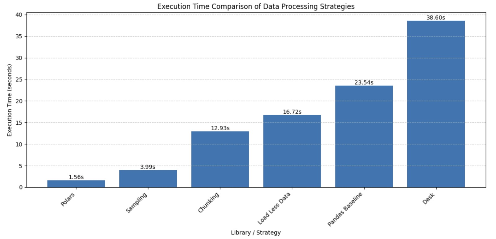
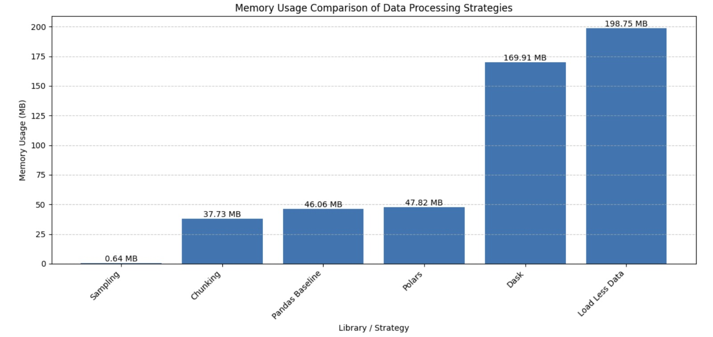

#  Big Data Handling with Carrier On-Time Performance Dataset

<table border="solid" align="center">
  <tr>
    <th>Name</th>
    <th>Matric Number</th>
  </tr>
  <tr>
    <td width=80%>DHESHIEGHAN A/L SARAVANA MOORTHY</td>
    <td>A23CS0072</td>
  </tr>
  <tr>
    <td width=80%>PRAVINRAJ A/L SIVABATHI</td>
    <td>A23CS0171</td>
  </tr>
</table>

## Abstract

This project investigates the effectiveness of multiple big data handling strategies using the Carrier On-Time Performance Dataset. The dataset, `airline_2m.csv`, contains approximately 2,000,000 flight records, 109 columns, and has a file size of 841.30 MB, making it suitable for evaluating large-scale data processing techniques.Several strategies were implemented using Pandas, including column reduction, chunking, data type optimisation, and sampling. In addition, Dask and Polars were used to examine scalable and high-performance data processing approaches. The performance of each method was evaluated based on execution time and memory usage in order to determine their efficiency and practicality when handling large datasets.

The results show that Polars achieved the fastest execution time due to its optimised execution model, while chunking provided a balanced approach for processing the full dataset with controlled memory usage. Data type optimisation significantly reduced memory consumption by converting columns into more efficient formats, and sampling proved useful for quick exploratory analysis with minimal resource usage. Although Dask supports parallel processing, it showed slower performance in this experiment due to overhead from task scheduling and partition management. Overall, the findings demonstrate that no single method is universally optimal. The choice of strategy depends on the specific objective, whether it is speed, memory efficiency, or scalability. This project highlights the importance of selecting appropriate tools and techniques based on dataset characteristics and system limitations in real-world big data processing.

## 1. Introduction

The growth of large datasets, also known as "big data", presents challenges in storage, processing, and analysis. Efficiently handling big data is important for extracting meaningful insights and building scalable data processing workflows.

This project aims to explore and evaluate various strategies for handling large datasets through practical implementation and performance comparison. We utilized the Carrier On-Time Performance Dataset, a large aviation dataset containing airline flight records, delay information, cancellation status, route details, and carrier information.

The primary libraries employed were Pandas for general data analysis, Dask for parallel and scalable data processing, and Polars for high-performance data manipulation. This report outlines the dataset used, the methodologies applied for handling and processing the data, the results obtained from the experiments, and a reflection on the learning outcomes.

## 2. Dataset Description

The dataset used in this project is the **Carrier On-Time Performance Dataset**, obtained from Kaggle (https://www.kaggle.com/datasets/mexwell/carrier-on-time-performance-dataset). This dataset is widely used in transportation analytics and contains detailed information on airline flight operations, including delays, cancellations, routes, and carrier performance.

The dataset is provided in CSV format as `airline_2m.csv`, with a file size of approximately 841.30 MB. It consists of 2,000,000 records and 109 columns, making it suitable for evaluating big data handling techniques. Due to its size and complexity, the dataset represents a realistic scenario where efficient data processing strategies are required.

The dataset includes a wide range of features covering time-based information, airline identifiers, origin and destination details, and delay-related metrics. Some of the key attributes are summarised below:

| **Content** | **Details** |
|-------------|-------------|
| `Year` | Year of the flight record |
| `Month` | Month of the flight |
| `DayOfWeek` | Day of the week |
| `FlightDate` | Date of the flight |
| `Reporting_Airline` | Airline carrier code |
| `Origin` | Origin airport code |
| `OriginCityName` | Origin city name |
| `Dest` | Destination airport code |
| `DestCityName` | Destination city name |
| `DepDelay` | Departure delay in minutes |
| `ArrDelay` | Arrival delay in minutes |
| `Cancelled` | Indicates whether the flight was cancelled |
| `Distance` | Flight distance |
| `CarrierDelay` | Delay caused by airline |
| `WeatherDelay` | Delay caused by weather |

For the purpose of this analysis, only 8 relevant columns were selected: `Year`, `Month`, `DayOfWeek`, `Reporting_Airline`, `Origin`, `Dest`, `DepDelay`, and `ArrDelay`. This selection was made to reduce computational overhead while still preserving the key information required for delay analysis.

Based on the processed dataset, the total number of flights analysed was 2,000,000, with 859,554 flights identified as delayed, representing approximately 42.98% of the dataset. These characteristics make the dataset suitable for evaluating both performance and analytical accuracy across different big data handling strategies.

The dataset was chosen not only because of its size but also because of its structured and meaningful attributes, which allow for realistic performance testing and practical analysis in a big data context.

## 3. Initial Data Loading and Inspection

Before applying any big data handling strategies, the dataset was first accessed and inspected to understand its structure, size, and key characteristics. This step is essential to ensure that the dataset is suitable for analysis and to identify how it should be processed efficiently.

The dataset was obtained from Kaggle and stored in the working directory. The Kaggle API credentials were first configured, and the dataset was then downloaded and extracted:

```python
!pip install kaggle dask[dataframe] polars pyarrow memory_profiler psutil -q

from google.colab import files
files.upload()

!mkdir -p ~/.kaggle
!cp kaggle.json ~/.kaggle/
!chmod 600 ~/.kaggle/kaggle.json

DATASET_SLUG = "mexwell/carrier-on-time-performance-dataset"
!mkdir -p /content/data
!kaggle datasets download -d {DATASET_SLUG} -p /content/data --unzip
```

After extraction, the main dataset file was identified as:

```python
main_file = "/content/data/airline_2m.csv"
```

The dataset size was approximately **841.30 MB**, which satisfies the assignment requirement of using a dataset larger than 700 MB. This confirms that the dataset is suitable for evaluating big data handling techniques.

To understand the dataset structure, a preview of 10,000 rows was loaded using Pandas. Loading a subset of the data helps avoid unnecessary memory usage while still providing sufficient information for inspection.

```python
import pandas as pd

df_preview = pd.read_csv(
    main_file,
    nrows=10000,
    encoding="latin1",
    low_memory=False
)

print("Preview shape:", df_preview.shape)
print("Total columns:", len(df_preview.columns))
print(df_preview.columns.tolist())
```

The inspection produced the following results:

| Item | Result |
|------|--------|
| Preview Rows | 10,000 |
| Total Columns | 109 |
| Dataset File | `airline_2m.csv` |
| Full Dataset Size | 2,000,000 rows |

From the inspection, it was observed that the dataset contains a wide range of flight-related attributes, including time information, airline carrier details, origin and destination airports, and delay-related metrics. The dataset includes both numerical and categorical data types, which is important for later processing steps such as data type optimisation.

In addition, the delay columns such as `DepDelay` and `ArrDelay` contain both positive and negative values. Positive values represent delayed flights, while negative values indicate early departures or arrivals. These values are valid and should be preserved during analysis.

Overall, this initial inspection step provided a clear understanding of the dataset structure and confirmed that it is suitable for further processing. It also supported the selection of relevant columns for subsequent big data handling strategies, which helps improve efficiency in later stages of the project.

### Helper Functions for Measurement

To ensure consistent and comparable benchmarking across all strategies, a helper function `measure_task()` was implemented. This function records both execution time and memory change for each strategy run.

```python
import os, time, gc, psutil

def get_memory_mb():
    process = psutil.Process(os.getpid())
    return process.memory_info().rss / (1024 ** 2)

def measure_task(task_name, func):
    gc.collect()
    mem_before = get_memory_mb()
    start = time.time()

    result = func()

    end = time.time()
    mem_after = get_memory_mb()

    execution_time = end - start
    memory_used = mem_after - mem_before

    print(f"\n{task_name}")
    print(f"Execution Time: {execution_time:.4f} seconds")
    print(f"Memory Change: {memory_used:.2f} MB")

    return result, execution_time, memory_used
```

## 4. Big Data Handling Strategies and Library Comparisons

This section presents the implementation of different big data handling strategies and compares their performance using execution time and memory usage. All methods produced consistent analytical results, ensuring correctness across different approaches.

---

### 4.1 Load Less Data (Column Reduction)

This strategy reduces memory usage by loading only the required columns instead of all 109 columns.

```python
selected_cols = [
    "Year", "Month", "DayOfWeek",
    "Reporting_Airline", "Origin", "Dest",
    "DepDelay", "ArrDelay"
]

df_selected = pd.read_csv(
    main_file,
    usecols=selected_cols,
    encoding="latin1",
    low_memory=False
)
```

| Metric | Value |
|--------|-------|
| Selected Columns | 8 out of 109 |
| Execution Time | 16.72 seconds |
| Memory Change | +198.75 MB |

Although fewer columns were loaded, the entire 2,000,000 rows were still read from disk, which explains the relatively high memory usage. This strategy is most effective when combined with other techniques such as chunking or data type optimisation.

---

### 4.2 Chunking

Chunking processes the dataset in smaller sequential blocks instead of loading it all at once. Each chunk is processed independently and discarded before the next is loaded, keeping memory usage low throughout the entire run.

```python
chunk_size = 100_000
total_rows = 0
total_dep_delay = 0
total_arr_delay = 0
valid_dep_count = 0
valid_arr_count = 0
delayed_flights = 0

for chunk in pd.read_csv(
    main_file,
    usecols=selected_cols,
    chunksize=chunk_size,
    encoding="latin1",
    low_memory=False
):
    total_rows += len(chunk)
    delayed_flights += (chunk["ArrDelay"] > 0).sum()
    total_dep_delay += chunk["DepDelay"].sum(skipna=True)
    total_arr_delay += chunk["ArrDelay"].sum(skipna=True)
    valid_dep_count += chunk["DepDelay"].count()
    valid_arr_count += chunk["ArrDelay"].count()

avg_dep_delay = total_dep_delay / valid_dep_count
avg_arr_delay = total_arr_delay / valid_arr_count
delayed_percentage = (delayed_flights / total_rows) * 100
```

| Metric | Value |
|--------|-------|
| Total Rows Processed | 2,000,000 |
| Average Departure Delay | 8.59 minutes |
| Average Arrival Delay | 6.21 minutes |
| Delayed Flights Count | 859,554 |
| Delayed Flights Percentage | 42.98% |
| Execution Time | 12.93 seconds |
| Memory Change | +37.73 MB |

Chunking is effective because it processes the full dataset while keeping memory usage low. It is the most suitable approach when working with large files in memory-constrained environments such as Google Colab.

---

### 4.3 Data Type Optimisation

When Pandas loads a CSV file, it assigns wide default types regardless of the actual value ranges. This strategy downcasts integer and float columns to smaller types and converts repeated string columns to `category` dtype, significantly reducing the DataFrame's memory footprint.

```python
before = df_selected.memory_usage(deep=True).sum() / (1024 ** 2)

for col in ["Year", "Month", "DayOfWeek"]:
    df_selected[col] = pd.to_numeric(df_selected[col], downcast="integer")

for col in ["DepDelay", "ArrDelay"]:
    df_selected[col] = pd.to_numeric(df_selected[col], downcast="float")

for col in ["Reporting_Airline", "Origin", "Dest"]:
    df_selected[col] = df_selected[col].astype("category")

after = df_selected.memory_usage(deep=True).sum() / (1024 ** 2)
reduction = ((before - after) / before) * 100

print(f"Memory before: {before:.2f} MB")
print(f"Memory after:  {after:.2f} MB")
print(f"Reduction:     {reduction:.2f}%")
```

| Metric | Value |
|--------|-------|
| Memory Before Optimisation | 371.95 MB |
| Memory After Optimisation | 32.50 MB |
| Memory Reduction | **91.26%** |
| Execution Time | 2.79 seconds |

Data type optimisation provides significant memory reduction in just 2.79 seconds, especially for datasets containing repeated categorical values and columns with small numeric ranges. This is one of the most cost-effective strategies available.

---

### 4.4 Sampling

Sampling selects a smaller representative subset of the dataset for faster exploratory analysis and pipeline testing. A 10% sample was drawn from 300,000 loaded rows, yielding 30,000 rows for analysis.

```python
sample_df = pd.read_csv(
    main_file,
    usecols=selected_cols,
    nrows=300_000,
    encoding="latin1",
    low_memory=False
)

sample_df = sample_df.sample(frac=0.1, random_state=42)

avg_dep_delay = sample_df["DepDelay"].mean()
avg_arr_delay = sample_df["ArrDelay"].mean()
```

| Metric | Value |
|--------|-------|
| Sample Size | 30,000 rows |
| Average Departure Delay (sample) | 8.49 minutes |
| Average Departure Delay (full) | 8.59 minutes |
| Average Arrival Delay (sample) | 6.07 minutes |
| Average Arrival Delay (full) | 6.21 minutes |
| Execution Time | 3.99 seconds |
| Memory Change | +0.64 MB |

Sampling is useful for quick testing and development. The sample results are close to the full dataset values, confirming that the sample is statistically representative. It should complement full processing rather than replace it.

---

### 4.5 Dask (Parallel Processing)

Dask reads the dataset lazily by splitting it into partitions and processing them in parallel. Computations are only triggered when `.compute()` is called.

```python
import dask.dataframe as dd

ddf = dd.read_csv(
    main_file,
    usecols=selected_cols,
    encoding="latin1",
    assume_missing=True,
    blocksize="32MB"
)

total_rows = ddf.shape[0].compute()
avg_dep_delay = ddf["DepDelay"].mean().compute()
avg_arr_delay = ddf["ArrDelay"].mean().compute()
delayed_flights = (ddf["ArrDelay"] > 0).sum().compute()
delayed_percentage = (delayed_flights / total_rows) * 100
```

| Metric | Value |
|--------|-------|
| Total Rows Processed | 2,000,000 |
| Average Departure Delay | 8.59 minutes |
| Average Arrival Delay | 6.21 minutes |
| Delayed Flights Count | 859,554 |
| Delayed Flights Percentage | 42.98% |
| Execution Time | 38.60 seconds |
| Memory Change | +169.91 MB |

Dask produced correct results but was the slowest method at 38.60 seconds. The overhead comes from its task scheduler coordinating multiple separate `.compute()` calls, each triggering a fresh read pass over the partitions. On a single-machine Google Colab environment, this scheduling cost outweighs the benefit of parallel execution. Dask is more suitable for distributed systems or datasets that genuinely exceed available RAM.

---

### 4.6 Library Comparison

The same delay analysis was performed using Pandas, Dask, and Polars to directly compare library performance on identical operations.

#### Pandas

```python
df = pd.read_csv(
    main_file,
    usecols=selected_cols,
    encoding="latin1",
    low_memory=False
)

total_rows = len(df)
avg_dep_delay = df["DepDelay"].mean()
avg_arr_delay = df["ArrDelay"].mean()
delayed_flights = (df["ArrDelay"] > 0).sum()
delayed_percentage = (delayed_flights / total_rows) * 100
```

| Metric | Value |
|--------|-------|
| Execution Time | 23.54 seconds |
| Memory Change | -46.06 MB |

---

#### Polars

```python
import polars as pl

result = (
    pl.scan_csv(main_file, encoding="utf8-lossy", ignore_errors=True)
    .select(selected_cols)
    .select([
        pl.len().alias("Total Rows Processed"),
        pl.col("DepDelay").mean().alias("Average Departure Delay"),
        pl.col("ArrDelay").mean().alias("Average Arrival Delay"),
        (pl.col("ArrDelay") > 0).sum().alias("Delayed Flights Count")
    ])
    .with_columns(
        ((pl.col("Delayed Flights Count") / pl.col("Total Rows Processed")) * 100)
        .alias("Delayed Flights Percentage")
    )
    .collect()
)
```

| Metric | Value |
|--------|-------|
| Execution Time | **1.56 seconds** |
| Memory Change | +47.82 MB |

---

#### Dask

Same implementation as Section 4.5.

| Metric | Value |
|--------|-------|
| Execution Time | 38.60 seconds |
| Memory Change | +169.91 MB |

---

### 4.7 Overall Analysis

All methods produced identical analytical results, confirming that different strategies affect performance but not correctness. Polars achieved the fastest execution time at 1.56 seconds due to its use of lazy evaluation, vectorised operations, and multi-threaded execution implemented in Rust. These features allow Polars to optimise query execution before processing and fully utilise available CPU cores, resulting in significantly faster performance compared to other libraries.

Sampling used the least additional memory at +0.64 MB and is most suitable for fast exploratory analysis and rapid development. Chunking provided the best balance between memory efficiency and full dataset processing, maintaining low memory usage at +37.73 MB while still processing all 2,000,000 rows. This makes chunking highly practical in memory-constrained environments such as Google Colab.

Data type optimisation demonstrated the most significant internal memory reduction, shrinking the DataFrame from 371.95 MB to 32.50 MB, representing a 91.26% reduction. This highlights that default Pandas data types are often inefficient, especially for columns with limited numeric ranges or repeated categorical values, and optimising these types can greatly improve performance.

Dask was the slowest in this experiment due to overhead from task scheduling and partition coordination. While this overhead reduces performance in a single-machine environment, Dask remains a powerful solution for distributed computing scenarios and for processing datasets that exceed available system memory.

From a practical perspective, the choice of strategy and library depends on the use case. Polars is most suitable for high-speed analytical tasks on large datasets that fit into memory, while Pandas remains a reliable option for small to medium-sized datasets due to its simplicity and extensive ecosystem. Dask is more appropriate for large-scale or distributed environments where parallel processing across multiple machines is required.

Memory values may vary due to Python garbage collection and OS-level memory reuse, where freed memory is reclaimed and reused during execution. Therefore, memory measurements should be interpreted alongside execution time rather than as absolute values.

## 5. Results and Analysis

This section presents the performance comparison of different data handling strategies and libraries based on execution time and memory usage. All methods produced consistent analytical results, confirming that the differences observed are related to performance rather than accuracy.

---

### 5.1 Comparison of Data Handling Techniques

The following table summarises the execution time and memory usage of each strategy:

| Technique / Library | Execution Time (s) | Memory Change (MB) |
|--------------------|-------------------|--------------------|
| Load Less Data | 16.72 | 198.75 |
| Chunking | 12.93 | 37.73 |
| Data Type Optimisation | 2.79 | 46.42 |
| Sampling | 3.99 | 0.64 |
| Pandas Baseline | 23.54 | - 46.06 |
| Dask | 38.60 | 169.91 |
| Polars | 1.56 | 47.82 |

### Execution Time Comparison



The chart above illustrates the execution time differences across various data processing strategies. Polars demonstrates the fastest performance, while Dask shows the slowest execution due to overhead from parallel task scheduling.

---

### Memory Usage Comparison



The memory usage chart highlights that sampling consumes the least memory, while the "Load Less Data" strategy still results in high memory usage due to full dataset loading. Dask also shows higher memory consumption due to partition handling and overhead.


Based on the results presented in the table and visualised in the charts above, Polars achieved the fastest execution time at 1.56 seconds, making it the most efficient option when speed is the primary concern. This superior performance is due to its optimised execution model, including lazy evaluation and multi-threaded processing.

Sampling and data type optimisation also performed efficiently, as they reduce the amount of data processed and improve memory usage. In particular, data type optimisation significantly reduces the in-memory footprint of the dataset, while sampling allows faster exploratory analysis with minimal resource consumption.

Chunking provided a good balance between performance and memory usage. As shown in the charts, it processes the full dataset while maintaining relatively low memory consumption, making it suitable for large datasets that cannot fit entirely into memory.

The "Load Less Data" strategy reduced the number of columns processed; however, it still required loading the entire dataset, which explains the relatively high memory usage observed in the chart.

Pandas baseline processing was slower compared to optimised methods because it loads and processes the full dataset in a single-threaded manner. Dask recorded the highest execution time in this experiment. Although it supports parallel processing, the overhead of task scheduling and partition management reduced its efficiency in a single-machine environment such as Google Colab.

---

### 5.2 Comparison of Library Performance

The following table compares the performance of Pandas, Polars, and Dask for the same delay analysis task:

| Library | Execution Time (s) | Memory Change (MB) |
|---------|-------------------|--------------------|
| Pandas | 23.54 |- 46.06 |
| Polars | 1.56 | 47.82 |
| Dask | 38.60 | 169.91 |

Polars demonstrated the fastest performance due to its optimised execution model and efficient internal processing. Pandas provided a reliable and straightforward implementation but required more time to complete the same task. Dask, while slower in this experiment, remains useful for handling datasets that exceed memory limits or require distributed processing.

It is important to note that the recorded memory change for the Pandas baseline appeared as a negative value (-46.06 MB). This does not indicate that the operation consumed negative memory. Instead, it is a result of Python’s garbage collection and memory management behaviour.

During execution, temporary objects created by Pandas may be released or reused by the Python interpreter before the final memory measurement is taken. As a result, the memory usage after execution can appear lower than before execution, leading to a negative memory change value.

Therefore, memory measurements in this experiment should be interpreted as approximate indicators rather than absolute values. For more accurate analysis, peak memory usage would be a more reliable metric. Despite this fluctuation, the execution time remains a consistent and reliable measure for comparing performance across libraries.

From a practical perspective, the choice of library depends on the use case. Polars is most suitable for high-speed analytical tasks on large datasets that can fit into memory. Pandas remains a reliable option for small to medium-sized datasets due to its simplicity and extensive ecosystem. Dask is more appropriate for distributed computing scenarios or datasets that exceed available memory, where parallel processing across multiple machines is required.

---

### 5.3 Delay Analysis Results

The dataset was analysed to examine flight delay patterns, and the results were consistent across all processing methods.

| Metric | Result |
|--------|--------|
| Total Rows Processed | 2,000,000 |
| Average Departure Delay | 8.59 minutes |
| Average Arrival Delay | 6.21 minutes |
| Delayed Flights Count | 859,554 |
| Delayed Flights Percentage | 42.98% |

The results show that 859,554 flights experienced delays, representing approximately 42.98% of the dataset. The average departure delay was higher than the average arrival delay, suggesting that some flights were able to recover part of their delay during the journey.

The consistency of these results across all strategies confirms that the different methods affect performance metrics such as execution time and memory usage, but do not impact the correctness of the analytical outcomes.

## 6. Conclusion and Reflection

### 6.1 Conclusion

This project successfully evaluated multiple big data handling strategies using the Carrier On-Time Performance Dataset. The results demonstrate that different approaches offer distinct advantages depending on the objective of the analysis.

Polars achieved the fastest execution time at 1.56 seconds, making it the most efficient option when speed is the primary concern. Pandas provided a reliable and straightforward baseline but required more time, completing the same task in 23.54 seconds. Dask, while capable of handling large-scale and distributed data processing, showed slower performance in this experiment at 38.60 seconds due to task scheduling overhead.

Among the data handling strategies, chunking proved to be the most practical approach for processing the full dataset while maintaining low memory usage. Data type optimisation resulted in a significant memory reduction of 91.26%, highlighting the importance of selecting appropriate data types when working with large datasets. Sampling was effective for quick exploratory analysis, producing results that closely matched the full dataset with minimal execution time and memory usage.

Overall, the findings confirm that there is no single best method for all scenarios. The choice of strategy depends on the specific requirements, whether it is execution speed, memory efficiency, or scalability.Although Polars provides superior speed, it may have compatibility limitations compared to Pandas, which offers broader support across data science libraries and tools. Therefore, the choice between performance and compatibility must be considered when selecting a data processing library.

---

### 6.2 Limitations

Despite the successful implementation, several limitations were observed. The experiments were conducted in a Google Colab environment, where system resources such as CPU and memory may vary between sessions. This can lead to slight differences in execution time and memory measurements.

In addition, some memory change values appeared as zero or very small due to Python’s garbage collection mechanism. During execution, unused memory may be released back to the system, causing the measured memory after execution to appear lower than before execution. Therefore, memory values should be interpreted carefully alongside execution time.

The analysis was also performed using selected columns instead of all 109 columns. While this improves efficiency, it may not fully represent performance when all features are processed. Furthermore, Dask performance may improve significantly when applied to larger datasets or distributed environments.

---

### 6.3 Individual Reflection

#### PRAVINRAJ A/L SIVABATHI

Through this assignment, I developed a deeper understanding of how large datasets can be processed efficiently using different techniques. Initially, I assumed that faster execution always meant better performance, but this project showed that memory usage and scalability are equally important considerations. I learned that data type optimisation can significantly reduce memory usage, as demonstrated by the reduction from 371.95 MB to 32.50 MB. I also gained experience comparing different libraries such as Pandas, Dask, and Polars. Polars stood out due to its speed, but I realised that it may not always be the best option depending on system constraints and dataset size. Overall, this project improved my practical skills in handling real-world datasets and strengthened my ability to choose appropriate tools based on specific requirements.

---

#### DHESHIEGHAN A/L SARAVANA MOORTHY

This project provided valuable hands-on experience in applying big data handling strategies and evaluating their performance. I learned that different techniques such as chunking and sampling can significantly improve efficiency when working with large datasets. Chunking, in particular, helped me understand how large files can be processed without exceeding memory limits.Working with Dask and Polars allowed me to explore different approaches to data processing. Although Dask was slower in this experiment, I understood its importance in distributed systems and larger-scale data processing. I also learned that interpreting results carefully is important, especially when dealing with memory measurements affected by garbage collection.Overall, this assignment enhanced my understanding of big data processing and improved my ability to analyse performance trade-offs between speed, memory usage, and scalability.

---

## 7. References

- Kaggle Dataset: Carrier On-Time Performance Dataset  
  https://www.kaggle.com/datasets/mexwell/carrier-on-time-performance-dataset

- Pandas Documentation  
  https://pandas.pydata.org/pandas-docs/stable/

- Dask Documentation  
  https://docs.dask.org/en/latest/

- Polars Documentation  
  https://docs.pola.rs/

---

## Appendix: Code and Visualizations

All Python implementations, execution outputs, and visualisations such as execution time and memory comparison charts are available in the accompanying Jupyter Notebook:

[big_data.ipynb](big_data.ipynb)
