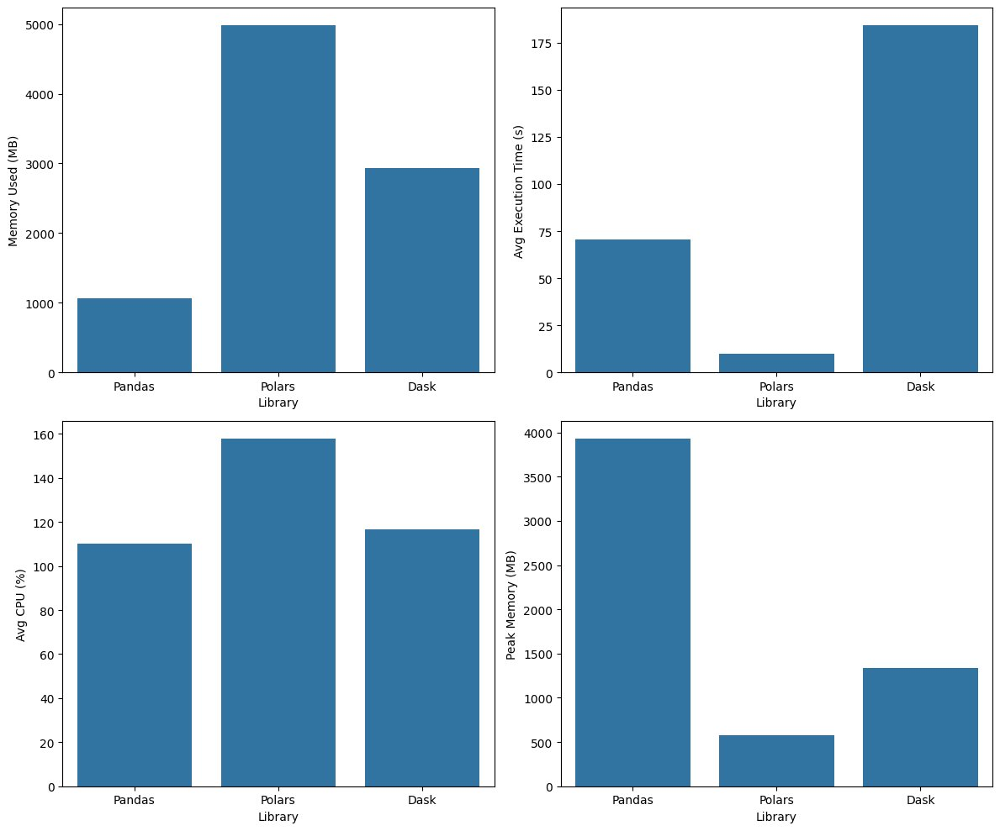

# 📘 Assignment 2: Mastering Big Data Handling

<table border="solid" align="center">
  <tr>
    <th>Name</th>
    <th>Matric Number</th>
  </tr>
  <tr>
    <td>Muhammad Afiq Danial bin Rozaidie</td>
    <td>A23CS0117</td>
  </tr>
  <tr>
    <td>Ahmad Adib Zikri bin A.Mazlam</td>
    <td>A23CS0205</td>
  </tr>
</table>

## 1. Dataset Description 📊

- **Name**: Amazon Books Reviews
- **Source**: [Kaggle - mohamedbakhet](https://www.kaggle.com/datasets/mohamedbakhet/amazon-books-reviews)
- **Domain**: Entertainment / Literature / User Reviews
- **File Size**: 2.86 GB
- **Structure**: 3,000,000 rows X 10 columns

| Column/Attribute | Description |
|---|---|
| Id | A unique identifier for the book (3 million total) |
| Title | The full name or title of the book being reviewed |
| Price | List price of the book at time of data collection (may contain null values) |
| User_id | A unique identifier of the user who rated the book |
| profileName | The display name of the reviewer |
| review/helpfulness | A ratio (formatted as "X/Y") indicating how many people found the review helpful |
| review/score | Numerical rating given by the reviewer, ranging from 1.0 to 5.0 |
| review/time | The timestamp of when the review was given |
| review/summary | A short summary provided by the user for their review |
| review/text | The full body text of the user's review |

---

## 2. Library Choices 📚

Three libraries evaluated for big data processing performance:

1. **Pandas**
2. **Polars**
3. **Dask**

**Reasons for choosing Polars:**
- Built in Rust, making it extremely fast and memory efficient compared to Pandas
- Uses lazy evaluation — plans the full query first, optimizes it, then executes in one pass
- Processes data using all CPU cores by default without any extra configuration

**Reasons for choosing Dask:**
- Processes data in partitions (chunks) so it never loads the full dataset into RAM — ideal when data is larger than memory
- When the dataset doesn't "fit in memory", Dask can extend computation to disk
- Allows easy scaling to clusters or a single machine based on dataset size

---

## 3. Data Loading and Inspection

### Step 1 — Import Libraries

The `import` statement brings code from one module into another, allowing reuse of functions, classes, and variables without rewriting them.

```python
import pandas as pd
import numpy as np
import os
import dask.dataframe as dd
from IPython.display import display
import psutil
import time
import csv
import polars as pl
import pyarrow.compute as pc
import threading
import seaborn as sns
import matplotlib.pyplot as plt
import timeit
import tracemalloc
import gc
```

### Step 2 — Import Kaggle Credentials

Uploaded `kaggle.json` via the Colab file upload feature.

```python
from google.colab import files
files.upload()
```

### Step 3 — Configure Kaggle API

Moved the uploaded file to the `.kaggle` directory and set proper permissions.

```python
!mkdir -p ~/.kaggle
!cp kaggle.json ~/.kaggle/
!chmod 600 ~/.kaggle/kaggle.json
```

### Step 4 — Download Dataset from Kaggle

```python
!kaggle datasets download -d mohamedbakhet/amazon-books-reviews
```

**Output:**
```
Dataset URL: https://www.kaggle.com/datasets/mohamedbakhet/amazon-books-reviews
License(s): CC0-1.0
Downloading amazon-books-reviews.zip to /content
100% 1.06G/1.06G [00:07<00:00, 150MB/s]
```

### Step 5 — Unzip the Dataset

```python
!unzip amazon-books-reviews.zip
```

**Output:**
```
Archive:  amazon-books-reviews.zip
  inflating: Books_rating.csv        
  inflating: books_data.csv          
```

### Step 6 — Verify Files

`!ls` lists the files and directories in the current working directory.

```python
!ls
```

**Output:**
```
amazon-books-reviews.zip  Books_rating.csv  sample_data
books_data.csv            kaggle.json
```

### Step 7 — Load Dataset with Pandas

The dataset was loaded using Pandas. `copy()` was used to prevent changes to the original. `head()` displays the first 5 rows.

```python
df_copy = pd.read_csv("Books_rating.csv", low_memory=False)
df = df_copy.copy()
df.head()
```

### Step 8 — Dataset Info

`df.info()` gives a concise summary of the DataFrame's structure and metadata.

```python
df.info()
```

**Output:**
```
<class 'pandas.core.frame.DataFrame'>
RangeIndex: 3000000 entries, 0 to 2999999
Data columns (total 10 columns):
 #   Column              Dtype  
---  ------              -----  
 0   Id                  object 
 1   Title               object 
 2   Price               float64
 3   User_id             object 
 4   profileName         object 
 5   review/helpfulness  object 
 6   review/score        float64
 7   review/time         int64  
 8   review/summary      object 
 9   review/text         object 
dtypes: float64(2), int64(1), object(7)
memory usage: 228.9+ MB
```

### Step 9 — Count Non-Null Values

`df.count()` counts the number of non-null values in each column.

```python
df.count()
```

**Output:**

| Column | Count |
|---|---|
| Id | 3,000,000 |
| Title | 2,999,792 |
| Price | 481,171 |
| User_id | 2,438,213 |
| profileName | 2,438,095 |
| review/helpfulness | 3,000,000 |
| review/score | 3,000,000 |
| review/time | 3,000,000 |
| review/summary | 2,999,593 |
| review/text | 2,999,992 |

---

## 4. Big Data Handling Strategies

### 4.1 Load Less Data

This strategy demonstrates memory optimization by first loading the entire dataset, then reloading only a subset of relevant columns using the `usecols` parameter. By excluding unnecessary data, memory consumption is significantly reduced while retaining the fields needed for analysis.

**Chosen columns:** `"Title"`, `"Price"`, `"User_id"`, `"review/score"`, `"review/summary"`

```python
selected_columns = ["Title", "Price", "User_id", "review/score", "review/summary"]

# Before
df_full = pd.read_csv("Books_rating.csv")
mem_before = df_full.memory_usage(deep=True).sum()

# After - load only required columns
df_after = pd.read_csv("Books_rating.csv", usecols=selected_columns)
mem_after = df_after.memory_usage(deep=True).sum()

print(f"Before: {mem_before / (1024 ** 2):.2f} MB")
print(f"After:  {mem_after / (1024 ** 2):.2f} MB")
print(f"Saved:  {(mem_before - mem_after) / (1024 ** 2):.2f} MB")
```

**Output:**
```
Before: 3679.50 MB
After:  677.08 MB
Saved:  3002.41 MB
```

**Discussion:**

The results clearly show the impact of selective data loading on memory efficiency. Initially, loading the full dataset consumes 3679.50 MB, which can strain system resources on machines with limited RAM. After applying `usecols`, memory usage drops significantly to 677.08 MB — a saving of 3002.41 MB.

This reduction highlights how unnecessary columns contribute heavily to memory overhead, particularly in large datasets with text fields or unused attributes. By limiting the dataset to only relevant features, processing becomes more efficient, faster, and less prone to memory-related issues. This is especially important in big data scenarios where optimizing resource usage directly affects scalability.

---

### 4.2 Chunking

This strategy reads the large dataset in smaller batches (`chunksize=30000`) instead of loading it all into memory at once. Each chunk is processed sequentially while tracking the number of chunks and total rows processed.

```python
start_time = time.time()

chunk_num = 0
total_rows = 0

for chunk in pd.read_csv("Books_rating.csv", chunksize=30000):
    chunk_num += 1
    total_rows += len(chunk)
    print(f"Chunk {chunk_num}: {len(chunk)} rows | Running total: {total_rows}")

end_time = time.time()
print(f"\nTotal chunks : {chunk_num}")
print(f"Total rows   : {total_rows}")
print(f"Execution Time taken   : {end_time - start_time:.2f} seconds")
```

**Output (summarized):**
```
Chunk 1: 30000 rows | Running total: 30000
Chunk 2: 30000 rows | Running total: 60000
...
Chunk 100: 30000 rows | Running total: 3000000

Total chunks : 100
Total rows   : 3000000
Execution Time taken   : 41.64 seconds
```

**Discussion:**

The results demonstrate how chunking enables efficient processing of large datasets without overwhelming system memory. The 3,000,000-row dataset was successfully processed in 100 chunks of 30,000 rows each, showing that data can be handled incrementally rather than all at once. This ensures scalability, as each chunk is small enough to fit comfortably in memory.

The total execution time of 41.64 seconds represents a reasonable trade-off between memory efficiency and performance. While chunking introduces slight overhead due to repeated read operations, it allows large-scale data processing on machines with limited resources — highly effective for big data scenarios where full dataset loading is impractical.

---

### 4.3 Optimized Data Types

This strategy applies datatype optimization to reduce memory usage by converting columns to more efficient types. Numeric columns are downcast from larger types (e.g., `int64`, `float64`) into smaller ones, while string columns with low uniqueness are converted to `category` type.

```python
df_mem = pd.read_csv("Books_rating.csv")
df_mem.info()  # Before conversion

# Memory before
mem_before = df_mem.memory_usage(deep=True).sum()

# Downcast numeric columns
for col in df_mem.select_dtypes(include=["int64"]).columns:
    df_mem[col] = pd.to_numeric(df_mem[col], downcast="integer")

for col in df_mem.select_dtypes(include=["float64"]).columns:
    df_mem[col] = pd.to_numeric(df_mem[col], downcast="float")

# Convert low-cardinality string columns to category
for col in df_mem.select_dtypes(include=["object"]).columns:
    if df_mem[col].nunique() / len(df_mem) < 0.5:
        df_mem[col] = df_mem[col].astype("category")

# Memory after
mem_after = df_mem.memory_usage(deep=True).sum()

print(f"Before : {mem_before / (1024 ** 2):.2f} MB")
print(f"After  : {mem_after / (1024 ** 2):.2f} MB")
print(f"Saved  : {(mem_before - mem_after) / (1024 ** 2):.2f} MB  ({(mem_before - mem_after) / mem_before * 100:.1f}% reduction)")
```

**Output:**
```
Before : 3679.50 MB
After  : 3026.93 MB
Saved  : 652.56 MB  (17.7% reduction)
```

**After conversion info:**
```
dtypes: category(5), float32(2), int32(1), object(2)
```

**Discussion:**

Datatype optimization leads to a moderate but meaningful reduction in memory usage. By converting numeric columns to smaller types (`float32`, `int32`) and transforming several string columns into `category`, the dataset size decreased from 3679.50 MB to 3026.93 MB — saving 652.56 MB (17.7%) without removing any data.

Five columns were converted to `category`, effective for columns like `Id`, `User_id`, and `profileName` where values repeat frequently. The two remaining `object` columns (`review/summary` and `review/text`) still consume significant memory due to unstructured text, explaining why the overall reduction is limited compared to column filtering. This approach complements other techniques such as column selection and chunking.

---

### 4.4 Sampling

This strategy applies random sampling by selecting 10% of the dataset using `frac=0.1`. `random_state=42` ensures reproducibility. Basic exploratory analysis (`describe()`) is then performed on the sampled data.

```python
print(f"Original rows : {len(df)}")
print(df.describe())

# Stratified sampling - 10% sample
sample_df = df.sample(frac=0.1, random_state=42)

print(f"Sampled rows  : {len(sample_df)}")
print(sample_df.describe())
```

**Output:**
```
Original rows : 3000000
               Price  review/score   review/time
count  481171.000000  3.000000e+06  3.000000e+06
mean       21.762656  4.215289e+00  1.132307e+09
std        26.206541  1.203054e+00  1.493202e+08
min         1.000000  1.000000e+00 -1.000000e+00
25%        10.780000  4.000000e+00  9.999072e+08
50%        14.930000  5.000000e+00  1.128298e+09
75%        23.950000  5.000000e+00  1.269130e+09
max       995.000000  5.000000e+00  1.362355e+09

Sampled rows  : 300000
              Price   review/score   review/time
count  47902.000000  300000.000000  3.000000e+05
mean      21.800030       4.216783  1.132360e+09
...
max      716.630000       5.000000  1.362355e+09

Rows: 300000, Columns: 10
```

**Discussion:**

The 10% sample (300,000 rows) closely preserves the statistical properties of the original 3,000,000-row dataset. Key metrics such as mean, median, and quartiles for `Price`, `review/score`, and `review/time` remain nearly identical. For example, the mean review score changes only slightly (4.215 → 4.217), indicating the sample is representative.

Some differences exist in extreme values — the maximum price in the sample (716.63) is lower than the original (995.00), showing that rare outliers may not always be captured. Sampling significantly reduces computational cost, memory usage, and processing time, making it ideal for quick exploratory analysis and prototyping. However, it may miss rare events or subtle patterns critical for anomaly detection or high-stakes decisions.

---

### 4.5 Parallel Processing with Dask and Polars

This code compares two parallel processing approaches. Dask uses lazy loading and performs a full statistical summary across partitions in parallel. Polars loads data in columnar format and computes mean values efficiently.

**Dask:**

```python
start = time.time()

ddf = dd.read_csv("Books_rating.csv", dtype={'Id': 'object'})
result = ddf.describe().compute()
mem_usage = ddf.memory_usage(deep=True).sum().compute()
end = time.time()

print(result)
print(f"\nMemory : {mem_usage / (1024 ** 2):.2f} MB")
print(f"Time   : {end - start:.2f} seconds")
```

**Output:**
```
               Price  review/score   review/time
count  481171.000000  3.000000e+06  3.000000e+06
mean       21.762656  4.215289e+00  1.132307e+09
...
max       995.000000  5.000000e+00  1.362355e+09

Memory : 2877.83 MB
Time   : 100.76 seconds
```

**Polars:**

```python
start = time.time()

df = pl.read_csv("Books_rating.csv")
results = {
    "Price_mean"       : df["Price"].mean(),
    "review/score_mean": df["review/score"].mean(),
    "review/time_mean" : df["review/time"].mean()
}
mem_usage = df.estimated_size()
end = time.time()

print(f"Means  : {results}")
print(f"\nMemory : {mem_usage / (1024 ** 2):.2f} MB")
print(f"Time   : {end - start:.2f} seconds")
```

**Output:**
```
Means  : {'Price_mean': 21.76..., 'review/score_mean': 4.21..., 'review/time_mean': 1132306772.63...}

Memory : 2716.75 MB
Time   : 20.14 seconds
```

**Discussion:**

| Library | Memory (MB) | Time (s) |
|---|---|---|
| Dask | 2877.83 | 100.76 |
| Polars | 2716.75 | 20.14 |

Polars outperforms Dask in both execution time and memory efficiency. Polars completes the operation in 20.14 seconds — roughly 5× faster than Dask's 100.76 seconds. Dask's lazy, distributed-style execution introduces overhead from task scheduling and partition management, beneficial for cluster computing but slower for single-machine workloads. Polars' Rust-based columnar engine executes operations more directly and efficiently.

---

## 5. Comparison Analysis

This function evaluates any given function under consistent conditions, tracking execution time (over multiple runs), memory usage before and after execution, peak memory via `tracemalloc`, and average CPU utilization via a background monitoring thread.

```python
def measure_performance(func, description="", runs=3, *args, **kwargs):

    process   = psutil.Process(os.getpid())
    total_ram = psutil.virtual_memory().total / (1024 ** 2)

    cpu_samples = []
    done        = [False]

    def track_cpu():
        while not done[0]:
            cpu_samples.append(process.cpu_percent(interval=0.1))

    cpu_thread = threading.Thread(target=track_cpu)
    cpu_thread.start()

    mem_before_mb = process.memory_info().rss / (1024 ** 2)
    tracemalloc.start()

    run_times = []
    result    = None
    success   = True
    error_msg = ""

    for i in range(runs):
        t_start = time.time()
        try:
            result  = func(*args, **kwargs)
            success = True
        except Exception as e:
            result    = None
            success   = False
            error_msg = str(e)
            break
        t_end = time.time()
        run_times.append(round(t_end - t_start, 4))

    _, peak_traced = tracemalloc.get_traced_memory()
    tracemalloc.stop()

    mem_after_mb   = process.memory_info().rss / (1024 ** 2)
    done[0]        = True
    cpu_thread.join()

    peak_memory_mb = peak_traced  / (1024 ** 2)
    mem_diff_mb    = mem_after_mb - mem_before_mb
    avg_time       = round(sum(run_times) / len(run_times), 4) if run_times else 0.0
    avg_cpu        = round(sum(cpu_samples) / len(cpu_samples), 2) if cpu_samples else 0.0

    performance = {
        "Description":                    description,
        "Memory Used (MB)":               round(mem_diff_mb,    2),
        "Peak Memory - tracemalloc (MB)": round(peak_memory_mb, 4),
        "Avg Execution Time (s)":         avg_time,
        "Average CPU (%)":                avg_cpu,
        "Success?":                       success,
    }

    if not success:
        performance["Error"] = error_msg

    return performance, result
```

### Library 1: Sample Load using Pandas

```python
def load_full_data():
    df = pd.read_csv("Books_rating.csv")
    df_sampled = df.sample(frac=0.1, random_state=42)
    return df_sampled

performance, df = measure_performance(load_full_data, description="Load with Pandas (10% sample)")
performance_df = pd.DataFrame([performance])
display(performance_df)
```

**Result:** Memory Used = 1059.78 MB | Peak Memory = 3928.5455 MB | Avg Execution Time = 70.6697 s | Avg CPU = 110.28%

### Library 2: Sample Load with Polars

```python
def load_with_polars(filepath):
    df = pl.read_csv(filepath)
    df_sampled = df.sample(fraction=0.1, seed=42)
    return df_sampled.to_pandas()

performance_polars, df_polars = measure_performance(
    load_with_polars,
    description="Load with Polars (10% sample)",
    filepath="Books_rating.csv"
)
performance_df = pd.DataFrame([performance_polars])
display(performance_df)
```

**Result:** Memory Used = 4987.64 MB | Peak Memory = 573.3536 MB | Avg Execution Time = 10.01 s | Avg CPU = 157.79%

### Library 3: Sample Load with Dask

```python
def load_full_data_dask_and_compute(file_path):
    ddf = dd.read_csv(
        file_path,
        assume_missing=True,
        quoting=3,
        on_bad_lines='skip',
        dtype=str
    )
    df = ddf.compute()
    df_sampled = df.sample(frac=0.1, random_state=42)
    return df_sampled

performance_dask_compute, df_dask_computed = measure_performance(
    load_full_data_dask_and_compute,
    description="Load with Dask (10% sample)",
    file_path="Books_rating.csv"
)
performance_df_compute = pd.DataFrame([performance_dask_compute])
display(performance_df_compute)
```

**Result:** Memory Used = 2937.39 MB | Peak Memory = 1339.2336 MB | Avg Execution Time = 184.4054 s | Avg CPU = 116.80%

---

### Comparison Chart

We use seaborn and matplotlib to compare performance across the three libraries using a 10% sample of the actual dataset (full load on Polars was not feasible, so all libraries were compared fairly on the same sample).

```python
library_data = pd.DataFrame({
    'Library': ['Pandas', 'Polars', 'Dask'],
    'Memory Used (MB)': [1059.78, 4987.64, 2937.39],
    'Peak Memory (MB)': [3928.5455, 573.3536, 1339.2336],
    'Avg Execution Time (s)': [70.6697, 10.01, 184.4054],
    'Avg CPU (%)': [110.28, 157.79, 116.8]
})

fig, axes = plt.subplots(2, 2, figsize=(12, 10))
sns.barplot(x="Library", y="Memory Used (MB)", data=library_data, ax=axes[0, 0])
sns.barplot(x="Library", y="Peak Memory (MB)", data=library_data, ax=axes[1, 1])
sns.barplot(x="Library", y="Avg Execution Time (s)", data=library_data, ax=axes[0, 1])
sns.barplot(x="Library", y="Avg CPU (%)", data=library_data, ax=axes[1, 0])

plt.tight_layout()
plt.show()
```



---

### Comparison Table

| Library | Memory Used (MB) | Peak Memory (MB) | Avg Execution Time (s) | Avg CPU (%) |
|---|---|---|---|---|
| Pandas | 1059.78 | 3928.5455 | 70.6697 | 110.28 |
| Polars | 4987.64 | 573.3536 | 10.01 | 157.79 |
| Dask | 2937.39 | 1339.2336 | 184.4054 | 116.80 |

---

### Results Analysis: Pandas vs Polars vs Dask

The results show clear differences in how Pandas, Polars, and Dask handle large-scale data processing, particularly in terms of speed, memory efficiency, and computational overhead.

---

#### 1. Overall Performance Comparison

- **Polars** is the fastest, with an average execution time of **10.01 seconds**, significantly outperforming both Pandas (70.67s) and Dask (184.41s).
- **Pandas** uses the least memory on average **(1059.78 MB)** but has high peak memory usage **(3928.55 MB)**, indicating memory spikes during processing.
- **Dask** performs the worst in execution time despite its distributed computing design, and also shows moderate memory usage.

---

#### 2. Why Polars is Faster

Polars' superior performance is explained by its core architectural design:

**a. Rust-Based Engine (Zero-Cost Abstraction)**

Polars is built in **Rust**, providing memory safety without garbage collection overhead. This allows it to execute operations closer to hardware-level efficiency compared to Pandas, which is built on Python and relies heavily on NumPy.

**b. Columnar Memory Layout**

Polars uses a **columnar data format (Apache Arrow-based)**, meaning operations are performed on entire columns rather than row-by-row. This improves cache locality and reduces unnecessary memory access, especially for analytical queries like aggregation and filtering.

**c. Query Optimization and Lazy Execution**

Even in eager mode, Polars applies internal optimizations such as vectorized execution, SIMD (Single Instruction Multiple Data) optimizations, and reduced intermediate object creation — reducing overhead compared to Pandas, which often creates temporary copies of data.

---

#### 3. Why Pandas Uses Less Average Memory but is Slower

Pandas shows relatively low average memory usage but higher peak memory and slower execution due to:

- Row-based internal operations in some workflows
- Frequent intermediate object creation, which increases overhead
- Python-level execution bottlenecks (less parallelism)
- Inefficient handling of large string/object columns

While Pandas is flexible and widely used, its architecture is **not optimized** for large-scale parallel computation.

---

#### 4. Why Dask is Slower Despite Parallelism

Dask is designed for distributed or parallel execution, but underperforms here because:

- **Task scheduling overhead:** Dask must manage task graphs even for simple operations
- **Lazy computation overhead:** Execution is delayed until `.compute()` is called, introducing coordination cost
- **Not fully beneficial on single-machine workloads:** Without a cluster, Dask's advantages are limited
- Data conversion to Pandas after computation adds extra overhead

This explains why Dask has the highest execution time **(184s)** despite its scalability design.

---

#### 5. Trade-offs Summary

| Library | Strengths | Weaknesses |
|---|---|---|
| **Polars** | Extremely fast, efficient memory usage, modern architecture | Smaller ecosystem, fewer legacy integrations |
| **Pandas** | Easy to use, highly compatible, mature ecosystem | Slower, high peak memory usage |
| **Dask** | Scalable for distributed systems, handles big data beyond memory | High overhead, slower on single-machine workloads |

---

#### 6. Final Critical Insight

> The best-performing library depends on both **dataset size** and **execution environment**.

- **Polars** is ideal for single-machine high-performance analytics.
- **Pandas** remains useful for small-to-medium datasets and prototyping.
- **Dask** is most effective in distributed or cluster-based environments, not local execution.

Thus, **Polars provides the best balance of speed and efficiency** in this experiment due to its modern columnar architecture and Rust-based execution engine, while Pandas and Dask trade performance for flexibility and scalability respectively.

## 6. Conclusion and Reflection

### 6.1 Conclusion

The comparative analysis shows clear differences in performance across libraries and data processing strategies. Polars consistently delivered the best overall performance, particularly in execution speed and efficient handling of large datasets, due to its columnar memory model and Rust-based execution engine. Pandas, while highly flexible and widely used, showed slower execution and higher peak memory usage, reflecting its limitations when handling large-scale data in-memory. Dask, although designed for distributed processing, performed less efficiently in this experiment because of the additional overhead from task scheduling and lazy computation, which is less beneficial in a single-machine environment.

In addition to library comparison, the memory and processing strategies also had a significant impact on performance. Column selection and datatype optimization were highly effective in reducing memory usage, while chunking enabled the processing of datasets that would otherwise exceed system memory limits. Sampling provided fast exploratory insights but introduced slight trade-offs in data completeness. Overall, the findings suggest that an optimal data processing pipeline should combine efficient libraries like Polars with preprocessing strategies depending on the task requirements.

### 6.2 Reflection

Through this assignment, we gained a deeper understanding of how different tools and strategies behave when working with large datasets. The most surprising result was Dask's underperformance. We expected it to outpace Pandas given its parallel execution model, but at 184 seconds it was nearly three times slower. This came down to the overhead of building and scheduling task graphs even for simple operations, that coordination cost on a single machine easily erased any performance gains. We also did not expect Polars' peak memory usage (573 MB) to differ so drastically from Pandas' spike of 3,928 MB, which is a meaningful gap in real pipelines where memory is shared across processes.

If we repeated this assignment or are have to handle a large datasets, we would run each library in an isolated environment to prevent memory from earlier runs affecting later measurements.

Our almost 3 GB dataset has clear limits when scaled up. Pandas would struggle well before 10 GB since it loads everything into RAM, while Polars scales further but remains bounded by available physical memory. Dask, despite performing worst here, is ironically the most scalable of the three — its lazy, partition-based model supports datasets larger than memory and can extend to a cluster with minimal code changes. Beyond 100 GB, none of our approaches would be sufficient without tools like Apache Spark or cloud solutions such as Google BigQuery.

This assignment made us realise that choosing a library is really choosing an architecture — what works at above 700 MB may completely fall apart at 1 TB

## References

- **Dataset-Kaggle: Amazon Books Reviews(Books_rating.csv)** -  https://www.google.com/url?q=https%3A%2F%2Fwww.kaggle.com%2Fdatasets%2Fmohamedbakhet%2Famazon-books-reviews
- **Dask:** https://www.geeksforgeeks.org/python/introduction-to-dask-in-python/
- **Pandas:** https://www.w3schools.com/python/pandas/default.asp
- **Polars:** https://www.geeksforgeeks.org/python/an-introduction-to-polars-pythons-tool-for-large-scale-data-analysis/
