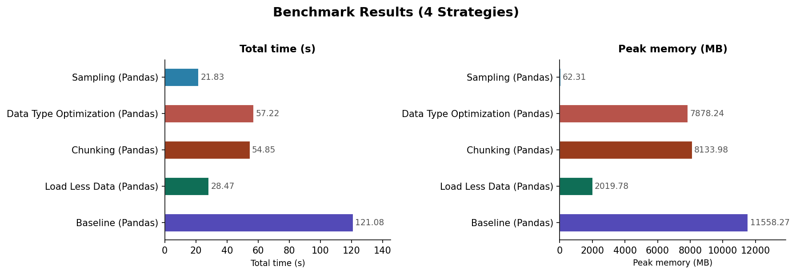
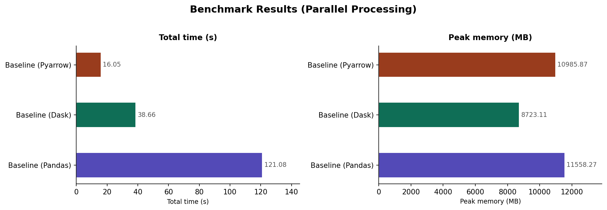
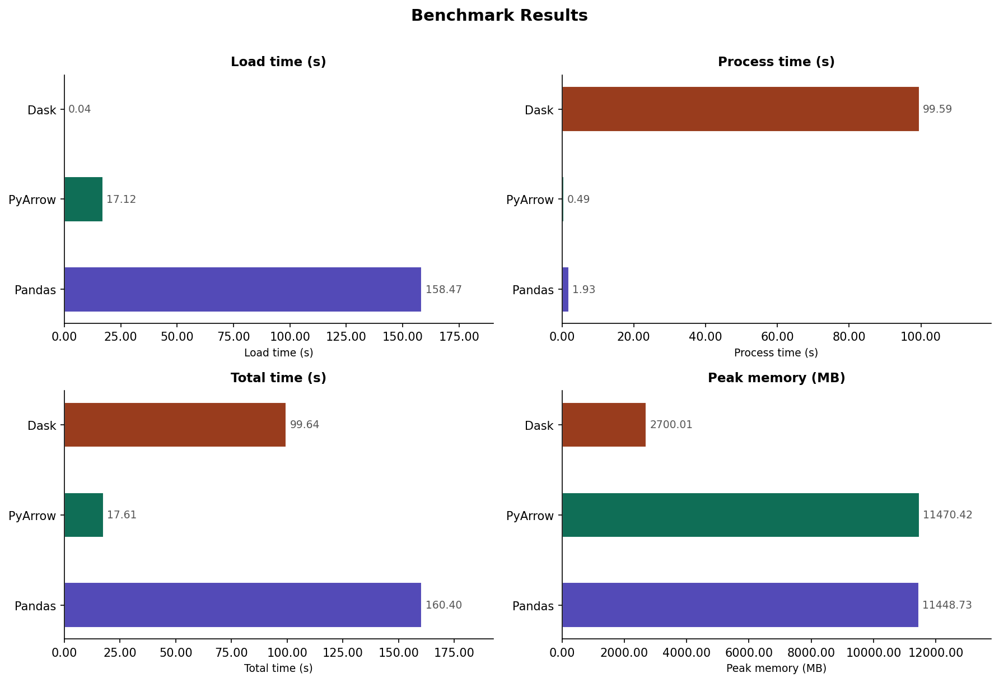

# Assignment 2: Mastering Big Data Handling

## Group Information
**Group Name:** scubaa     
**Members:**
1. Mohamed Alif Fathi bin Abdul Latif 
2. Iman Abadi bin Mohd Nizwan
---

## 1. Dataset Selection

### Dataset Overview

* **Name**: Anime Dataset 2023
* **Source**: [Kaggle: Anime Dataset 2023](https://www.kaggle.com/datasets/dbdmobile/myanimelist-dataset)
* **Domain**: *Anime user reviews, ratings, and metadata*
* **Files Used**: `final_animedataset.csv`

### Description
Scraped from MyAnimeList (MAL), this dataset includes extensive data on thousands of anime titles, user preferences, and reviews. It includes anonymised user interaction data, such as watch status and individual scores, along with a broad range of metadata, such as genres, studios, ratings, and airing dates.

### Data Column Description

| Column | Type | Unit | Description |
| :--- | :--- | :--- | :--- |
| `username` | string | - | The unique display name of the MyAnimeList user |
| `anime_id` | int | - | Unique ID assigned to each anime title |
| `my_score` | int | 0–10 | The personal rating given by the user (0 means no score) |
| `user_id` | int | - | Anonymized unique identification number for the user |
| `gender` | string | - | The gender associated with the user profile |
| `title` | string | - | The official name of the anime title |
| `type` | string | - | Media format (e.g., TV, Movie, OVA, Special) |
| `source` | string | - | The original source material (e.g., Manga, Light Novel) |
| `score` | float | 1–10 | The overall global average rating for the anime |
| `scored_by` | int | - | The total count of users who rated the anime globally |
| `rank` | float | - | The weighted score rank of the anime |
| `popularity` | int | - | Ranking based on the number of users who added it to their list |
| `genres` | string | - | Categorical tags describing the anime's themes and style |

---

## 2. Library Choices
 
| Library | Role | Justification |
|:---|:---|:---|
| **Pandas** | Library 1 — Baseline | Compulsory baseline. Most widely used Python data manipulation library; serves as the reference point for all performance comparisons. |
| **Dask** | Library 2 — Scalable | Mirrors the Pandas API but operates in parallel on partitioned data. Ideal for large CSV files that exceed RAM, making it well-suited for our 4.24 GB dataset. |
| **PyArrow** | Library 3 — Scalable | Based on the Apache Arrow columnar in-memory format with a highly optimised C++ backend. Delivers significantly faster CSV reads and lower I/O overhead compared to Pandas. |
 
---

## 3. Data Loading and Inspection
 
### 3.1 Dataset Size
 
```python
import os
 
FILE = "anime_dataset/final_animedataset.csv"
 
size_bytes = os.path.getsize(FILE)
size_mb    = size_bytes / (1024 * 1024)
size_gb    = size_bytes / (1024 * 1024 * 1024)
 
print(f"{FILE}")
print(f"Size: {size_bytes} bytes")
print(f"Size: {size_mb:.2f} MB")
print(f"Size: {size_gb:.2f} GB")
```
 
**Output:**
```
anime_dataset/final_animedataset.csv
Size: 4549801910 bytes
Size: 4339.03 MB
Size: 4.24 GB
```
 
### 3.2 Loading with Chunking for Safe Inspection
 
To avoid a memory crash when inspecting a 4.24 GB file, we load only 5 sample rows for preview while iterating through the full file in chunks of 10,000 rows to count totals and null values without holding everything in RAM at once.
 
```python
import pandas as pd
import gc
 
nrows     = 5
chunksize = 10000
 
df_sample   = pd.read_csv(FILE, nrows=nrows)
total_rows  = 0
null_counts = pd.Series(0, index=df_sample.columns)
 
for chunk in pd.read_csv(FILE, chunksize=chunksize):
    total_rows  += len(chunk)
    null_counts += chunk.isnull().sum()
```
 
### 3.3 File Summary
 
| Property | Value |
|:---|:---|
| File | `anime_dataset/final_animedataset.csv` |
| Total Rows | 35,305,695 |
| Total Columns | 13 |
 
### 3.4 Schema and Null Counts
 
| Column | Dtype | Nulls | Null % |
|:---|:---|---:|---:|
| username | str | 256 | 0.0% |
| anime_id | int64 | 0 | 0.0% |
| my_score | int64 | 0 | 0.0% |
| user_id | int64 | 0 | 0.0% |
| gender | str | 0 | 0.0% |
| title | str | 0 | 0.0% |
| type | str | 0 | 0.0% |
| source | str | 0 | 0.0% |
| score | float64 | 0 | 0.0% |
| scored_by | int64 | 0 | 0.0% |
| rank | float64 | 751,970 | 2.1% |
| popularity | int64 | 0 | 0.0% |
| genre | str | 2,267 | 0.0% |
 
**Key Observations:**
- The dataset is largely clean with minimal null values.
- `rank` has the highest null rate at 2.1% (751,970 rows), likely because some anime are unranked.
- `genre` has a negligible 2,267 nulls (~0.006%), suggesting most titles have genre tags.
### 3.5 Sample Rows (First 5)
 
| username | anime_id | my_score | user_id | gender | title | type | source | score | scored_by | rank | popularity | genre |
|:---|---:|---:|---:|:---|:---|:---|:---|---:|---:|---:|---:|:---|
| karthiga | 21 | 9 | 2255153 | Female | One Piece | TV | Manga | 8.54 | 423868 | 91.0 | 35 | Action, Adventure, Comedy, Super Power, Drama, … |
| karthiga | 59 | 7 | 2255153 | Female | Chobits | TV | Manga | 7.53 | 175388 | 1546.0 | 188 | Sci-Fi, Comedy, Drama, Romance, Ecchi, Seinen |
| karthiga | 74 | 7 | 2255153 | Female | Gakuen Alice | TV | Manga | 7.77 | 33244 | 941.0 | 1291 | Comedy, School, Shoujo, Super Power |
| karthiga | 120 | 7 | 2255153 | Female | Fruits Basket | TV | Manga | 7.77 | 167968 | 939.0 | 222 | Slice of Life, Comedy, Drama, Romance, Fantasy, … |
| karthiga | 178 | 7 | 2255153 | Female | Ultra Maniac | TV | Manga | 7.26 | 9663 | 2594.0 | 2490 | Magic, Comedy, Romance, School, Shoujo |
 
```python
# Release memory after inspection
del df_sample, total_rows, null_counts
gc.collect()
```
 
---
 
## 4. Big Data Handling Strategies
 
### Performance Benchmarking Methodology
 
All strategies are evaluated using a custom `evaluate_performance()` function that:
- Records **before** and **after** Resident Set Size (RSS) memory using `psutil`.
- Tracks **peak memory** via a background monitoring thread polling every 50 ms.
- Measures **wall-clock execution time** using `time.time()`.
- Averages results over **3 runs** to reduce noise from OS caching and scheduling.
```python
import psutil, threading, time, gc
 
def evaluate_performance(strategy_fn, strategy_name="UnknownStrategy", *args, **kwargs):
    process      = psutil.Process(os.getpid())
    baseline_mem = process.memory_info().rss
    peak_memory  = baseline_mem
    monitoring   = True
 
    def monitor_memory():
        nonlocal peak_memory
        while monitoring:
            mem = process.memory_info().rss
            peak_memory = max(peak_memory, mem)
            time.sleep(0.05)
 
    thread = threading.Thread(target=monitor_memory, daemon=True)
    thread.start()
 
    t0     = time.time()
    result = strategy_fn(*args, **kwargs)
    if hasattr(result, "compute"):
        result = result.compute()
    t1 = time.time()
 
    monitoring = False
    thread.join()
 
    after_mem       = process.memory_info().rss
    peak_memory_mb  = max(0, (peak_memory - baseline_mem) / (1024 ** 2))
    before_mb       = baseline_mem / (1024 ** 2)
    after_mb        = after_mem    / (1024 ** 2)
 
    del result
    gc.collect()
    time.sleep(2)
 
    return {
        "name"                 : strategy_name,
        "total_time_s"         : round(t1 - t0, 4),
        "before_memory_mb"     : round(before_mb, 2),
        "after_memory_mb"      : round(after_mb, 2),
        "peak_memory_usage_mb" : round(peak_memory_mb, 2),
    }
```
 
Results are averaged using `evaluate_performance_avg()` which calls `evaluate_performance()` `n=3` times and computes the mean for each metric.
 
---
 
### 4.1 Strategy 1: Load Less Data
 
**What it is:** Instead of reading all 13 columns, only the columns required for analysis are loaded using the `usecols` parameter. In this case, only `anime_id`, `title`, and `score` are selected.
 
**Why it is useful:** Loading irrelevant columns wastes memory proportional to the number of unneeded columns. With a 4.24 GB file and 13 columns, loading only 3 columns immediately reduces the data volume to roughly 23% of the original, significantly lowering both peak memory and load time.
 
**When to use it:** At the very start of any pipeline where the analysis target is known in advance. It is the simplest and most impactful first optimisation.
 
```python
def strategy_select_cols():
    return pd.read_csv(FILE, usecols=["anime_id", "title", "score"])
 
metrics = evaluate_performance_avg(strategy_select_cols, "Load Less Data (Pandas)", n=3)
```
 
**Results (Average of 3 runs):**
 
| Metric | Value |
|:---|---:|
| Total Time (s) | 28.47 |
| Before Memory (MB) | 257.1 |
| After Memory (MB) | 1,918.5 |
| Peak Memory (MB) | 2,019.8 |
 
**Discussion:** Compared to the Pandas baseline (121.08 s, 11,558.3 MB peak), selecting only 3 columns reduces load time by **~76%** and peak memory by **~82%**. This is the most dramatic single improvement among all four Pandas strategies tested. The disk still needs to be fully scanned since CSV is not a columnar format, but parsing and storing only 3 columns eliminates the majority of the memory allocation overhead.
 
---
 
### 4.2 Strategy 2: Chunking
 
**What it is:** The file is read in successive segments (`chunksize=500,000` rows) and each chunk is processed before the next is loaded. The chunks are concatenated at the end to produce the final DataFrame.
 
**Why it is useful:** Chunking ensures that at any given moment, only a fraction of the full 35M-row dataset resides in RAM. This makes it possible to process files that exceed available memory on systems with limited resources such as Google Colab's free tier.
 
**When to use it:** When an aggregate or transformation operation must be applied to the full dataset but loading it all at once risks an out-of-memory (OOM) crash.
 
```python
def strategy_chunked():
    chunks = pd.read_csv(FILE, chunksize=500_000)
    return pd.concat(chunks, ignore_index=True)
 
metrics = evaluate_performance_avg(strategy_chunked, "Chunking (Pandas)", n=3)
```
 
**Results (Average of 3 runs):**
 
| Metric | Value |
|:---|---:|
| Total Time (s) | 54.85 |
| Before Memory (MB) | 217.1 |
| After Memory (MB) | 6,515.5 |
| Peak Memory (MB) | 8,134.0 |
 
**Discussion:** Chunking is faster than the Pandas baseline (~55 s vs ~121 s) because it avoids the single-pass overhead of loading the entire file into one large object. However, concatenating all chunks at the end still results in the full DataFrame being held in RAM (~6.5 GB after), so the memory savings are moderate compared to processing chunks without concatenation. The peak memory (8,134 MB) is lower than baseline (11,558 MB) because memory is allocated incrementally rather than all at once.
 
---
 
### 4.3 Strategy 3: Data Type Optimisation
 
**What it is:** Pandas assigns conservative default types on CSV read (e.g., `int64`, `float64`). By specifying a `dtype` map that uses narrower types (`int32`, `float32`, `Int16`), we reduce the per-value memory footprint before any data enters RAM.
 
**Why it is useful:** Halving the bit-width of a numeric column (e.g., `float64` → `float32`) halves its memory requirement. Applied across millions of rows, this can reduce the total footprint by 30–60% depending on column composition.
 
**When to use it:** After the initial schema inspection, once the value ranges of numeric columns are understood. It should be applied at load time rather than as a post-load conversion to minimise the transient peak.
 
```python
def strategy_optimized_dtypes():
    dtype_map = {
        "anime_id" : "int32",
        "score"    : "float32",
        "episodes" : "Int16",
    }
    return pd.read_csv(FILE, dtype=dtype_map)
 
metrics = evaluate_performance_avg(strategy_optimized_dtypes, "Data Type Optimization (Pandas)", n=3)
```
 
**Results (Average of 3 runs):**
 
| Metric | Value |
|:---|---:|
| Total Time (s) | 57.22 |
| Before Memory (MB) | 271.7 |
| After Memory (MB) | 6,114.6 |
| Peak Memory (MB) | 7,878.2 |
 
**Discussion:** Type optimisation reduces peak memory to 7,878 MB from the baseline's 11,558 MB — a **32% reduction**. Load time also improves to ~57 s from 121 s. The gains are real but more modest than column selection because only 3 of 13 columns were narrowed. A more aggressive dtype mapping across all numeric columns would yield greater savings, though string columns (`username`, `title`, `genre`) dominate the memory footprint and cannot be compressed this way.
 
---
 
### 4.4 Strategy 4: Sampling
 
**What it is:** A random 1% sample of the dataset is loaded by using a row-skip function with `skiprows`. The skip logic retains the header and randomly keeps approximately 1 in every 100 rows.
 
**Why it is useful:** Sampling allows a developer to build, test, and validate the entire processing pipeline in seconds on a representative subset before committing to the full multi-minute run. It is standard practice in production data science workflows.
 
**When to use it:** During exploratory data analysis (EDA) and pipeline development. It should not replace full-dataset processing in a final analysis but is invaluable for fast iteration.
 
```python
import random
 
def strategy_sampling():
    skip_logic = lambda i: i > 0 and random.random() > 0.01
    return pd.read_csv(FILE, skiprows=skip_logic)
 
metrics = evaluate_performance_avg(strategy_sampling, "Sampling (Pandas)", n=3)
```
 
**Results (Average of 3 runs):**
 
| Metric | Value |
|:---|---:|
| Total Time (s) | 21.83 |
| Before Memory (MB) | 334.9 |
| After Memory (MB) | 383.4 |
| Peak Memory (MB) | 62.3 |
 
**Discussion:** Sampling produces by far the lowest memory footprint of all Pandas strategies — peak usage of only 62.3 MB compared to 11,558 MB for the full baseline. Load time drops to ~22 s. The trade-off is that the resulting DataFrame contains approximately 353,000 rows (1% of 35M), which may not be sufficient for analyses that require rare events or precise aggregate statistics. The disk is still fully scanned because `skiprows` operates row-by-row; true partial reads would require a columnar format such as Parquet.

**Visualization benchmark between 4 strategies**


 
---
 
### 4.5 Strategy 5: Parallel Processing with Scalable Libraries
 
**What it is:** The same full-load operation is executed with Pandas (baseline), Dask, and PyArrow. Dask partitions the file and processes chunks in parallel across CPU cores. PyArrow reads the file using a highly optimised C++ multithreaded CSV parser and stores data in its columnar Arrow format.
 
**Why it is important:** Standard Pandas operations are single-threaded, leaving most CPU cores idle. Scalable libraries exploit all available cores for I/O and computation, dramatically reducing wall-clock time on large files.
 
#### Pandas Baseline
 
```python
def strategy_baseline_pandas():
    return pd.read_csv(FILE, low_memory=False)
 
metrics = evaluate_performance_avg(strategy_baseline_pandas, "Baseline (Pandas)", n=3)
```
 
#### Dask
 
```python
import dask.dataframe as dd
 
def strategy_baseline_dask():
    return dd.read_csv(FILE)  # lazy — triggers .compute() inside benchmarker
 
metrics = evaluate_performance_avg(strategy_baseline_dask, "Baseline (Dask)", n=3)
```
 
#### PyArrow
 
```python
import pyarrow.csv as pa_csv
 
def strategy_baseline_pyarrow():
    return pa_csv.read_csv(FILE)
 
metrics = evaluate_performance_avg(strategy_baseline_pyarrow, "Baseline (PyArrow)", n=3)
```
 
**Results — Parallel Processing Comparison (Average of 3 runs):**
 
| Library | Total Time (s) | Before Memory (MB) | After Memory (MB) | Peak Memory (MB) |
|:---|---:|---:|---:|---:|
| Baseline (Pandas) | 121.08 | 152.5 | 5,888.3 | 11,558.3 |
| Baseline (Dask) | 38.66 | 228.6 | 6,860.1 | 8,723.1 |
| Baseline (PyArrow) | 16.05 | 204.8 | 166.0 | 10,985.9 |
 
**Discussion:**
 
- **Dask** is 3.1× faster than Pandas for a full load and compute, leveraging parallel partitioned processing. However, its peak memory (8,723 MB) remains high because `.compute()` materialises the full DataFrame.
- **PyArrow** is 7.5× faster than Pandas (16 s vs 121 s) due to its multithreaded C++ parser and columnar memory layout. Its after-memory (166 MB) is remarkably low — it releases the Arrow Table from RAM after the benchmark clears it. Peak memory (10,986 MB) is high during active reading.
- **Pandas** is the slowest and most memory-intensive for a full load, confirming that single-threaded eager loading is the least scalable approach.

**Visualization benchmark between Pandas, Dask and PyArrow Full Load**



---

## 5. Comparative Analysis

### 5.1 Comparison between Pandas, Dask and Polars

Baseline operation: Full Load with Aggregation Operation
Runs averaged: 3

**Benchmark function:**
```python
def evaluate_performance_library(
    load_fn,
    process_fn,
    strategy_name: str = "UnknownStrategy",
    *args,
    **kwargs
) -> dict:
    process = psutil.Process(os.getpid())

    baseline_memory = process.memory_info().rss
    peak_memory     = baseline_memory
    monitoring      = True

    def monitor_memory():
        nonlocal peak_memory
        while monitoring:
            mem = process.memory_info().rss
            peak_memory = max(peak_memory, mem)
            time.sleep(0.05)

    monitor_thread = threading.Thread(target=monitor_memory, daemon=True)
    monitor_thread.start()

    # --- Load ---
    t0     = time.time()
    data   = load_fn(*args, **kwargs)
    t1     = time.time()

    # --- Process ---
    t2     = time.time()
    result = process_fn(data)
    if hasattr(result, "compute"):
        result = result.compute()
    t3     = time.time()

    monitoring = False
    monitor_thread.join()

    after_memory        = process.memory_info().rss
    peak_memory_mb      = max(0, (peak_memory - baseline_memory) / (1024 ** 2))
    before_mb           = baseline_memory / (1024 ** 2)
    after_mb            = after_memory    / (1024 ** 2)
    load_time_s         = round(t1 - t0, 4)
    process_time_s      = round(t3 - t2, 4)
    total_time_s        = round(t3 - t0, 4)

    del data, result
    gc.collect()
    time.sleep(2)

    metrics = {
        "name"                 : strategy_name,
        "load_time_s"          : load_time_s,
        "process_time_s"       : process_time_s,
        "total_time_s"         : total_time_s,
        "before_memory_mb"     : round(before_mb, 2),
        "after_memory_mb"      : round(after_mb, 2),
        "peak_memory_usage_mb" : round(peak_memory_mb, 2),
    }

    print(f"\nStrategy : {strategy_name}")
    display(pd.DataFrame([{
        "Metric" : "Load Time (s)",
        "Value"  : f"{load_time_s:.2f}",
    }, {
        "Metric" : "Process Time (s)",
        "Value"  : f"{process_time_s:.2f}",
    }, {
        "Metric" : "Total Time (s)",
        "Value"  : f"{total_time_s:.2f}",
    }, {
        "Metric" : "Before Memory (MB)",
        "Value"  : f"{before_mb:,.1f}",
    }, {
        "Metric" : "After Memory (MB)",
        "Value"  : f"{after_mb:,.1f}",
    }, {
        "Metric" : "Peak Memory (MB)",
        "Value"  : f"{peak_memory_mb:,.1f}",
    }]).set_index("Metric"))
    print(f"{'='*40}")

    return metrics
``` 
This benchmarking function compares the execution time and memory usage for each library. It uses a background thread to poll the system's Resident Set Size (RSS) (`process.memory_info().rss`), capturing peak memory usage during busy operations in addition to basic before-and-after memory usage snapshots. It divides performance into load time and process time to differentiate between I/O bottlenecks and algorithmic latency by accepting a load operation function and a compute/process operation function. where the execution time are measured idepedantly.

**Average performnce benchmark function:**
```python
def evaluate_performance_library_avg(
    load_fn,
    process_fn,
    strategy_name: str = "UnknownStrategy",
    n: int = 3,
    *args,
    **kwargs
) -> dict:
    runs = []
    for i in range(n):
        print(f"  Run {i+1}/{n}...")
        metrics = evaluate_performance_library(load_fn, process_fn, strategy_name, *args, **kwargs)
        runs.append(metrics)
        time.sleep(2)

    avg_metrics = {
        "name"                 : strategy_name,
        "load_time_s"          : round(sum(r["load_time_s"]          for r in runs) / n, 4),
        "process_time_s"       : round(sum(r["process_time_s"]       for r in runs) / n, 4),
        "total_time_s"         : round(sum(r["total_time_s"]         for r in runs) / n, 4),
        "before_memory_mb"     : round(sum(r["before_memory_mb"]     for r in runs) / n, 2),
        "after_memory_mb"      : round(sum(r["after_memory_mb"]      for r in runs) / n, 2),
        "peak_memory_usage_mb" : round(sum(r["peak_memory_usage_mb"] for r in runs) / n, 2),
    }

    print(f"\nAVG RESULT ({n} runs) : {strategy_name}")
    display(pd.DataFrame([{
        "Metric" : "Avg Load Time (s)",
        "Value"  : f"{avg_metrics['load_time_s']:.2f}",
    }, {
        "Metric" : "Avg Process Time (s)",
        "Value"  : f"{avg_metrics['process_time_s']:.2f}",
    }, {
        "Metric" : "Avg Total Time (s)",
        "Value"  : f"{avg_metrics['total_time_s']:.2f}",
    }, {
        "Metric" : "Avg Before Memory (MB)",
        "Value"  : f"{avg_metrics['before_memory_mb']:,.1f}",
    }, {
        "Metric" : "Avg After Memory (MB)",
        "Value"  : f"{avg_metrics['after_memory_mb']:,.1f}",
    }, {
        "Metric" : "Avg Peak Memory (MB)",
        "Value"  : f"{avg_metrics['peak_memory_usage_mb']:,.1f}",
    }]).set_index("Metric"))

    return avg_metrics
```
This function runs the benchmarking function a number of times based on the `n` value and averages the metrics from each execution for each metric used. The default value of `n = 3`. 

**Full Load with Pandas**
```python
# Pandas
def load_pandas():
    return pd.read_csv(FILE, low_memory=False)

def process_pandas(df):
    return df.groupby("genre")["score"].mean()

metrics = evaluate_performance_library_avg(load_pandas, process_pandas, "Pandas", n=3)
results_library.append(metrics)
```
The baseline Pandas operation reads the CSV file and performs an aggregation task, which is the simplest approach for a direct comparison for the otther 2 libraries.  

**Full Load with PyArrow**
```python
# PyArrow
def load_pyarrow():
    return pa_csv.read_csv(FILE)

def process_pyarrow(table):
    import pyarrow.compute as pc
    # groupby aggregation
    return table.group_by("genre").aggregate([("score", "mean")])

metrics = evaluate_performance_library_avg(load_pyarrow, process_pyarrow, "PyArrow", n=3)
results_library.append(metrics)
```
PyArrow uses a columnar alternative to the benchmark, where `load_pyarrow` converts the CSV to an Arrow Table, which usually results in faster I/O and a smaller memory footprint. The `process_pyarrow` step evaluates the efficiency of the `pyarrow.compute` engine, which employs zero-copy principles and efficient memory mapping.

**Full Load with Dask**
```python
# Dask
def load_dask():
    return dd.read_csv(FILE)

def process_dask(df):
    return df.groupby("genre")["score"].mean()
    
metrics = evaluate_performance_library_avg(load_dask, process_dask, "Dask", n=3)
results_library.append(metrics)
```    
Dask uses a lazy loading strategy, where `load_dask` only maps the file structure into metadata rather than loading data into RAM as a full DataFrame. This results in almost instant load times and a minimal initial memory footprint in the benchmark logs. The `process_dask` executes `.compute()` method within the benchmarking function and triggers the parallel execution engine.

---

### 5.2 Summary Result For Each Library
<table border="1" class="dataframe">
  <thead>
    <tr style="text-align: right;">
      <th>Name</th>
      <th>Load Time (s)</th>
      <th>Process Time (s)</th>
      <th>Total Time (s)</th>
      <th>Before Memory (MB)</th>
      <th>After Memory (MB)</th>
      <th>Peak Memory Usage (MB)</th>
    </tr>
  </thead>
  <tbody>
    <tr>
      <td>Pandas</td>
      <td>135.1022</td>
      <td>1.9331</td>
      <td>137.0353</td>
      <td>203.83</td>
      <td>6131.13</td>
      <td>12029.94</td>
    </tr>
    <tr>
      <td>PyArrow</td>
      <td>15.0006</td>
      <td>0.4363</td>
      <td>15.4369</td>
      <td>204.17</td>
      <td>2195.15</td>
      <td>11891.13</td>
    </tr>
    <tr>
      <td>Dask</td>
      <td>0.0574</td>
      <td>98.3365</td>
      <td>98.3939</td>
      <td>275.92</td>
      <td>303.12</td>
      <td>2658.21</td>
    </tr>
  </tbody>
</table>
</div>

---

```python
metrics = [
    ("load_time_s",          "Load time (s)"),
    ("process_time_s",       "Process time (s)"),
    ("total_time_s",         "Total time (s)"),
    ("peak_memory_usage_mb", "Peak memory (MB)"),
]

names  = [r["name"] for r in results_library]
colors = ["#534AB7", "#0F6E56", "#993C1D"]  # one per strategy, extend if needed
colors = (colors * len(names))[:len(names)]

fig, axes = plt.subplots(2, 2, figsize=(12, 8))
fig.suptitle("Benchmark Results", fontsize=14, fontweight="bold", y=1.01)
axes = axes.flatten()

for ax, (key, label) in zip(axes, metrics):
    values = [r.get(key, 0) for r in results_library]
    bars   = ax.barh(names, values, color=colors, edgecolor="white", height=0.5)

    # value labels at end of each bar
    for bar, val in zip(bars, values):
        ax.text(
            bar.get_width() + max(values) * 0.01,
            bar.get_y() + bar.get_height() / 2,
            f"{val:.2f}",
            va="center", ha="left", fontsize=9, color="#555"
        )

    ax.set_title(label, fontsize=11, fontweight="bold", pad=8)
    ax.set_xlabel(label, fontsize=9)
    ax.spines[["top", "right"]].set_visible(False)
    ax.xaxis.set_major_formatter(mtick.FormatStrFormatter("%.2f"))
    ax.tick_params(axis="y", labelsize=10)
    ax.set_xlim(0, max(values) * 1.2)  # headroom for labels

plt.tight_layout()
plt.savefig("benchmark_results.png", dpi=150, bbox_inches="tight")
plt.show()
```



### Discussion 
The benchmark results show a significant difference between execution strategies, with PyArrow being the fastest. It outperforms Pandas, finishing the complete procedure in just 15.4 seconds. It is due to its highly optimised C++ backend and columnar memory format, which enable it to consume and aggregate data with little overhead. Its ability to process the aggregation in less than half a second makes it the better option for high-performance applications where RAM is enough, even though its max memory utilisation is still large at around 12 GB.

Dask on the other hand, shows strengths by having a low-memory capability that is perfect for systems with limited resources. It is shown by its Peak Memory Usage of 2,658 MB, which is lower than both Pandas and PyArrow because it does not load all data at once. However, this efficiency causes significantly higher execution time because Dask's processing time increases to over 98 seconds due to the need to handle complicated task scheduling and stream data in chunks. The near-zero load time measured demonstrates its lazy loading strategy, which delays the actual data workload until the computing phase begins.


Pandas performed the worst compared to the other libraries due to its eager loading and single-threaded operation. It takes almost 135 seconds to load the CSV with its peak memory utilisation at 12,029 MB. While its processing logic is quite fast once the data is in memory, the size of its initial I/O phase makes it the least scalable alternative. The findings show that each library has its own strengths and weaknesses where PyArrow excels for high throughput, Dask for handling large amounts of data even with limited memory and Pandas for smaller, simpler workloads.

## 6. Conclusion and Reflection
 
### 6.1 Summary of Key Observations
 
This assignment benchmarked five big data handling strategies and three Python libraries against a 4.24 GB, 35-million-row anime dataset from MyAnimeList. The central findings are:
 
1. **Column selection** is the most impactful single Pandas optimisation. It reduce peak memory by 82% and load time by 76% by simply restricting to the three required columns.
2. **Sampling** is the best strategy for rapid prototyping, delivering results in under 22 seconds with only 62 MB of peak memory, though it sacrifices data completeness.
3. **PyArrow** is the fastest library for full-dataset workflows, completing a load-plus-aggregation benchmark in 15.4 seconds which is nearly 9× faster than Pandas because of its C++ multithreaded parser and columnar format.
4. **Dask** is the most memory-efficient library for full-dataset processing, with a peak of only 2,658 MB, making it the best choice when RAM is the primary constraint.
5. **Pandas** remains essentia for development and smaller workloads due to its rich API ecosystem, but it is not a production-grade tool for datasets of this scale.
### 6.2 Reflection on Learning
 
Several outcomes from this assignment were unexpected. The most surprising was Dask's processing time of 98 seconds despite its parallel architecture, it nearly as slow as Pandas' 121 seconds for the same operation. This shows an important point because Dask's parallelism comes with scheduling overhead, and for datasets that can fit in memory, PyArrow's in-process parallelism is more efficient than Dask's distributed-task model. Dask excels only when the data cannot fit in RAM at all.
 
Another insight was the behaviour of the sampling strategy. Despite reading the entire 4.24 GB file row-by-row (since CSV is a row-oriented format), sampling was still fast because parsing is cheaper than storing — the skip lambda discards rows before they enter the DataFrame, keeping memory minimal.
 
The chunking benchmark also highlighted a subtle trap: concatenating chunks at the end (`pd.concat()`) negates the memory advantage of chunking because it re-assembles the full DataFrame. Chunking is most beneficial when results can be aggregated per-chunk and discarded, rather than concatenated.
 
### 6.3 Scalability Discussion
 
The strategies tested here were sufficient for a 4.24 GB file on a 12 GB Colab instance. However, scalability at larger scales changes the picture significantly:
 
| Scale | Recommended Approach |
|:---|:---|
| < 1 GB | Pandas with dtype optimisation and column selection |
| 1–16 GB | PyArrow for speed; Dask if RAM is limited |
| 16 GB – 1 TB | Dask with distributed cluster; or Polars for single-machine performance |
| > 1 TB | Apache Spark on a cloud cluster (AWS EMR, Databricks, GCP Dataproc) |
 
At 10 GB, Dask becomes the clear choice because the dataset cannot fit in a standard 12 GB Colab session even with PyArrow. At 100 GB or beyond, neither Dask in single-machine mode nor PyArrow can sustain throughput — distributed systems such as Apache Spark or cloud-native solutions like BigQuery or AWS Athena become necessary. The transition to distributed computing also introduces new challenges in data partitioning, network I/O, and fault tolerance that go beyond the scope of local Python libraries.
 
This assignment reinforced a core principle of high-performance data processing: **no single tool is optimal in every situation**. Choosing the right strategy requires understanding the constraints of the environment (RAM, CPU cores, storage), the nature of the operation (I/O-bound vs. compute-bound), and the acceptable trade-offs between speed, memory, and implementation complexity.
 
---
 
## References
 
- MyAnimeList Dataset (2023). *Kaggle*. Retrieved from https://www.kaggle.com/datasets/dbdmobile/myanimelist-dataset
- Apache Arrow Project. *PyArrow Documentation*. Retrieved from https://arrow.apache.org/docs/python/
- Dask Development Team. *Dask Documentation*. Retrieved from https://docs.dask.org/en/stable/
- psutil Documentation. Retrieved from https://psutil.readthedocs.io/en/latest/

---
