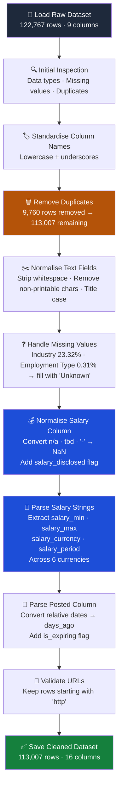

<h1 align="center"> 
  Web Scraping Jobstreet using Beautiful Soup
  <br>
</h1>

<table border="solid" align="center">
  <tr>
    <th>Name</th>
    <th>Matric Number</th>
  </tr>
  <tr>
    <td width=80%>Najma Shakirah binti Shahrulzaman</td>
    <td>A23CS0140</td>
  </tr>
  <tr>
    <td width=80%>Nurul Asyikin Binti Khairul Anuar</td>
    <td>A23CS0162</td>
  </tr>
  <tr>
    <td width=80%>Harini A/P Sangaran</td>
    <td>A23CS0081</td>
  </tr>
</table>
<br>
<div align='center'>
</div>
<br>

# 🧑‍💼 JobStreet Web Scraper
A Python-based web scraper that extracts job listings from [JobStreet](https://my.jobstreet.com) and saves the data into a structured CSV file. Built for simplicity, performance, and reliability.

---
## 📂 Project Files

| File Name                     | Description                                | Link |
|------------------------------|--------------------------------------------|------|
| **Raw Dataset**              | Cleaned and raw data with URLs             | [](https://drive.google.com/file/d/1IsDhWyV1s5ZEcNX4ONSvjBH_eqpXPRZY/view?usp=sharing) |
| **Clean Dataset**            | Preprocessed data ready for use            | [](https://drive.google.com/file/d/1FmOO3mK-c3hRDBe1oIGbE_tUcESGrYoX/view?usp=sharing)|
| **Web Crawler Script**       | Python script to scrape jobstreet       | [](https://colab.research.google.com/drive/1PzGcCcfSxBqYafEWA6kZEVeAabeE_byP?usp=sharing) |
| **Data Cleaning Code**       | Script to clean and preprocess the data    | [](https://colab.research.google.com/drive/1tIe-Q0jlvSyZicJ7WO13ljf6XXxrgdzF?usp=sharing) |
| **Optimization Code**        | Performance-optimized transformation code  | [](https://colab.research.google.com/drive/10s659IqvQ9ZlJiorg3izsnTkEVfCnfjS?usp=sharing) |
| **Optimization Record Part 1** | Benchmark results part 1                 | [](p2/performance_after_part1.csv) |
| **Optimization Record Part 2** | Benchmark results part 2                 | [](p2/performance_after_part2.csv) |
| **Optimization Record Part 3** | Benchmark results part 3                 | [](p2/performance_after_part3.csv) |
| **Evaluation Chart**         | Visual comparison of optimization results  | [](p2/evaluation_charts.ipynb) |
| **Project Report**           | Final detailed documentation               | [](report/Final_Report.pdf) |
| **Presentation Slides**      | Slides for project presentation            | [](report/PresentationSlide.pdf) |


---

## 📚 Libraries Used

### 🕸️ Web Scraping Libraries


| Library | Description |
|--------|-------------|
|  `BeautifulSoup` | Web scraping & HTML parsing |
|  `requests` | Sends HTTP requests to access web pages |


---
## 2.0 System Design & Architecture
This chapter discusses the overall system architecture and workflow developed for the JobStreet web scraping project. It explains the system layers, tools, and frameworks used for web crawling, data processing, optimisation, and data analysis. In addition, the chapter outlines the responsibilities of each team member throughout the project development process.

### 2.1 System Arcitecture


1. Network Layer

The network layer provides secure and reliable communication between the web scraping system and external services. This layer uses cloud services and VPN technology to ensure secure data transmission during scraping operations. Since large-scale web scraping involves handling traffic and frequent HTTP requests, the network layer maintains high throughput and ensures uninterrupted communication with JobStreet.com. This enables the system to collect and process data efficiently in real time. 

2. Presentation Layer

The presentation layer displays the analysed and optimised job market data in a clear and user-friendly format. This layer uses data visualisation techniques such as charts and dashboards to present performance metrics and scraping results which allows users to compare processing time, memory usage, CPU usage and throughput generated from the analysis modules. 

3. Application Layer

a) Web Scraper Module
The web scraper module is responsible for sending HTTP requests to JobStreet.com using the Requests library and extracting relevant job-related information through BeautifulSoup parsing. The module collects data such as countries, job titles, company names, locations, salary, job industry, employment mode and when the jobs were posted in jobstreet. This process enables automated large-scale data collection from the website efficiently.

b) Data Processing Module
The data processing module is responsible for cleaning, validating and transforming the scraped data. Duplicate records, missing or null values are removed, data formats are standardised and data type consistency is ensured so that it is the same across the dataset. The processed data is then stored for optimisation and analytical tasks.

c) Performance Metrics Module
The performance metrics module evaluates the optimisation performance of the scraping workflow. This module calculates the processing time, CPU utilisation, memory consumption and throughput performance. These values are used to compare the efficiency of different optimisation techniques and measure the overall system performance during large-scale data scraping and processing activities.

4. Integration Layer

The integration layer acts as the bridge between system components to ensure interaction across modules. Within this layer, an API Gateway is implemented to manage incoming and outgoing requests between the application modules and the database layer. The API Gateway supports high-volume web scraping activities which improves the overall efficiency of the system architecture.

5. Database Layer

The database layer is responsible for storing and managing both raw and processed data collected from JobStreet.com. The Main Database stores cleaned and transformed datasets for further analysis and visualisation. Google Colab is utilised as a cloud-based environment to host datasets and support large-scale processing activities. The API Endpoint provides controlled access to stored data for external services or future system expansion. This layer ensures organised data management, efficient retrieval and reliable storage of large datasets generated through the web scraping process.


### 2.2 Architecture of Tools and Frameworks Used


<br>
<br>

Figure 2 shows the overall workflow and system architecture of a web scraping and data analysis pipeline for JobStreet.com. The process begins with the Requests and BeautifulSoup libraries, which are used to scrape data from JobStreet.com. The scraped data is stored as Raw Data containing approximately 130,000 rows and is uploaded in GitHub. Then, the data is cleaned and processed using the pandas library to transform the dataset by removing duplicates, handling missing values, and standardising data types. The cleaned data is then processed in Google Colab, which provides a cloud runtime environment for handling large-scale datasets. Next, the data is optimised and analysed, where different libraries such as pandas, Polars, and DuckDB are tested and compared to evaluate optimisation performance. Finally, the processed data is stored in a database which is then used for data analysis. Data analysis is handled by analysing and comparing processing time, CPU usage, memory usage, and throughput. Data visualisation such as charts and graphical outputs are used to present the analysis.

<br>

### 2.3 Roles of Team Members

| Member Name                        | Task                                                                               | 
|------------------------------------|------------------------------------------------------------------------------------|
| Najma Shakirah Binti Shahrulzaman  | Data cleaning, Documentation for Introduction, Data Processing and Conclusion      |
| Nurul Asyikin Binti Khairul Anuar  | Data Optimization using Pandas, Polars, DuckDB, Documentation for Optimization Techniques, Performance Evaluation and Challenges and Limitations  |
| Harini A/P Sangaran                | Web crawling, Documentation for System Design and Architecture and Data Collection |

---

## 3.0 Data Collection
This chapter explains the methodology used to collect job listing data from JobStreet.com through web scraping techniques. It describes the crawling process, pagination handling, retry mechanisms, and rate-limiting strategies implemented during data extraction. The chapter also presents the dataset collected and discusses the ethical considerations followed throughout the scraping process.

### 3.1 Crawling method 
A synchronous web crawler was developed using Python to scrape job listings from Jobstreet Malaysia and Jobstreet Singapore across various countries which are Malaysia, Singapore, Indonesia, Thailand and Philippines. The crawler performs a keyword-based page-by-page extraction process using Python libraries such as requests, BeautifulSoup, time, random, and pandas. The crawler operates sequentially without asynchronous processing or multiprocessing. 

### 3.1.1 Synchronous Architecture 
The crawler uses a synchronous crawling architecture where each request and extraction process is completed before moving to the next page. The synchronous workflow consists of several stages. The crawler begins with a predefined keyword and country combination. A request URL is dynamically generated using the keyword slug and page number. Then, a HTTP GET request is issued to retrieve the HTML content of the page. The crawler waits for the response before continuing to the next step. If the request fails, a retry mechanism retries the request up to three times before skipping the page. Once a successful response is received, the HTML content is parsed using BeautifulSoup. Relevant job attributes such as country, job title, company name, salary, location, posted date, employment type, and URL are extracted. Then, the extracted records are appended into a list and periodically saved into a CSV file. Finally, the crawler proceeds to the next page after completing extraction for the current page. This sequential crawling strategy ensures execution and easier debugging while minimizing excessive request rates that may lead to HTTP 403 rate-limiting errors.

### 3.1.2 Pagination
Pagination was implemented through iterative page navigation. The crawler starts from page 1 and continuously increments the page number until multiple consecutive empty pages are encountered.

```python
keyword_slug = (
    keyword
    .replace(" ", "-")
    .lower()
)

url = (
    f"{domain}/"
    f"{keyword_slug}-jobs"
    f"?page={page}"
)
```

The keywords used to crawl data from jobstreet.com are python, java, software engineer, data analyst, cloud engineer, accounting, finance, marketing, healthcare and so on. This keyword-based pagination allows the web crawler to bypass pagination limitations commonly found in generic search pages and allows collection of a larger number of job listings.

The crawling process stops automatically when three consecutive pages return zero job listings.

```python
if count == 0:

    consecutive_empty += 1

    if (
        consecutive_empty
        >= MAX_EMPTY_PAGES
    ):

        break
```

### 3.1.3 Rate Limiting and Retry Logic
To minimize server overload and reduce the risk of request blocking, the crawler incorporates rate-limiting and retry mechanisms. The crawler uses randomized delays between requests:

```python
time.sleep(
    random.uniform(
        SLEEP_MIN,
        SLEEP_MAX
    )
)
```

The delay range is configured as:

```python
SLEEP_MIN = 2
SLEEP_MAX = 5
```

This creates human-like browsing intervals and helps reduce aggressive traffic patterns. Moreover, a retry mechanism is implemented to handle temporary failures such as connection errors, timeouts, or HTTP 403 responses. If a request fails, the crawler retries up to three times before abandoning the page. Failed attempts are logged for monitoring purposes. To further reduce blocking risks, the crawler pauses for 60 seconds after every 100 pages.

```python
for attempt in range(1, MAX_RETRIES + 1):

    try:

        response = requests.get(
            url,
            headers=get_headers(),
            timeout=30
        )

        if response.status_code == 200:

            return response.text

MAX_RETRIES = 3

if page % 100 == 0:

    time.sleep(60)
```

### 3.1.4 Sequential Data Fetch and Parsing
After receiving the HTML response, the crawler parses the page using BeautifulSoup. Then, the crawler locates all job cards using soup.find_all().

```python
soup = BeautifulSoup(
    html,
    "html.parser"
)

job_cards = soup.find_all("article")
```

For every job card identified, the crawler extracts several structured fields which are Country, Job title, Company name, Location, Salary, Posted date, Employment type and URL.

Example extraction logic :

```python
title_tag = card.find(
    "a",
    attrs={
        "data-automation":
        "jobTitle"
    }
)

title = title_tag.get_text(
    strip=True
)

Salary extraction:

salary_tag = card.find(
    attrs={
        "data-automation":
        "job-card-salary"
    }
)

Company extraction:

company_tag = card.find(
    attrs={
        "data-automation":
        "advertiser-name"
    }
)
```

Each extracted record is appended into a Python list :

```python
jobs.append({

    "Country": country,
    "Keyword": keyword,
    "Title": title,
    "Company": company,
    "Location": location,
    "Salary": salary,
    "Posted": posted,
    "Employment Type": employment,
    "URL": link
})
```

The accumulated data is periodically converted into a pandas DataFrame and exported into CSV format. Duplicate job listings are removed using URL-based deduplication.

```python
df = df.drop_duplicates(
    subset=["URL"]
)
```

### Number of Records Collected
After executing the full crawl across multiple countries and keywords, the crawler successfully collects thousands of job listings from JobStreet platforms across Southeast Asia. The crawler extracted job listings from Malaysia, Singapore, Indonesia, Thailand and Philippines. All extracted listings were saved into CSV format for preprocessing and further analysis.

<br>

| Data                      | Description                                       | 
|---------------------------|---------------------------------------------------|
| Country                   | Country where the job is listed                   |
| Title                     | Job title or role name                            |
| Company                   | Company or employer name                          |
| Location                  | Job location or city                              |
| Salary                    | Salary information if available                   |
| Posted                    | Job posting date                                  |
| Employment_type           | Type of employment such as full-time or contract  | 
| URL                       | Direct link to the job listing                    |

<br>

### 3.3 Ethical Considerations
Ethical compliance was considered throughout the scraping process to ensure responsible data collection.

### 3.3.1 Respecting Server Load
Several measures were implemented to minimize impact on the target servers which are : 
- Randomized request delays were used between requests.
- Long cooldown intervals were introduced after every 100 pages.
- The crawler uses synchronous execution instead of aggressive parallel crawling.
- Retry limits prevent excessive repeated requests.

### 3.3.2 Data Scope and Privacy
Only publicly accessible job listings were collected. The crawler did not require login authentication, did not access hidden APIs, did not scrape personal user information and did not collect sensitive data such as phone numbers, emails, or IP addresses. The extracted information consisted only of publicly displayed job advertisement content.

### 3.3.3 Legal Review and Transparency
The crawler used a custom browser header to identify itself as a standard web client. The scraping activity was conducted strictly for academic and educational purposes. Data collection was limited to publicly available information and was not redistributed commercially. The resulting dataset was used solely for coursework, analytics, and research-related activities within the project scope.

```python
headers = {

    "User-Agent":
    random.choice(USER_AGENTS),

    "Accept-Language":
    "en-US,en;q=0.9",

    "Referer":
    "https://www.google.com/"
}
```

---
## 4.0 Data Processing



## 📊 Dataset Overview
This dataset contains job listings from JobStreet across five Southeast Asian countries — Malaysia, Singapore, Indonesia, Philippines and Thailand. The dataset includes key attributes such as job title, company name, location, salary, employment type, and industry. It provides valuable insights for job seekers, employers, and analysts interested in the labour market across Southeast Asia.

## 📊 Data Description

| Column Name        | Description                                                              |
|--------------------|--------------------------------------------------------------------------|
| `country`          | Country where the job is listed                                          |
| `title`            | Job title or role name                                                   |
| `company`          | Company or employer name                                                 |
| `location`         | City or locality where the job is based                                  |
| `salary`           | Raw salary string retained as reference for parsed salary columns        |
| `posted`           | Raw relative posting date retained as reference for parsed date columns  |
| `employment_type`  | Type of employment such as Full Time, Contract or Part Time              |
| `industry`         | Industry sector of the job listing                                       |
| `url`              | Direct link to the job listing on JobStreet                              |
| `salary_disclosed` | Boolean flag — True if employer published a salary, False if withheld    |
| `salary_min`       | Lower bound of salary range parsed from raw salary string                |
| `salary_max`       | Upper bound of salary range parsed from raw salary string                |
| `salary_currency`  | Currency code detected from salary string — MYR, SGD, IDR, PHP, THB, USD|
| `salary_period`    | Pay period parsed from salary string — monthly, yearly or hourly        |
| `days_ago`         | Number of days since the job was posted                                  |
| `is_expiring`      | Boolean flag — True if the listing is marked as expiring soon            |

---
## 🚀 Performance Benchmark

This section compares the performance of three optimisation techniques which are Pandas, Polars and DuckDB when processing the cleaned JobStreet dataset. The comparison focuses on processing time, CPU usage, memory usage and throughput performance.

To ensure a fair comparison, all techniques used the same dataset and workflow. Each optimisation technique was executed three times and the average result was calculated for evaluation.

<br>

<div align="center">

| Optimization Technique | Description |
|---|---|
| **Pandas** | Pandas was used because it is one of the most commonly used Python libraries for data cleaning and preprocessing. It provides dataframe functions that make the dataset easier to manage and analyse. |
| **Polars** | Polars was tested to compare its performance with Pandas since it supports parallel processing and faster dataframe operations. It was used to evaluate whether it could process large datasets more efficiently. |
| **DuckDB** | DuckDB was used to perform SQL-based analysis directly on the CSV dataset without setting up a separate database server. It was selected to evaluate its query performance and memory efficiency during large-scale data processing. |

</div>

<br>


---

### 🕒 Total Processing Time (seconds)

The processing time benchmark measures the total execution time required to load, clean and analyse the dataset for each optimisation technique. Lower processing time indicates better performance efficiency.

<br>

<div align="center">

| Optimization Technique | Run 1 | Run 2 | Run 3 | Average |
|---|---|---|---|---|
| **Pandas** | 0.7013 | 0.6072 | 0.6084 | 0.64 |
| **Polars** | 0.1452 | 0.1441 | 0.1421 | 0.14 |
| **DuckDB** | 0.2067 | 0.2016 | 0.2042 | 0.20 |

</div>

<br>

Based on the benchmark results, Polars achieved the fastest processing time, followed by DuckDB. Pandas recorded the slowest execution time because it performs operations sequentially and requires more overhead when processing large datasets.

---

### 🧠 CPU Usage (%)

CPU usage measures the percentage of processor resources consumed during execution. Higher CPU usage may indicate better utilisation of parallel processing capabilities.

<br>

<div align="center">

| Optimization Technique | Run 1 | Run 2 | Run 3 | Average |
|---|---|---|---|---|
| **Pandas** | 49.91 | 49.91 | 50.95 | 50.09 |
| **Polars** | 92.97 | 97.18 | 95.01 | 95.06 |
| **DuckDB** | 70.16 | 69.44 | 71.01 | 70.20 |

</div>

<br>

Polars utilised the highest CPU resources because it uses parallel execution and multi-threaded dataframe operations internally. DuckDB also showed high CPU utilisation due to vectorised query execution. Pandas recorded the lowest CPU usage because most operations were executed sequentially.

---

### 💾 Memory Usage (MB)

Memory usage measures the amount of RAM consumed during data processing operations. Lower memory consumption indicates better memory efficiency.

<br>

<div align="center">

| Optimization Technique | Run 1 | Run 2 | Run 3 | Average |
|---|---|---|---|---|
| **Pandas** | 812.00 | 818.52 | 818.53 | 816.35 |
| **Polars** | 817.89 | 817.90 | 817.90 | 817.90 |
| **DuckDB** | 787.23 | 787.05 | 787.11 | 787.13 |

</div>

<br>

DuckDB recorded the lowest memory usage among all optimisation techniques because it performs efficient in-memory query execution and avoids unnecessary dataframe duplication. Pandas and Polars consumed more memory due to dataframe allocation during processing operations.

---

### ⚡ Throughput (records/second)

Throughput measures the number of records processed per second during execution. Higher throughput indicates better processing performance.

<br>

<div align="center">

| Optimization Technique | Run 1 | Run 2 | Run 3 | Average |
|---|---|---|---|---|
| **Pandas** | 170728.51 | 185623.50 | 184172.75 | 180174.92 |
| **Polars** | 766843.09 | 805061.70 | 820782.91 | 797562.56 |
| **DuckDB** | 523918.85 | 587682.25 | 576896.56 | 562832.55 |

</div>

<br>

Polars achieved the highest throughput performance, followed by DuckDB. Pandas processed significantly fewer records per second because of its slower execution model. The results show that Polars and DuckDB are more suitable for large-scale analytical workloads and high-volume data processing tasks.

---

## 📌 Conclusion on Optimization Techniques

Based on the benchmark evaluation, Polars demonstrated the best overall performance among the three optimisation techniques tested. Polars achieved the fastest processing time and the highest throughput due to its parallel execution architecture and efficient columnar memory processing. These characteristics allow Polars to handle large-scale datasets more efficiently compared to other dataframe libraries.

DuckDB also showed strong performance with low memory consumption and fast analytical query execution. Its SQL-based processing capabilities make it highly suitable for analytical workloads and large-scale data querying tasks.

Although Pandas recorded slower execution speed and lower throughput, it remains useful for data preprocessing, cleaning and smaller-scale analysis because of its simplicity, flexibility and extensive community support.

Overall, the benchmark results indicate that Polars is the most suitable optimisation technique for this project because it provides the best balance between processing speed, scalability and high-volume data processing performance.

## 🥇 Winner
<p align="center">
  
</p>
