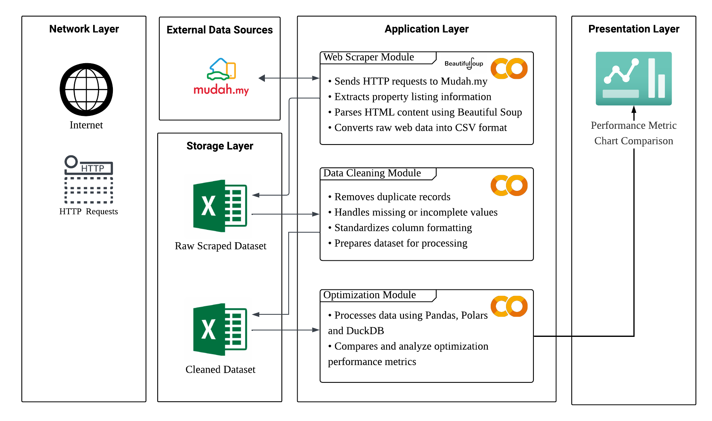

<h1 align="center"> 
  Fast&Furious - mudah.my
   
</h1>

<table border="solid" align="center">
  <tr>
    <th>Name</th>
    <th>Matric Number</th>
  </tr>
  <tr>
    <td width=80%>Goe Jie Ying</td>
    <td> A23CS0224 </td>
  </tr>
  <tr>
    <td width=80%> Nawwarah Auni binti Nazrudin </td>
    <td> A23CS0143 </td>
  </tr>
  <tr>
    <td width=80%> Yasmin Batrisyia Binti Zahiruddin </td>
    <td> A23CS0201 </td>
  </tr>
</table>

# 🏘️ mudah.my Web Scraper

A Python-based web scraper developed to collect property listings from [mudah.my](https://www.mudah.my/) across all states in Malaysia. The scraper extracts relevant property information from each listing and stores the data into separate CSV files by state, which are later combined into a complete consolidated dataset.

---
## 📂 Project Files

| File Name                     | Description                                | Link |
|------------------------------|--------------------------------------------|------|
| **Raw Dataset**              | Cleaned and raw data with URLs             | |
| **Clean Dataset**            | Preprocessed data ready for use            | |
| **Web Crawler Script**       | Python script to scrape mudah.my       |  |
| **Data Cleaning Code**       | Script to clean and preprocess the data    |  |
| **Optimization Code**        | Performance-optimized transformation code  |  |
| **Baseline Results** | Benchmark results using standard Pandas without optimization techniques |  |
| **Optimized Results** | Benchmark results after applying Pandas optimized pipeline, Polars, and DuckDB |  |
| **Evaluation Chart**         | Visual comparison of optimization results  |  |
| **Project Report**           | Final detailed documentation               |  |
| **Presentation Slides**      | Slides for project presentation            |  |

---

## 📚 Libraries Used

### 🕸️ Web Scraping Libraries
| Logo | Library | Description | 
| :---: | :--- | :--- |  
|  | **`BeautifulSoup`** | Web scraping & HTML parsing | 
|  | **`requests`** | Sends HTTP requests to access web pages | 
|  | **`lxml`** | Parse raw HTML strings into BeautifulSoup objects |

---
### ⚙️ Data Processing & Optimization Libraries

| Method | Purpose |
|-----|-----|
| **Pandas Optimized** | Optimized DataFrame processing using vectorization and memory-efficient techniques. |
| **Polars** | Fast parallel DataFrame processing with lower memory usage. |
| **DuckDB** | High-speed SQL-based analytics for large datasets. |

---
## 🛠️ System Architecture

#### Architecture Workflow:

#### 1. Network Layer 
The entry point. Uses the internet and HTTP requests to reach external websites.

#### 2. External Data Sources
Targets Mudah.my as the data source for property listings.

#### 3. Application Layer
The core processing engine, split into 3 modules:

- Web Scraper Module: Sends HTTP requests to Mudah.my, extracts listing data, and parses HTML using BeautifulSoup, saving the output as CSV
- Data Cleaning Module: Removes duplicates, fixes missing values, and standardizes formatting to prep the data for analysis
- Optimization Module: Processes the cleaned data using Pandas, Polars, and DuckDB to benchmark and compare their performance

#### 4. Storage Layer
Two Excel files act as checkpoints: a Raw Scraped Dataset (output of scraping) and a Cleaned Dataset (output of cleaning)

#### 5. Presentation Layer
Final output is a Performance Metric Chart Comparison, visualizing how Pandas, Polars, and DuckDB compare when processing the same dataset

## 🔧 Architecture of Tools and Frameworks Used
#### Architecture Workflow:

#### 1.  Data Collection
Google Colab runs **BeautifulSoup** to scrape data from **mudah.my**, producing raw data.

#### 2.  Data Cleaning
The raw data is passed into **Pandas** for cleaning and transformation, producing clean data.

#### 3.  Parallel Processing (Before & After Optimization)
Three tools process the clean data in parallel:

| Pipeline | Tool | Status | Output File |
|----------|------|--------|-------------|
| Baseline | Pandas | Before optimization | `performance_before.csv` |
| Optimized | Pandas | After optimization | `performance_after.csv` |
| Optimized | Polars | After optimization | `performance_after.csv` |
| Optimized | DuckDB | After optimization | `performance_after.csv` |

 All four CSV outputs are saved into a central database.

#### 4. Analysis & Visualization
The database flows into **data metrics analysis**, then into **data visualization** to show charts and graphs for insights.

#### 5. Upload to GitHub
The clean data and final outputs are pushed to **GitHub** for version control and sharing.

.png)

## 📊 Dataset Overview

This dataset contains property listings collected from various regions in Malaysia through web scraping from Mudah.my. The dataset includes key attributes such as property type, price, location, property size, number of bedrooms and bathrooms, seller information, and ownership details. It provides valuable insights for property buyers, sellers, and analysts interested in the Malaysian real estate market.

---
## 🔗 Data Details

- **Raw Dataset:** 102,486 rows and 16 columns. The dataset contains missing values in fields such as `bathrooms`, `bedrooms`, and `seller_name`.

- **Cleaned Dataset:** 100,442 rows and 16 columns after data preprocessing. Cleaning steps include removing duplicate records and handling missing values.

- Both datasets are stored in CSV file format for further processing and benchmarking.

---
## 📊 Data Description

| Field Name | Expected Type | Sample Value | Description |
|-----|-----|-----|-----|
| `listing_id` | Text / Numeric | `114427893` | Unique identifier assigned to each property listing. |
| `property_type` | Categorical | `Apartment for Sale` | Type or category of the property being listed. |
| `description` | Text | `The Laguna in Langkawi...` | Detailed description of the property provided by the seller. |
| `location` | Text | `Kluang` | District or area where the property is located. |
| `state` | Categorical | `Johor` | State in Malaysia where the property is located. |
| `price_rm` | Numeric | `550000` | Selling price of the property in Malaysian Ringgit (RM). |
| `mortgage_est_rm` | Numeric | `2192.0` | Estimated monthly mortgage or loan repayment amount in RM. |
| `land_title` | Categorical | `Non Bumi Lot` | Classification of land ownership or property title. |
| `size_sqft` | Numeric | `1050.0` | Property size measured in square feet (sqft). |
| `bedrooms` | Numeric | `2.0` | Number of bedrooms available in the property. |
| `bathrooms` | Numeric | `2.0` | Number of bathrooms available in the property. |
| `tenure` | Categorical | `Freehold` | Ownership tenure of the property, such as Freehold or Leasehold. |
| `seller_type` | Categorical | `Private` | Type of seller offering the property, such as Private owner or Agent. |
| `seller_name` | Text | `Lee` | Name of the seller or property agent. |
| `url` | Text (URL) | `https://www.mudah.my/...` | Direct URL linking to the specific property listing page. |
| `img_url` | Text (URL) | `https://cdn.rnudah.com/...` | Direct URL linking to the main image of the property listing. |
---
## 🚀 Performance Benchmark

### 🕒 Total Processing Time (seconds)
| Optimization Stage  | Run 1 | Run 2 | Run 3 | Average |
| ------------------- | ----: | ----: | ----: | ------: |
| Pandas Baseline |  11.20 |  4.19 |  4.62 |    6.67 |
| Pandas Optimization |  3.73 |  5.05 |  3.93 |    4.24 |
| Polars Optimization |  0.93 |  0.83 |  0.75 |    0.84 |
| DuckDB Optimization |  1.33 |  1.02 |  1.29 |    1.21 |
---

### 🧠 CPU Usage (%)
| Optimization Stage  | Run 1 | Run 2 | Run 3 | Average |
| ------------------- | ----: | ----: | ----: | ------: |
| Pandas Baseline |  47.0 |  91.7 |  97.4 |    78.7 |
| Pandas Optimization | 100.0 |  98.4 | 100.0 |   99.47 |
| Polars Optimization | 113.7 | 124.7 | 132.7 |  123.70 |
| DuckDB Optimization | 107.2 | 136.4 | 110.3 |  117.97 |

---

### 💾 Memory Usage (MB)
| Optimization Stage  |  Run 1 |  Run 2 |  Run 3 | Average |
| ------------------- | -----: | -----: | -----: | ------: |
| Pandas Baseline |  251.16 |  251.16 |  251.17 |  251.17 |
| Pandas Optimization | 213.61 | 213.61 | 213.61 |  213.61 |
| Polars Optimization |   0.09 |   0.04 |   0.04 |    0.06 |
| DuckDB Optimization |   0.15 |   0.15 |   0.15 |    0.15 |
---

### ⚡ Throughput (records/second)
| Optimization Stage  | Run 1 | Run 2 | Run 3 | Average |
| ------------------- | ----: | ----: | ----: | ------: |
| Pandas Baseline |  8970 |  23952 |  21738 |  18220 |
| Pandas Optimization | 26930 | 19905 | 25544 |   24126 |
| Polars Optimization | 58641 | 65582 | 73360 |   65861 |
| DuckDB Optimization | 40965 | 53658 | 42470 |   45698 |

---

## ✅ Conclusion
Overall, all optimized methods outperformed the Pandas baseline in terms of processing efficiency. Among the tested approaches, **Polars** achieved the best overall performance with the fastest execution time and highest throughput.

🥇Therefore, **Polars can be considered the overall winner among the tested methods**.🥇
