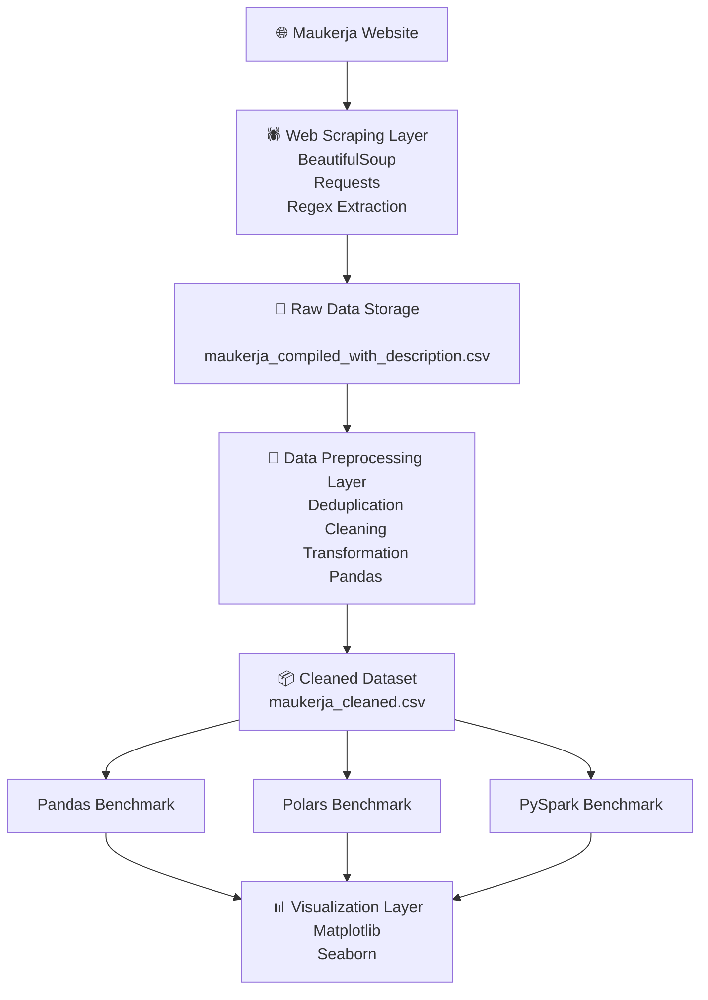

<h1 align="center"> 
  TripleA - Maukerja Job Scraping and Data Processing Benchmark
   
</h1>

<table align="center">
  <tr>
    <th>Name</th>
    <th>Matric Number</th>
  </tr>
  <tr>
    <td width=80%>LAM YOKE YU</td>
    <td>A23CS0233</td>
  </tr>
  <tr>
    <td width=80%>NABIL AFLAH BOO BINTI MOHD YOSUF BOO YONG CHONG</td>
    <td>A23CS0252</td>
  </tr>
  <tr>
    <td width=80%>ANIS SAFIYYA BINTI JANAI</td>
    <td>A23CS0049</td>
  </tr>
</table>
 

# Project Overview
The system is a data processing pipeline consisting of four main stages: web scraping, data preprocessing and cleaning, data processing using multiple libraries and frameworks, and performance visualisation.

The objective of the system is to collect job postings from the [Maukerja](https://www.maukerja.my/) website and to evaluate and compare the performance of different data processing libraries, namely Pandas, Polars, and PySpark.

# Project Architecture

# Tools and Framework Used
| Purpose           | Framework and Libraries                               | 
|------------------------------|--------------------------------------------|
| Core programming language |  |
| Data storage |   |
| Web Scraping libraries|   |
| Data manipulation libraries |   |
| Distributed processing framework |  |
| Data visualisation libraries |   |
| Version control and coordination |  |

# Project Structure
📁 TripleA  
│  
├── 📁 data/  
│   ├── 📁 [raw_data_compiled](https://github.com/drshahizan/HPDP/tree/main/2526/project/p1/TripleA/data/raw_data_compiled) - Job listing scraped from the Maukerja website  
│   ├── 📄 [maukerja_compiled.gz](https://github.com/drshahizan/HPDP/blob/main/2526/project/p1/TripleA/data/maukerja_compiled.gz) - Deduplicated job listings  
│   ├── 📄 [maukerja_compiled_with_description.gz](https://github.com/drshahizan/HPDP/blob/main/2526/project/p1/TripleA/data/maukerja_compiled_with_description.gz) - Job listings with extracted descriptions  
│   └── 📄 [maukerja_cleaned.gz](https://github.com/drshahizan/HPDP/blob/main/2526/project/p1/TripleA/data/maukerja_cleaned.gz) - Cleaned and normalised dataset     
│  
├── 📁 p1/  
│   ├── 📓 [main_crawler.ipynb](https://github.com/drshahizan/HPDP/blob/main/2526/project/p1/TripleA/p1/main_crawler.ipynb) - Scrapes job listing pages   
│   ├── 📓 [description_crawler.ipynb](https://github.com/drshahizan/HPDP/blob/main/2526/project/p1/TripleA/p1/description_crawler.ipynb) - Scrapes job descriptions using job URLs    
│   ├── 📓 [scraped_file_handler.ipynb](https://github.com/drshahizan/HPDP/blob/main/2526/project/p1/TripleA/p1/scraped_file_handler.ipynb) - Merges and separates datasets for processing        
│   ├── 📓 [maukerja_clean.ipynb](https://github.com/drshahizan/HPDP/blob/main/2526/project/p1/TripleA/p1/maukerja_clean.ipynb) - Data cleaning and standardisation   
│   └── 📓 [optimize_pipeline.ipynb](https://github.com/drshahizan/HPDP/blob/main/2526/project/p1/TripleA/p1/optimize_pipeline.ipynb) - Benchmarking pipeline for selected libraries    
│  
├── 📁 p2/  
│   ├── 📄 [performance_before.csv](https://github.com/drshahizan/HPDP/blob/main/2526/project/p1/TripleA/p2/performance_before.csv)  
│   ├── 📄 [performance_after.csv](https://github.com/drshahizan/HPDP/blob/main/2526/project/p1/TripleA/p2/performance_after.csv)  
│   └── 📓 [evaluation_charts.ipynb](https://github.com/drshahizan/HPDP/blob/main/2526/project/p1/TripleA/p2/evaluation_charts.ipynb) - Visualises performance metrics    
│  
├── 📁 report/  
│   └── 📄 [Final_Report.pdf](https://github.com/drshahizan/HPDP/blob/main/2526/project/p1/TripleA/report/Final_Report.pdf)  
│  
├── 📄 README.md  
└── 📄 requirements.txt  

# Execution Flow
The pipeline was executed in the following order:

1. `main_crawler.ipynb`
   - Scrape job listing pages
2. `scraped_file_handler.ipynb`
   - Merge and deduplicate datasets
3. `description_crawler.ipynb`
   - Scrape detailed job descriptions
4. `scraped_file_handler.ipynb`
   - Recombine datasets
5. `maukerja_clean.ipynb`
   - Cleans and standardises data
6. `optimize_pipeline.ipynb`
   - Execute Pandas, Polars, and PySpark benchmarks
7. `evaluation_charts.ipynb`
   - Generate performance charts

# Data Scraping
- **Source Website**: [Maukerja](https://www.maukerja.my/)
- **Total Records Collected**: 106,080 job postings

# Benchmarking
### Libraries compared:   
  

### Benchmark Metrics:
- Execution time (seconds)
- CPU utilisation (%)
- Memory usage (MB)
- Throughput (records/second)

### Benchmarking Results:

### Benchmarking Summary
Polars achieved the best overall performance in terms of execution time and throughput, making it highly efficient for single-machine data processing tasks.

The optimised Pandas implementation significantly improved performance compared to the baseline version, particularly in execution time and memory efficiency.

PySpark, while designed for distributed computing environments, exhibited higher execution time in a single-machine setup, indicating that its advantages are more apparent in cluster-based architectures.
