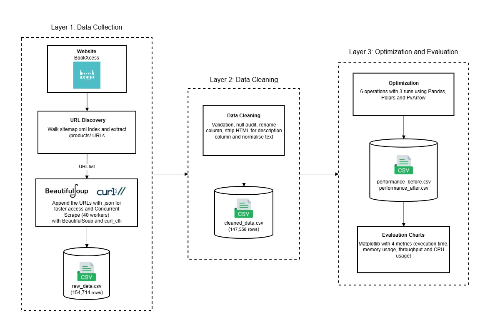
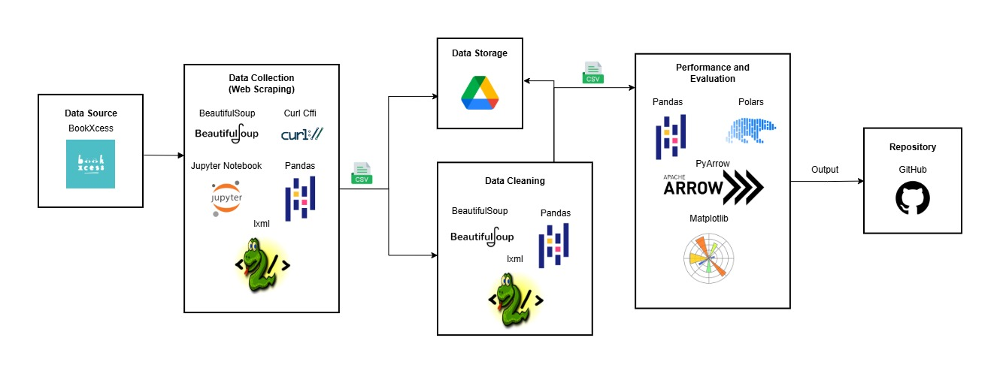

<h1 align="center">
  Group scubscub
  <br>
  Optimizing High-Performance Data Processing for Large-Scale Web Crawlers
  <br>
</h1>

<table border="solid" align="center">
  <tr>
    <th>Name</th>
    <th>Matric Number</th>
  </tr>
  <tr>
    <td width=80%>IMAN ABADI BIN MOHD NIZWAN</td>
    <td>A23CS0084</td>
  </tr>
  <tr>
    <td width=80%>MOHAMED ALIF FATHI BIN ABDUL LATIF</td>
    <td>A23CS0112</td>
  </tr>
  <tr>
    <td width=80%>DHESHIEGHAN A/L SARAVANA MOORTHY</td>
    <td>A23CS0072</td>
  </tr>
</table>

<br>

# Project Overview

This project crawls the full product catalogue of [BookXcess](https://www.bookxcess.com/), one of the largest discount bookstore chains in Malaysia, and benchmarks how three different data-processing libraries handle the resulting dataset. Over **100,000 structured book records** are collected via the site's XML sitemap and public `.json` endpoints, cleaned into a tidy CSV, and then put through an identical pipeline of six operations in **Pandas**, **Polars**, and **PyArrow**. The aim is to measure the real-world impact of applying high-performance computing techniques (concurrency during scraping, columnar engines during processing) versus a plain single-threaded Pandas baseline.

# System Architecture

<p align="center">
  
</p>

The pipeline runs in four stages: **(1) scrape** the BookXcess sitemap with a 40-worker `ThreadPoolExecutor` over `curl_cffi`, **(2) clean** the raw CSV with `pandas` + `BeautifulSoup`, **(3) benchmark** six representative operations across Pandas, Polars, and PyArrow, and **(4) visualise** the per-metric comparisons in matplotlib.

# Tools and Frameworks

<p align="center">
  
</p>

| Purpose | Framework and Libraries |
|---------|--------------------------|
| Core programming language |  |
| Web scraping |    |
| Concurrency |  |
| Optimization |    |
| Visualization |  |
| System metrics |  |
| Data storage |  |
| Version control |  |

# Project Structure

```
scubscub/
├── data/
│   └── readme.md      
├── p1/
│   ├── main_crawler.ipynb       
│   ├── clean_data.ipynb   
│   ├── optimize_pipeline.ipynb 
│   └── readme.md
├── p2/
│   ├── performance_before.csv 
│   ├── performance_after.csv
│   ├── evaluation_charts.ipynb 
│   └── readme.md
├── report/
│   ├── Final_Report.pdf
│   ├── Final_Report_Turnitin.pdf
|   ├── Presentation_Slides.pdf
│   └── readme.md
├── system_architecture_diagram.jpg
├── tools_diagram.jpg
├── requirements.txt
└── readme.md
```

# Execution Flow

1. **[`p1/main_crawler.ipynb`](p1/main_crawler.ipynb)** — traverses the BookXcess sitemap index, collects every product URL, and concurrently fetches each product's `.json` endpoint to produce `raw_data.csv`.
2. **[`p1/clean_data.ipynb`](p1/clean_data.ipynb)** — strips HTML tags from descriptions, normalises text fields, validates author/publisher, computes discount %, drops illogical price rows, and writes `cleaned_data.csv`.
3. **[`p1/optimize_pipeline.ipynb`](p1/optimize_pipeline.ipynb)** — runs the same six operations in Pandas, Polars, and PyArrow (three runs each) and writes the timing/CPU/memory results to `p2/performance_before.csv` and `p2/performance_after.csv`.
4. **[`p2/evaluation_charts.ipynb`](p2/evaluation_charts.ipynb)** — loads both CSVs and plots per-metric comparisons across the three libraries.

# Data Scraping

- **Source website**: [BookXcess](https://www.bookxcess.com/)
- **Total records collected**: 100,000+ books
- **Method**: sitemap-driven URL discovery + concurrent `.json` endpoint fetches via `curl_cffi` (Chrome impersonation), 40 worker threads, exponential-backoff retries on 429/503, periodic CSV flushing.
- **Dataset access**: see [`data/readme.md`](data/readme.md) — full raw and cleaned CSVs are hosted on [Google Drive](https://drive.google.com/drive/folders/16OOeB5IXHAxJWn6YZz7S5bBCfsmkp_xm?usp=sharing) because they exceed GitHub's file size limit.

# Benchmarking

### Libraries compared
  

### Operations benchmarked
1. Filter high-discount books
2. GroupBy publisher aggregation
3. String extract price tier (regex)
4. Calculate savings (derived column)
5. Sort by discount and price
6. Top authors by average discount

### Metrics captured
- Execution time (seconds)
- CPU utilisation — initial and final (%)
- Memory used (MB)
- Throughput (rows/second)

Every operation is run **three times per library** with the average row included alongside the raw runs. Results live in [`p2/performance_before.csv`](p2/performance_before.csv) (baseline Pandas) and [`p2/performance_after.csv`](p2/performance_after.csv) (optimized pipeline).

### Summary of findings
Polars consistently delivered the lowest execution times on filter, sort, and groupby operations, benefiting from its multi-threaded query engine. PyArrow excelled on columnar aggregations and string extraction thanks to its compute kernels, while Pandas — although slower in raw execution — remains the most expressive baseline. The optimized pipeline (Polars + PyArrow) significantly reduced total processing time compared with the single-threaded Pandas baseline run in `performance_before.csv`.

