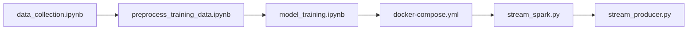
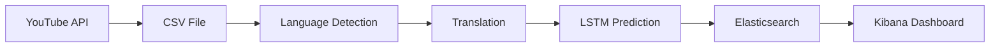

<h1 align="center"> 
  TripleA - Real-Time Malaysian Food Sentiment Analysis Using Apache Spark and Kafka
   
</h1>

Real-time sentiment analysis of Malaysian food-related YouTube comments using Apache Kafka, Apache Spark Structured Streaming and a deep learning LSTM model.

<table align="center">
  <tr>
    <th>Name</th>
    <th>Matric Number</th>
  </tr>
  <tr>
    <td width=80%>LAM YOKE YU</td>
    <td>A23CS0233</td>
  </tr>
  <tr>
    <td width=80%>NABIL AFLAH BOO BINTI MOHD YOSUF BOO YONG CHONG</td>
    <td>A23CS0252</td>
  </tr>
  <tr>
    <td width=80%>ANIS SAFIYYA BINTI JANAI</td>
    <td>A23CS0049</td>
  </tr>
</table>
 

# Project Overview
This project develops a real-time sentiment analysis system for Malaysian food-related YouTube comments. The project consists of three main stages:

1. **Data Acquisition and Preprocessing**
   - Collect comments from YouTube using the YouTube Data API.
   - Clean, filter, translate and automatically label the collected comments.

2. **Sentiment Model Development**
   - Train and evaluate sentiment classification models.
   - Select the best-performing model for deployment.

3. **Sentiment Analysis Pipelines**
   - **Streaming Pipeline** using Apache Kafka and Apache Spark Structured Streaming.
   - **Batch Pipeline** for offline processing and performance comparison.

# Project Architecture

# Tools and Frameworks

| Purpose | Framework / Library |
|---------|---------------------|
| Programming Language | Python |
| Data Collection | YouTube Data API |
| Data Processing | Pandas |
| Natural Language Processing | TensorFlow, Keras |
| Automatic Labelling | Hugging Face Transformers |
| Streaming Platform | Apache Kafka |
| Stream Processing | Apache Spark Structured Streaming |
| Search & Storage | Elasticsearch |
| Dashboard | Kibana |
| Containerisation | Docker |
| Version Control | GitHub |

# Project Structure
📁 TripleA  
│  
├── 📁 data/  
│   ├── 📄 [latest_malaysia_food_comments.csv](https://github.com/drshahizan/HPDP/tree/main/2526/project/p2/TripleA/data/latest_malaysia_food_comments.csv) - Food comments collected via YouTube API    
│   ├── 📄 [labeled_comments_clean.csv](https://github.com/drshahizan/HPDP/blob/main/2526/project/p2/TripleA/data/labeled_comments_clean.csv) - Cleaned labelled comments    
│  
├── 📁 notebooks/  
│   ├── 📓 [data_collection.ipynb](https://github.com/drshahizan/HPDP/blob/main/2526/project/p2/TripleA/notebooks/data_collection.ipynb) - Collects raw comments from YouTube    
│   ├── 📓 [preprocess_training_data.ipynb](https://github.com/drshahizan/HPDP/blob/main/2526/project/p2/TripleA/notebooks/preprocess_training_data.ipynb) - Preprocess and labels the collected comments     
│   ├── 📓 [model_training.ipynb](https://github.com/drshahizan/HPDP/blob/main/2526/project/p2/TripleA/notebooks/model_training.ipynb) - Trains two sentiment models and selects the best performing model             
│  
├── 📁 kafka_spark_pipeline/  
│   ├── 📄 [docker-compose.yml](https://github.com/drshahizan/HPDP/blob/main/2526/project/p2/TripleA/kafka_spark_pipeline/docker-compose.yml)  
│   ├── 📄 [model_loader.py](https://github.com/drshahizan/HPDP/blob/main/2526/project/p2/TripleA/kafka_spark_pipeline/model_loader.py)    
│   ├── 📄 [stream_producer.py](https://github.com/drshahizan/HPDP/blob/main/2526/project/p2/TripleA/kafka_spark_pipeline/stream_producer.py)    
│   ├── 📄 [stream_spark.py](https://github.com/drshahizan/HPDP/blob/main/2526/project/p2/TripleA/kafka_spark_pipeline/stream_spark.py)    
│   ├── 📄 [batch_scrape.py](https://github.com/drshahizan/HPDP/blob/main/2526/project/p2/TripleA/kafka_spark_pipeline/batch_scrape.py)    
│   ├── 📄 [batch_sentiment.py](https://github.com/drshahizan/HPDP/blob/main/2526/project/p2/TripleA/kafka_spark_pipeline/batch_sentiment.py)    
│  
├── 📁 report/  
│   └── 📄 [Final_Report.pdf](https://github.com/drshahizan/HPDP/blob/main/2526/project/p2/TripleA/report/Final_Report.pdf)  
│  
├── 📄 README.md  
└── 📄 requirements.txt  

# Execution Flow
The project was executed in the following order:

# Data Acquisition and Preprocessing
| Description | Value |
|------------|------:|
| Raw Comments Collected | 37,932 |
| Comments After Cleaning | 32,368 |
| High-Confidence Labelled Comments | 25,315 |
| Final Food-related Dataset | 9,037 |

# Sentiment Model Development
| Model | Accuracy | Precision | Recall | F1-Score |
|------|---------:|----------:|-------:|---------:|
| Naive Bayes | 0.6911 | 0.6865 | 0.6911 | 0.6833 |
| **LSTM** | **0.7311** | **0.7283** | **0.7311** | **0.7276** |

Best model selected: LSTM

# Streaming Pipeline

# Batch Pipeline

