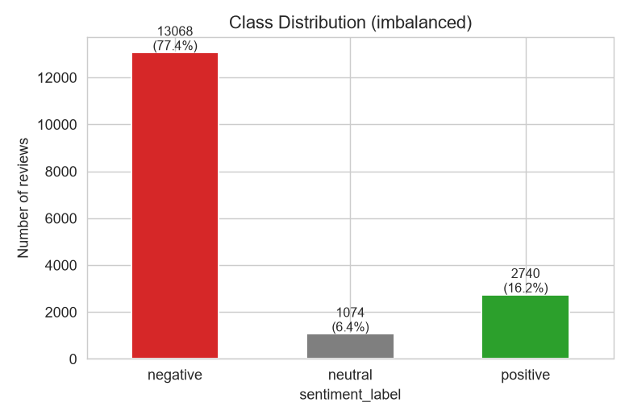
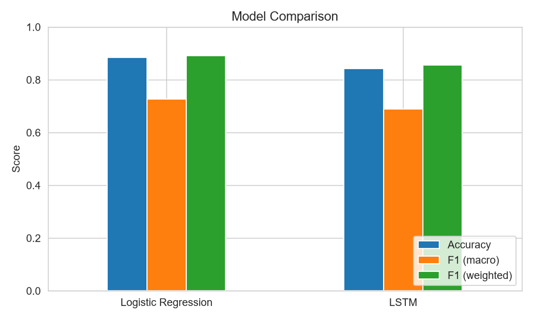
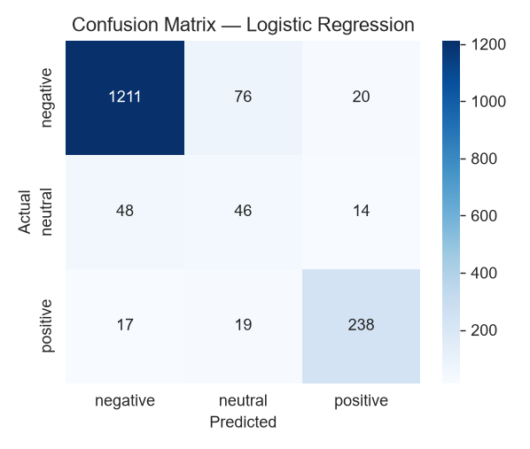
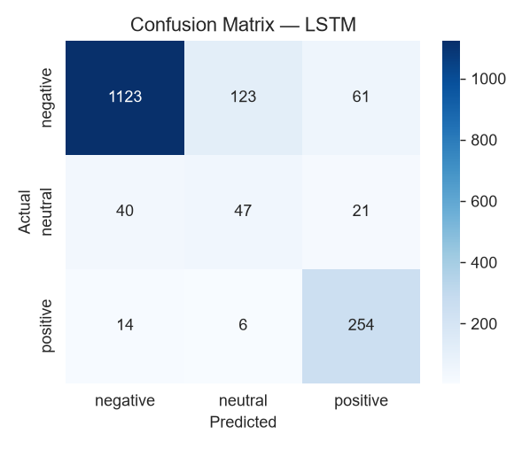
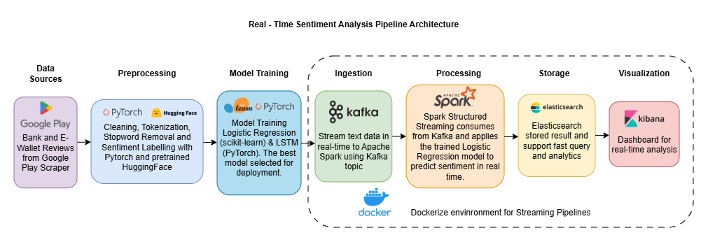
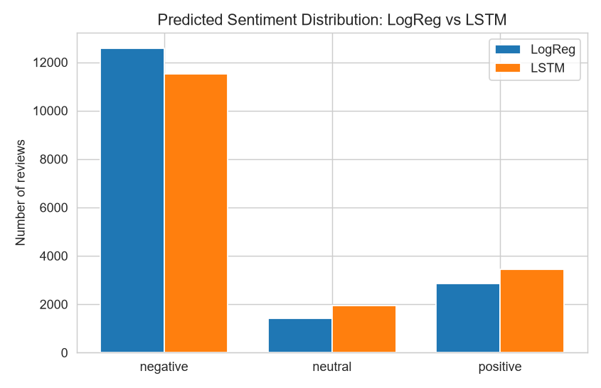
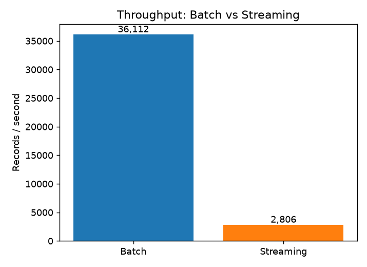

<h1 align="center"> 
  Vollzanbel - Real-Time Sentiment Analysis on Malaysian E-Wallet App Reviews
  <br>
</h1>

<p align="center">
  <b>High Performance Data Processing (SECP3133)</b> &middot; 2025/2026 Semester 2 &middot; Project 2<br>
  Real-Time Sentiment Analysis using Apache Kafka and Apache Spark
</p>

<table border="solid" align="center">
  <tr>
    <th>Name</th>
    <th>Matric Number</th>
  </tr>
  <tr>
    <td width=80%>MOHAMED ALIF FATHI BIN ABDUL LATIF</td>
    <td>A23CS0112</td>
  </tr>
  <tr>
    <td width=80%>IMAN ABADI BIN MOHD NIZWAN</td>
    <td>A23CS0084</td>
  </tr>
</table>

<p align="center"><b>Group:</b> Vollzanbel</p>

---

### Links for related documents:
<table>
  <tr>
    <th>Documents</th>
    <th>Links</th>
  </tr>
  <tr>
    <td>Final Report (PDF)</td>
    <td align="center">
      <a href="reports/"></a>
    </td>
  </tr>
  <tr>
    <td>Presentation Slides</td>
    <td align="center">
      <a href=""></a>
    </td>
  </tr>
  <tr>
    <td>Presentation Video</td>
    <td align="center">
      <a href=""></a>
    </td>
  </tr>
  <tr>
    <td>Raw Dataset (18,000 reviews)</td>
    <td align="center">
      <a href="data/reviews_raw.csv"></a>
    </td>
  </tr>
  <tr>
    <td>Cleaned &amp; Labelled Dataset (16,882 reviews)</td>
    <td align="center">
      <a href="data/cleaned_data.csv"></a>
    </td>
  </tr>
  <tr>
    <td>Preprocessing &amp; Sentiment Labelling Notebook</td>
    <td align="center">
      <a href="notebooks/preprocessing.ipynb"></a>
    </td>
  </tr>
  <tr>
    <td>Model Training &amp; Comparison Notebook (Logistic Regression &amp; LSTM)</td>
    <td align="center">
      <a href="model_training.ipynb"></a>
    </td>
  </tr>
  <tr>
    <td>Kafka &ndash; Spark Streaming Pipeline</td>
    <td align="center">
      <a href="kafka_spark_pipeline/"></a>
    </td>
  </tr>
</table>

---

## Table of Contents

### 1.0 Introduction
- [1.1 Background](#11-background)
- [1.2 Objectives](#12-objectives)
- [1.3 Scope](#13-scope)

### 2.0 Data Acquisition & Preprocessing
- [2.1 Sources](#21-sources)
- [2.2 Tools](#22-tools)
- [2.3 Cleaning Steps](#23-cleaning-steps)

### 3.0 Sentiment Model Development
- [3.1 Model Choice](#31-model-choice)
- [3.2 Training Process](#32-training-process)
- [3.3 Evaluation](#33-evaluation)

### 4.0 Apache System Architecture
- [4.0 Apache System Architecture](#40-apache-system-architecture-1)
  
### 5.0 Analysis & Results
- [5.1 Key Findings](#51-key-findings)
- [5.2 Visualizations](#52-visualizations)
- [5.3 Insights](#53-insights)

### 6.0 Optimisation & Comparison
- [6.0 Optimisation & Comparison](#60-optimisation--comparison-1)

### 7.0 Conclusion & Future Work
- [7.0 Conclusion & Future Work](#70-conclusion--future-work-1)

### 8.0 References
- [8.0 References](#80-references-1)

### 9.0 Appendix
- [9.0 Appendix](#90-appendix-1)
---

### 1.0 Introduction

#### 1.1 Background

E-wallets and mobile banking apps have become part of everyday life in Malaysia, with
services such as Touch 'n Go eWallet, Boost, ShopeePay, and the major banks' apps now used
daily for payments, transfers, and toll/parking. Because users share their experiences openly
on the **Google Play Store**, app reviews are a rich, public, and Malaysian-relevant source of
opinion. However, these reviews arrive continuously and in large volumes, so reading them
manually is impractical.

This project, **Vollzanbel**, simulates a production analytics environment by building a
**real-time sentiment analysis pipeline** that ingests app reviews, classifies each one as
**positive, negative, or neutral**, and surfaces the resulting trends on an interactive
dashboard. The system is built on the modern big-data stack required by the brief &mdash;
**Apache Kafka** for streaming, **Apache Spark** Structured Streaming for parallel processing,
**Elasticsearch** for storage, and **Kibana** for visualization &mdash; demonstrating how
classroom theory connects to industry data-engineering practice.

#### 1.2 Objectives

The objectives of this project are to:

1. Collect a Malaysian-relevant, text-based dataset suitable for sentiment classification
   (Google Play reviews of Malaysian e-wallet and banking apps).
2. Apply standard NLP preprocessing &mdash; cleaning, tokenization, stop-word removal, and
   lemmatization &mdash; to prepare the text.
3. Train, evaluate, and compare **at least two** sentiment classifiers (a machine-learning
   model and a deep-learning model) using accuracy, precision, recall, F1, and confusion
   matrices.
4. Integrate the best model into a **real-time streaming pipeline** built on Apache Kafka and
   Apache Spark.
5. Store the classified output in **Elasticsearch** and visualize sentiment trends in **Kibana**.
6. Compare **batch vs. streaming** performance (processing time, throughput, accuracy, latency)
   and interpret the results.

#### 1.3 Scope

| In scope | Out of scope |
|---|---|
| 9 Malaysian e-wallet / mobile-banking apps on Google Play | Non-Malaysian sources, other app stores |
| 3-class sentiment: positive / negative / neutral | Fine-grained aspect/emotion analysis |
| English-dominant text (~97% EN, with Malay/Manglish handled) | Full multilingual modelling |
| Two trained classifiers: Logistic Regression + LSTM | Production-grade horizontal scaling / cloud deploy |
| Kafka &rarr; Spark &rarr; Elasticsearch &rarr; Kibana on Docker Compose | Live continuous collection (data is collected once and replayed) |

The streaming layer is driven by **replaying** the collected, cleaned dataset through Kafka to
faithfully simulate a live review stream, which is the standard approach for a reproducible
academic pipeline.

---

### 2.0 Data Acquisition & Preprocessing

#### 2.1 Sources

The primary data source is **Google Play Store reviews** of **9 Malaysian e-wallet and
mobile-banking applications**. The most recent **2,000 reviews per app** were scraped, giving a
raw dataset of **18,000 reviews** ([`data/reviews_raw.csv`](data/reviews_raw.csv)).

| # | App | Reviews |
|---|-----|:------:|
| 1 | Touch 'n Go eWallet | 2,000 |
| 2 | Maybank MAE | 2,000 |
| 3 | Boost eWallet | 2,000 |
| 4 | ShopeePay (Shopee MY) | 2,000 |
| 5 | BigPay | 2,000 |
| 6 | CIMB OCTO MY | 2,000 |
| 7 | RHB Banking App | 2,000 |
| 8 | Hong Leong Connect | 2,000 |
| 9 | MyPB by Public Bank | 2,000 |
| | **Total (raw)** | **18,000** |

Each record contains the app name, review id, username, star rating, timestamp, review text,
and thumbs-up count. The data is publicly available and was collected for academic use only.

#### 2.2 Tools

| Stage | Tools / Libraries |
|---|---|
| Collection | `google-play-scraper` |
| Cleaning & wrangling | `pandas`, `numpy`, Python `re` (regex) |
| NLP preprocessing | `NLTK` (WordNet lemmatizer, English + Malay stop-word lists) |
| Sentiment labelling | Hugging Face `transformers` &mdash; `cardiffnlp/twitter-roberta-base-sentiment-latest` |
| Environment | Python 3.13, managed with `uv` (see [`requirements.txt`](requirements.txt)) |

#### 2.3 Cleaning Steps

Full pipeline in [`notebooks/preprocessing.ipynb`](notebooks/preprocessing.ipynb). A custom
`clean_text()` function handles **English, Bahasa Malaysia, and Manglish** in this order:

1. Lowercase the text.
2. Convert sentiment emojis to words (**before** stripping the rest).
3. Remove URLs, emails, and `@mentions`; keep hashtag text, drop the `#`.
4. Expand contractions (multi-word and single-word) **before** tokenizing.
5. Collapse 3+ repeated characters to 2 (`bagusss` &rarr; `baguss`).
6. Strip remaining punctuation and leftover emoji.
7. Whitespace tokenization.
8. Remove English + Malay stop-words **but keep negation words** (they flip sentiment).
9. Lemmatize with WordNet (Malay words pass through unchanged &mdash; deliberately not stemmed).

**Sentiment labelling (text-based, not star ratings).** Labels are produced from the **review
text** using the pre-trained transformer `cardiffnlp/twitter-roberta-base-sentiment-latest`,
which emits native 3-class output (positive / neutral / negative) with a softmax confidence
score. The `rating` column is kept for reference only. An English model was chosen because the
language-mix check showed the corpus is **~97% English**.

After cleaning (dropping empty/duplicate and non-classifiable reviews) and feature engineering,
the final labelled dataset has **16,882 reviews**
([`data/cleaned_data.csv`](data/cleaned_data.csv)).

**Class distribution (the dataset is heavily imbalanced):**

| Sentiment | Count | Share |
|---|:--:|:--:|
| Negative | 13,068 | 77.4% |
| Positive | 2,740 | 16.2% |
| Neutral | 1,074 | 6.4% |

<p align="center">
  
</p>

---

### 3.0 Sentiment Model Development

Full notebook: [`model_training.ipynb`](model_training.ipynb).

#### 3.1 Model Choice

As required by the brief (at least two models, covering different categories), two classifiers
were trained and compared:

| # | Model | Category | Features |
|---|-------|----------|----------|
| 1 | **Logistic Regression** | Machine Learning | TF-IDF |
| 2 | **LSTM** | Deep Learning (PyTorch) | Word embeddings |

**Handling class imbalance (no synthetic data).** Since ~77% of reviews are negative, a naive
model could score ~77% accuracy while being useless. This is addressed with **balanced class
weights**: Logistic Regression uses `class_weight="balanced"`, and the LSTM passes the same
balanced weights into `CrossEntropyLoss(weight=...)`. Metrics are reported as **macro-averaged**
(every class counts equally) plus per-class, not accuracy alone.

#### 3.2 Training Process

- **Split:** stratified **70 / 20 / 10** train / validation / test, keeping the
  negative/neutral/positive ratio identical across all three sets.
- **Features:** a shared **TF-IDF** vectorizer for the ML model; a word-embedding layer for the
  LSTM.
- **Training:** Logistic Regression fitted on TF-IDF features with balanced weights; the LSTM
  trained in PyTorch with a class-weighted cross-entropy loss.
- **Artifacts saved** to [`models/`](models/) for the streaming stage:
  `tfidf_vectorizer.joblib`, `logistic_regression.joblib`, `lstm.pt`, and
  [`label_map.json`](models/label_map.json).

#### 3.3 Evaluation

Both models were evaluated with accuracy, macro/weighted precision, recall, F1, and a confusion
matrix ([`models/model_comparison.csv`](models/model_comparison.csv)):

| Model | Accuracy | Precision (macro) | Recall (macro) | F1 (macro) | F1 (weighted) |
|---|:--:|:--:|:--:|:--:|:--:|
| **Logistic Regression** | **0.8851** | **0.7168** | 0.7404 | **0.7263** | **0.8907** |
| LSTM | 0.8431 | 0.6590 | 0.7405 | 0.6893 | 0.8560 |

<p align="center">
  
</p>

<p align="center">
  
  
</p>

**Best model:** **Logistic Regression** outperforms the LSTM on accuracy and every aggregate F1
score, while being far lighter and faster to run per record. It is therefore selected as the
**deployed model** in the streaming pipeline.

---

### 4.0 Apache System Architecture

The real-time pipeline streams reviews through Kafka, classifies them inside Spark Structured
Streaming with the deployed Logistic Regression model, stores the results in Elasticsearch, and
visualizes them in Kibana. The whole stack runs via **Docker Compose**
([`kafka_spark_pipeline/`](kafka_spark_pipeline/)).

```
producer.py ──▶ Kafka topic "reviews" ──▶ Spark Structured Streaming ──▶ Elasticsearch ──▶ Kibana
                                          (TF-IDF + Logistic Regression)   (sentiment_reviews)
```

<p align="center">
  
</p>

| Component | Role | File |
|---|---|---|
| **Producer** | Replays `cleaned_data.csv` into the `reviews` topic to simulate a live stream | [`producer.py`](kafka_spark_pipeline/producer.py) |
| **Apache Kafka** | Message broker streaming reviews into the processing layer | [`docker-compose.yml`](kafka_spark_pipeline/docker-compose.yml) |
| **Apache Spark** | Structured Streaming job; classifies each micro-batch with TF-IDF + LogReg | [`spark_streaming.py`](kafka_spark_pipeline/spark_streaming.py) |
| **Elasticsearch** | Stores classified results in index `sentiment_reviews` | [`elastic_mappings.json`](kafka_spark_pipeline/elastic_mappings.json) |
| **Kibana** | Interactive dashboards (distribution, over-time, per-app, live stream) | http://localhost:5601 |
| **Benchmark** | Batch-vs-streaming comparison report | [`benchmark.py`](kafka_spark_pipeline/benchmark.py) |

Run instructions are in [`kafka_spark_pipeline/README.md`](kafka_spark_pipeline/README.md) and
summarized in the [Appendix](#90-appendix-1).

---

### 5.0 Analysis & Results

#### 5.1 Key Findings

- **Malaysians are largely dissatisfied** in their app reviews: **77.4%** of reviews are
  negative, versus 16.2% positive and 6.4% neutral.
- Common complaints centre on **app crashes, login/verification problems, and removed
  features** (e.g. auto top-up / quick payment), based on the most frequent negative terms.
- The deployed Logistic Regression model classifies the full dataset with **~94% accuracy
  against the labelled data**, and sustains real-time throughput in the streaming pipeline.

#### 5.2 Visualizations

Generated figures (in [`reports/figures/`](reports/figures/)):

| Figure | Description |
|---|---|
| [`fig_class_distribution.png`](reports/figures/fig_class_distribution.png) | Sentiment class distribution of the labelled dataset |
| [`fig_pred_distribution.png`](reports/figures/fig_pred_distribution.png) | Predicted-sentiment distribution from the deployed model |
| [`fig_model_comparison.png`](reports/figures/fig_model_comparison.png) | Logistic Regression vs. LSTM metric comparison |
| [`fig_confusion_logreg.png`](reports/figures/fig_confusion_logreg.png) / [`fig_confusion_lstm.png`](reports/figures/fig_confusion_lstm.png) | Per-model confusion matrices |
| [`fig_batch_vs_streaming.png`](reports/figures/fig_batch_vs_streaming.png) | Batch vs. streaming throughput |
| [`fig_architecture.png`](reports/figures/fig_architecture.png) | End-to-end pipeline architecture |

Interactive **Kibana** dashboards (brief §10): sentiment-distribution pie chart, sentiment
over time, per-app breakdown, and a live sentiment stream view.

<p align="center">
  
</p>

#### 5.3 Insights

The dominance of negative sentiment is consistent across the major e-wallet and banking apps,
signalling that **reliability and core-feature stability** are the biggest pain points for
Malaysian users. For app owners, the dashboard makes it possible to **monitor sentiment in real
time** and react quickly when a release triggers a spike in negative reviews. The skew also
explains why **macro-averaged metrics and class weighting were essential** &mdash; without them,
a model could look accurate while completely ignoring the minority positive/neutral classes.

---

### 6.0 Optimisation & Comparison

**Modelling optimisation.** Class imbalance was handled with **balanced class weights** rather
than synthetic oversampling, and models were compared on **macro F1** (not just accuracy) so the
minority classes count. Logistic Regression was selected over the heavier LSTM because it scored
higher on every aggregate metric *and* is cheaper to serve per record &mdash; the right
trade-off for a streaming workload.

**Batch vs. streaming comparison** (brief §6.4), measured on the full 16,882-review dataset with
the same deployed model ([`benchmark.py`](kafka_spark_pipeline/benchmark.py),
[`streaming_metrics.csv`](kafka_spark_pipeline/streaming_metrics.csv)):

| Metric | Batch | Streaming |
|---|:--:|:--:|
| Records processed | 16,882 | 16,882 |
| Total processing time | 0.53 s | 6.02 s |
| Throughput | ~31,750 rec/s | ~2,806 rec/s |
| Accuracy (vs. labels) | 0.9415 | 0.9483 |
| Avg. end-to-end latency | &ndash; | ~3.83 s |
| Micro-batches | 1 | 4 |

<p align="center">
  
</p>

**Interpretation.** Batch mode is far faster in raw throughput because it classifies everything
in a single in-memory pass with no streaming overhead. Streaming mode trades throughput for
**continuous, low-latency processing** (~3.8 s end-to-end per micro-batch) &mdash; the right
choice when reviews must be analysed *as they arrive*. **Accuracy is essentially identical**
across both modes (~0.94), confirming the model behaves consistently regardless of execution
mode.

---

### 7.0 Conclusion & Future Work

This project delivered a complete, working **real-time sentiment analysis pipeline** for
Malaysian e-wallet and banking app reviews. We collected 18,000 Google Play reviews across 9
apps, labelled 16,882 of them from the **review text** using a transformer model, trained and
compared **Logistic Regression and LSTM**, and deployed the best model (Logistic Regression) in a
**Kafka → Spark → Elasticsearch → Kibana** pipeline running on Docker. We also quantified the
**batch-vs-streaming** trade-off with measured throughput, latency, and accuracy.

**Future work:**
- Add a **transformer-based classifier** (e.g. fine-tuned BERT/DistilBERT) as a third model.
- Improve coverage of **Bahasa Malaysia / Manglish** with a multilingual or locally fine-tuned
  model.
- Move from replaying a static file to **live continuous collection** of new reviews.
- Scale the Spark/Kafka cluster horizontally and add resource-usage (CPU/memory) profiling.

---

### 8.0 References

1. CardiffNLP &mdash; `twitter-roberta-base-sentiment-latest`,
   https://huggingface.co/cardiffnlp/twitter-roberta-base-sentiment-latest
2. Apache Kafka &mdash; https://kafka.apache.org/
3. Apache Spark (Structured Streaming) &mdash; https://spark.apache.org/docs/latest/structured-streaming-programming-guide.html
4. Elasticsearch & Kibana &mdash; https://www.elastic.co/
5. scikit-learn &mdash; https://scikit-learn.org/ &nbsp;|&nbsp; PyTorch &mdash; https://pytorch.org/
6. `google-play-scraper` &mdash; https://pypi.org/project/google-play-scraper/

---
### 9.0 Appendix

#### Repository structure

```
Vollzanbel/
├── README.md
├── requirements.txt
├── model_training.ipynb            # Train & compare Logistic Regression + LSTM
├── data/
│   ├── reviews_raw.csv             # 18,000 raw Google Play reviews (9 apps)
│   └── cleaned_data.csv            # 16,882 cleaned & labelled reviews
├── notebooks/
│   └── preprocessing.ipynb         # Cleaning + transformer-based labelling
├── models/
│   ├── tfidf_vectorizer.joblib
│   ├── logistic_regression.joblib  # Deployed model
│   ├── lstm.pt
│   ├── label_map.json
│   └── model_comparison.csv
├── kafka_spark_pipeline/
│   ├── docker-compose.yml          # Kafka, Spark, Elasticsearch, Kibana
│   ├── Dockerfile.spark
│   ├── producer.py                 # Streams reviews into Kafka
│   ├── spark_streaming.py          # Classifies + writes to Elasticsearch
│   ├── elastic_mappings.json
│   ├── benchmark.py                # Batch vs. streaming comparison
│   ├── streaming_metrics.csv
│   └── README.md
└── reports/
    └── figures/                    # All generated charts
```

#### Quick start

```bash
# 1. Install dependencies
pip install -r requirements.txt        # or: uv sync

# 2. (Re)train and compare the models
#    open and run model_training.ipynb  →  writes artifacts to models/

# 3. Start the streaming pipeline
cd kafka_spark_pipeline
docker compose up -d kafka elasticsearch kibana
docker exec hpdp-kafka /opt/kafka/bin/kafka-topics.sh --create --topic reviews \
  --bootstrap-server localhost:9092 --partitions 1 --replication-factor 1 --if-not-exists
docker compose up --build spark        # in its own terminal

# 4. Stream the reviews (in another terminal)
uv run python producer.py --rate 20

# 5. View results in Kibana → http://localhost:5601  (index: sentiment_reviews)

# 6. Batch-vs-streaming comparison
uv run python benchmark.py
```

See [`kafka_spark_pipeline/README.md`](kafka_spark_pipeline/README.md) for full pipeline details.
