<h1 align="center">
  Web Miner – Real-Time Sentiment Analysis on Grab's Reviews (Google Play)
  <br>
</h1>

<table border="solid" align="center">
  <tr>
    <th>Name</th>
    <th>Matric Number</th>
    <th>Role</th>
  </tr>
  <tr>
    <td width=70%>NG YU HIN</td>
    <td>A23CS0148</td>
    <td>Group Leader & Data Engineer</td>
  </tr>
  <tr>
    <td width=70%>MUHAMMAD SYAHMI FARIS BIN RUSLI</td>
    <td>A23CS0118</td>
    <td>NLP & Model Engineer</td>
  </tr>
  <tr>
    <td width=70%>AFIF SHAQIR IRFAN BIN ARQAM</td>
    <td>A23CS0204</td>
    <td>Pipeline & Visualization Engineer</td>
  </tr>
</table>

---

## 📂 Links for Related Files

<div align="center">

| Name | Description | Links |
| :--- | :--- | :--- |
| `grab_reviews_raw.csv` | Unprocessed Grab review dataset scraped from Google Play Store. | [View CSV](data/grab_reviews_raw.csv) |
| `cleaned_data.csv` | Cleaned and preprocessed review data ready for model training. | [View CSV](data/cleaned_data.csv) |
| `grab_scraper.ipynb` | Notebook for scraping Grab reviews from Google Play. | [View Notebook](notebooks/grab_scraper.ipynb) |
| `preprocessing.ipynb` | Data cleaning, text normalisation, and feature engineering. | [View Notebook](notebooks/preprocessing.ipynb) |
| `01_eda_split.ipynb` | Exploratory data analysis and train/test split. | [View Notebook](notebooks/01_eda_split.ipynb) |
| `02_model_naive_bayes.ipynb` | Model training using the Naive Bayes model. | [View Notebook](notebooks/02_model_naive_bayes.ipynb) |
| `03_model_lstm.ipynb` | Model training using the LSTM model. | [View Notebook](notebooks/03_model_lstm.ipynb) |
| `04_model_distilbert.ipynb` | Model training using the DistilBERT model. | [View Notebook](notebooks/04_model_distilbert.ipynb) |
| `05_compare_models.ipynb` | Side-by-side comparison of all three trained models. | [View Notebook](notebooks/05_compare_models.ipynb) |
| `06_kafka_producer.ipynb` | Kafka producer notebook for streaming review data. | [View Notebook](kafka_spark_pipeline/06_kafka_producer.ipynb) |
| `07_spark_streaming.ipynb` | Spark Structured Streaming notebook for real-time inference. | [View Notebook](kafka_spark_pipeline/07_spark_streaming.ipynb) |
| `08_visualization.ipynb` | Kibana-connected visualisation notebook. | [View Notebook](kafka_spark_pipeline/08_visualization.ipynb) |
| `docker-compose.yml` | Docker Compose config for Kafka, Zookeeper, Elasticsearch & Kibana. | [View File](kafka_spark_pipeline/docker-compose.yml) |
| `run_all.ps1` | PowerShell script to automate the full pipeline execution. | [View File](kafka_spark_pipeline/run_all.ps1) |
| `HPDP Project 2 Report.pdf` | Comprehensive project report. | [View Report](reports/HPDP%20Project%202%20Report.pdf) |
| `Image/` | All architecture diagrams, EDA charts, and model result visuals. | [View Folder](Image/) |

</div>

---

## 🏗️ System Architecture

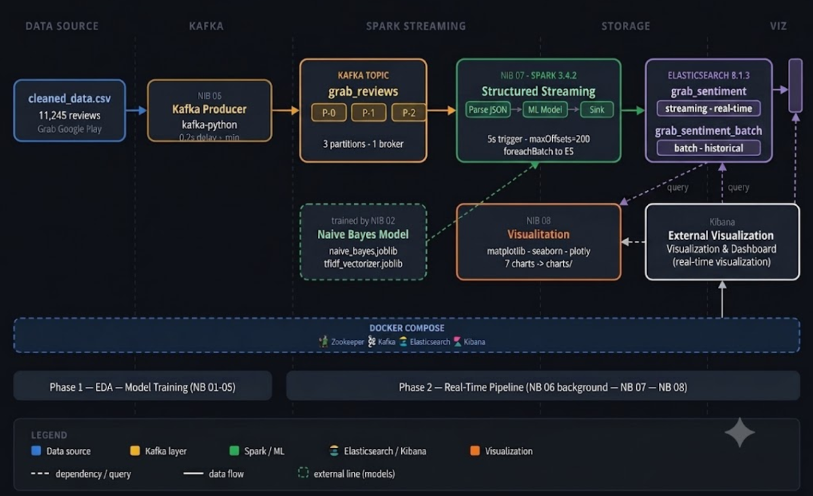

The WebMiner architecture is designed for **end-to-end real-time sentiment analysis** of Grab App reviews scraped from the Google Play Store. The pipeline is split into **two main phases**:

1. **Phase 1 — EDA & Model Training** (Notebooks 01–05)
2. **Phase 2 — Real-Time Pipeline** (Notebooks 06–08 via Kafka, Spark, Elasticsearch & Kibana)

### 🔹 1. Data Collection

- Grab App reviews are scraped from the Google Play Store using `google-play-scraper`.
- The raw data (`grab_reviews_raw.csv`) is stored locally and served as the foundation for all subsequent steps.

### 🔹 2. Data Preparation & EDA

- Data is cleaned and normalised in `preprocessing.ipynb`.
- Exploratory Data Analysis (EDA) is conducted in `01_eda_split.ipynb`, covering class distribution, token lengths, and word cloud visualisations.
- The cleaned dataset is saved as `cleaned_data.csv` and split into training and testing sets.

### 🔹 3. Model Training

Three sentiment classification models are trained and evaluated:

| Model | Accuracy | Macro-F1 |
| :--- | :---: | :---: |
| **Naive Bayes** | 0.759 | 0.623 |
| **LSTM** | **0.845** | 0.575 |
| **DistilBERT** | 0.801 | **0.637** |

All three models are compared in `05_compare_models.ipynb` for accuracy, F1-score, computational cost, and per-class performance.

### 🔹 4. Real-Time Streaming Pipeline

- `06_kafka_producer.ipynb` streams `cleaned_data.csv` into a Kafka topic (`grab_reviews`) with 3 partitions.
- `07_spark_streaming.ipynb` consumes the Kafka stream using **Spark Structured Streaming**, applies the trained **Naive Bayes model** for inference, and sinks results to **Elasticsearch** (index: `grab_sentiment` for real-time, `grab_sentiment_batch` for historical).
- The entire infrastructure (Zookeeper, Kafka, Elasticsearch, Kibana) is orchestrated through `docker-compose.yml`.

### 🔹 5. Visualization

- `08_visualization.ipynb` produces sentiment distribution charts using `matplotlib`, `seaborn`, and `plotly`.
- **Kibana** is used for real-time dashboard visualisation of streaming sentiment predictions.

---

## 🧰 Technologies Used

| Technology | Description |
| :--- | :--- |
| **Google Play Scraper** | Extracts user reviews from Google Play Store |
| **Apache Kafka** | Distributed event streaming platform for real-time data ingestion |
| **Apache Spark (PySpark)** | Big data framework for preprocessing and Structured Streaming |
| **Naive Bayes** | Fast, lightweight ML model used for real-time sentiment inference |
| **LSTM** | Deep learning model capturing sequential text dependencies |
| **DistilBERT** | Transformer-based model with highest per-class F1 performance |
| **Elasticsearch** | Real-time search and analytics engine for storing predictions |
| **Kibana** | Visualisation tool for Elasticsearch sentiment dashboards |
| **Docker Compose** | Container orchestration for the full streaming stack |
| **Python** | Primary language used across the entire pipeline |

---

## 🚀 Step-by-Step Pipeline Execution

This section outlines the full setup and execution flow for running the WebMiner sentiment analysis pipeline.

---

### Phase 1 — EDA & Model Training

> Run the notebooks below sequentially in the `notebooks/` directory.

#### 1️⃣ Scrape & Prepare Data
```bash
# Run in Jupyter
notebooks/grab_scraper.ipynb        # Scrape Grab reviews
notebooks/preprocessing.ipynb      # Clean and normalise text
notebooks/01_eda_split.ipynb        # EDA and train/test split
```

#### 2️⃣ Train Sentiment Models
```bash
notebooks/02_model_naive_bayes.ipynb   # Train Naive Bayes
notebooks/03_model_lstm.ipynb          # Train LSTM
notebooks/04_model_distilbert.ipynb    # Train DistilBERT
notebooks/05_compare_models.ipynb      # Compare all models
```

---

### Phase 2 — Real-Time Pipeline

#### 3️⃣ Start the Full Infrastructure with Docker Compose
```bash
# From the kafka_spark_pipeline/ directory
docker-compose up -d
```
This brings up **Zookeeper**, **Kafka**, **Elasticsearch**, and **Kibana** in detached mode.

#### 4️⃣ Run the Kafka Producer
```bash
# Open kafka_spark_pipeline/06_kafka_producer.ipynb in Jupyter
# Streams cleaned_data.csv into the Kafka topic: grab_reviews
```

#### 5️⃣ Start Spark Structured Streaming Consumer
```bash
# Open kafka_spark_pipeline/07_spark_streaming.ipynb in Jupyter
# Consumes from Kafka → applies NB model → sinks to Elasticsearch
```

#### 6️⃣ Generate Visualisations
```bash
# Open kafka_spark_pipeline/08_visualization.ipynb in Jupyter
# Produces local charts and connects to Kibana
```

#### 7️⃣ Access Kibana Dashboard
- Open your browser at: [http://localhost:5601](http://localhost:5601)
- Navigate to **Stack Management → Data Views → Create Data View**
  - Name: `grab_sentiment*`
- Navigate to **Dashboard → Create Visualisation**

Alternatively, run the automated PowerShell script to execute all phases:
```powershell
# From kafka_spark_pipeline/
.\run_all.ps1
```

---

## 📊 Exploratory Data Analysis

### 🟩 Class Distribution
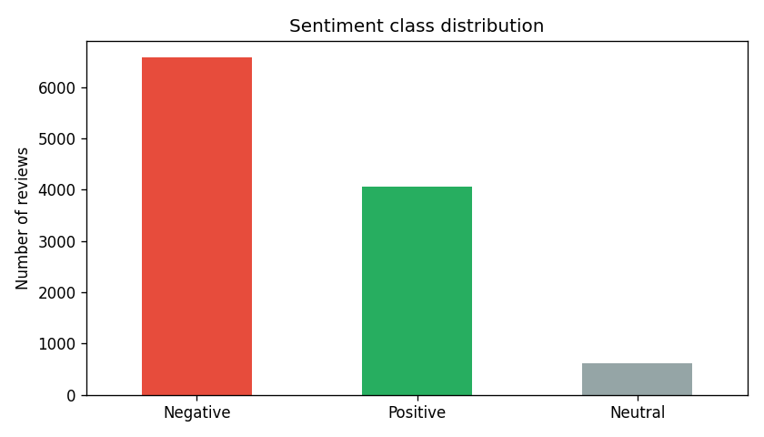

### ☁️ Word Clouds (Positive vs Negative Reviews)
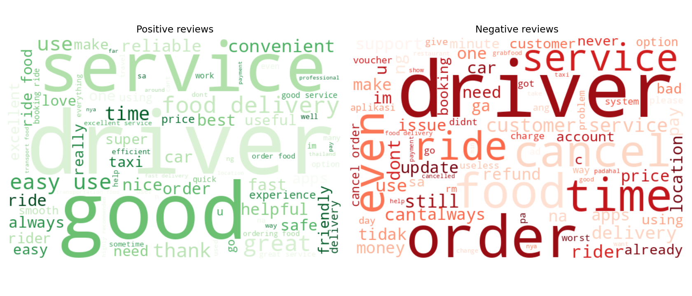

### 📏 Token Length Distribution
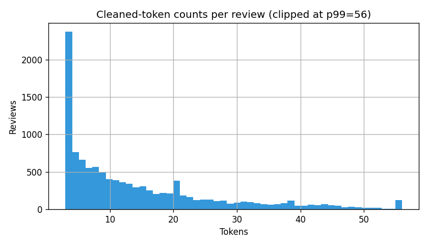

---

## 🤖 Model Results

### 📈 Accuracy vs Macro-F1 (Test Set)
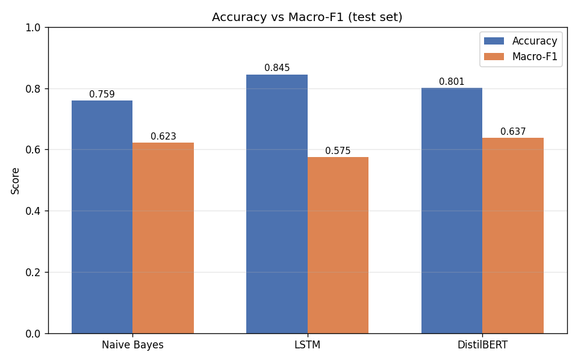

### 💰 Computational Cost Comparison
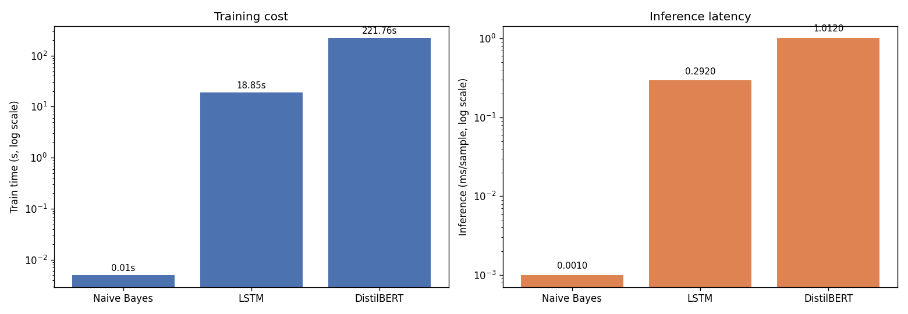

### 🎯 Per-Class F1 Score
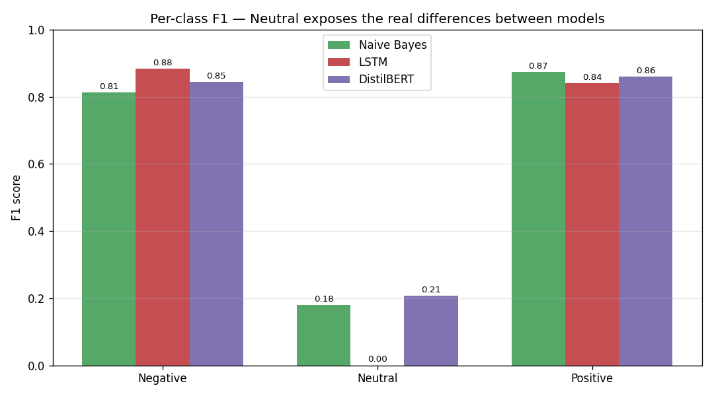

### 🔵 Naive Bayes Confusion Matrix
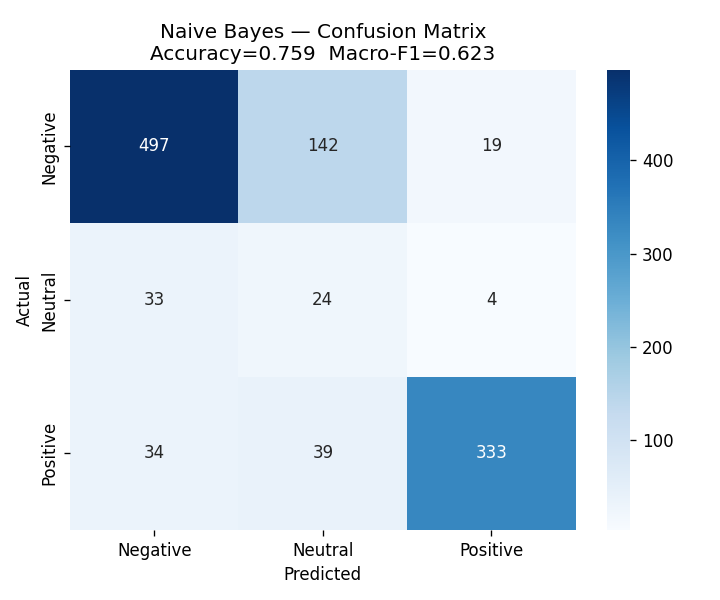

### 🟠 LSTM Confusion Matrix
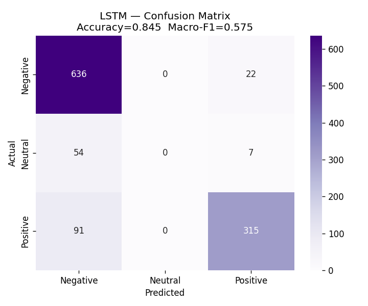

### 🟣 LSTM Training Curves
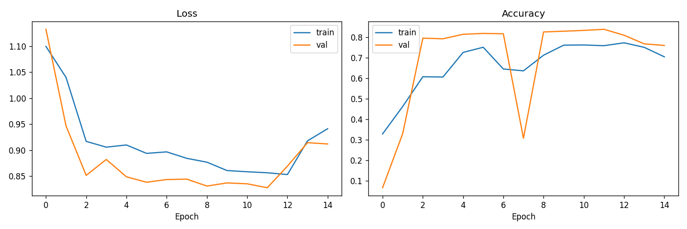

### 🔴 DistilBERT Confusion Matrix
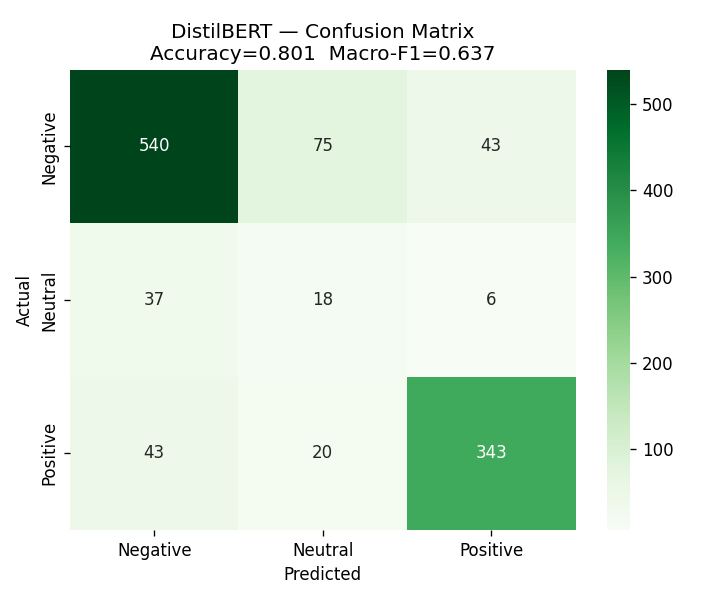

---

## 📎 Quick Links

<table>
  <tr>
    <th>Document</th>
    <th>Link</th>
  </tr>
  <tr>
    <td>Project Report</td>
    <td align="center">
      <a href="reports/HPDP Project 2 Report.pdf"></a>
    </td>
  </tr>
  <tr>
    <td>Presentation Slides</td>
    <td align="center">
      <a href="reports/presentation_slides.pptx">
    </td>
  </tr>
  <tr>
    <td>Presentation Video</td>
    <td align="center">
      <a href="https://youtu.be/ZazzZO4Dkg8"></a>
    </td>
  </tr>
  <tr>
    <td>Raw Data</td>
    <td align="center">
      <a href="data/grab_reviews_raw.csv"></a>
    </td>
  </tr>
  <tr>
    <td>Cleaned Data</td>
    <td align="center">
      <a href="data/cleaned_data.csv"></a>
    </td>
  </tr>
  <tr>
    <td>Naive Bayes Notebook</td>
    <td align="center">
      <a href="notebooks/02_model_naive_bayes.ipynb"></a>
    </td>
  </tr>
  <tr>
    <td>LSTM Notebook</td>
    <td align="center">
      <a href="notebooks/03_model_lstm.ipynb"></a>
    </td>
  </tr>
  <tr>
    <td>DistilBERT Notebook</td>
    <td align="center">
      <a href="notebooks/04_model_distilbert.ipynb"></a>
    </td>
  </tr>
  <tr>
    <td>Kafka Producer Notebook</td>
    <td align="center">
      <a href="kafka_spark_pipeline/06_kafka_producer.ipynb"></a>
    </td>
  </tr>
  <tr>
    <td>Spark Streaming Notebook</td>
    <td align="center">
      <a href="kafka_spark_pipeline/07_spark_streaming.ipynb"></a>
    </td>
  </tr>
</table>

---
