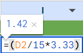
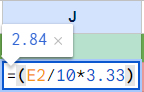
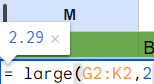
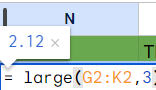
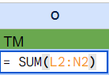
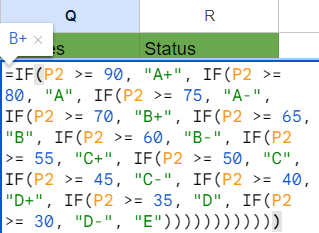
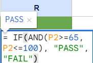

# Assignment 1a: Examination results

### Group Name: (3H) HAHAHA

1. Import the Dataset1.txt into Google Sheets, on the left upper menu bar, choose **"File" -> "Import"**.

   
2. To convert the Academic, Sports, Co-Curriculum, Test_1 and Test_2 data values to 2 decimal places, select the column and choose <b>"Increase decimal places"</b> or <b>"Decrease decimal places"</b> on the menu bar.

 

3. To provide new value for columns B through F, at column G,
<b>enter the formula: "=(B2/61*3.33)"</b>
and fill the remaining rows by <b>Ctrl + Enter</b>, the same procedure for column H, I, J, and K with different formula, and make sure to change them to 2 decimal places like step 2

  

 
 
 

 

4. For another 3 new column which are B1, B2, and B3 that want to find the highest, second highest, and third highest value from column G to K, in the new column,
enter  
B1: <b>"=large(G2:K2,1)"</b>

 

B2: <b>"=large(G2:K2,2)"</b>

 

B3: <b>"=large(G2:K2,3)"</b>

 

5. To know the total points, at Column O (TM), enter:<b>"=SUM(L2:N2)"</b> which sum the column L to N.

 

6. To calculate the percentage in column O (TM), in column P, enter:<b>"=O2*10"</b>, and make sure to change them to 2 decimal places like step 2

 

7. To know the grade of each record, at column Q row 2, 
enter:<b>"=IF(P2 >= 90, "A+", IF(P2 >= 80, "A", IF(P2 >= 75, "A-", IF(P2 >= 70, "B+", IF(P2 >= 65, "B", IF(P2 >= 60, "B-", IF(P2 >= 55, "C+", IF(P2 >= 50, "C", IF(P2 >= 45, "C-", IF(P2 >= 40, "D+", IF(P2 >= 35, "D", IF(P2 >= 30, "D-", "E"))))))))))))"</b>

 

8. To categorize the grades as PASS or FAIL, at Column R, 
enter:<b>"= IF(AND(P2>=65, P2<=100), "PASS", "FAIL")"</b>

 

  
## Contribution 🛠️
Please create an [Issue](https://github.com/drshahizan/BDM/issues) for any improvements, suggestions or errors in the content.

You can also contact me using [Linkedin](https://www.linkedin.com/in/drshahizan/) for any other queries or feedback.

