</a>

# Assignment 1a: Examination results

## Group Name: (3H) HAHAHA
### Group Members

| Name                                     | Matrix Number | 
| :---------------------------------------- | :-------------: |
| IZZAT HAQEEMI BIN HAIRUDIN | A21EC0033	   |    
| MOHAMAD AZRI HADIF BIN MOHAMMAD RIZAL	              | A21EC0054   |     
| NG SUANG JOO     | A21EC0102   |   
| NG ZI XING | A21EC0213   |  

## Table of Contents
- [Assignment 1a: Examination results](#assignment-1a-examination-results)
   * [Data Preprocessing](#data-preprocessing)
      + [Import Data from .txt](#import-data-from-txt)
      + [Set number format](#set-number-format)
      + [Normalizing the range of data](#normalizing-the-range-of-data)
      + [The first three highest scores](#the-first-three-highest-scores)
      + [Total Points](#total-points)
      + [Grades](#grades)
      + [Status](#status)
      + [Color the pass record](#color-the-pass-record)
   * [Data Visualization](#data-visualization)
      + [i. Determine the min, maximum, and average values](#i-determine-the-min-maximum-and-average-values)
      + [ii. Display grading results as charts and tables.](#ii-display-grading-results-as-charts-and-tables)
         - [Grades Column Chart](#grades-column-chart)
         - [Grades Table Chart](#grades-table-chart)
      + [iii. Show the total number of records. Please display Pass and Fail in the form of a percentage and the number of records.](#iii-show-the-total-number-of-records-please-display-pass-and-fail-in-the-form-of-a-percentage-and-the-number-of-records)
         - [Total Number scorecard chart](#total-number-scorecard-chart)
         - [Fail and Pass scorecard chart](#fail-and-pass-scorecard-chart)
      + [iv. Create Pass and Fail views in the form of pie charts as well.](#iv-create-pass-and-fail-views-in-the-form-of-pie-charts-as-well)
         - [Status Doughnut chart](#status-doughnut-chart)
   * [Contribution 🛠️](#contribution-)

  

## Data Preprocessing

### Import Data from .txt
1. Import the Dataset1.txt into Google Sheets, on the left upper menu bar, choose **"File" -> "Import"**.

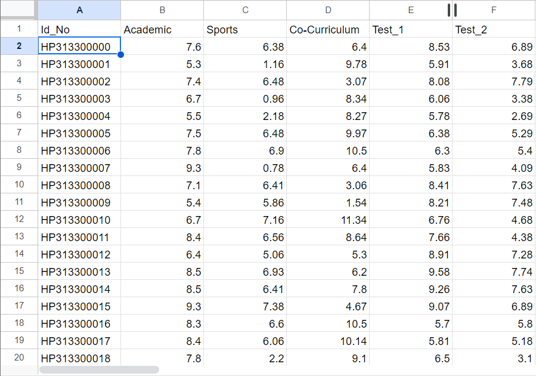
   

### Set number format
2. To convert the Academic, Sports, Co-Curriculum, Test_1 and Test_2 data values to 2 decimal places, select the column and choose <b>"Increase decimal places"</b> or <b>"Decrease decimal places"</b> on the menu bar.

 

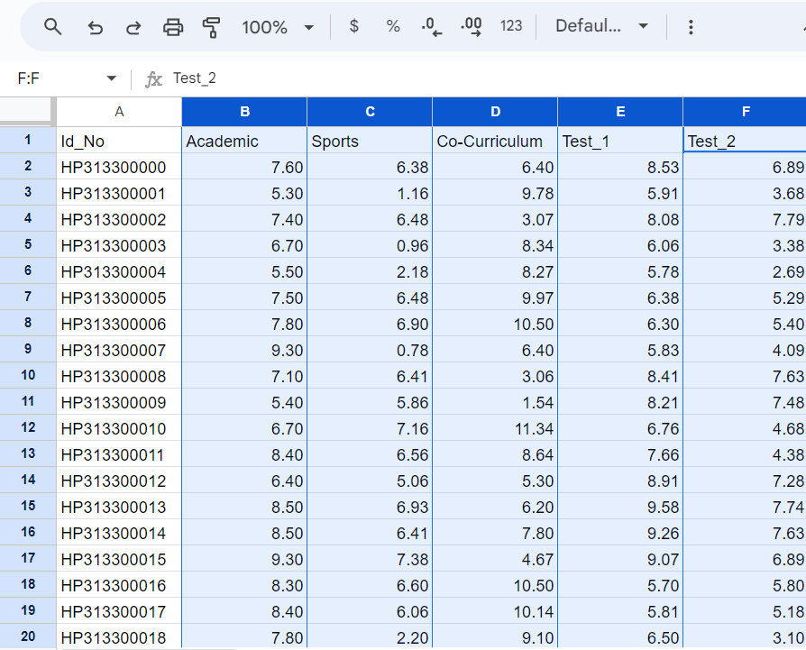 

### Normalizing the range of data
3. To provide new value for columns B through F, at column G,
<b>enter the formula: "=(B2/61*3.33)"</b>
and fill the remaining rows by <b>Ctrl + Enter</b>, the same procedure for column H, I, J, and K with different formula, and repeat step 2

  

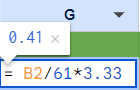
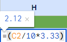 
 
 
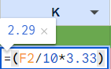
 

###  The first three highest scores
4. For another 3 new column which are B1, B2, and B3 that want to find the highest, second highest, and third highest value from column G to K, in the new column,
enter  

B1: <b>"=large(G2:K2,1)"</b>
 

B2: <b>"=large(G2:K2,2)"</b>
 

B3: <b>"=large(G2:K2,3)"</b>
 

### Total Points
5. To know the total points, at Column O (TM), enter:<b>"=SUM(L2:N2)"</b> which sum the column L to N.

 

6. To calculate the percentage in column O (TM), in column P, enter:<b>"=O2*10"</b>, and make sure to change them to 2 decimal places like step 2

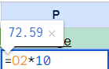 

### Grades
7. To know the grade of each record, at column Q row 2, 
enter:<b>"=IF(P2 >= 90, "A+", IF(P2 >= 80, "A", IF(P2 >= 75, "A-", IF(P2 >= 70, "B+", IF(P2 >= 65, "B", IF(P2 >= 60, "B-", IF(P2 >= 55, "C+", IF(P2 >= 50, "C", IF(P2 >= 45, "C-", IF(P2 >= 40, "D+", IF(P2 >= 35, "D", IF(P2 >= 30, "D-", "E"))))))))))))"</b>

 

### Status
8. To categorize the grades as PASS or FAIL, at Column R, 
enter:<b>"= IF(AND(P2>=65, P2<=100), "PASS", "FAIL")"</b>

 

### Color the pass record

9. To color the pass record, select the status column, right click and select the conditional formating
   
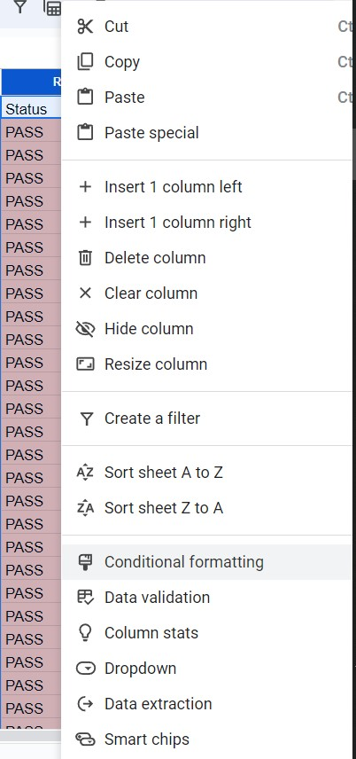 

10. set up the color rule as follow with the condition of once it is passed, the color will be red
    
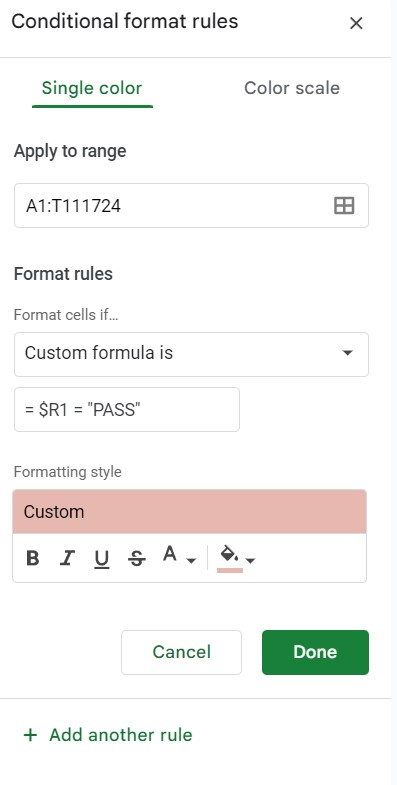 

11. same for the percentage column to set up the conditional formatiing with the following rules
    
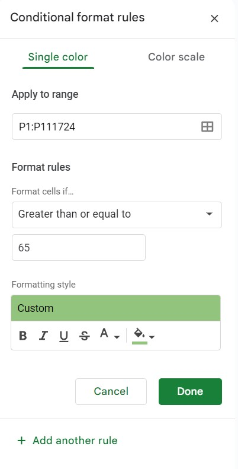 

## Data Visualization

create a new sheet by shift + F11 named dashboard for deign the dashboard

### i. Determine the min, maximum, and average values

1. select the chart logo at the top right corner

   
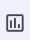 

2. select scorecard chart as chart type

   
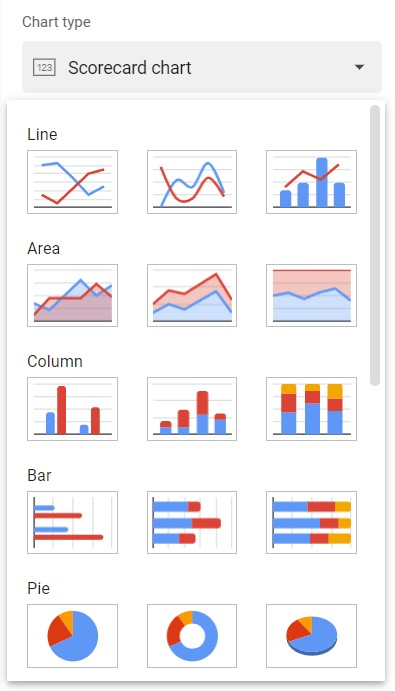 

3. select the data range at sheet with name "Dataset1" and range from "P1:P11520" which is where the "Percentage" column located

   
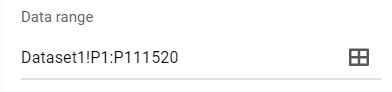 

4. tick aggregate and select the function as "Min", make sure you select the option of "Use first row as headers"

   
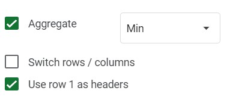 

5. for the chart "Average", repeat the step from 1 ~ 4, but select the aggregate function as Max

   
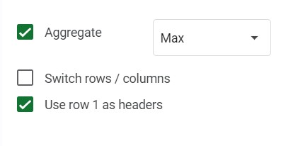 

6. for the chart "Max", repeat the step from 1 ~ 4, but select the aggregate function as Average

   
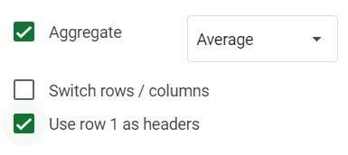 

7. For design the chart, select the customize tab
   
   
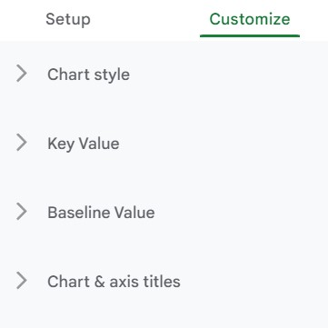 

7. Select Chart Type, can design the chart color and font

   
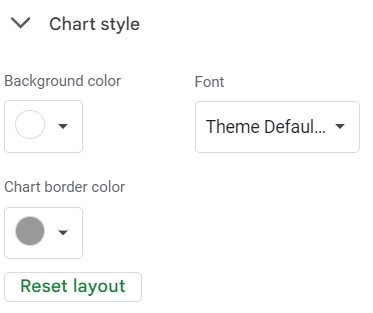 

8. Select Key Value, can design the the value

   
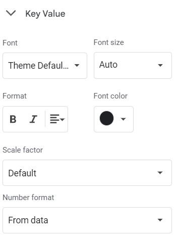 

9. select chat&axis title, to set the the chart title

    
 

### ii. Display grading results as charts and tables.

#### Grades Column Chart
1. select column chart as chart type

   
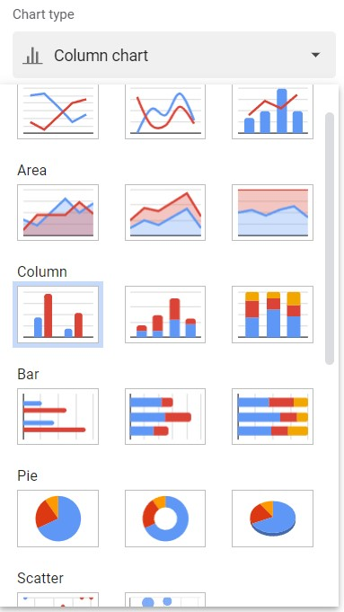 

2. select the data range at sheet with name "Dataset1" and range from "P1:P11520" which is where the "Grade" column located

   
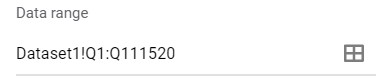 

3. make sure tick the aggregate and "use row 1 as headers"

   
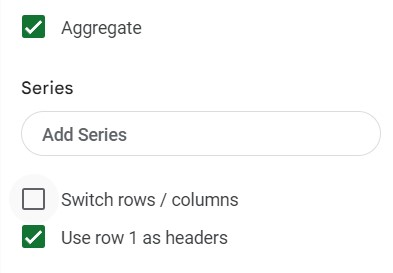 

4. select the "chart title" option and set the chart tite as "Grading"

   
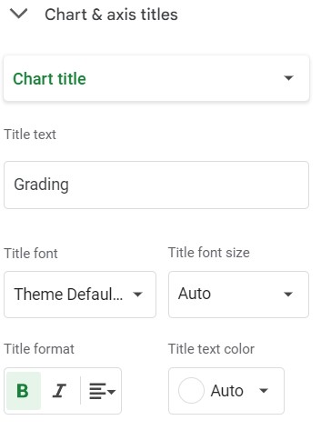 

5. select the "horizontal axis title" option and set the title as "Grade"

   
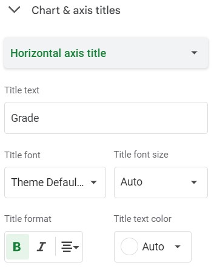 
 

6. select the "vertical axis title" option and set the title as "Num. of Students"

   
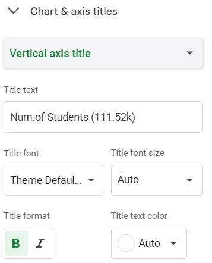 
 

7. to ensure the bar chart sorting according to the order, should make sure to sorting the sheet according to the percenatage

   
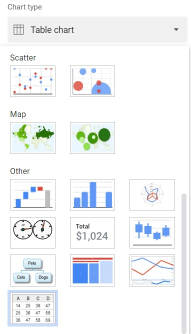 
 

#### Grades Table Chart

1. To ensure the table will have a "total row" at the last row, we have to create a new column in the original dataset with the following formula

   
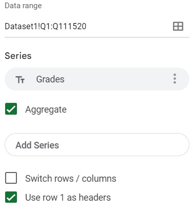 

2. To prevent this added column affect the appearance of the original dataset, we can set the font color same as the background (white) and set the
   following conditional formating for the added column:

   
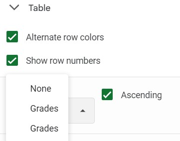 
 

3. Back to the dashboard sheet, create a new table chart

   
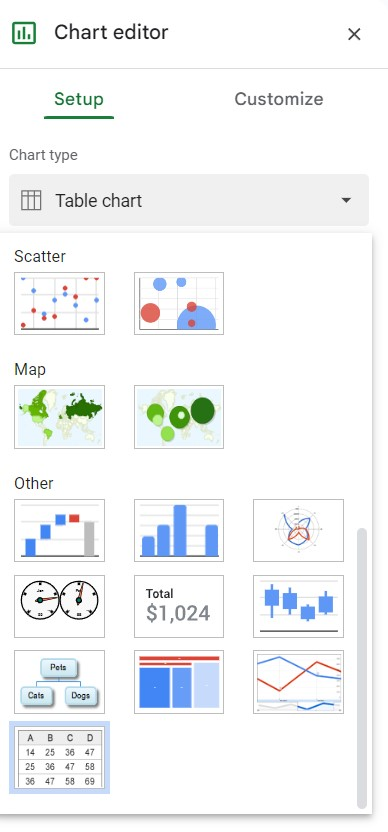 

4. set the dataset range as follow image where is the Grades column located, and make sure tick the aggregate

   
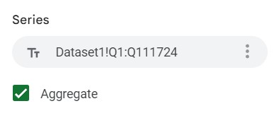 
 

5. To add the "total row", click the add series and add the data range which is where the added column located

   
 

   
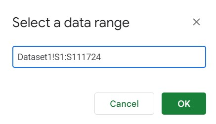 

6. select the combine ranges as vertically

   
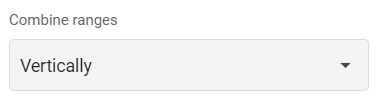 

7. ensure to tick the first column as header option

   
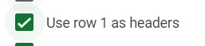 
 

### iii. Show the total number of records. Please display Pass and Fail in the form of a percentage and the number of records.

#### Total Number scorecard chart

1. create a new scorecard chart

   
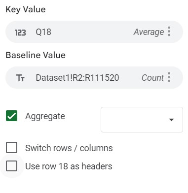 

2. add the data range and key value as where the total value located in statistics sheet

   
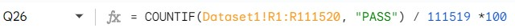 

3. go to customize -> key value, set the scale factor as 1000 and select number format as custom to set the suffix as K

   
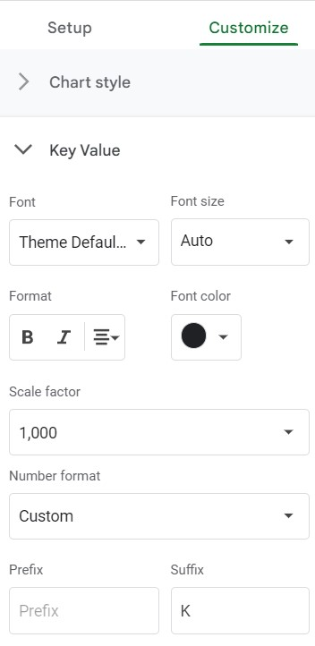 

#### Fail and Pass scorecard chart

1. This scorecard card is consist of two score card stacked together to show the percentage and the actual number:

   
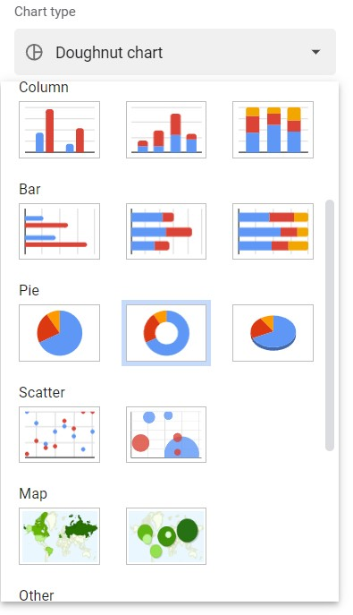 

   
   
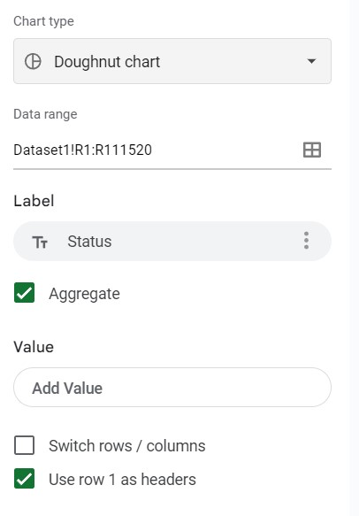 

   
   
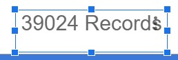 
 

2. to set up the fail value scorecord, set the data range as where the fail value located in the statistics sheet:

   
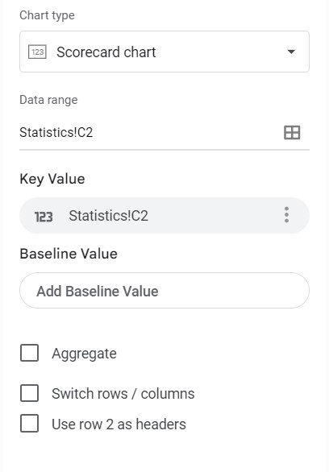 
 

3. go to customize and follow the following setting to add the suffix %

   
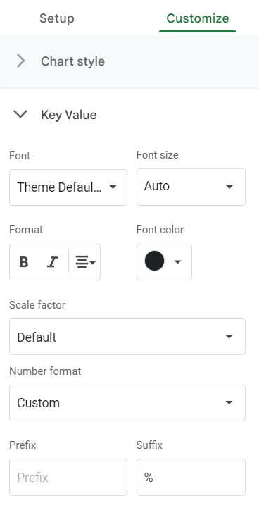 

4. set the title as "Fail"

   
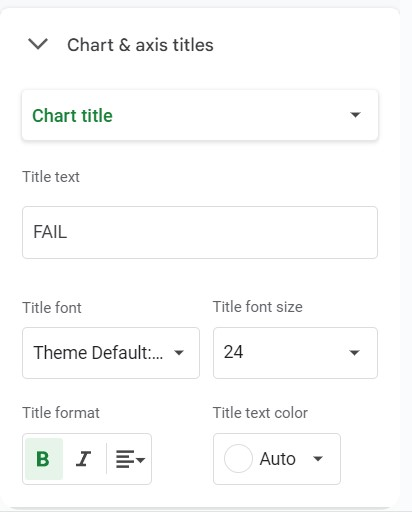 

5. to set up the number scorecard, create new one score card and set the data range as where the fail percentage located at statistics sheet

   
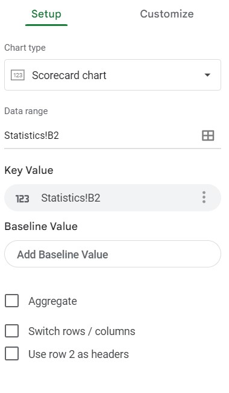 

6. go to customize -> key value to set the suffix as "records"

   
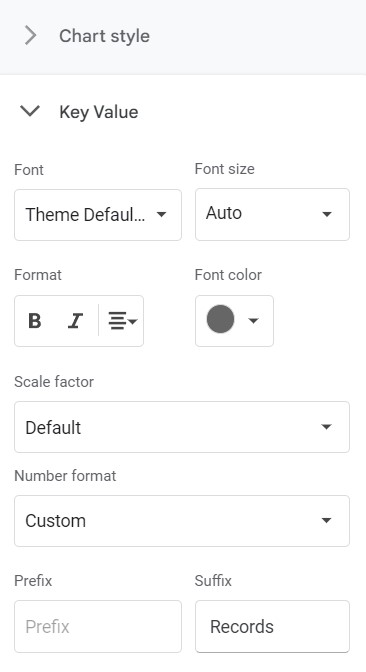 

7. set the border of the number scorecard same as the background color of the percentage scorecard then statck them together

   
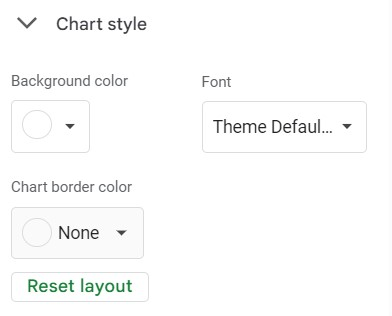 

8. repeat step 1 ~ 7 to set up the pass scorecard except reset the data range as where pass value and percentage locateed and title as "Pass"

   
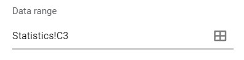 

   
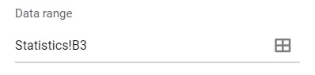 

### iv. Create Pass and Fail views in the form of pie charts as well.

#### Status Doughnut chart
1. To ease the following process create a new sheet named "Statistics" and set the formula as stated:

   
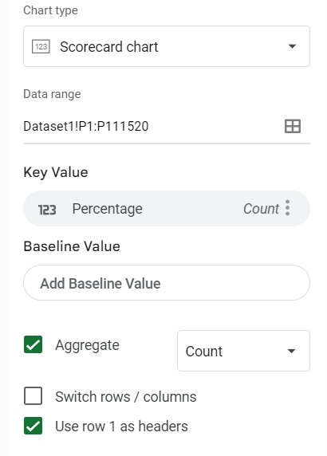 
 

   a. B4 : = COUNT(Dataset1!P1:P111520)
   b. B2 : = COUNTIF(Dataset1!R1:R111520, "FAIL")
   c. B3 : = B4-B2
   d. C2 : = B2/B4*100
   e. C3 : = 100-C2

2. back to dashboard sheet, create a doughnut chart:

   
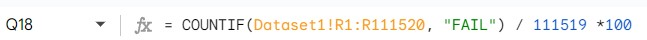 

3. select the data range as where status column located, and follow the following setting

   
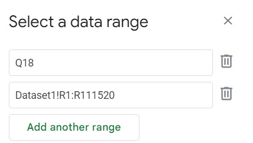 

  
## Contribution 🛠️
Please create an [Issue](https://github.com/drshahizan/HPDP/issues) for any improvements, suggestions or errors in the content.

You can also contact me using [Linkedin](https://www.linkedin.com/in/drshahizan/) for any other queries or feedback.

