

# Assignment 1a: Examination results

### Group Name: BYTE NAVIGATORS
### Group Members

| Name                                     | Matrix Number | Task |
| :---------------------------------------- | :-------------: | ------------- |
| LOO ZHI YUAN            |A21EC0197      |Data Preprocessing|
| SOO WAN YING              |A21EC0227      |Documentation      |
| LAU YEE CHI              |A21EC0042      |Visualization     |

### Table of Contents
+ [Import Dataset](#dataset_import)
+ [Data Preprocessing](#dataset_preprocessing)
+ [Data Processing](#dataset_processing)
+ [Create Dashboard](#create_dashboard)
  + [Pass and Fail Views](#passfail_dashboard)
  + [Total Number of Records](#total_dashboard)
  + [Pass Percentage](#pass_dashboard)
  + [Fail Percentage](#fail_dashboard)
  + [Maximum Value](#max_dashboard)
  + [Minimum Value](#min_dashboard)
  + [Average Value](#avg_dashboard)
  + [Number of Students and Grades](#numstu_grades_dashboard)
  + [Total Number of Grades](#grade_dashboard)
+ [Dashboard](#dashboard)
+ [Contributions](#contribution)

## Import Dataset 
1. Click on the **"File"** menu and select **"Import"**.

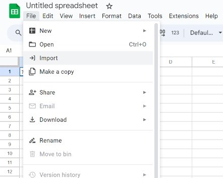

 <em> Figure 1: Import data </em> 
 

2. Click on the **"Upload"** and select the file to import from computer.

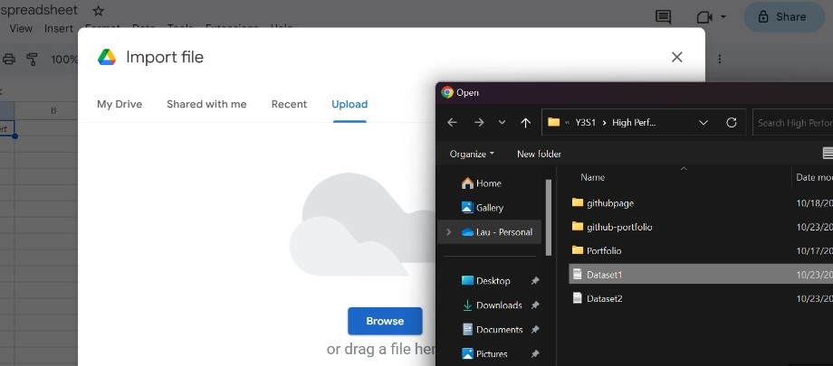
  

 <em> Figure 2: Upload data </em> 
 

3. Click **"Import data"** button after configuring the setting.

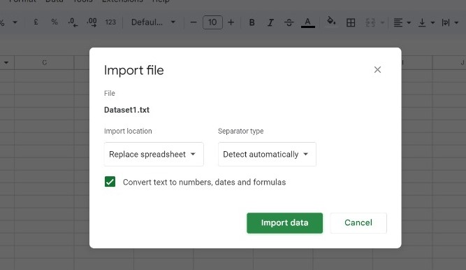

 <em> Figure 3: Import data </em> 
 

4. The data was imported sucessfully.

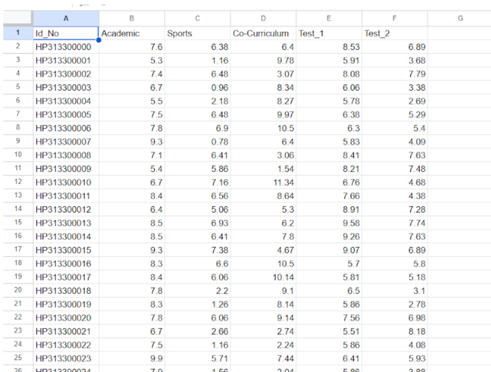

 <em> Figure 4: Dataset1 imported successfully </em> 
 

## Data Preprocessing 
1. Select the range of cells that contain data need to be convert to 2 decimal places and click on the **"Format"**, and select **"Number"**.

 

 <em> Figure 5: Convert the data to 2 decimal places </em> 
 

2. The data values was displayed in two decimal places.

 <em> Figure 6: The data converted to 2 decimal places </em> 
 

## Data Processing 
1. Use function **"=(B2/61*3.33)"** to update the new maximum value of 3.33, same procedure apply to column H **"(=C2/10*3.33)"**, I **"(=D2/15*3.33)"**, J **"(=E2/10*3.33)"**, and K **"(=F2/10*3.33)"** with different function.

 <em> Figure 7: Function used to update the new maximum value </em> 
 

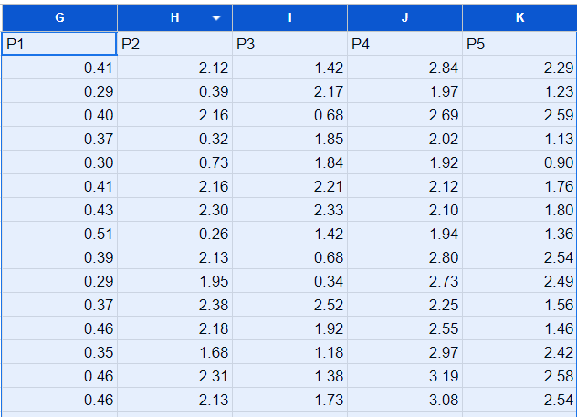

 <em> Figure 8: The updated data with new maximum value </em> 
 

2. Use function **"=LARGE(data,n)"** to find the highest, second highest and third highest value for column G to K.

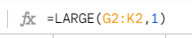

 <em> Figure 9: Function used to find the highest value </em> 
 

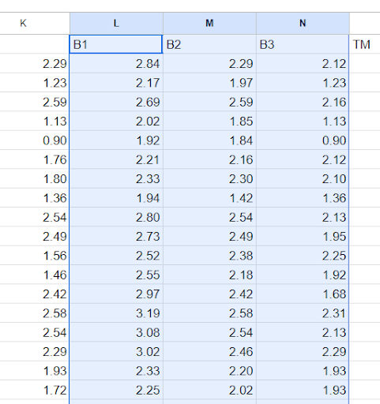
  

 <em> Figure 10: The updated data with  B1 is the highest, B2 is the second highest and B3 is the third highest</em> 
 

3. Use function **"=SUM(value1)"** to calculate the total point for column L to N.

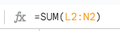
 

 <em> Figure 11: Function used to calculate the sum </em> 
 

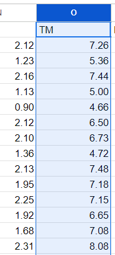
  

 <em> Figure 12: The total point was calculated for each row </em> 
 

4. Multiply the value in column O with 10 to calculate the percentage in column P.

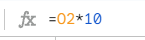

 <em> Figure 13: Function used to calculate percentafe </em> 
 

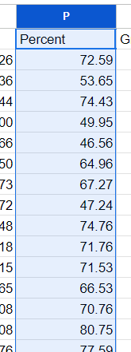

 <em> Figure 14: The caulcuated percentage </em> 
 

5. Use function **"=IF(P2>=90,"A+",IF(P2>=80,"A",IF(P2>=75,"A-",IF(P2>=70,"B+",IF(P2>=65,"B",IF(P2>=60,"B-",IF(P2>=55,"C+",IF(P2>=50,"C",IF(P2>=45,"C-",IF(P2>=40,"D+",IF(P2>=35,"D",IF(P2>=30,"D-","E"))))))))))))"** to assign the grade of each record.

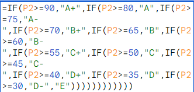
 

 <em> Figure 15: Function used to assign the grade </em> 
 

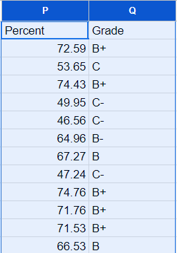

 <em> Figure 16: The grade was updated for each record </em> 
 

6. Use function **"=IF(P2>=65,"Pass","Fail")"** to categorize the grades as PASS or FAIL.

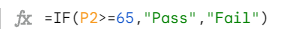
 

 <em> Figure 17: Function used to assign the grade </em> 
 

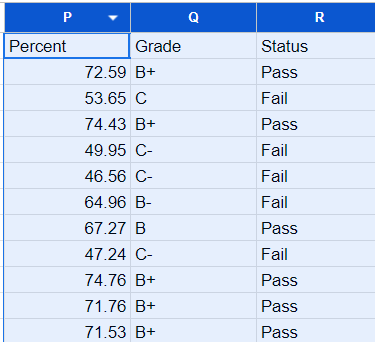
 

 <em> Figure 18: The status for each grade was updated </em> 
 

7. Use **"Conditional Formatting"** to colour column P with green and colour the Pass line with a light red.

  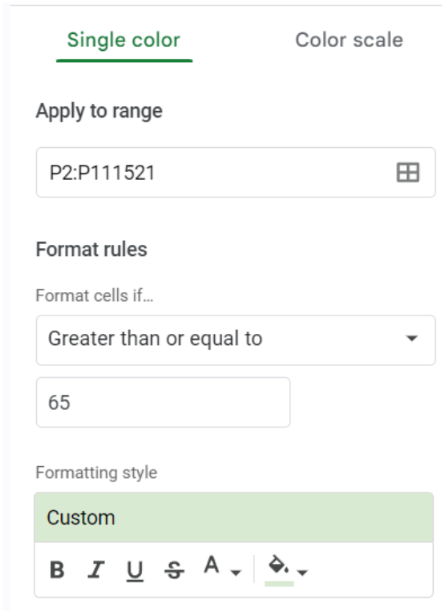
  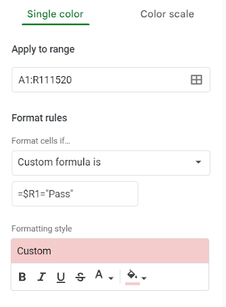

 <em> Figure 19 & 20: Conditional formatting to colour the column </em> 
 

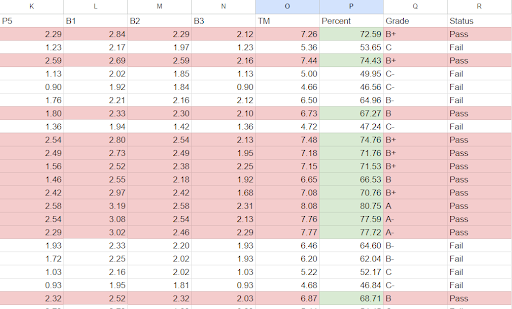
 

 <em> Figure 21: Data after conditional formatting </em> 
 

8. Use **"Text color"** to colour the column L, M and N (B1, B2, B3) into red colour.
   
   Use "CTRL + Shift + ↓(Downward Arrow)" to select the whole column, repeat this step on column L, M and L. Then, change the text colour into red colour.

  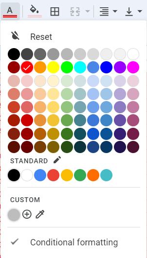

 <em> Figure 22: Text color to colour the columns </em> 
 

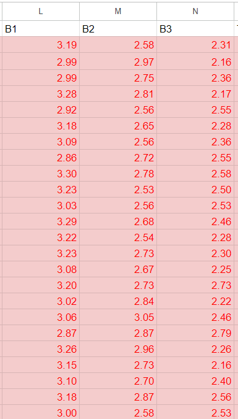
 

 <em> Figure 23: The columns colour in red </em> 
 
   
## Create Dashboard 
1. Create and rename **"Dashboard"** at new spreadsheet.

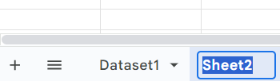
 

 <em> Figure 24: Create new speardsheet through "+" button </em> 
 

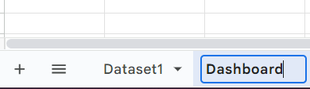
 

 <em> Figure 25: Rename the spreadsheet to "Dashboard" </em> 
 

2. Insert new chart into the "Dashboard" spreadsheet
   
   Insert the new chart by clicking the "Insert" at the menu on top. Then, choose "Chart" to insert it.

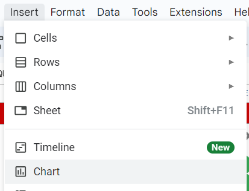
 

 <em> Figure 26: Insert new chart</em> 
 

### Pass and Fail views by using Doughnut chart 

3. Customize and setup the chart
   Setup the chart through the following settings:
   + Chart type: Doughnut chart
   + Data range: R3:R111521 (Dataset1!R3:R111521)

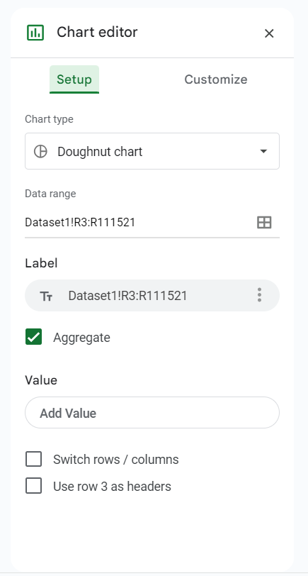
 

 <em> Figure 27: Setup the Pass and Fail views chart</em> 
 

4. Tick the "Aggregate" section

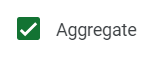
 

 <em> Figure 28: Tick the "Aggregate" section</em> 
 

5. Result of **"Pass and Fail views Doughnut chart"** dashboard

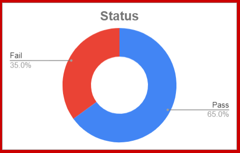
 

 <em> Figure 29: Final result for Pass and Fail views Doughnut chart</em> 
 

### Total Number of Records by using Scorecard chart 
6. Customize and setup the chart
   Setup the chart through the following settings:
   + Chart type: Scorecard chart
   + Data range: R2:R111521 (Dataset1!R2:R111521)
  

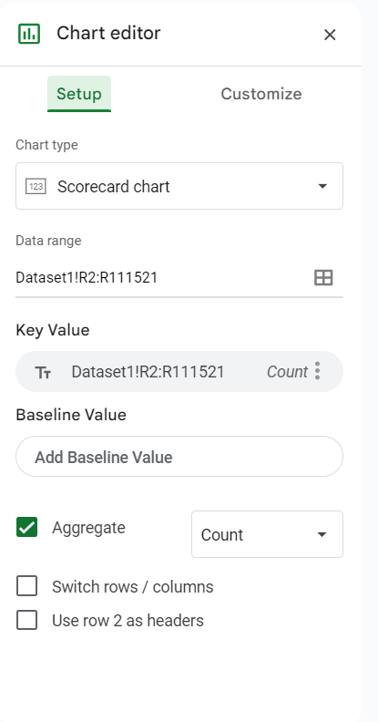
 

 <em> Figure 30: Setup the Total Number of Records chart</em> 
 

7. Tick the "Aggregate" section and choose "Count"

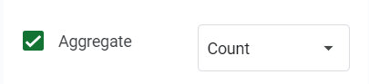
 

 <em> Figure 31: Tick the "Aggregate" section and choose "Count"</em> 
 

8. Result of **"Total Number of Records Scorecard chart"** dashboard

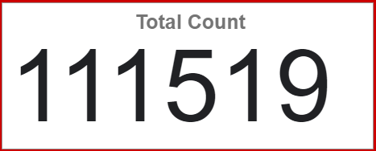
 

 <em> Figure 32: Final result for Total Number of Records Scorecard chart</em> 
 

### Pass Percentage by using Scorecard chart 
9. Customize and setup the chart
   Setup the chart through the following settings:
   + Chart type: Scorecard chart
   + Data range: E26
  

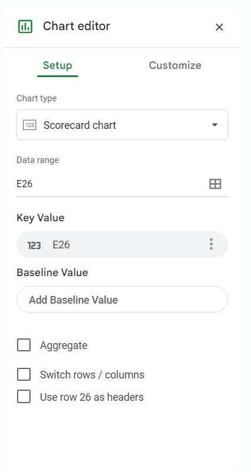
 

 <em> Figure 33: Setup the Pass Percentage chart</em> 
 

10. Result of **"Pass Percentage Scorecard chart"** dashboard

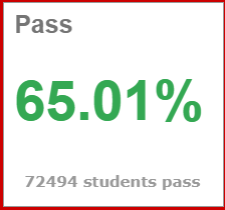
 

 <em> Figure 34: Final result for Pass Percentage Scorecard chart</em> 
 

### Fail Percentage by using Scorecard chart 
11. Customize and setup the chart
   Setup the chart through the following settings:
   + Chart type: Scorecard chart
   + Data range: E33
  

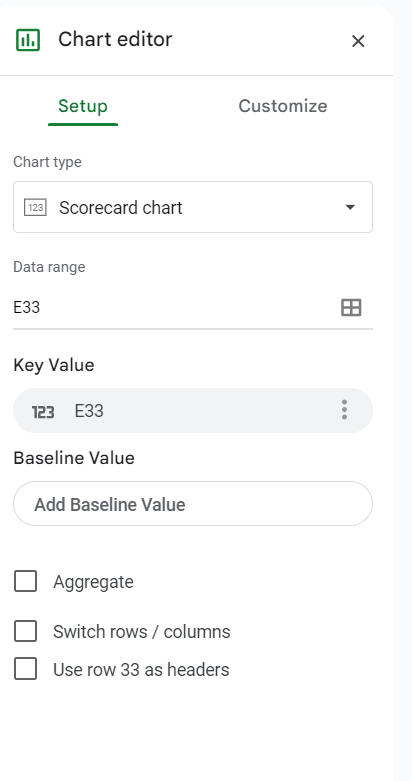
 

 <em> Figure 33: Setup the Fail Percentage chart</em> 
 

12. Result of **"Fail Percentage Scorecard chart"** dashboard

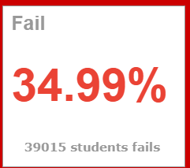
 

 <em> Figure 34: Final result for Fail Percentage Scorecard chart</em> 
 

### Maximum Value by using Scorecard chart 
13. Customize and setup the chart
   Setup the chart through the following settings:
   + Chart type: Scorecard chart
   + Data range: U6:U8, P2:P111725 (Dataset1!U6:U8,Dataset1!P2:P111725)
   + Combine ranges: Horizontally
  

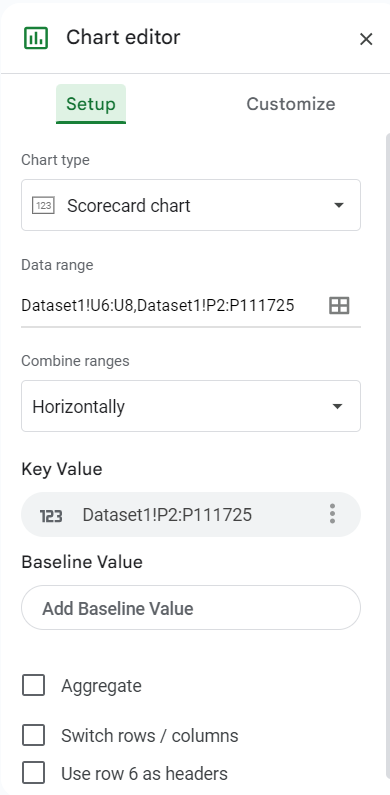
 

 <em> Figure 35: Setup the Maximum Value chart</em> 
 

14. Result of **"Maximum Value Scorecard chart"** dashboard

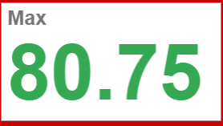
 

 <em> Figure 36: Final result for Maximum Value Scorecard chart</em> 
 

### Minimum Value by using Scorecard chart 
15. Customize and setup the chart
   Setup the chart through the following settings:
   + Chart type: Scorecard chart
   + Data range: R4
  

 

 <em> Figure 37: Setup the Minimum Value chart</em> 
 

16. Result of **"Minimum Value Scorecard chart"** dashboard

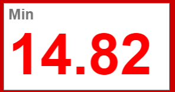
 

 <em> Figure 38: Final result for Minimum Value Scorecard chart</em> 
 

### Average Value by using Scorecard chart 
17. Customize and setup the chart
   Setup the chart through the following settings:
   + Chart type: Scorecard chart
   + Data range: R6
  

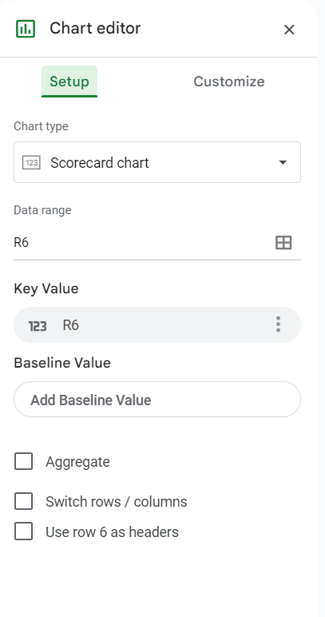
 

 <em> Figure 37: Setup the Average Value chart</em> 
 

18. Result of **"Average Value Scorecard chart"** dashboard

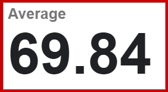
 

 <em> Figure 38: Final result for Average Value Scorecard chart</em> 
 

### Number of Students and Grades by using Column chart 
19. Customize and setup the chart
   Setup the chart through the following settings:
   + Chart type: Column chart
   + Data range: K10:L23
   + Stacking: None
   + X-axis: Grade
   + Series: Total
  

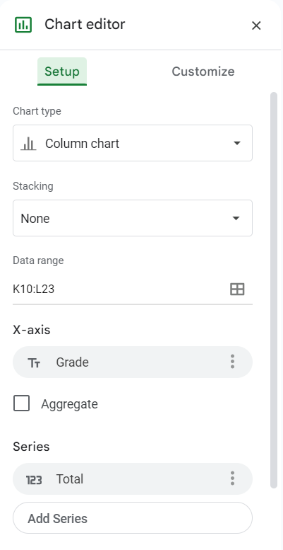
 

 <em> Figure 39: Setup the Number of Students and Grades chart</em> 
 

20. Result of **"Number of Students and Grades Column chart"** dashboard

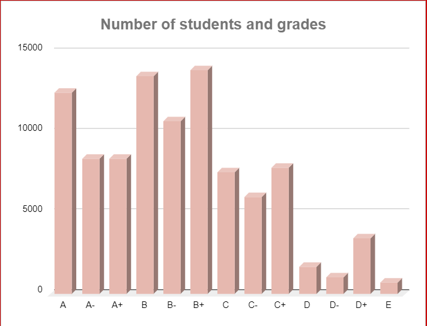
 

 <em> Figure 40: Final result for Number of Students and Grades Column chart</em> 
 

### Total Number of Grades table 
21. Use formula in Figure 41 and Figure 42 to link to total number of grades to the table on dashboard.

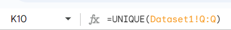
 

 <em> Figure 41: Formula to retrieve the grades</em> 
 

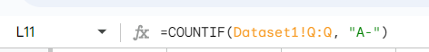
 

 <em> Figure 42: Formula to retrieve the total number of grades</em> 
 

   Repeat the step in Figure 42 for every grades such as. A+, A, A-, B+, B and more.

22. Result of **"Total Number of Grades table"** dashboard

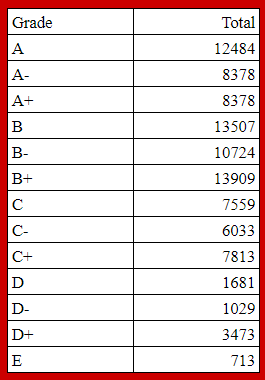
 

 <em> Figure 43: Final result for Total Number of Grades table</em> 
 

## Dashboard 

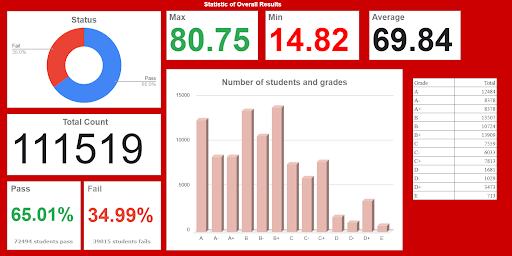
 

 <em> Figure 44: Dashboard </em> 
 

## Contribution 🛠️  
Please create an [Issue](https://github.com/drshahizan/HPDP/issues) for any improvements, suggestions or errors in the content.

You can also contact me using [Linkedin](https://www.linkedin.com/in/drshahizan/) for any other queries or feedback.

