

# Assignment 1b: Sales performance

### Group Name: BYTE NAVIGATORS

### Group Members

| Name                                     | Matrix Number | Task |
| :---------------------------------------- | :-------------: | ------------- |
| LOO ZHI YUAN            |A21EC0197      |Data Preprocessing|
| SOO WAN YING              |A21EC0227      |Documentation      |
| LAU YEE CHI              |A21EC0042      |Visualization     |

### Table of Contents
+ [Import Dataset](#dataset_import)
+ [Data Processing](#data_processing)
+ [Create Dashboard](#create_dashboard)
+ [Dashboard](#dashboard)
+ [Contributions](#contribution)

## Import Dataset 
1. Click on the **"File"** menu and select **"Import"**.

 <em> Figure 1: Import data </em> 
 

2. Click on the **"Upload"** and select the file to import from computer.

 

 <em> Figure 2: Upload data </em> 
 

3. Click **"Import data"** button after configuring the setting.

 <em> Figure 3: Import data </em> 

4. The data was imported sucessfully.

 <em> Figure 4: Dataset2 was imported sucessfully </em> 
 

## Data Processing 
1. Use function **"=UNIQUE(range, by_column, exactly_once)"** to get return of the rows in the order in which they first appear, same procedure apply to sales person, product, sales region, customer, sales year, sales month, and sales qtr.

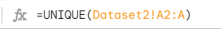

 <em> Figure 5: Use UNIQUE function to get return of the rows in the order in which they first appear </em> 
 

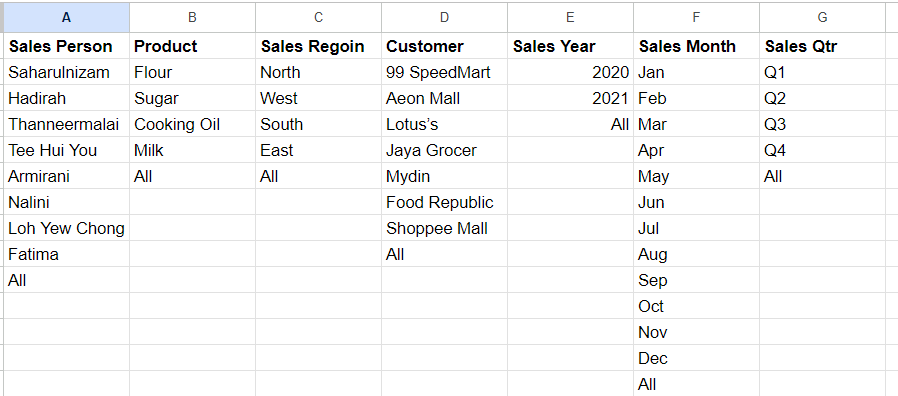
  

 <em> Figure 6: The filtered data after using UNIQUE function  </em> 
 

2. Use **"data validation"** to build the dropdown menu.

  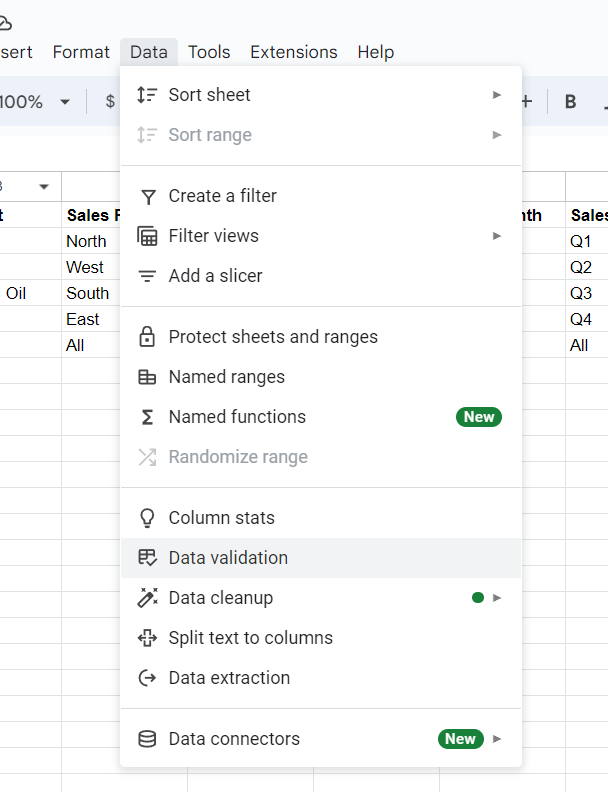
  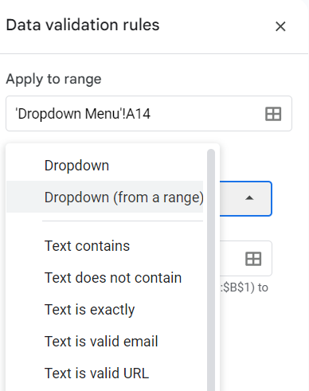

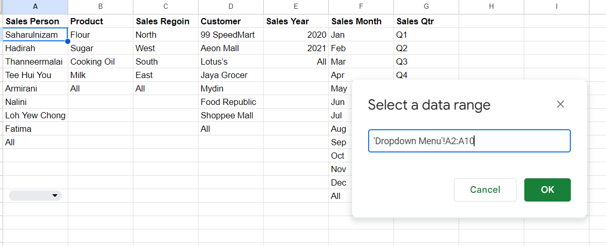
  

 <em> Figure 7 & 8 & 9: Use data validation to build dropdown menu  </em> 
 

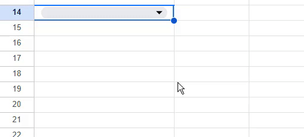
  

 <em> Gif 1: The built dropdown menu after using data validation </em> 
 

3. Use function **"=QUERY(data, query, [headers])"** to retrieve the data.

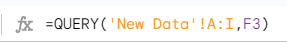
 

 <em> Figure 10: Use QUERY function to retrieve the data  </em> 
 

4. Use function **"IF(logical_expression, value_if_true, value_if_false)"** to combine with **QUERY function** to filter or query data based on specific criteria.

 

 <em> Figure 11: Use IF function to filter the data  </em> 
 

6. Use function **"=CONCATENATE(string1, [string2, ...])"** to combine the cells without losing data.

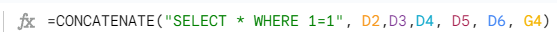
  

 <em> Figure 12: Use CONCATENATE function to combine the cells  </em> 
 

7. Repeat step 3 to step 6 with sales region, sales product, sales person, customers, and month.
  
8. The completed dropdown menu.

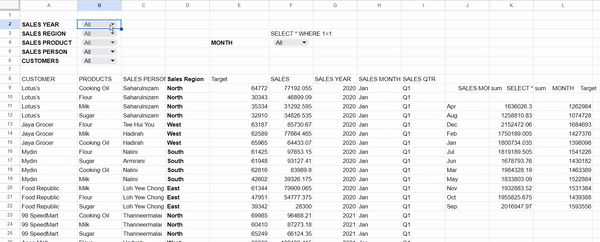

 <em> Gif 2: The completed dropdown menu  </em> 
 

9. Use function **"=QUERY(data, query, [headers])"** to calculate the sum of sales and target.

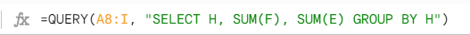
 

 <em> Figure 13: Use QUERY function to select column H and calculate the sum of columns F and E, grouped by column H </em> 
 

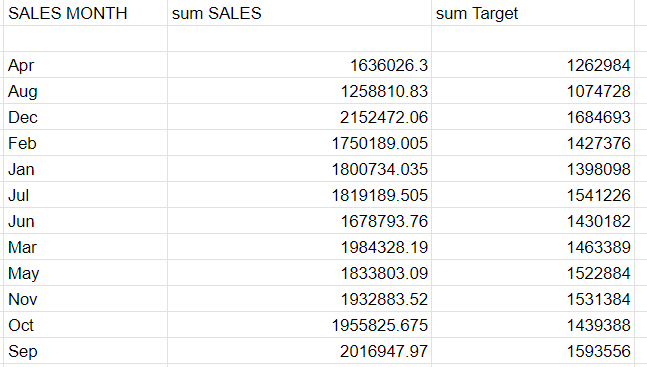
 

 <em> Figure 14: The calculated sum of sales and target</em> 
 
   
## Create Dashboard  
1. Click on the **"Insert"** menu and select **"chart"**.

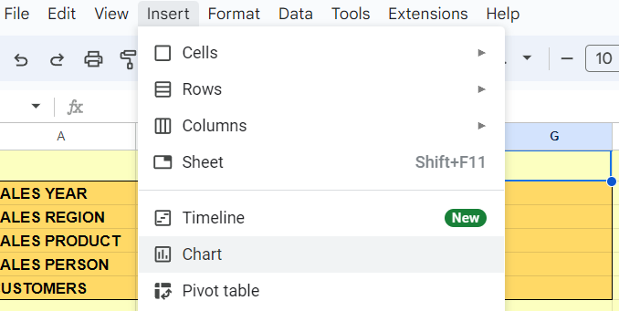

 <em> Figure 15: Insert chart</em> 
 

2. Select **"Line chart"**, and make the following changes:
  + Data range: K11:M22
  + X-axis: K11:M22
  + Series: Sum for L11:M22, and M11:M22

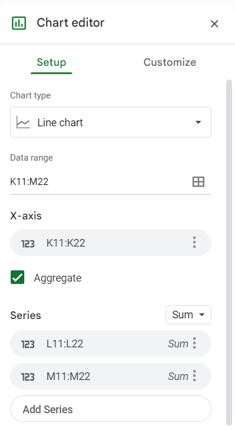

 <em> Figure 16: Chart editor for monthly sales and target</em> 
 

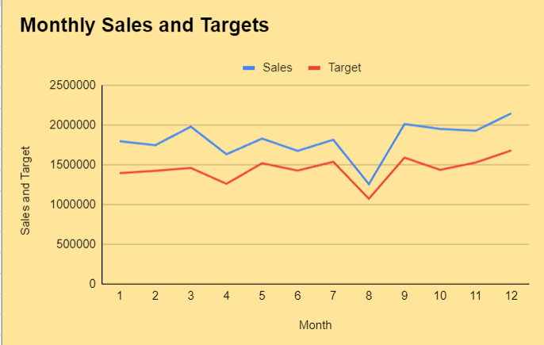

 <em> Figure 17: Line chart for monthly sales and target</em> 
 

3. Repeat step 1, and select **"Column chart"**, and make the following changes:
  + Stacking: None
  + Data range: A8:A331
  + X-axis: CUSTOMER

 <em> Figure 18: Chart editor for customer</em> 
 

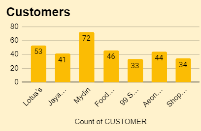

 <em> Figure 19: Column chart for customer</em> 

4. Repeat step 1, and select **"3D pie chart"**, and make the following changes:
  + Data range: D8:D331
  + Label: Sales Region

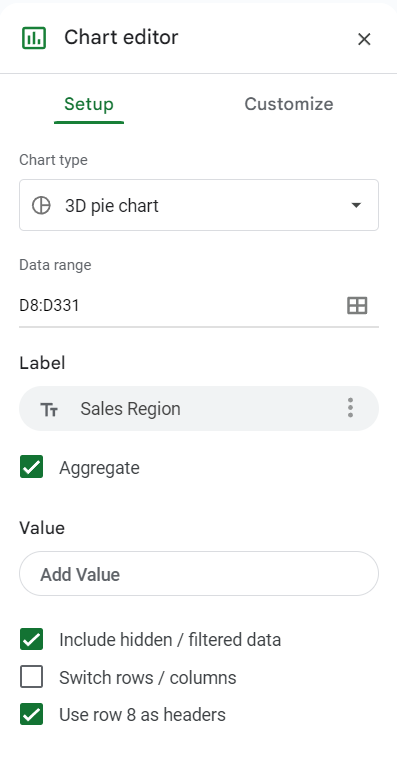

 <em> Figure 20: Chart editor for sales region</em> 
 

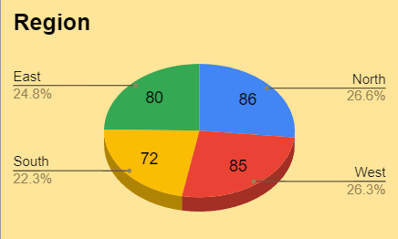

 <em> Figure 21: 3D pie chart for sales region</em> 

5. Repeat step 1, and select **"Pie chart"**, and make the following changes:
  + Data range: D8:D331
  + Label: SALES PERSON

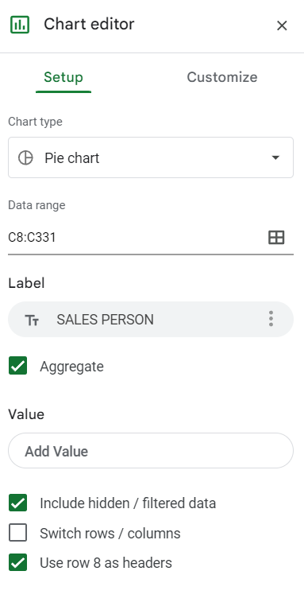

 <em> Figure 22: Chart editor for sales person</em> 
 

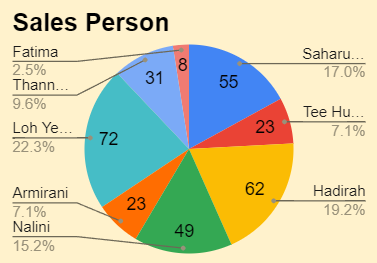

 <em> Figure 23: Pie chart for sales person</em> 

6. Repeat step 1, and select **"Area chart"**, and make the following changes:
  + Stacking: None
  + Data range: K8:L22
  + X-axis: K8:K22
  + Series: Sum for L8:L22 

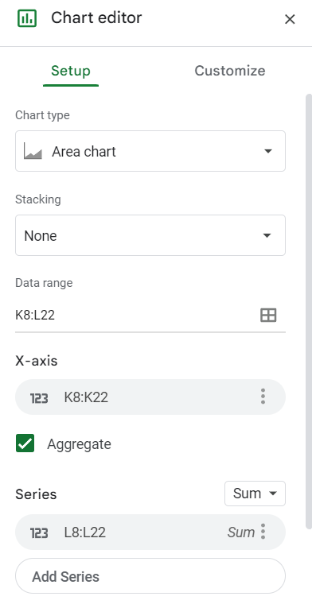

 <em> Figure 24: Chart editor for sales trend</em> 
 

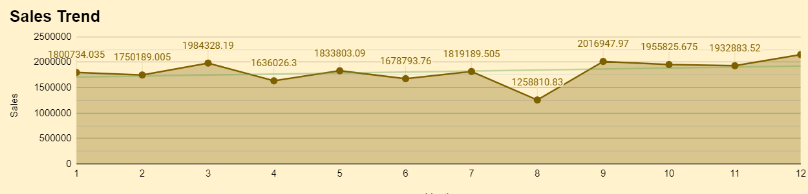

 <em> Figure 25: Area chart for sales trend</em> 

## Dashboard  

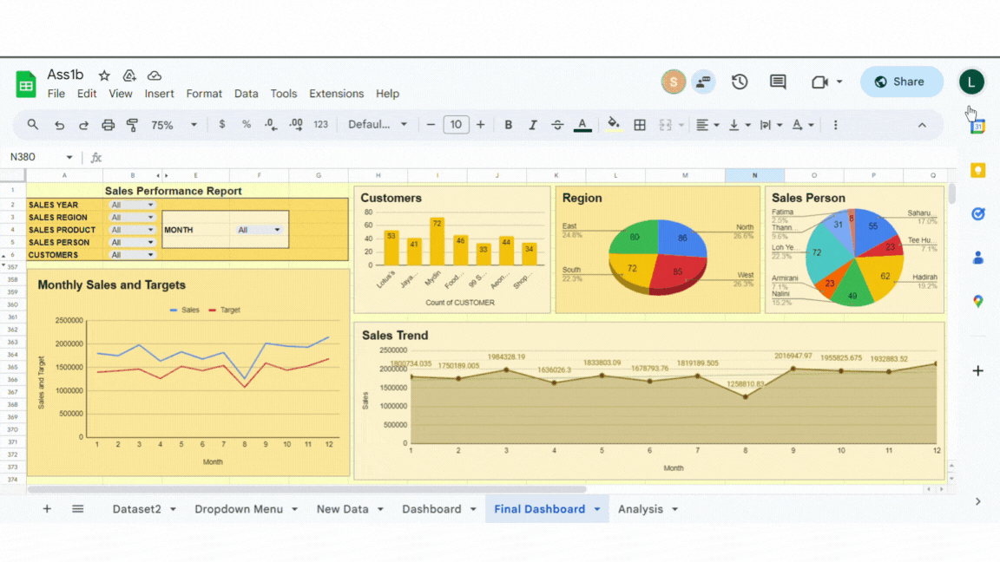
  

 <em> Gif 3: The completed dashboard  </em> 
 

## Contribution 🛠️  
Please create an [Issue](https://github.com/drshahizan/HPDP/issues) for any improvements, suggestions or errors in the content.

You can also contact me using [Linkedin](https://www.linkedin.com/in/drshahizan/) for any other queries or feedback.

