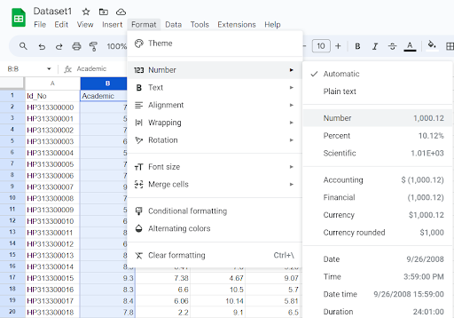

# Assignment 1a: Examination results

### Group Name: DEADPOOL
### Group Members

| Name                                     | Matrix Number | Task |
| :---------------------------------------- | :-------------: | ------------- |
| UMAR HAZIQ BIN MUHAMAD NORHISHAM            | A21EC0235     |  DATA PREPROCESSING DASHBOARD ASM1  |
| SAM CHIA YUN              | A21EC0127     | DATA TRANSFORMATION     |
| MUHAMMAD IZZUDDIN BIN SHABRIN             | A21EC0083     |   VISUALIZATION   |
| KEE SHIN PEARL             | A21EC0190     | DOCUMENTATION     |

## Dataset Information 
This dataset describes exam outcomes, allowing us to determine if students passed or failed. There are five factors that go into determining a student's grade: co-curriculum, athletics, academics, tests 1 and 2

**Deadpool Google Sheet**: https://docs.google.com/spreadsheets/d/1-a6XEi_X0BPA2ugBbEKP3aqwfWSL5TKOPjdZvjvMh68/edit#gid=1538304567

## Data Import  
1. Download and import dataset1 to google sheet.

    

  
Figure 1: Import Dataset to Google Sheet

## Data Preprocessing 
1. Select the range of cells that contain data need to be convert to 2 decimal places and click on the **"Format"**, and select **"Number"**.

 

 <em> Figure 2: Convert the data to 2 decimal places </em> 
 

2. The data values was displayed in two decimal places.

 <em> Figure 3: The data converted to 2 decimal places </em> 
 

## Data Processing 

1. Formula (Column Number/61)*3.33 was used in order to calculate the value for P1. P1 represents the score for academic.

    

  
Figure 4: The (Column Number/61)*3.33 was used in order to obtain the value for column P1

 

2. Formula (Column Number/10)*3.33 was used in order to calculate the value for P2. P2 represents Sport's score.

    

  
Figure 5: The (Column Number/10)*3.33 was used in order to obtain the value for column P2

 

3. Formula (Column Number/15)*3.33 was used in order to calculate the value for P3. P3 represents Co-Curriculum score.

    

  
Figure 6: The (Column Number/15)*3.33 was used in order to obtain the value for column P3

 

4. Formula (Column Number/10)*3.33 was used in order to calculate the value for P4. P4 represents Test 1 mark.

    

  
Figure 7: The (Column Number/10)*3.33 was used in order to obtain the value for column P4

 

5. Formula (Column Number/10)*3.33 was used in order to calculate the value for P5. P5 represents Test 2 mark.

    

  
Figure 8: The (Column Number/10)*3.33 was used in order to obtain the value for column P5

 

6. Every new column has be rounded off by selecting 'Number' from the Format ribbon."

    

  
Figure 9: Rounding off to two decimal places

 

7. Next, determine which three numbers in columns P1 through P5 are the highest. To fill the value of the columns to the last row, use Ctrl+C, Ctrl+space, and Ctrl+V for each column. 

    

  
Figure 10: For the highest values for column P1, use the formula as shown. 

 

8. Top 3 values from column P1-P5 are selected.

    

  
Figure 11: For the highest values for column P1, use the formula as shown. 

 

9. Calculate the total for the three highest values by using the formula SUM(L2:N2).

    

  
Figure 12: Formula to calculate total marks. 

 

10. Change the total marks to percentage by using (O2/10*100) formula.

    

  
Figure 13: Formula to calculate total marks. 

 

11. Determine the grade for the students by using the formula shown below.

    

  
Figure 14: Formula to determine students' grade. 

 

12. Determine either the students passed or failed the examination. The red rows indicate the students have successfully passed the exam meanwhile the not coloured rows indicate the students failed.

    

  
Figure 15: Formula to determine the students passed or failed. 

 

## Dashboard 

1. Determine the min for student's examination result

    

  
Figure 16: Min mark for student's examination results. 

 

2. Determine the max for student's examination result

    

  
Figure 17: Max mark for student's examination results. 

 

3. Determine the average for student's examination result

    

  
Figure 18: Average mark for student's examination results. 

 

4. Create a column chart to analyse the number of students getting grade A+ to E. 

    

  
Figure 19: Chart for students' grades. 

 

5. Calculate the number of students for each grade by using formula shown below. 

    

  
Figure 20: Students' grade Table. 

 

6. Create a doughnut table to illustrate number of students who passed and failed. 

    

  
Figure 21: Students' grade doughnut chart. 

 

7. Create a scorecard chart to calculate total amount of students/records. 

    

  
Figure 22: Scorecard chart shows number of records/students. 

 

8. Create a scorecard chart to calculate total amount of students who passed the exam. 

    

  
Figure 23: Scorecard chart shows number of students passed. 

 

9. Create a scorecard chart to calculate total amount of students who failed the exam. 

    

  
Figure 24: Scorecard chart shows number of students failed. 

 

10. finalise dashboard for examination results.

    

  
Figure 25: Examiniation result dashboard. 

 

## Contribution 🛠️
Please create an [Issue](https://github.com/drshahizan/HPDP/issues) for any improvements, suggestions or errors in the content.

You can also contact me using [Linkedin](https://www.linkedin.com/in/drshahizan/) for any other queries or feedback.

