

# Assignment 1b: Sales performance

### Group Name: GPS (GroupPalingSolid)

## Table of Contents
+ [Dataset Information](#dataset_info)
+ [Importing data](#import_data)
+ [Monthly Sales](#monthly_sales)
+ [Sales Region](#sales_region)
+ [Customer](#customer)
+ [Salesperson](#salesperson)
+ [Sales trend](#sales_trend)
+ [Slicer](#slicer)

## Dataset information 
This dataset is called Dataset2.txt. This dataset has nine columns which are CUSTOMER, PRODUCTS, SALES PERSON, Sales Region, Target, SALES, SALES YEAR, SALES MONTH	and SALES QTR.

**Source**: https://docs.google.com/spreadsheets/d/1vUogP0glv5RVHAp1kRcJCLvHPztVrFxzTwvV4YZCsiE/edit?usp=sharing

  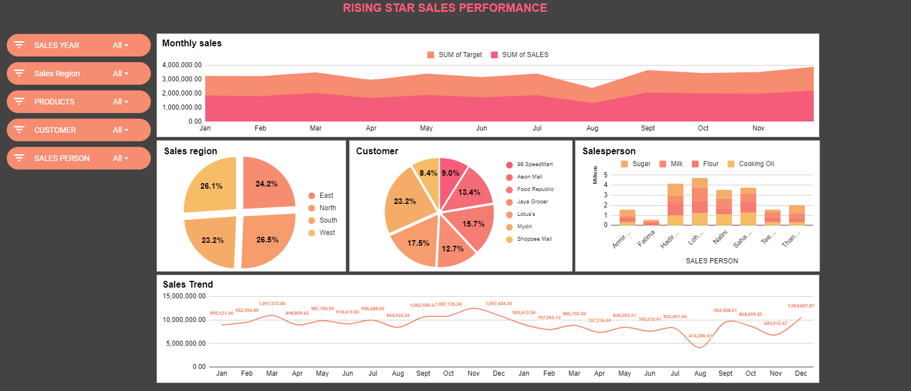

 

### Importing data : 
 1. Import the Dataset2.txt into Google Sheets, on the left upper menu bar, choose "File" -> "Import".

  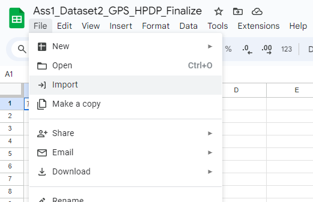

 
2. Then, click "Import data"

  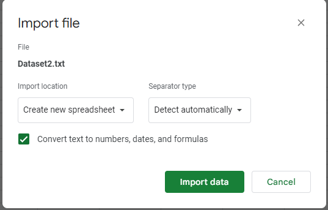

3. Add a new column named "Month Index" and insert a formula =IF(H2="Jan", 1, IF(H2="Feb", 2, IF(H2="Mar", 3, IF(H2="Apr", 4, IF(H2="May", 5, IF(H2="Jun", 6, IF(H2="Jul", 7, IF(H2="Aug", 8, IF(H2="Sept", 9, IF(H2="Oct", 10, IF(H2="Nov", 11, IF(H2="Dec", 12, 0)))))))))))) to sort the "SALES MONTH" due to "SALES MONTH" format data is in text.

  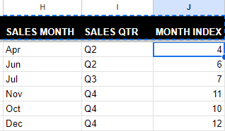

## Charts
### Monthly sales chart
1. First of all, select all columns that we just imported click on "Insert" and click on "Pivot Table"

  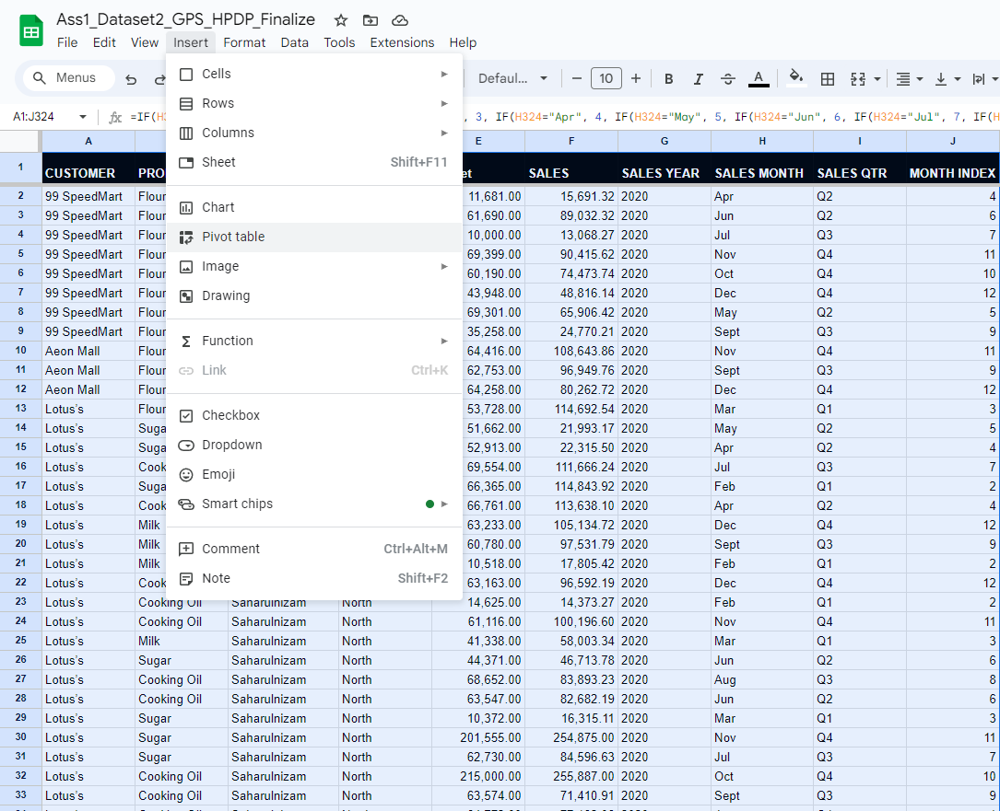

2. Make sure that the data range is correct and proceed with clicking on Create Table. Just so you know, you can create the table in the same existing sheet.

  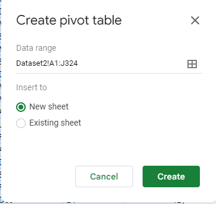

3. On Pivot Table Editor, choose "Month Index" and "Sales Month" as Rows. Then, choose "Sales Year" and "Target" as Values and close the editor.

  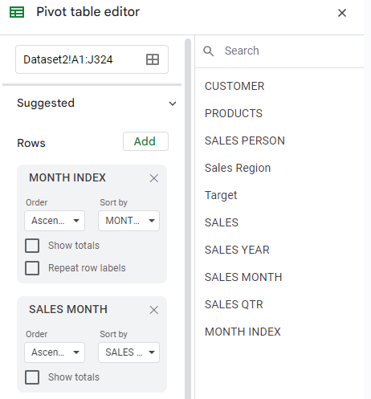

  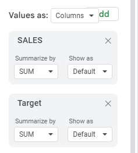

4. The output is shown below: 

  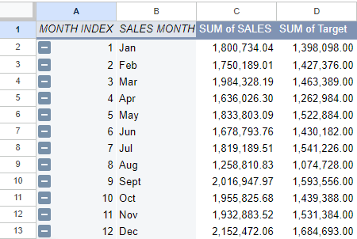

5. Select the table we just created, click on "Insert" and click on "Chart".

  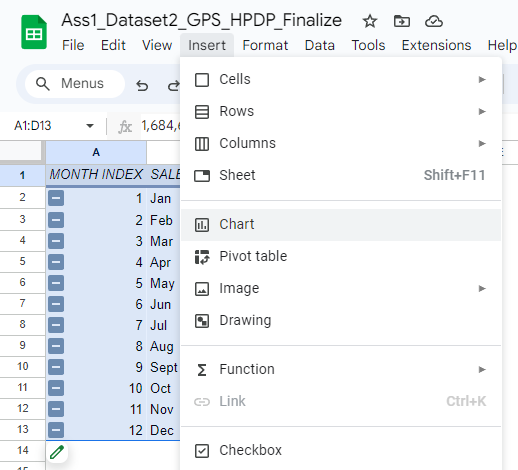

6. In Chart Editor, choose "Stacked area chart" and ensure that the data range is correct. Set the X-axis as a "SALES MONTH" column and the Series as "SUM of SALES" and "SUM of Target".

  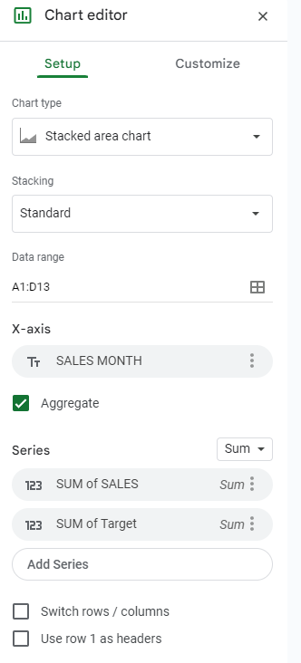

7. For the Sales Monthly Chart, the chart is shown below:

  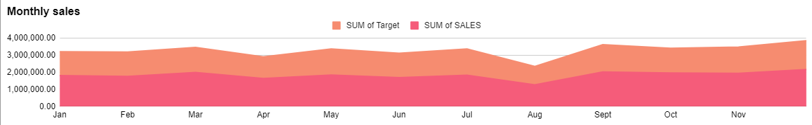

### Sales region
1. Repeat steps 1 and 2 from 'Monthly Sales Chart' to create a pivot table for Sales Region.
2. Add 'Sales Region' as Rows and 'SALES' as Values.
   

     

The output is as stated below:

 
  

3. Select the pivot table that was created, and click 'Insert' at the ribbon. A pie chart will be automatically created.

  

4. Once the pie chart is created, ensure that the Data range, Label and Value is correct as shown below. 

  

5. Customize the chart according to your preferences. The result of the pie chart is attached below:

  

### Customer
1. Repeat steps 1 and 2 from 'Monthly Sales Chart' to create a pivot table for Customer.
2. Add 'CUSTOMER' as Rows and 'SALES' as Values.
   

   
   

   The output is shown below:
   

   
   

3. Select the pivot table that was created, and click 'Insert' at the ribbon. A pie chart will be automatically created.
   

     
   

4. Once the pie chart is created, ensure that the Data range, Label and Value is correct as shown below.
   

   
   
 
5. Customize the chart according to your preferences. The result of the pie chart is attached below:
   

   
   

### Salesperson
1. Do the same steps in Monthly sales charts from step 1 until step 3. However, this time choose "Sales Product" and "PRODUCTS" as Rows. Then, choose "Sales". 

  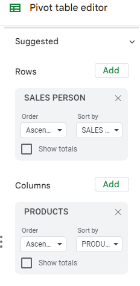

  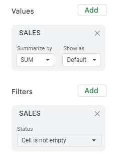

2. For the filter part, choose SALES, click on "Filter by condition", click on "is not empty" and close the editor.

  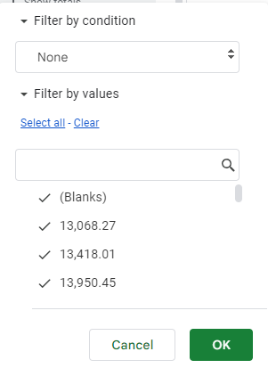

  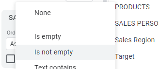

3. The output is shown below:

  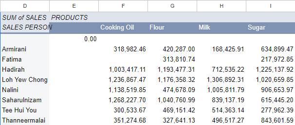

4. Select the table we just created, click on "Insert" and click on "Chart".

  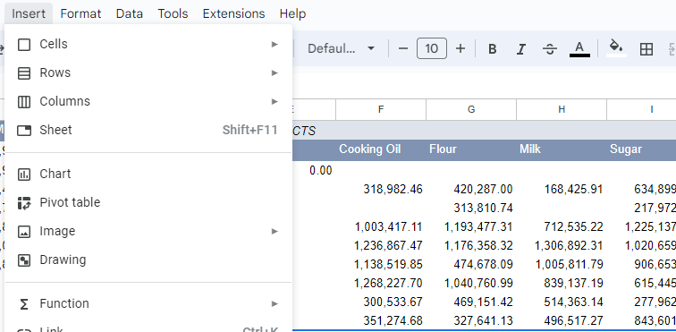

5. In Chart Editor, choose "Stacked column chart" and ensure that the data range is correct. Set the X-axis as a "SALES PERSON" column and the Series as "Cooking Oil", "Flour", "Milk" and "Sugar".

  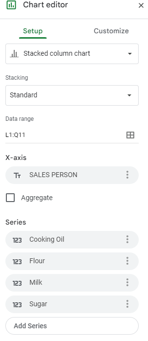

6. For the Salesperson chart, the chart is shown below:

  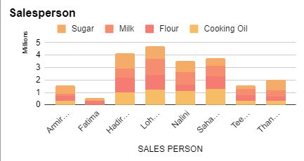

### Sales Trend
1. Do the same steps in Monthly sales charts from step 1 until step 3. However, this time choose "Sales Product" and "PRODUCTS" as Rows. Then, choose "Sales". 

  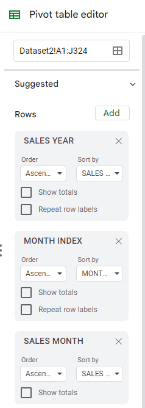

  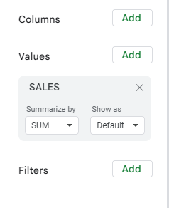

2. The output is shown below:

  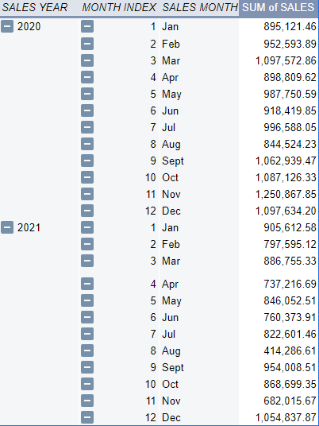

3. Select the table we just created, click on "Insert" and click on "Chart".

  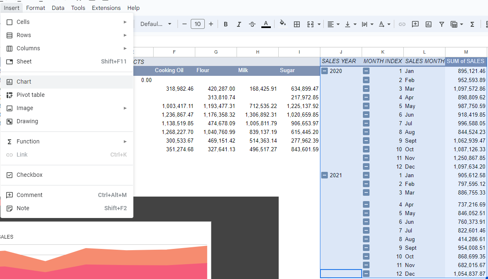

4. In Chart Editor, choose "Smooth line chart" and ensure that the data range is correct. Set the X-axis as a "SALES MONTH" column and the Series as "SUM of SALES".

  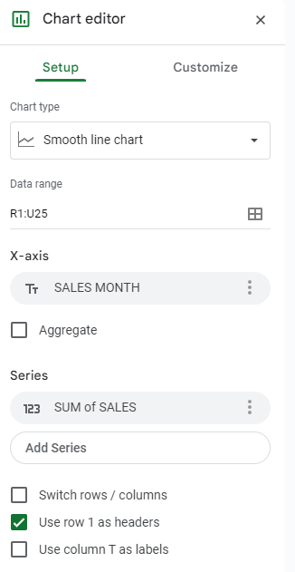

5. For the Sales trend chart, the chart is shown below:

  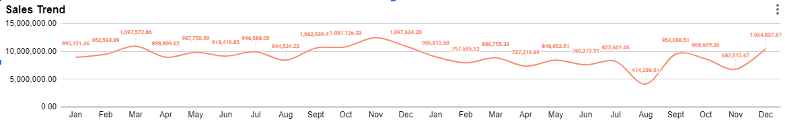

## Slicer
1. First of all, Slicers provide buttons that you can click to filter tables or PivotTables. In addition to quick filtering, slicers also indicate the current filtering state, which makes it easy to understand what exactly is currently displayed. The image below is what we called Slicer.

  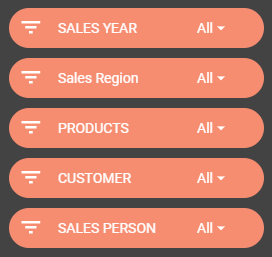

2. To create Slicer, you just need to click on "Data" and click on "Add a slicer".

  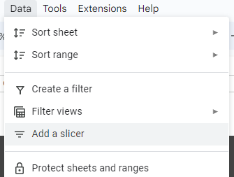

3. In a Slicer editor, you can choose any Column that you decide to filter.

  

## Contribution 🛠️
Please create an [Issue](https://github.com/drshahizan/HPDP/issues) for any improvements, suggestions or errors in the content.

You can also contact me using [Linkedin](https://www.linkedin.com/in/drshahizan/) for any other queries or feedback.

