

# Assignment 1: Data Analysis using Google Sheets
## Dataset 2 Report

:octocat: <h2>Group Name: KhuChin Group Members</h2>

| Name                                     | Matrix Number |
| :---------------------------------------- | :-------------: |
| Muhammad Ashraaf Bin Saleh              |A21EC0068      |
| Nur Khuzairie Zakwan Bin Mohd Zamri              |A21EC0112      |
| Nur Shuhada Safiah Binti Ayob              |A21EC0114      |
| Ikmal Bin Khairulezuan              |A21EC0186      |

------
## 📑 KhuChin Dataset2 Dashboard

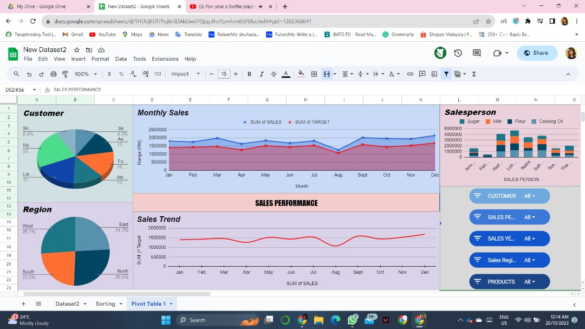
  

------

## 📕 Dataset Information

We were given a dataset called dataset2.txt. This dataset contain a total of nine columns from which customer, salesperson, sales and year are some of the column in the dataset. Our task is the design a functional dashboard using GoogleSheet.  

[Google Sheet Link](https://docs.google.com/spreadsheets/d/1FlDUjFDf7Puj6r3DAkL6wJ7Qjqy3FoYLm4cm6SP8fyc/edit?usp=sharing)

---

## 1. Import dataset into Google Sheet

- First we need to download the dataset from the file in GitHub. Then we will open a brand new google sheet. From there we can import the dataset into the sheets. 
- Click on the **File** at the top left corner and then click on the **Import**.

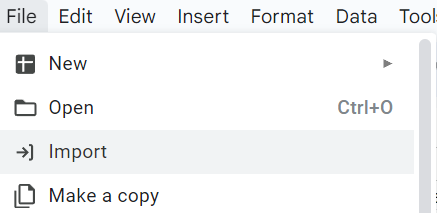

_Figure 1.1: Opening the import pop-up screen_

- Then we will see a pop-up and we can click on **Upload**. From there you can just drag the database from your explorer file or browse through your files.

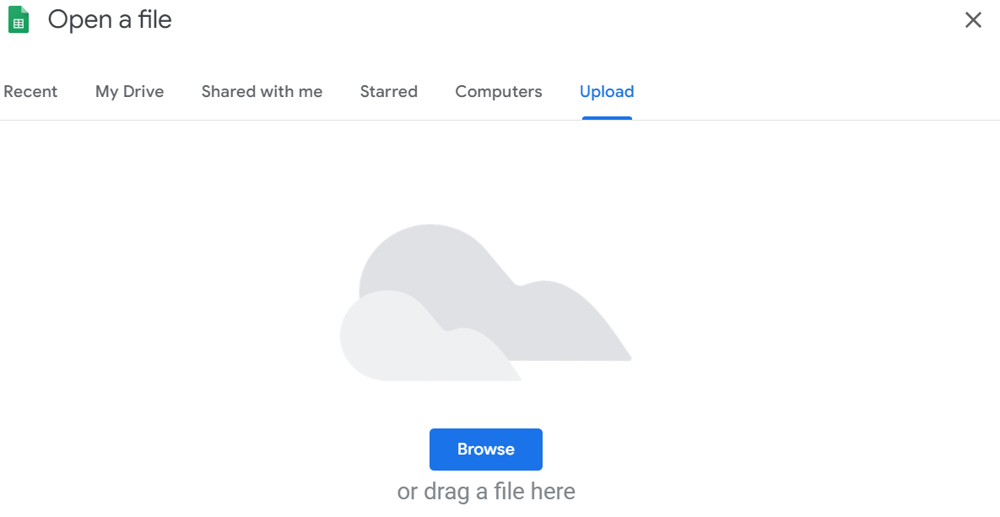

_Figure 1.2: Importing the data_

- After that, we have succesfully import the data into GoogleSheet.

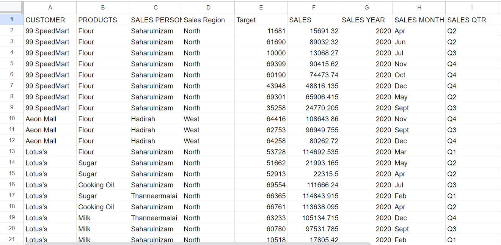

_Figure 1.3: Data queries in spreadsheet_

------

## 2. Create new sheet for general purpose usage

- Now we will create a new sheet and transfer our data into that so that we can use it freely. This serve as a precaution so that if anything happen it does not affect the original database. We will use this new sheet to sort and add new column for later use. You can name the sheet however you like but we will go with "Sorting".
- In order to create new sheet in the same spreadsheet. We can just click on the **+** button at the bottom of the screen.

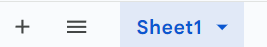

_Figure 2.1: Adding new sheet_

- Then we can transfer the data by using the copy and paste method. Just press **Ctrl** and **A** on your keyboard to select all. Then press **Ctrl** and **C** to copy the data. After that go to the new sheet we just created and paste the data by clicking on the box in the sheet and press **Ctrl** and **V** at the same time.

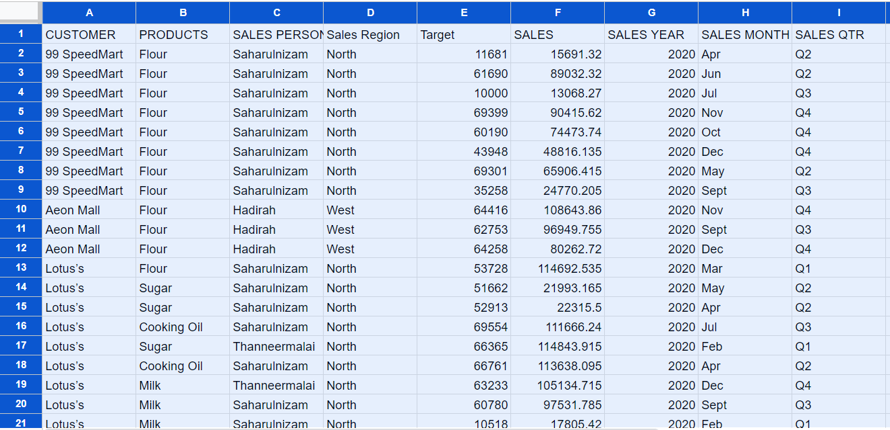

_Figure 2.2: Copy the data to new sheet_

## 3. Preprocessing

- For this part, we need to make sure our data is readable ny the computer to ensure smooth calculation and prevent any possible error. As for the database provided, there aren't any missing data or anything that need to be change. How ever for easier usage, we have assigned the month to number so that it is easier to sort. The result is stored in a new column name "Month". We use formula as below: 

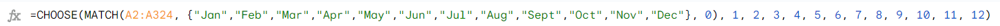

_Figure 3.1: Formula for changing the month to number_

- Then we will combine the month and the year so that we can differentiate between same month but in different year. The result is stored in a new column name "YearMonth". For this we use this formula as below:

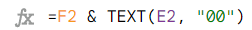

_Figure 3.2: Formula for combining the year and month_

- After that we will sort the data using the "YearMonth" column as our main in ascending order. The formula is as below:

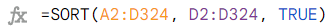

_Figure 3.3: Formula for sorting the data_

### 3.1 Method to create a pivot table

- Before putting our data into a chart, we create a pivot table to simplify the process of selecting the best chart type. A pivot table represents our data visually, allowing us to identify patterns and make comparisons. Furthermore, it shows the computations, such as sums or averages, indicating how the data has changed and increasing the accuracy of our charts and analysis. All data from the TempData sheet was selected, and clicked the Insert from the task bar, then chose Pivot Table and chose Create, and the new sheet was created as Pivot Table 1. Select all data -> Insert -> Pivot table -> Create -> Pivot Table 1.

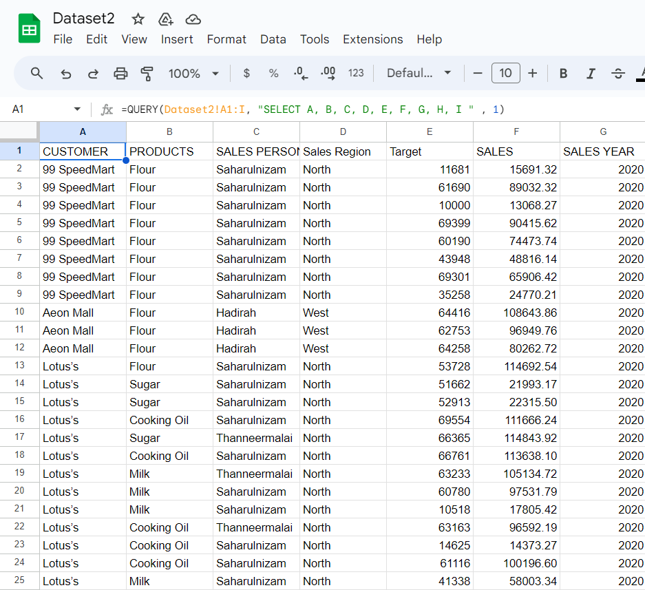

_Figure 3.1.1: Selecting all data from TempData_

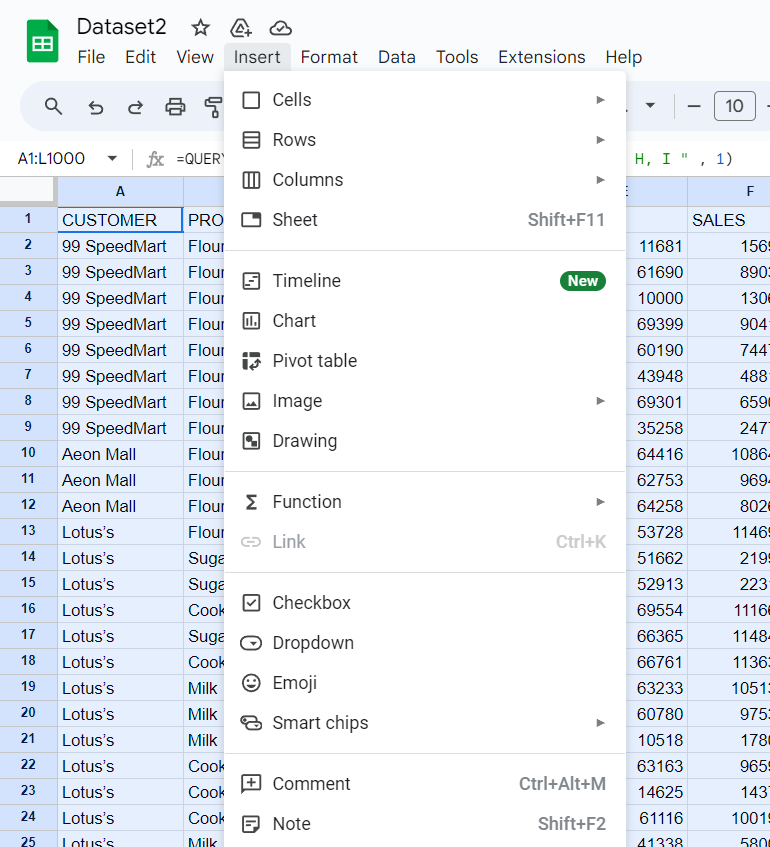

_Figure 3.1.2: Choose Insert and Pivot table_

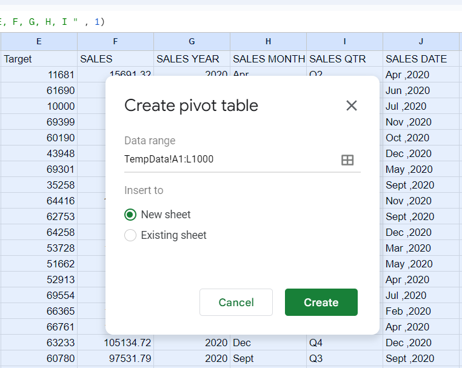

_Figure 3.1.3: Choose Create to create pivot table_

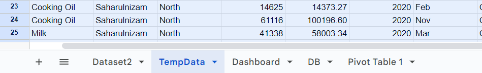

_Figure 3.1.4: New sheet named Pivot Table 1 was created_

- Choose Pivot Table 1, and we can choose any data that we want to be inserted in the pivot table. From the Pivot table editor, just drag the data that we want to the Rows, Columns, Values or Filters. Then the pivot table will be ready. Click on the pivot table and click Insert from the task bar, then choose Chart, and the suitable chart based on the pivot table will be produced. Click edit chart, and then we customize the chart.

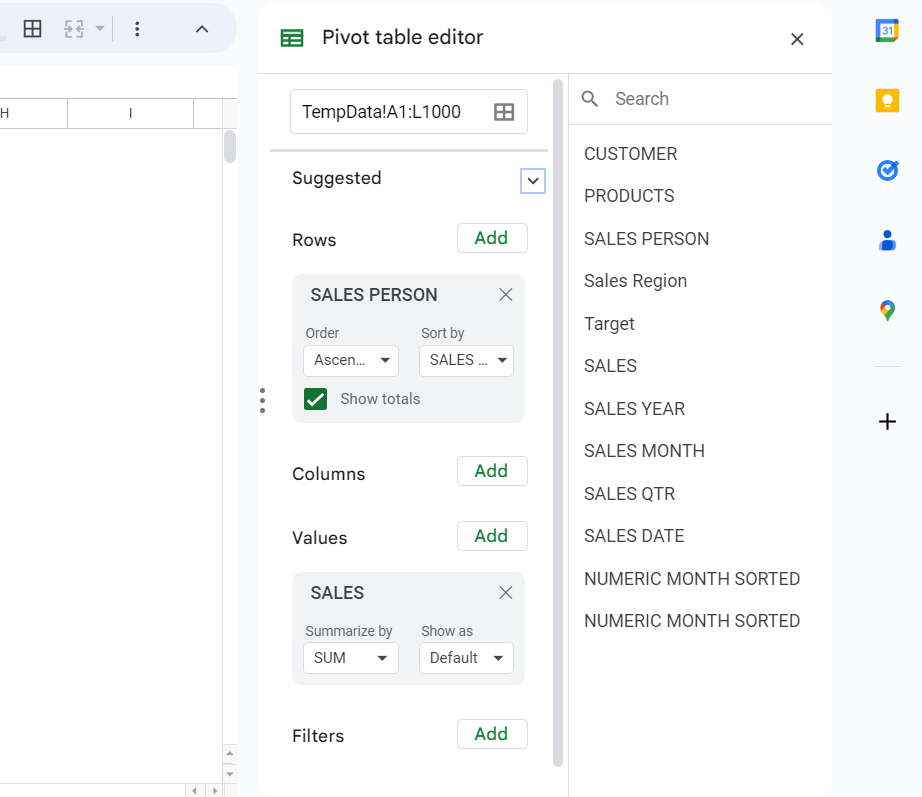

_Figure 3.1.5: Selecting data to be inserted in the pivot table_

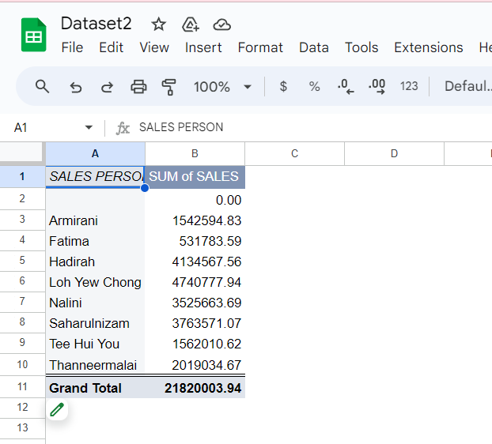

_Figure 3.1.6: Pivot table from the data chosen_

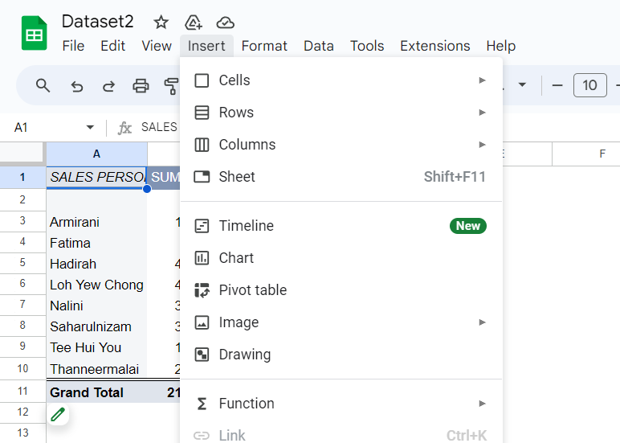

_Figure 3.1.7: Choose Chart to create a chart based on the pivot table_

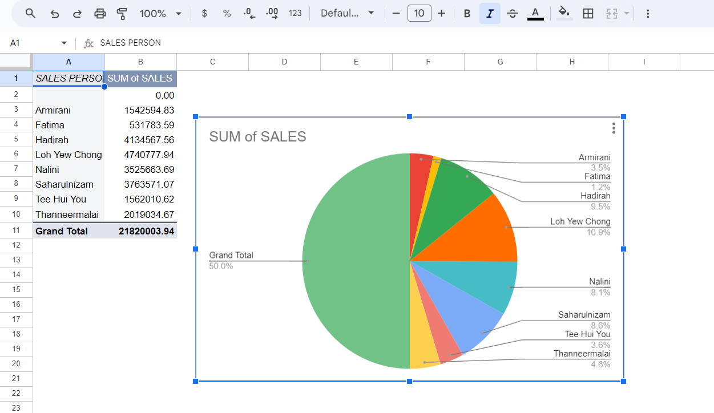

_Figure 3.1.8: Chart created_

### 3.2 List of pivot tables.

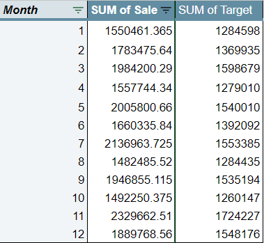

_Figure 3.2.1: Sum of sales and target by month_

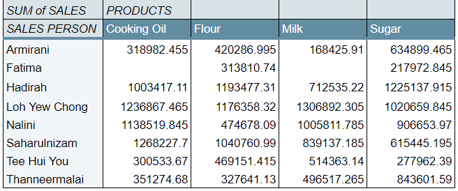

_Figure 3.2.2: Sum of sales by product and sale person_

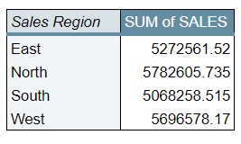

_Figure 3.2.3: Sum of sales by region_

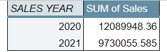

_Figure 3.2.4: Sum of sales by year_

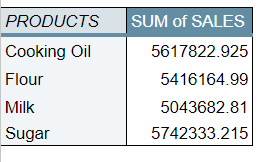

_Figure 3.2.5: Sum of sales by product_

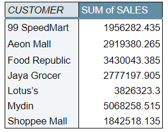

_Figure 3.2.6: Sum of sales by customer_

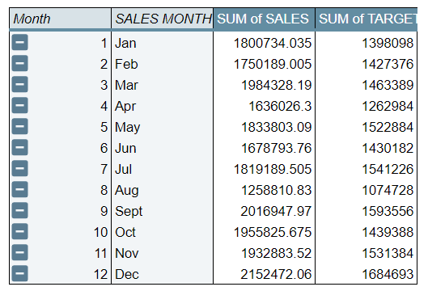

_Figure 3.2.7: Sum of sales and target by month (sorted)_

## 4. Creating Dashboard
- To design our dashboard, we create charts using the pivot tables and organise them in Google Sheets. In addition, slicers are used as filters in our dashboard. This means that if we need to access specific data, we can simply select the option we want, and the dashboard will display only the data we require.

### 4.1 Slicer
- We have 5 slicers in our dashboard and all of them can be used for filter the chart in our dashboard.

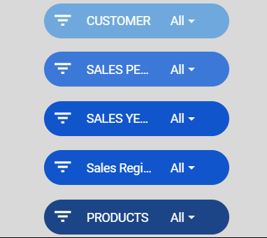

_Figure 4.1.1: List of slicer_

- Choose Data from the task bask and click Add a Slicer. Then, select the data range and choose the column that we want. 

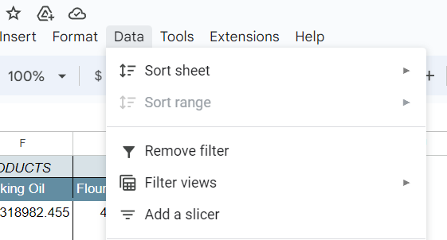

_Figure 4.1.2: Click Data and Add a slicer_

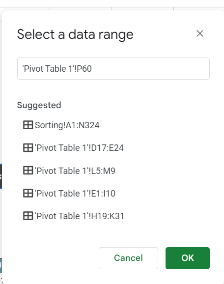

_Figure 4.1.3: Select a data range_

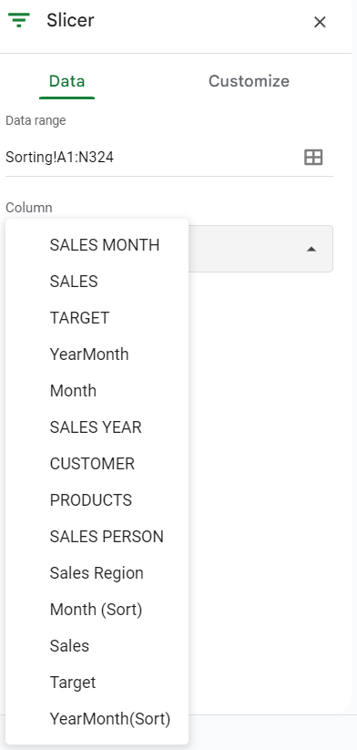

_Figure 4.1.4: Select Column_

### 4.2 DashBoard 
- We arrange our charts to make the dashboard. The dashboard must fit on the screen. Here is the list of our charts:

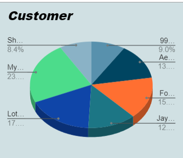

_Figure 4.2.1: Select Column_

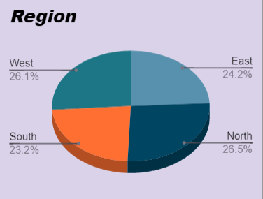

_Figure 4.2.2: Select Column_

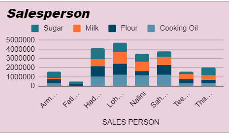

_Figure 4.2.3: Select Column_

_Figure 4.2.4: Select Column_

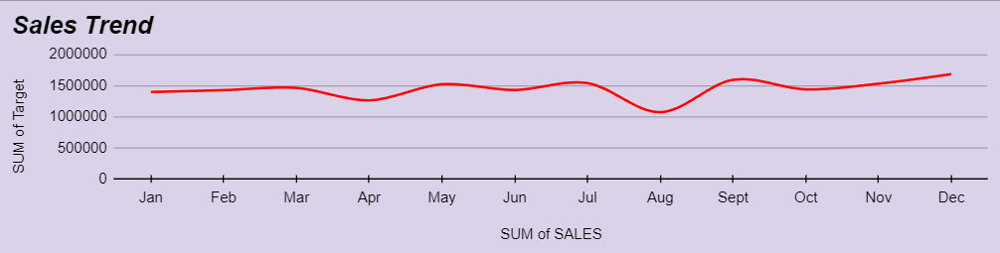

_Figure 4.2.5: Select Column_

- Our dashboard will change when we put the filter on by using slicers.

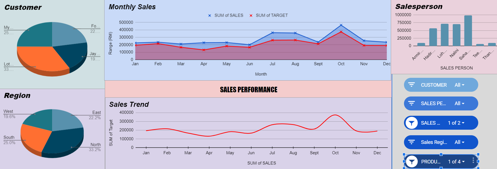

_Figure 4.2.5: Cooking Oil Sales 2020_

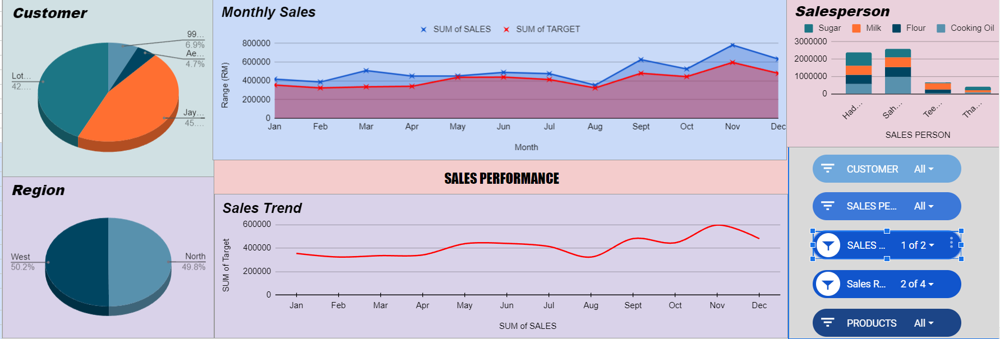

_Figure 4.2.5: North and West sales 2020_

