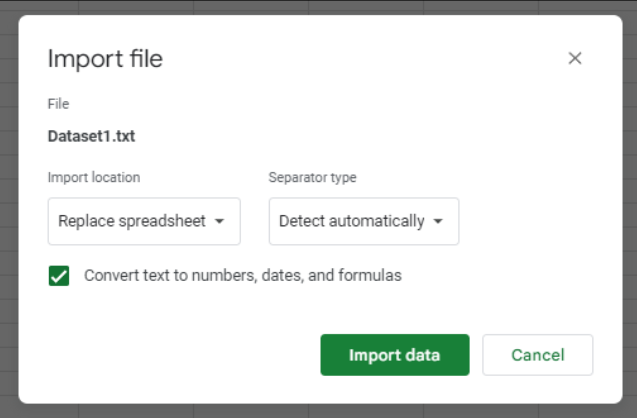
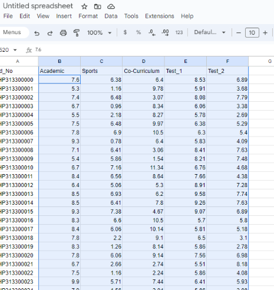
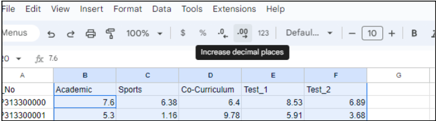
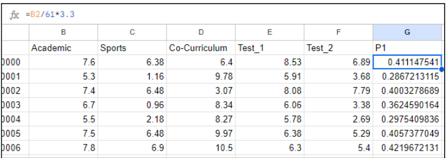
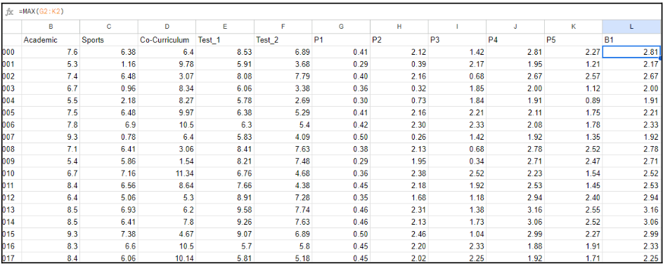
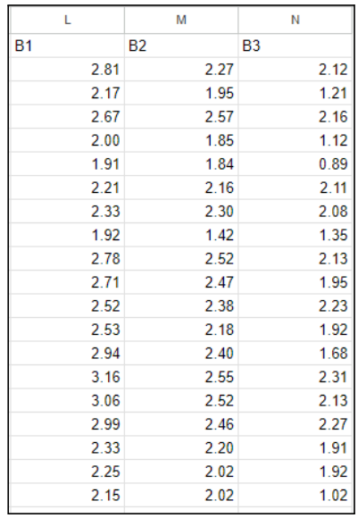
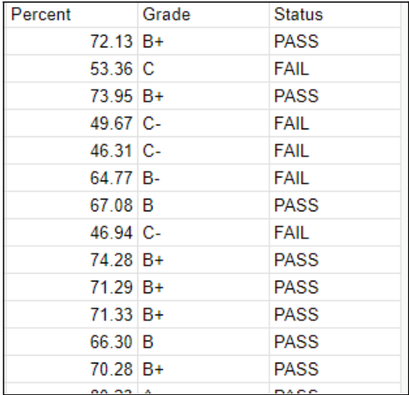

# Assignment 1a: Examination results

### Group Name: SEK KITO

## Introduction

## Data Preparation

1. We will be provided with a .txt file of the examination result and to import it, click on the ‘File’ tab and choose ‘Import’.

  

2. A new tab will appear and go to the ‘Upload’ section to browse the file. 

3. Browse to the given .txt file and a new tab will appear to ask about the import location and the separator type, just use the default setting and click the ‘Import Data'  button.

## Data Preprocessing

4. For the synchronization of two decimal places, use the cursor and choose B2 and slide the cursor until F2 then press Ctrl+SPACE to select all the values.

  

5. Click on the ‘Increase Decimal Places’ button in the menu ribbon until all values in two decimal places.

6. Make a new column by choosing ‘Insert’ and then ‘Column’ and choose one column right until it contains five new columns. Rename the new columns P1, P2, P3, P4, P5.

   

7. For P1, use this formula “=B2/61*3.33 where 61 is the total marks in the column academic or B and 3.33 is the new maximum value for the newly-created column. For the next column, change the value attribute by using a respected column and use the correct total marks like in this given mark table.
   

8. Next, the top three values from the columns P1 until P5 will be determined firstly by creating three new columns, B1, B2, B3. 

9. For B1, use the formula, “=MAX(G2:K2)” to return the highest value.

  

10. For B2, use the formula, “=LARGE(G2:K2,2)” to return the second highest value.

11. For B3, use the formula, “=LARGE(G2:K2,3)” to return the third highest value.

12. Make a new column, TM to store the total mark by using this formula, “=SUM(L2:N2)”.

13. Make another new column, Percent to store the percentage by using this formula, “=SUM(L2:N2)*10”.
    

14. The value of percentage will be used to know the value for Grade and Status. For the column Grade, use this formula “=IF(P2>90,"A+", IF (P2>80,"A", IF(P2>75, "A-", IF(P2>70,"B+", IF(P2>65, "B", IF(P2>60, "B-", IF(P2>55, "C+", IF(P2>50, "C", IF(P2>45, "C-", IF(P2>40, "D+", IF(P2>35, "D", IF(P2>30, "D-", "E" ))))))))))))”.

15. For the Status, use this formula, “=IF(P2>90,"PASS", IF (P2>80,"PASS", IF(P2>75, "PASS", IF(P2>70,"PASS", IF(P2>65, "PASS", IF(P2>60, "FAIL", IF(P2>55, "FAIL", IF(P2>50, "FAIL", IF(P2>45, "FAIL", IF(P2>40, "FAIL", IF(P2>35, "FAIL", IF(P2>30, "FAIL", "FAIL" ))))))))))))”.

## Contribution 🛠️
Please create an [Issue](https://github.com/drshahizan/BDM/issues) for any improvements, suggestions or errors in the content.

You can also contact me using [Linkedin](https://www.linkedin.com/in/drshahizan/) for any other queries or feedback.

