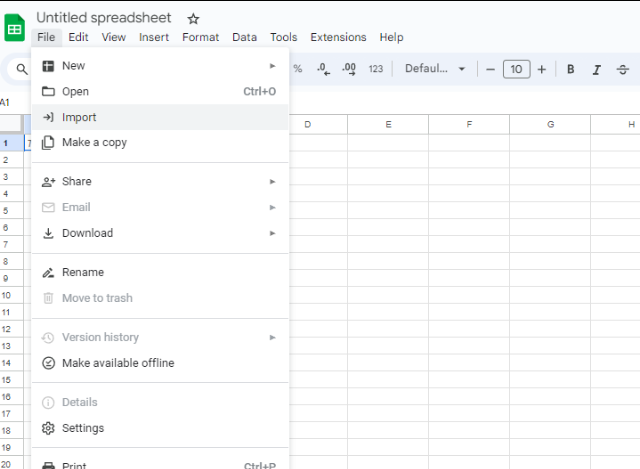
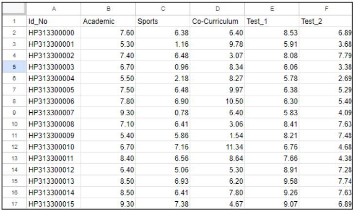
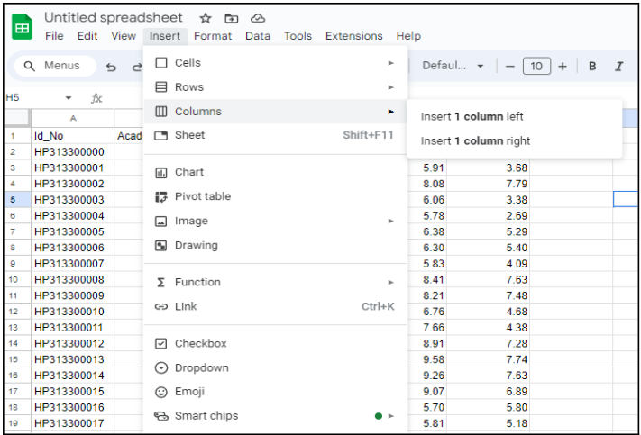
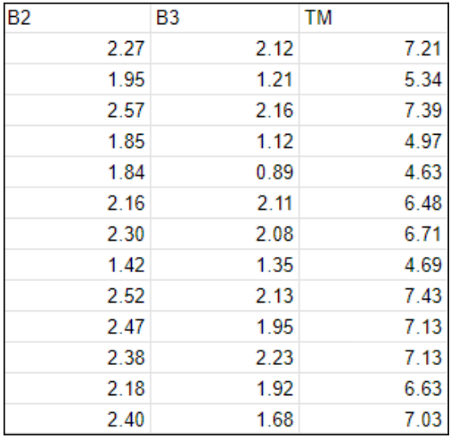
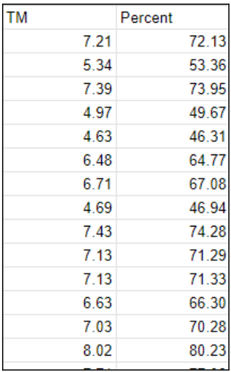
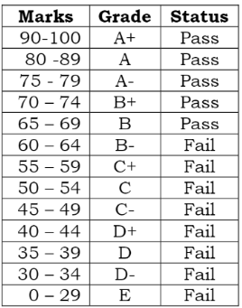
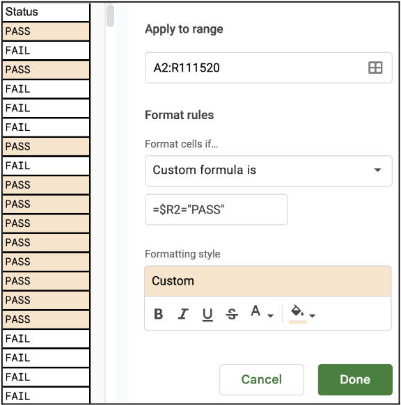
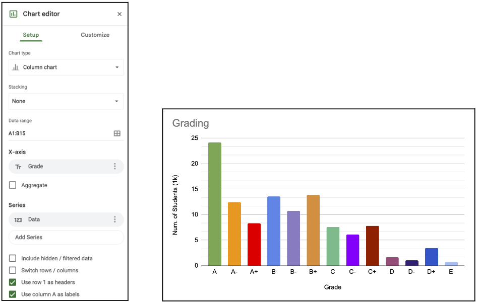
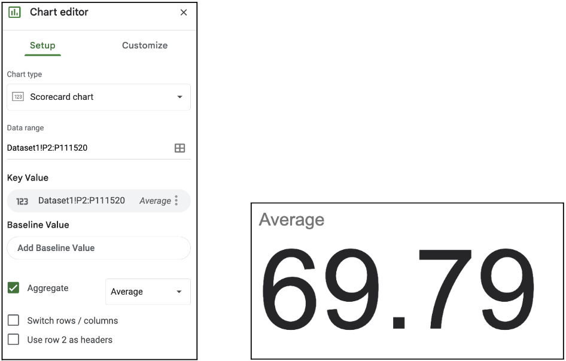

# Assignment 1a: Examination results

### Group Name: SEK KITO

## Introduction

## Data Preparation

1. We will be provided with a .txt file of the examination result and to import it, click on the ‘File’ tab and choose ‘Import’.

  

2. A new tab will appear and go to the ‘Upload’ section to browse the file. 

3. Browse to the given .txt file and a new tab will appear to ask about the import location and the separator type, just use the default setting and click the ‘Import Data'  button.

## Data Preprocessing

4. For the synchronization of two decimal places, use the cursor and choose B2 and slide the cursor until F2 then press Ctrl+SPACE to select all the values.

  

5. Click on the ‘Increase Decimal Places’ button in the menu ribbon until all values in two decimal places.

6. Make a new column by choosing ‘Insert’ and then ‘Column’ and choose one column right until it contains five new columns. Rename the new columns P1, P2, P3, P4, P5.

   

7. For P1, use this formula “=B2/61*3.33 where 61 is the total marks in the column academic or B and 3.33 is the new maximum value for the newly-created column. For the next column, change the value attribute by using a respected column and use the correct total marks like in this given mark table.
   

8. Next, the top three values from the columns P1 until P5 will be determined firstly by creating three new columns, B1, B2, B3. 

9. For B1, use the formula, “=MAX(G2:K2)” to return the highest value.

10. For B2, use the formula, “=LARGE(G2:K2,2)” to return the second highest value.

11. For B3, use the formula, “=LARGE(G2:K2,3)” to return the third highest value.

12. Make a new column, TM to store the total mark by using this formula, “=SUM(L2:N2)”.

13. Make another new column, Percent to store the percentage by using this formula, “=SUM(L2:N2)*10”.
    

14. The value of percentage will be used to know the value for Grade and Status. For the column Grade, use this formula “=IF(P2>90,"A+", IF (P2>80,"A", IF(P2>75, "A-", IF(P2>70,"B+", IF(P2>65, "B", IF(P2>60, "B-", IF(P2>55, "C+", IF(P2>50, "C", IF(P2>45, "C-", IF(P2>40, "D+", IF(P2>35, "D", IF(P2>30, "D-", "E" ))))))))))))”.

15. For the Status, use this formula, “=IF(P2>90,"PASS", IF (P2>80,"PASS", IF(P2>75, "PASS", IF(P2>70,"PASS", IF(P2>65, "PASS", IF(P2>60, "FAIL", IF(P2>55, "FAIL", IF(P2>50, "FAIL", IF(P2>45, "FAIL", IF(P2>40, "FAIL", IF(P2>35, "FAIL", IF(P2>30, "FAIL", "FAIL" ))))))))))))”.

16. Next, in the toolbar, go to “Format” > “Conditional Formatting” to add a new rule. Apply to range “A2:R111520”, select “Custom formula is” and type “ “=$R2="PASS" ” as the formula. Choose a light red highlight for rows that have the string value “PASS” in its R column. Click “Done”.

17. Change the text color of values under columns B1, B2 and B3 by selecting the headers, press Ctrl + Shift + Down Arrow, then select red in the “Text Color” toolkit.

18. Go to “Format” > “Conditional Formatting” again to add a new rule. Apply to range “P2:P111520”, select “Custom formula is” and type “=$P2>65” as the formula. Choose a green highlight for cells that have value largger than 65. Click “Done” to apply.

## Data Visualization

19. Proceed with creating a new sheet named “Dashboard”. The following steps are to achieve a dashboard with visualizations based on Dataset1 as per the photo shown.

20. Starting with the Bar Chart, select the “G” column and insert a pivot table in a new sheet called “Grade”. Then, setup the pivot table as follows. With the Grade in ascending order, and its recurrences summmarized by COUNTA.

21. Then select the entire pivot table except total and insert a new chart of type Column Chart. Use Grade at the X-axis and Data at the Y-axis. Then just double click and edit chart and axis titles as well as manually assign different colours to the individual columns.

22. The Table Chart can also be derived from the same pivot table, by selecting the entire pivot table and inserting a new chart of type “Table Chart”. Just make sure that the setup is identical to as shown below.

23. Next we need to insert a pivot table in a new sheet called “Status” based on column “Status”. Then, setup the pivot table as follows. With the Status in ascending order, and its recurrences summmarized by COUNTA. 

24. To generate a Doughnut Chart of the fail/pass ratio of the students in the dataset. First, select the pivot table and insert a new chart of type “Doughnut Chart”. Then select “Status” field as the label and “Record” field as the value. Customize the chart further by setting doughnut hole to 80%, slice label as percentage, and under “Pie Slice”, set the colour for Fail and Pass to red and green respectively.

25. Based on the same pivot table, add a new column titled “Percentage” and assign a function “=B3/$B$5” and “=B4/$B$5” to calculate the percentage of PASS and FAIL records over the total of records. Then insert two new charts of type Scoreboard Chart. To create the Pass and Fail Scoreboard chart, select C3 and C4 as the data range respectively. Then at the Chart Axis Title option, type PASS or FAIL as the Chart Title and under Key Value, pick red or green for the value colour.

26. For the next three charts, select all in Dataset1, and individually insert a new chart of type “Scoreboard Chart”. Then in the setup menu, tick “aggregate” box and select operations for each intended chart i.e., Min for Min Scoreboard Chart, Max for Max Scoreboard Chart and Average for Average Scoreboard Chart. Then name each chart under “Chart & axis titles”, write the titles for each titular chart respectively. 

27. To create the “Total Records” chart, select only the first column of “Id_No” then insert chart of type “Scoreboard Chart”. Tick on “Aggregate” box and use Count operation (the only one available). It will display the number of records in the column, indicating how many students’ records are present.

28. Last thing to do is copy each of the charts created in this tutorial and place them in their positions inside of the “Dashboard” sheet created earlier. To make the dashboard more visually appealing, select all the cells surrounding the graphs and merge them together. Then change the colour of the merged cell to yellow for example to make the charts pop out even more.

29. At last, we have our dashboard!
## Contribution 🛠️
Please create an [Issue](https://github.com/drshahizan/HPDP/issues) for any improvements, suggestions or errors in the content.

You can also contact me using [Linkedin](https://www.linkedin.com/in/drshahizan/) for any other queries or feedback.

