# Importing Data into Sheets

1. Start with a new blank Google Sheets
2. Click on ‘File’ at at the top-left corner of the screen and click on ‘Import’

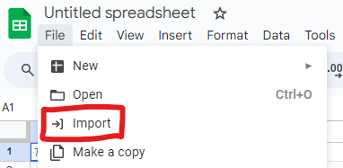

    Figure 1 : Import button reference to import files into Google Sheets

3. A new menu will appear. Click ‘Upload’ and then click on ‘Browse’ to browse on your local machine/computer

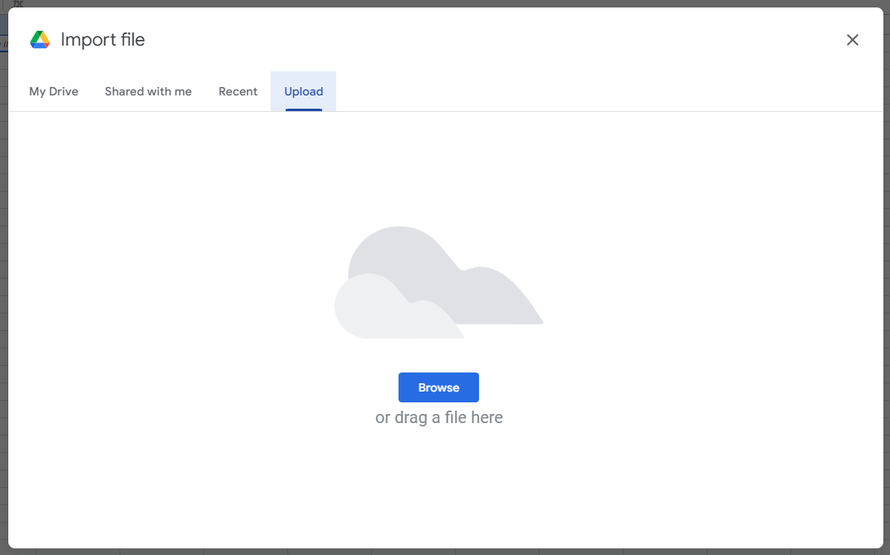

    Figure 2 : New menu that appears after clicking on ‘Import’

4. Choose your file. In this case, we are using the Dataset2.txt file. Click ‘Open’

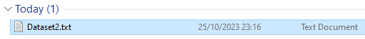

    Figure 3 : Image referencing to Dataset2.txt from local machine/computer

    Figure 4 : Image referencing to the ‘Open’ button after choosing the right file

5. Make sure that your current sheet is empty and click ‘Import data’

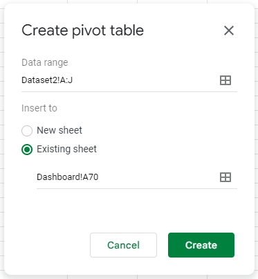

    Figure 5 : Image referencing the ‘Import data’ button

6. If the import  is successful, your sheets should looks like this

    

>>>>>  gd2md-html alert: inline image link here (to images/image7.png). Store image on your image server and adjust path/filename/extension if necessary.  (<a href="#">Back to top</a>)(<a href="#gdcalert8">Next alert</a>) >>>>> 

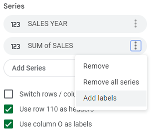

    Figure 6 : The sheets should look like this after importing the file

# Creating Pivot Table from Dataset

## **Creating a Month Number column from Sales Month column**

1. Firstly, create a new column referencing ‘SALES MONTH’ to ‘MONTH NUMBER’ to reference text ‘Jan’, ‘Feb’, ‘Mar’, … into 1, 2, 3, … so you can use it to sort the months since Google Sheets cannot detect text as month
2. To do this, select the second cell of a new column, J2 for example.

>>>>>  gd2md-html alert: inline image link here (to images/image8.png). Store image on your image server and adjust path/filename/extension if necessary.  (<a href="#">Back to top</a>)(<a href="#gdcalert9">Next alert</a>) >>>>> 

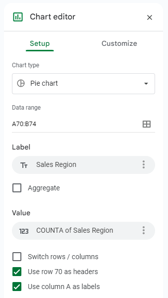

Figure 7 : Showing the second cell of column ‘J’ being selected

3. Enter the formula “=ARRAYFORMULA(IF(H2:H="", "", VALUE(MATCH(H2:H, {"Jan","Feb","Mar","Apr","May","Jun","Jul","Aug","Sept","Oct","Nov","Dec"}, 0), "0")))” on the function tab above the sheet. The way this formula works is by referencing the ‘SALES MONTH’ column, ‘H’, and converts the month in text form into number form. Make sure not to accidentally select the header cell

    

>>>>>  gd2md-html alert: inline image link here (to images/image9.png). Store image on your image server and adjust path/filename/extension if necessary.  (<a href="#">Back to top</a>)(<a href="#gdcalert10">Next alert</a>) >>>>> 

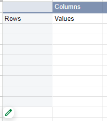

    Figure 8 : Showing the formula being added in the function tab

    

>>>>>  gd2md-html alert: inline image link here (to images/image10.png). Store image on your image server and adjust path/filename/extension if necessary.  (<a href="#">Back to top</a>)(<a href="#gdcalert11">Next alert</a>) >>>>> 

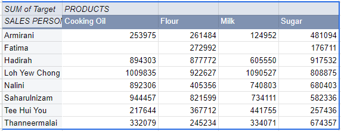

    Figure 9 : Showing that the referenced column is column ‘H’, SALES MONTH

4. A new column will be generated once the formula has been inserted in the function tab

    

>>>>>  gd2md-html alert: inline image link here (to images/image11.png). Store image on your image server and adjust path/filename/extension if necessary.  (<a href="#">Back to top</a>)(<a href="#gdcalert12">Next alert</a>) >>>>> 

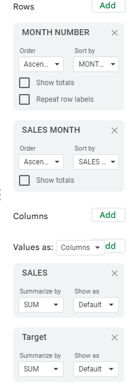

    Figure 10 : New column generated from the formula 

5. Name the newly generated column as ‘MONTH NUMBER’ so you can recognize the column function better

## **Creating Pivot table from Dataset2**

1. Create a new sheet and name it as Dashboard

        

>>>>>  gd2md-html alert: inline image link here (to images/image12.png). Store image on your image server and adjust path/filename/extension if necessary.  (<a href="#">Back to top</a>)(<a href="#gdcalert13">Next alert</a>) >>>>> 

        Figure 11 : Showing a newly created sheet named ‘Dashboard’

2. Select all of the column in your dataset including ‘MONTH NUMBER’

        

>>>>>  gd2md-html alert: inline image link here (to images/image13.png). Store image on your image server and adjust path/filename/extension if necessary.  (<a href="#">Back to top</a>)(<a href="#gdcalert14">Next alert</a>) >>>>> 

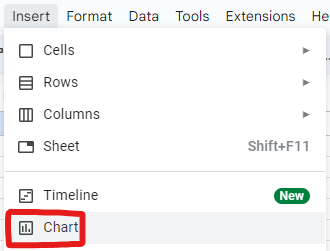

        Figure 12 : Showing column A-J being selected

3. Click on the ‘Insert’ button at the top panel and click on ‘Pivot Table’

        

>>>>>  gd2md-html alert: inline image link here (to images/image14.png). Store image on your image server and adjust path/filename/extension if necessary.  (<a href="#">Back to top</a>)(<a href="#gdcalert15">Next alert</a>) >>>>> 

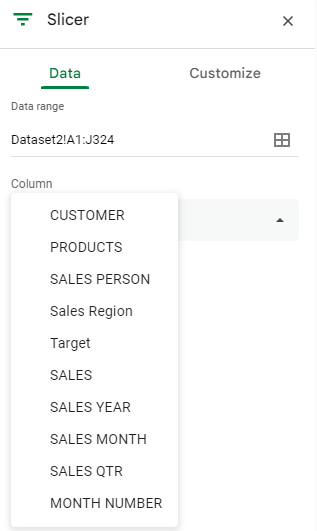

        Figure 13 : Showing the ‘Insert’ button being clicked on and ‘Pivot Table’

4. Click on ‘Existing Sheet’ and click on ‘Select data range’

        

>>>>>  gd2md-html alert: inline image link here (to images/image15.png). Store image on your image server and adjust path/filename/extension if necessary.  (<a href="#">Back to top</a>)(<a href="#gdcalert16">Next alert</a>) >>>>> 

        Figure 14 : Showing a different menu when clicking on ‘Existing sheet’ and highlighting the ‘Select data range’ button

5. A new menu will appear asking which cell to insert the pivot table. Go to ‘Pivot Table 1’ sheet and click on the cell at the lower part of the sheet because we are going to insert charts at the upper part. Just select a cell you want to add the pivot table and click ‘OK’

        

>>>>>  gd2md-html alert: inline image link here (to images/image16.png). Store image on your image server and adjust path/filename/extension if necessary.  (<a href="#">Back to top</a>)(<a href="#gdcalert17">Next alert</a>) >>>>> 

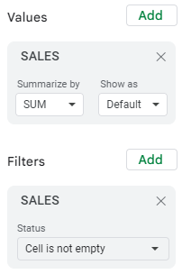

        Figure 15 : Click on row 70 of column A and click on ‘OK’

6. Click ‘Create’. The pivot will be created at the previously selected cell

        

>>>>>  gd2md-html alert: inline image link here (to images/image17.png). Store image on your image server and adjust path/filename/extension if necessary.  (<a href="#">Back to top</a>)(<a href="#gdcalert18">Next alert</a>) >>>>> 

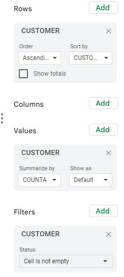

        Figure 16 : Click on ‘Create’

        

>>>>>  gd2md-html alert: inline image link here (to images/image18.png). Store image on your image server and adjust path/filename/extension if necessary.  (<a href="#">Back to top</a>)(<a href="#gdcalert19">Next alert</a>) >>>>> 

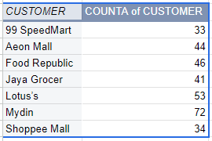

        Figure 17 : Pivot table created

7. Repeat step 2 - step 6 until there are 5 blank pivot tables at the lower part of ‘Dashboard’ sheet since we are making 5 charts

## 

## **Creating Pivot table for Region chart**

1. Hover your mouse over the first pivot table and click on the ‘Edit’ button (Pencil icon)

        

>>>>>  gd2md-html alert: inline image link here (to images/image19.png). Store image on your image server and adjust path/filename/extension if necessary.  (<a href="#">Back to top</a>)(<a href="#gdcalert20">Next alert</a>) >>>>> 

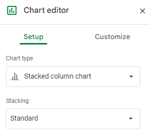

        Figure 18 : Showing the ‘Edit’ button pop up when hovering over pivot table

2. Add ‘Sales Region’ on ‘Rows’ and ‘Values’ section

        

>>>>>  gd2md-html alert: inline image link here (to images/image20.png). Store image on your image server and adjust path/filename/extension if necessary.  (<a href="#">Back to top</a>)(<a href="#gdcalert21">Next alert</a>) >>>>> 

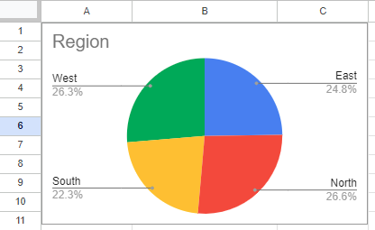

        Figure 19 : Show ‘Sales Region’ added to its respective section

3. Add ‘Sales Region’ at the ‘Filters’ section and set the condition to ‘Is not empty’ so that the pivot does not read blank cells. Click ‘OK’

        

>>>>>  gd2md-html alert: inline image link here (to images/image21.png). Store image on your image server and adjust path/filename/extension if necessary.  (<a href="#">Back to top</a>)(<a href="#gdcalert22">Next alert</a>) >>>>> 

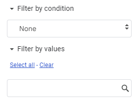

        Figure 20 : Step 1 to set the condition

        

>>>>>  gd2md-html alert: inline image link here (to images/image22.png). Store image on your image server and adjust path/filename/extension if necessary.  (<a href="#">Back to top</a>)(<a href="#gdcalert23">Next alert</a>) >>>>> 

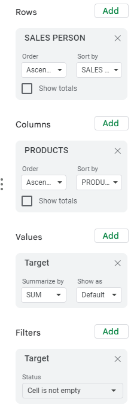

        Figure 21 : Step 2 to set the condition

        

>>>>>  gd2md-html alert: inline image link here (to images/image23.png). Store image on your image server and adjust path/filename/extension if necessary.  (<a href="#">Back to top</a>)(<a href="#gdcalert24">Next alert</a>) >>>>> 

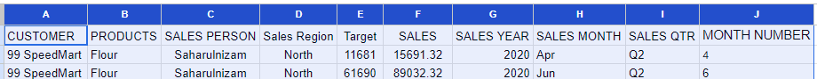

        Figure 22 : Step 3 to set the condition and click on ‘OK’

4. The pivot table should looks like this

        

>>>>>  gd2md-html alert: inline image link here (to images/image24.png). Store image on your image server and adjust path/filename/extension if necessary.  (<a href="#">Back to top</a>)(<a href="#gdcalert25">Next alert</a>) >>>>> 

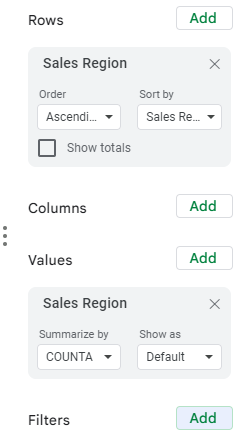

        Figure 23 : Pivot table for Sales Region

## **Creating Pivot table for Customer chart**

1. Go to a new pivot table
2. Follow the same steps as **[Creating Pivot table for Region chart](#creating-pivot-table-for-region-chart-10)** to get the following result

        

>>>>>  gd2md-html alert: inline image link here (to images/image25.png). Store image on your image server and adjust path/filename/extension if necessary.  (<a href="#">Back to top</a>)(<a href="#gdcalert26">Next alert</a>) >>>>> 

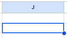

        Figure 24 : Rows, Values and Filter for the ‘Customer’ pivot table

3. The pivot table should looks like this

        

>>>>>  gd2md-html alert: inline image link here (to images/image26.png). Store image on your image server and adjust path/filename/extension if necessary.  (<a href="#">Back to top</a>)(<a href="#gdcalert27">Next alert</a>) >>>>> 

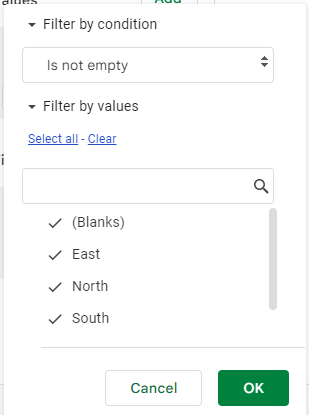

        Figure 25 : Pivot table for Customer

## **Creating Pivot table for Salesperson chart**

1. Go to a new pivot table
2. Follow the same steps as **[Creating Pivot table for Region chart](#creating-pivot-table-for-region-chart-10)** to get the following result

        

>>>>>  gd2md-html alert: inline image link here (to images/image27.png). Store image on your image server and adjust path/filename/extension if necessary.  (<a href="#">Back to top</a>)(<a href="#gdcalert28">Next alert</a>) >>>>> 

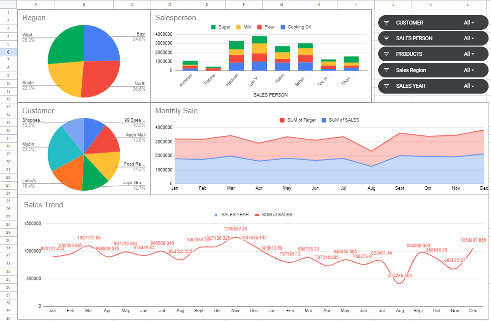

        Figure 26 : Rows, Values and Filter for the ‘Salesperson’ pivot table

3. The pivot table should looks like this

        

>>>>>  gd2md-html alert: inline image link here (to images/image28.png). Store image on your image server and adjust path/filename/extension if necessary.  (<a href="#">Back to top</a>)(<a href="#gdcalert29">Next alert</a>) >>>>> 

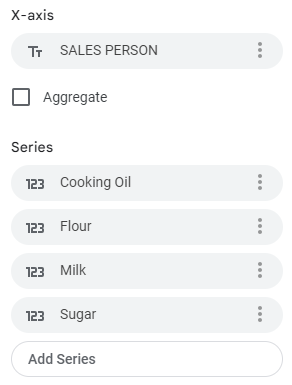

        Figure 27 : Pivot table for Salesperson

        

## Creating Pivot table for Monthly Sale chart

1. Go to a new pivot table
2. Follow the same steps as **[Creating Pivot table for Region chart](#creating-pivot-table-for-region-chart-10)** to get the following result

        

>>>>>  gd2md-html alert: inline image link here (to images/image29.png). Store image on your image server and adjust path/filename/extension if necessary.  (<a href="#">Back to top</a>)(<a href="#gdcalert30">Next alert</a>) >>>>> 

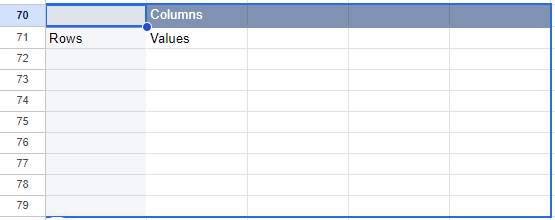

        Figure 28 : Rows and Values for ‘Monthly Sale’ pivot table

        

>>>>>  gd2md-html alert: inline image link here (to images/image30.png). Store image on your image server and adjust path/filename/extension if necessary.  (<a href="#">Back to top</a>)(<a href="#gdcalert31">Next alert</a>) >>>>> 

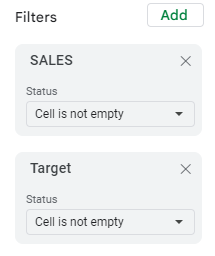

        Figure 29 : Filters for ‘Monthly Sale’ pivot table

3. The pivot table should looks like this

        

>>>>>  gd2md-html alert: inline image link here (to images/image31.png). Store image on your image server and adjust path/filename/extension if necessary.  (<a href="#">Back to top</a>)(<a href="#gdcalert32">Next alert</a>) >>>>> 

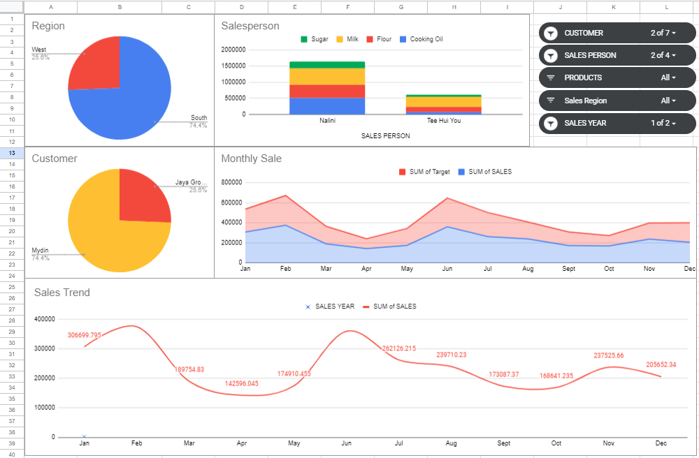

        Figure 30 : Pivot table for Monthly Sale

        

	**Creating Pivot table for Sales Trend chart**

1. Go to a new pivot table
2. Follow the same steps as **[Creating Pivot table for Region chart](#creating-pivot-table-for-region-chart-10)** to get the following result

        

>>>>>  gd2md-html alert: inline image link here (to images/image32.png). Store image on your image server and adjust path/filename/extension if necessary.  (<a href="#">Back to top</a>)(<a href="#gdcalert33">Next alert</a>) >>>>> 

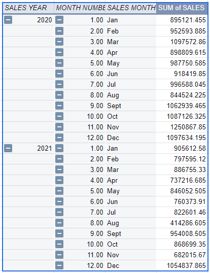

        Figure 31 : Rows for ‘Sales Trend’ pivot table

        

>>>>>  gd2md-html alert: inline image link here (to images/image33.png). Store image on your image server and adjust path/filename/extension if necessary.  (<a href="#">Back to top</a>)(<a href="#gdcalert34">Next alert</a>) >>>>> 

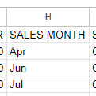

        Figure 32 : Values and Filters for ‘Sales Trend’ pivot table

3. The pivot table should looks like this

        

>>>>>  gd2md-html alert: inline image link here (to images/image34.png). Store image on your image server and adjust path/filename/extension if necessary.  (<a href="#">Back to top</a>)(<a href="#gdcalert35">Next alert</a>) >>>>> 

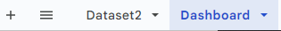

        Figure 33 : Pivot table for Sales Trend

# Creating Charts for All of the Pivot Tables

## 	Creating Pie Chart for Region Pivot Table

1. Select the entire Region pivot table
2. Click on ‘Insert’ → ‘Chart’

        

>>>>>  gd2md-html alert: inline image link here (to images/image35.png). Store image on your image server and adjust path/filename/extension if necessary.  (<a href="#">Back to top</a>)(<a href="#gdcalert36">Next alert</a>) >>>>> 

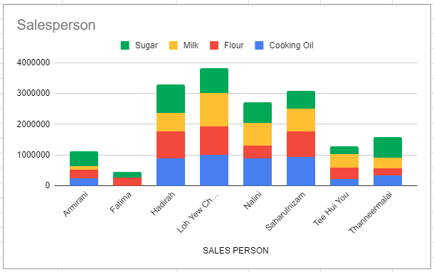

        Figure 34 : Showing the menu that popped up after clicking ‘Insert’ and where to find ‘Chart’

3. A chart will appear alongside with its chart editor panel

        

>>>>>  gd2md-html alert: inline image link here (to images/image36.png). Store image on your image server and adjust path/filename/extension if necessary.  (<a href="#">Back to top</a>)(<a href="#gdcalert37">Next alert</a>) >>>>> 

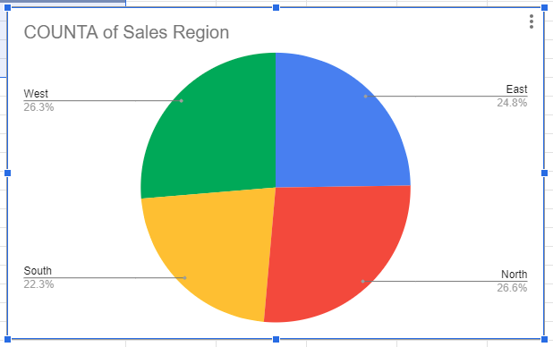

        Figure 35 : Newly generated chart

        

>>>>>  gd2md-html alert: inline image link here (to images/image37.png). Store image on your image server and adjust path/filename/extension if necessary.  (<a href="#">Back to top</a>)(<a href="#gdcalert38">Next alert</a>) >>>>> 

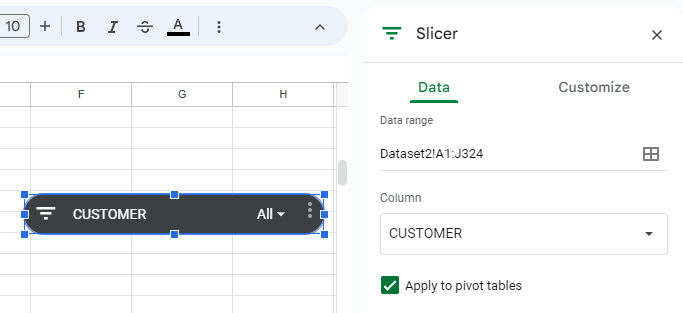

        Figure 36 : Chart editor panel

4. You can customize the chart by clicking ‘Customize’

        

>>>>>  gd2md-html alert: inline image link here (to images/image38.png). Store image on your image server and adjust path/filename/extension if necessary.  (<a href="#">Back to top</a>)(<a href="#gdcalert39">Next alert</a>) >>>>> 

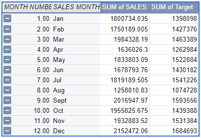

        Figure 37 : Customize panel

        

5. Customize the chart (Edit title and so on) and place it at the top of the sheet

        

>>>>>  gd2md-html alert: inline image link here (to images/image39.png). Store image on your image server and adjust path/filename/extension if necessary.  (<a href="#">Back to top</a>)(<a href="#gdcalert40">Next alert</a>) >>>>> 

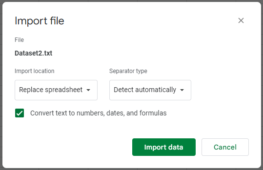

        Figure 38 : Region chart placed at the top of the sheet

## 	**Creating Pie Chart for Customer Pivot Table**

1. Follow the same steps as **[Creating Pie Chart for Region Pivot Table](#creating-pie-chart-for-region-pivot-table-20)** for ‘Customer’ pivot table
2. You should get a pie chart similar to this

        

>>>>>  gd2md-html alert: inline image link here (to images/image40.png). Store image on your image server and adjust path/filename/extension if necessary.  (<a href="#">Back to top</a>)(<a href="#gdcalert41">Next alert</a>) >>>>> 

        Figure 39 : Customer pie chart generated

## 	**Creating Stacked Column Chart for Salesperson Pivot Table**

1. Follow the same steps as **[Creating Pie Chart for Region Pivot Table](#creating-pie-chart-for-region-pivot-table-20)** up to step 3 for ‘Salesperson’ pivot table
2. Make sure that the chart type is ‘Stacked Column Chart’ at the ‘Chart Editor’ panel

        

>>>>>  gd2md-html alert: inline image link here (to images/image41.png). Store image on your image server and adjust path/filename/extension if necessary.  (<a href="#">Back to top</a>)(<a href="#gdcalert42">Next alert</a>) >>>>> 

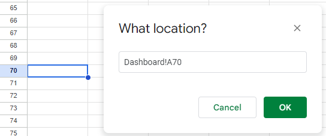

        Figure 40 : Shows that the chart type is ‘Stacked Column Chart’

3. Make sure that the ‘X-axis’ and ‘Series’ are configured like Figure 41 and change the chart’s name to ‘Salesperson’

        

>>>>>  gd2md-html alert: inline image link here (to images/image42.png). Store image on your image server and adjust path/filename/extension if necessary.  (<a href="#">Back to top</a>)(<a href="#gdcalert43">Next alert</a>) >>>>> 

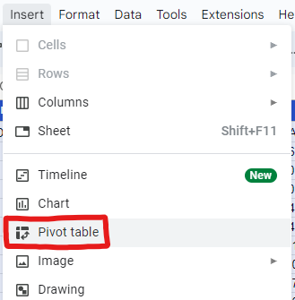

        Figure 41 : Configuration of ‘X-axis’ and ‘Series’ for Stacked Column Chart

        

>>>>>  gd2md-html alert: inline image link here (to images/image43.png). Store image on your image server and adjust path/filename/extension if necessary.  (<a href="#">Back to top</a>)(<a href="#gdcalert44">Next alert</a>) >>>>> 

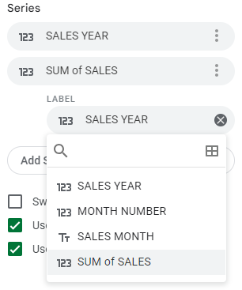

        Figure 42 : Shows that the chart’s name has been changed to ‘Salesperson’

## 	**Creating Stacked Area Chart for Monthly Sale Pivot Table**

1. Follow the same steps as **[Creating Pie Chart for Region Pivot Table](#creating-pie-chart-for-region-pivot-table-20)** up to step 3 for ‘Monthly Sale’ pivot table
2. Make sure that the chart type is ‘Stacked Area Chart’ at the ‘Chart Editor’ panel

        

>>>>>  gd2md-html alert: inline image link here (to images/image44.png). Store image on your image server and adjust path/filename/extension if necessary.  (<a href="#">Back to top</a>)(<a href="#gdcalert45">Next alert</a>) >>>>> 

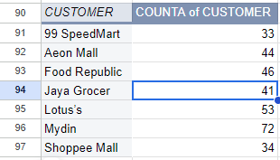

        Figure 43 : Shows that the chart type is ‘Stacked Area Chart’

3. Now, we need to configure the ‘X-axis’ and ‘Series’ for the chart. First, insert the ‘SALES MONTH’ as the ‘X-axis’. Do not tick the ‘Aggregate’ button

        

>>>>>  gd2md-html alert: inline image link here (to images/image45.png). Store image on your image server and adjust path/filename/extension if necessary.  (<a href="#">Back to top</a>)(<a href="#gdcalert46">Next alert</a>) >>>>> 

        Figure 44 : SALES MONTH set as the X-axis

4. Next, remove ‘MONTH NUMBER’ from the ‘Series’ by clicking on the three dots and click ‘Remove’

        

>>>>>  gd2md-html alert: inline image link here (to images/image46.png). Store image on your image server and adjust path/filename/extension if necessary.  (<a href="#">Back to top</a>)(<a href="#gdcalert47">Next alert</a>) >>>>> 

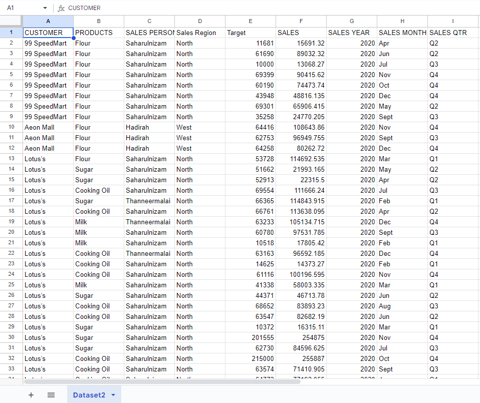

        Figure 45 : Where to find the ‘Remove’ button

5. The ‘X-axis’ and ‘Series’ should looks like Figure 46 and the chart should looks like Figure 47

        

>>>>>  gd2md-html alert: inline image link here (to images/image47.png). Store image on your image server and adjust path/filename/extension if necessary.  (<a href="#">Back to top</a>)(<a href="#gdcalert48">Next alert</a>) >>>>> 

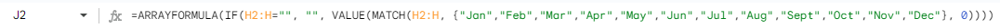

        Figure 46 : ‘X-axis’ and ‘Series’ for the ‘Stacked Area Chart’

        

>>>>>  gd2md-html alert: inline image link here (to images/image48.png). Store image on your image server and adjust path/filename/extension if necessary.  (<a href="#">Back to top</a>)(<a href="#gdcalert49">Next alert</a>) >>>>> 

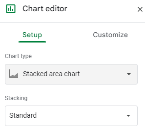

        Figure 47 : Stacked Area Chart

6. Lastly, name the chart as ‘Monthly Sale’ and place it at the top of the ‘Dashboard’ sheet

        

## 	**Creating Stacked Area Chart for Sales Trend Pivot Table**

1. Follow the same steps as **[Creating Pie Chart for Region Pivot Table](#creating-pie-chart-for-region-pivot-table-20)** up to step 3 for ‘Sales Trend’ pivot table
2. Make sure that the chart type is ‘Smooth Line Chart’ at the ‘Chart Editor’ panel

        

>>>>>  gd2md-html alert: inline image link here (to images/image49.png). Store image on your image server and adjust path/filename/extension if necessary.  (<a href="#">Back to top</a>)(<a href="#gdcalert50">Next alert</a>) >>>>> 

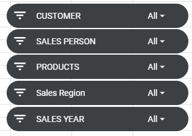

        Figure 48 : Shows that the chart type is ‘Smooth Line Chart’

3. Now, we need to configure the ‘X-axis’ and ‘Series’ for the chart. First, insert the ‘SALES MONTH’ as the ‘X-axis’. Do not tick the ‘Aggregate’ button

        

>>>>>  gd2md-html alert: inline image link here (to images/image50.png). Store image on your image server and adjust path/filename/extension if necessary.  (<a href="#">Back to top</a>)(<a href="#gdcalert51">Next alert</a>) >>>>> 

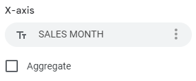

        Figure 49 : SALES MONTH set as the X-axis

4. Next, remove ‘MONTH NUMBER’ from the ‘Series’ by clicking on the three dots and click ‘Remove’

        

>>>>>  gd2md-html alert: inline image link here (to images/image51.png). Store image on your image server and adjust path/filename/extension if necessary.  (<a href="#">Back to top</a>)(<a href="#gdcalert52">Next alert</a>) >>>>> 

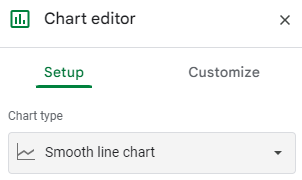

        Figure 50 : Where to find the ‘Remove’ button

5. Next, add label to the ‘SUM of SALES’ from the ‘Series’ by clicking on the three dots and click ‘Add labels’ and change it to ‘SUM of SALES’

        

>>>>>  gd2md-html alert: inline image link here (to images/image52.png). Store image on your image server and adjust path/filename/extension if necessary.  (<a href="#">Back to top</a>)(<a href="#gdcalert53">Next alert</a>) >>>>> 

        Figure 51 : ‘Add labels’ button

        

>>>>>  gd2md-html alert: inline image link here (to images/image53.png). Store image on your image server and adjust path/filename/extension if necessary.  (<a href="#">Back to top</a>)(<a href="#gdcalert54">Next alert</a>) >>>>> 

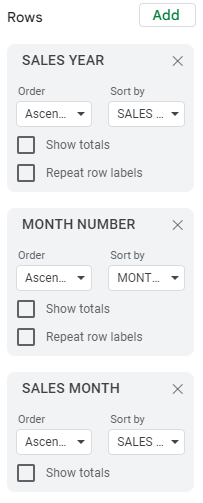

        Figure 52 : Change the label to ‘SUM of SALES’

6. Lastly, name the chart as ‘Sales Trend’ and place it at the top of the ‘Dashboard’ sheet

## 	**Dashboard after creation of all 5 charts**

1. You should have all these 5 charts if the steps were executed perfectly

>>>>>  gd2md-html alert: inline image link here (to images/image54.png). Store image on your image server and adjust path/filename/extension if necessary.  (<a href="#">Back to top</a>)(<a href="#gdcalert55">Next alert</a>) >>>>> 

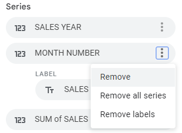

Figure 53 : All the charts created thus far

# Creating Slicer to filter the charts

1. Click on any cell of any pivot table

    

>>>>>  gd2md-html alert: inline image link here (to images/image55.png). Store image on your image server and adjust path/filename/extension if necessary.  (<a href="#">Back to top</a>)(<a href="#gdcalert56">Next alert</a>) >>>>> 

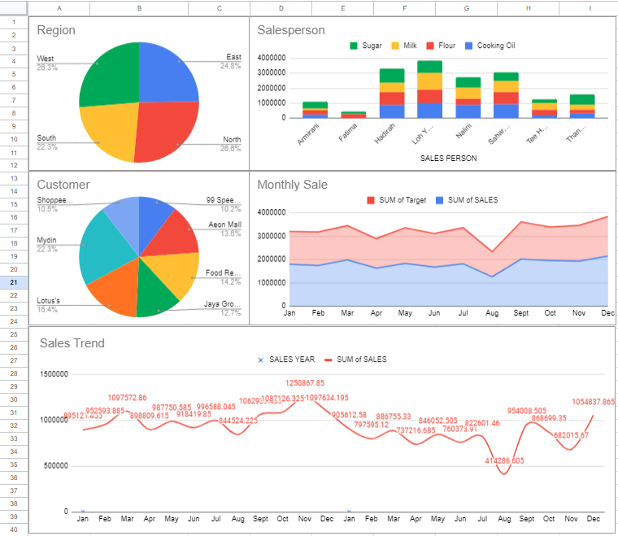

    Figure 54 : Selecting random cell from a pivot table

2. Click on ‘Data’ at the top bar of the sheet and click on ‘Add a slicer’

    

>>>>>  gd2md-html alert: inline image link here (to images/image56.png). Store image on your image server and adjust path/filename/extension if necessary.  (<a href="#">Back to top</a>)(<a href="#gdcalert57">Next alert</a>) >>>>> 

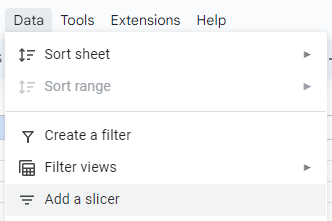

    Figure 55 : Add a slicer button

3. The slicer menu panel will pop up as well with the newly added slicer 

    

>>>>>  gd2md-html alert: inline image link here (to images/image57.png). Store image on your image server and adjust path/filename/extension if necessary.  (<a href="#">Back to top</a>)(<a href="#gdcalert58">Next alert</a>) >>>>> 

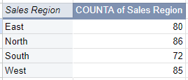

    Figure 56 : Slicer menu panel

    

>>>>>  gd2md-html alert: inline image link here (to images/image58.png). Store image on your image server and adjust path/filename/extension if necessary.  (<a href="#">Back to top</a>)(<a href="#gdcalert59">Next alert</a>) >>>>> 

    Figure 57 : Newly added slicer

4. Select ‘CUSTOMER’

    

>>>>>  gd2md-html alert: inline image link here (to images/image59.png). Store image on your image server and adjust path/filename/extension if necessary.  (<a href="#">Back to top</a>)(<a href="#gdcalert60">Next alert</a>) >>>>> 

    Figure 58 : Selecting ‘CUSTOMER’

5. Now create 4 more slicers for ‘SALESPERSON’, ‘PRODUCTS’, ‘Sales Region’ and ‘SALES YEAR’. Now you should have a total of 5 slicers

    

>>>>>  gd2md-html alert: inline image link here (to images/image60.png). Store image on your image server and adjust path/filename/extension if necessary.  (<a href="#">Back to top</a>)(<a href="#gdcalert61">Next alert</a>) >>>>> 

    Figure 59 : All the slicers thus far

6. Move all of the slicers to the top of the ‘Dashboard’ sheet. Hold ‘ctrl’ button on your keyboard and click on all of the slicers to make the process faster
7. Now your ‘Dashboard’ should look like Figure 60

    

>>>>>  gd2md-html alert: inline image link here (to images/image61.png). Store image on your image server and adjust path/filename/extension if necessary.  (<a href="#">Back to top</a>)(<a href="#gdcalert62">Next alert</a>) >>>>> 

    Figure 60 : Completed Dashboard

    

8. You can filter the data using the slicer

    

>>>>>  gd2md-html alert: inline image link here (to images/image62.png). Store image on your image server and adjust path/filename/extension if necessary.  (<a href="#">Back to top</a>)(<a href="#gdcalert63">Next alert</a>) >>>>> 

    Figure 61 : The charts will change after filtering using the slicers
