

# Assignment 1b: Sales Performance

### Group Name: ohSheet
### Group Members

| Name                                     | Matrix Number | Task |
| :---------------------------------------- | :-------------: | ------------- |
| MIKHAIL BIN YASSIN                       |  A21EC0053       |      Pre-processing |
| FAUZAN AQIL BIN AZMAN                    |    A21EC0174     |    Data Transformation           |
| YASMEEN NATASHA BINTI HAFIZ SHAHREL      |     A21EC0147    |     Documentation|   
| MUHAMMAD ADAM FAHMI BIN MOHD TAUFIQ      |      A21EC0061   |       Visualization         |     

## Table of Contents
+ [About](#about)
+ [Getting Started](#import)
+ [Creating a Dynamic Dashboard](#dashboard)
+ [Contributing](../CONTRIBUTING.md)

## About 

The main goal of this project is to utilize Google Sheets to process and present data, with a specific focus on a case study related to examination results. The project involves tasks such as calculating statistics, creating charts, and generating meaningful insights from the examination results.

We were given **Dataset2** where information about **CUSTOMER**, **PRODUCTS**, **SPORTS**, **SALES PERSON**, **Sales Region**, **Target**, **SALES**, **SALES YEAR**, **SALES MONTH** and **SALES QTR** are contained.

Firstly, we need to **import the data**. Since the data is already processed, we will **create a dynamic dashboard** to visualize the overall result.

In a nutshell, the project emphasizes practical data manipulation and visualization skills within the context of educational assessment.

## Getting Started 

1. Download the Dataset2.txt file.

2. To import the Dataset2.txt file on Google Sheets, choose 'File' and click 'Import'.
   
   

   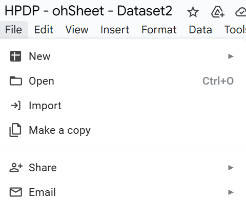
   
 
   
3. Choose the file and click 'Import data'.

4. Figure shows the data that has been entered into Google Sheets. This dataset contains ten columns: **CUSTOMER**, **PRODUCTS**, **SPORTS**, **SALES PERSON**, **Sales Region**, **Target**, **SALES**, **SALES YEAR**, **SALES MONTH** and **SALES QTR**.

## Creating a Dynamic Dashboard 
   

   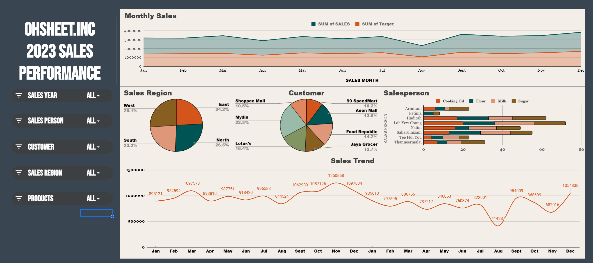
   
 

5. Create Pivot table
   
   Click “Insert” button then choose “Pivot Table” as shown below
   

   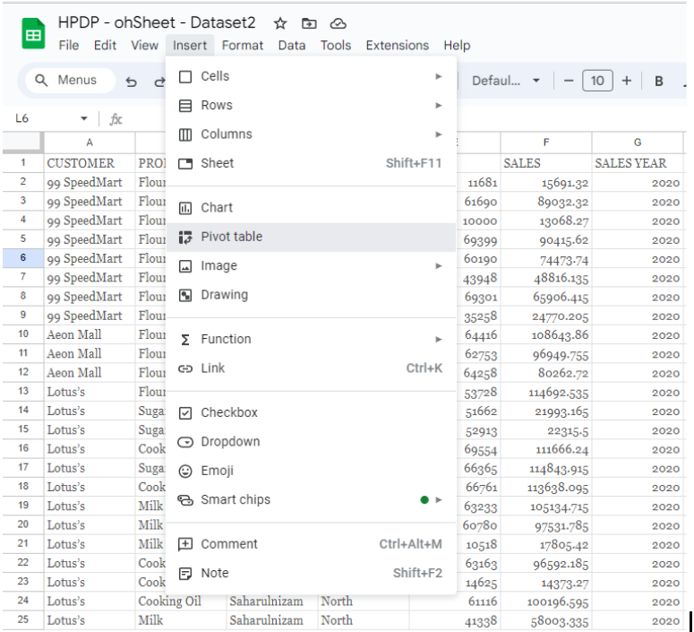
   
 

   Select all the data from the dataset for data range 
    

   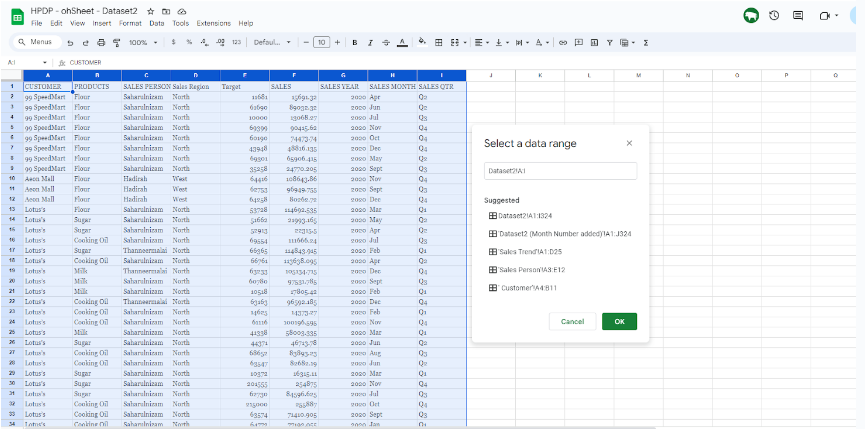
   
 

   Then choose whether “Existing sheet” to apply at same page, for “New sheet” it will create and apply at the new sheet. Lastly, click “Create” button to create pivot table
   

   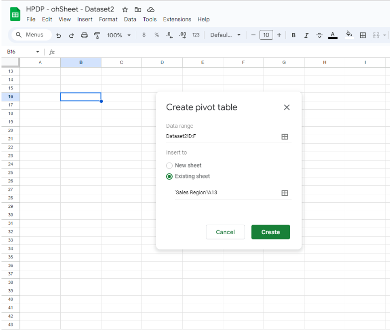
   
 

   Here is the examples of pivot table that already created 
   

   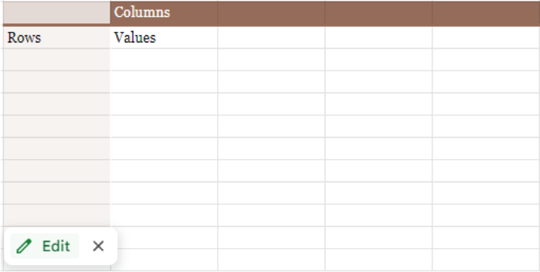
   
 

   
   SALES REGION
   
   For sales region, drag “Sales Region” to “Rows” and “Filters”, then drag “SALES” to the values
    

   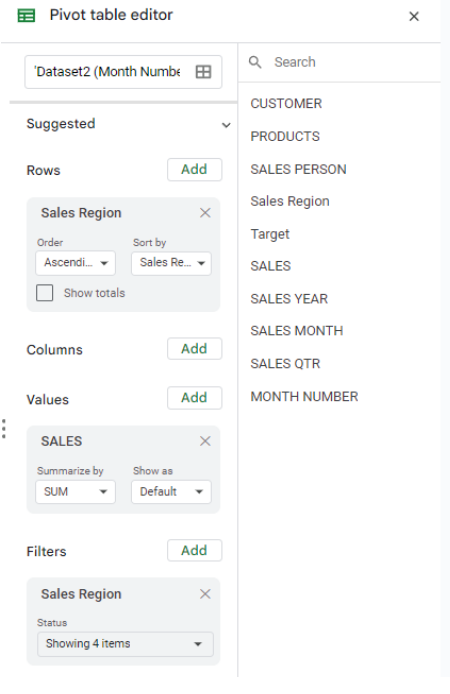
   
 

   Here is the result of SALES REGION
   
    

   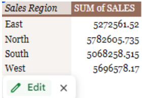
   
 

   SALES YEAR

   For Sales year, drag “SALES YEAR” to “Rows”, drag “SALES” to Values and set it as  “SUM”, and lastly drag “SALES YEAR” to “Filters”.
    

   
   
 

   Here is the result of SALES YEAR
   

   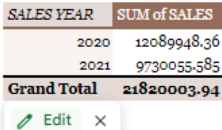
   
 

   SALES PERSON

   For Customer, drag “CUSTOMER”,  to “Rows”, then drag “PRODUCTS” to the “Columns”, drag “PRODUCTS” to value and set the value as “COUNTA”  and lastly drag “SALES PERSON” to “Filters”
    

   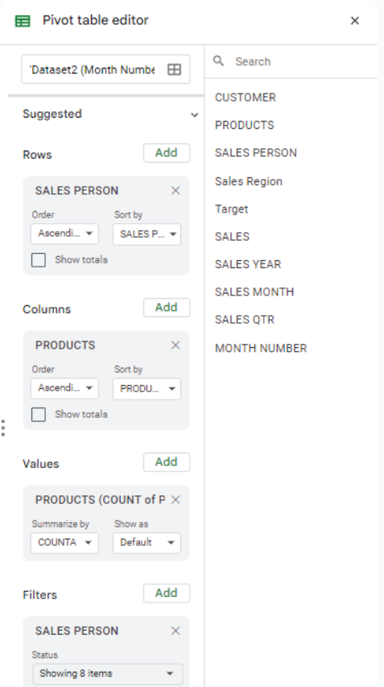
   
 

   Here is the result for SALES PERSON
   

   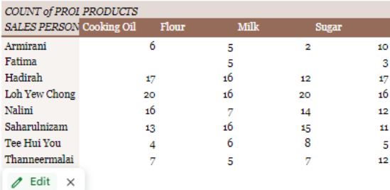
   
 

   CUSTOMER
   
   For Customer, drag “CUSTOMER”  to “Rows”, then drag “PRODUCTS” to the values and lastly drag “CUSTOMER” to “Filters”
   

   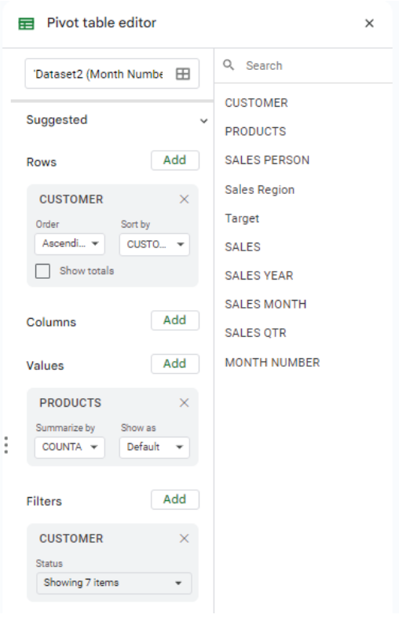
   
 

    Here is the result for CUSTOMER
   

   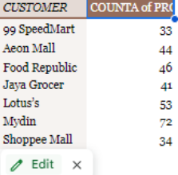
   
 
   
   

   PRODUCTS
   
   For monthly sales, drag “SALES PERSON”  to “Rows”, then drag “PRODUCT” to the “Columns”, drag “PRODUCT” to values and set it as “COUNTA” , and lastly drag “SALES PERSON” and “PRODUCTS” to “Filters”
    

   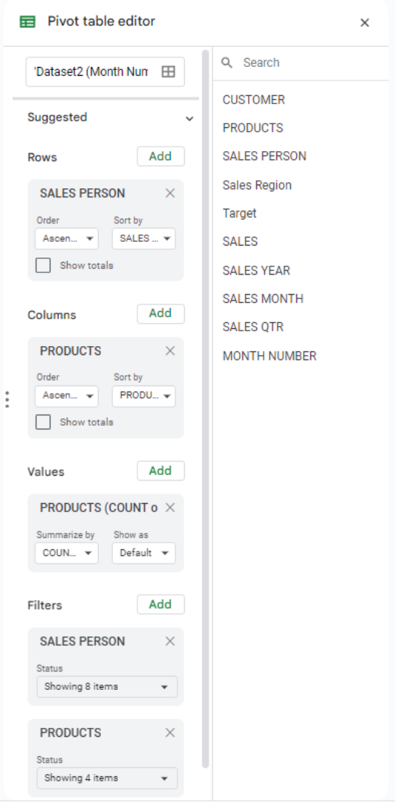
   
 

   
   Here is the result for PRODUCTS 
   

   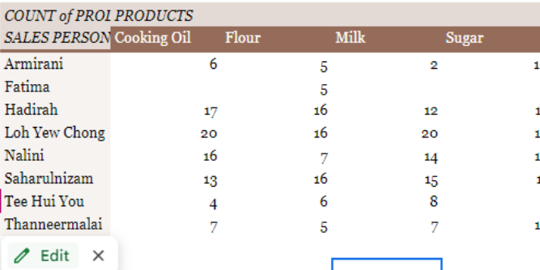
   
 

   SALES TREND

   For sales trend, drag “SALES YEAR”, “MONTH NUMBER” and “SALES MONTH”  to “Rows”, then drag “SALES” to the values and lastly drag “SALES YEAR” to “Filters”
   

   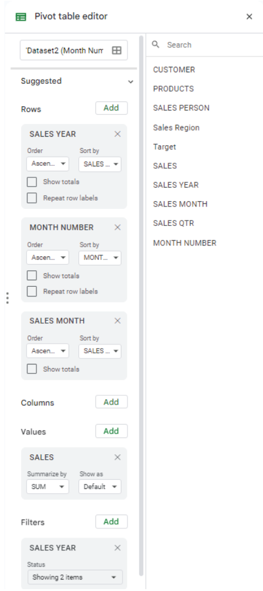
   
 

   Here is the result for SALES TREND 
   

   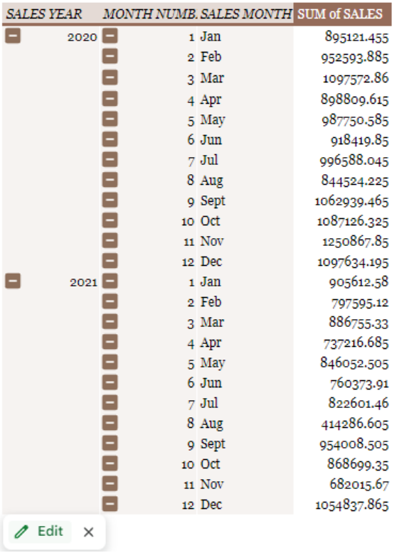
   
 
    

## Contribution 🛠️
Please create an [Issue](https://github.com/drshahizan/HPDP/issues) for any improvements, suggestions or errors in the content.

You can also contact me using [Linkedin](https://www.linkedin.com/in/drshahizan/) for any other queries or feedback.

