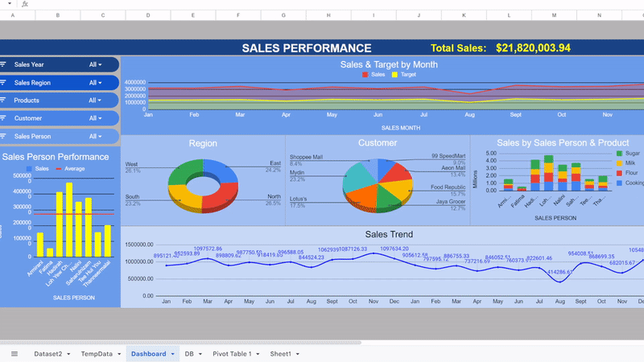

# Assignment 1: Data Analysis using Google Sheets
## Dataset 2 Report

---

### 🍀Group Name: sheemart
### 🌼Group Members

| Name                                     | Matrix Number | Photo |
| :---------------------------------------- | :-------------: | ------------|
| MUHAMMAD AMIR JAMIL BIN JAMLUS | A21EC0202 |              |
| MUHAMMAD NAQUIB BIN ZAKARIA | A20BE0161 |              |
| MUHAMMAD HAZIM BIN SALMAN | A21EC0078 |              |
| NURUNNAJWA BINTI ZULKIFLI | A21EC0121 |                  |

------
## 🌟sheemart Dashboard

  
------

## Dataset Information

We work with a dataset called dataset2.txt. This dataset contain nine columns. Customer, product, and salespeson are some of the column use

Google Sheet : https://docs.google.com/spreadsheets/d/1NeqlqmzfCoZzOjti6SplwZSnEMmr9rE3DAy8bdw6gSY/edit#gid=1654905438

---

## 1. Import dataset into Google Sheet

_Figure 1: Import the data_

- After opening Google Sheet, click on **File** and choose **Import**.

_Figure 2: Choose your data_

- Choose** Browse **and choose 'Dataset2.txt' as our dataset.

_Figure 3: Import data_

- Choose '**Replace in current sheet**' as Import location and '**Detect automatically**' as separator type. Check on the checkboard. Then, click Import Data.

_Figure 4: Database imported successfully_

- The database has been imported successfully.

----
## 2. Create "TempData"

We then created a temporary dataset called "TempData". The purpose of this temporary data is to allow us to work with the exact copy of the Dataset2.txt **without applying any changes to the original dataset**. This allows us to preprocess, transform and also add columns to the copy of the dataset without affecting the original dataset.

------

_Figure 5: Creation of TempData_

- We then began preprocessing the data, because the **decimal place wasnt consistent**. We then fixed the issue using Google Sheet provided tool "Increase decimal place" to make sure the decimal place becomes cosistent.

_Figure 6: Google Sheet provided tool_

## 3. Transformation

- Then we observed the provided **dataset did not have a numeric month** so we created a pivot table to assign each months to a numeric date value so we can use the data in our dashboard. The pivot table includes Sum of SALES and SUM of Target so we can *create a relation between them*.

_Figure 7: Pivot table to convert month names to month values_

_Figure 8: Pivot table settings. We can observe that the pivot table is refering to TempData_

### 3.1 Adding column to produce better insights.
- We realized that we need a new column for a complete insight on the month and year of each record. We then **created "Numeric Month Sorted"** so we can make a pivot table of month and year for our analysis. We made sure to convert each month names to numeric representations.

- We managed to do that with a specific query to convert month names to numeric value representations

_Figure 9: Query_

_Figure 10: Added column in TempData_

### 3.2 Method to create a pivot table

- Then we observe we can utilize the Products column in the data so we created a pivot table of Products and their SALES amount. 
In order to do this we first need to insert a pivot table tool referring to TempData. 
We do this by **opening the TempData sheet > Selecting all data > Insert  > Pivot Table**. Then a "Create pivot table" menu pops up. 
Here we can choose wether to insert the pivot table in a new page or to an existing page. 
Since we already have a working sheet for our dashboard, we selected Existing Sheet option. 
We were given 2 options wether to type the location manually or to choose "Select data range". 
We chose the second option  since its faster and more efficient with low risk of human error.  
 

- We then selected the cell location for our pivot table and press **"OK" > "Create Table"**. 
Google Sheet then showed us the "Pivot table editor" from which we are free to add data to the pivot or to change the pivot table settings. 
Then we made sure the pivot table refers to TempData by looking at the "Select a data range" bar. 
**It is important to refer to the correct place as referring to the wrong  or different place might cause missing data and also data inconsistency** 
Once we have validated the reference data , we can move on to adding data to our pivot table. We then selected relevant data to be added to the pivot table.
In this case we selected the "Product" column and the "SALES" column. We made sure the "Order" and "Sort by " settings are correcy, and we observe the pivot table is created successfully.
The purpose of pivot tables are for us to be able to create a relation between the data, and act as a reference point for our future charts in the dashboard.
**The creation of future pivot tables follow the same method as above.**

_Figure 11: Selecting all data in TempData_

_Figure 12: Selecting "Pivot Table" in the insert dropdown menu_

_Figure 13: Selecting the location in which the pivot table will be located._

_Figure 14: Selecting the location in which the pivot table will be located._

_Figure 15: Adding data to the pivot table and adjusting the required settings._

_Figure 16: Products & Sales pivot table._

_Figure 17: Regions & Sales pivot table._

_Figure 18: Customer & Sales pivot table._

_Figure 19: Sales MM-YYYY & Sales pivot table._

_Figure 20: Sales Person & Sales pivot table._

- We also noticed the capability of the dataset to determine each Sales Person performance with the addition of "Average" data which we will need to calculate. "Average" will create graph of each Sales Person performance against the average value of Sales.

_Figure 21: Query to find and add Average column to the pivot table. "=SUM(refdata)/COUNTUNIQUE(refdata)"_

## 4. Creating the dashboard

- Our dashboard consists of 2 main components , which are data visualizations and interactivity. We visualized our data with the help of "Charts" tool provided by Google Sheet, and the interactivity is executed by using the "Slicer" tool. It is very important to choose the right charts and provide enough interactivity and flexibility so the viewer can fully understand the insights from  the data, while interacting to view the charts in multiple different forms  according to their needs.

### 4.1 Creating the slicers

- Google Sheet provides us with the slicer tool and it is very accessible. In the tools menu, go to Data > Add a Slicer > Select a data range > Press "OK" > Choose your column on the "Choose a column dropdown menu" > Select apply to pivot tables.
- We need to make sure that the data range we chose is the right one as the wrong data range can cause data inconsistency or even missing data and errors. Here, we made sure to choose data from TempData(same as pivot table range).
- It is also important to make sure we select the "Apply to pivot tables" option as this will make sure any filters we apply to our slicers will affect our charts in the dashboard as the charts will be created by referrig the same pivot tables, top ensure data consistency is preserved.
- All slicers that we create will follow the same steps and rules, excluding the column selection as this depends on each individual slicers and their purpose(columns to filter).

_Figure 22: Add a Slicer can be found in the tools menu under Data._

_Figure 23: Configuring the settings of the slicer before creation._

_Figure 24: All the slicers that have been created. Each serves as their own filters which filters the data according to the chosen range set by the viewer. These filters can be used together and stacked to create a sophisticated data visualization in the dashboard._ 

- To check the functionality of each slicers, we can input certain filters in, and observe the changes made on the already created pivot tables.

### 4.2 Creating the charts
- We believe that choosing the right charts to represent our data is very important. Creating the wrong chart may result in the viewer getting confused from the observations and this may lead to the user missing important insights or even failing to understand the data.
- We first need to apply uniform steps in creating our charts. First, we select the relevant pivot table > Insert > Charts. Here, Google Sheets gave us a perview of the chart to be created. We observe there is a "Chart editor" menu. There are many things we can configure here, and they are divided to 2  parts, which are "Setup" and "Customize". Setup mainly consists of configurations we can make to how the charts will receive the data, some of the configurations include Chart type which allows us to choose a wide range of chart types like histogram, line plot, pie chart or even  combo chart, depending on the type of our dat and the message we want to communicate to our viewers. Stacking mainly refers to the scale of the data points. We can also view the Data range to make sure the chart is referring to the correct pivot table to preserve data comsistency. We can also configure which column we want to be represented in the X-axis and series, we can aggregate the axis and also add series, switch rows or even choose labels.
- Customize menu refers to the configurations to  make in terms of the visual aspect of our charts. The menu is divided to Chart style, Chart  & axis titles, Series, Legend, Horizontal axis, Vertical axis, and Gridlines and ticks.
- In the setup menu we configured the data range and made sure we are referring to the same data as the pivot table to preserve data consistency. The Label, Value, Row, Series, and X-axis are comfigured based on the requirements of the charts and the message we want to give to the viewers.
- In the customize menu, we made sure to choose the right visual design to attract viewers' attention visually and help them understand the charts better, and this includes choosing the right colours and fonts, including positions of certain items; as a bad design may cause visual confusions.
- The setup menu is very important as the wrong configurations may cause data unreadability from the  charts, or data inconsistency. It is very important to also make sure that the slicers have the same effects on the charts as well as on the pivot table, to further uphold our interactivity aspect.

 

- The steps to create a chart includes choosing the pivot table that we want the chart to represent. In this example, we want to create the monthly series for SUM of SALES and Sum of Target, hence we click the already created pivot table and click Insert > Chart. Here Google Sheet will give us a preview of a suggested chart, and also the chart editor. For our case we wanted to show how the sum of sales compares to the sum of target, per month. To do this we believe Area chart suits the task well. In the Chart editor's Setup menu, we chose Area chart as our chart type, and made sure our data range is correct. We also configured and checked the configurations for the X-axis, Series, and selected Use row 1 as headers, Use column I as labels. We chose SALES MONTH as our X-axis to showcase the movement of time, and both SUM of Sales and SUM of Target as the observed values. We also customized the chart appearance in terms of colours, fonts and rename certain items to better fit the narrative. We follow the same steps and rules for every chart creation.

_Figure 25: Selecting the pivot table_ 

_Figure 26: Insert > Chart_ 

_Figure 27: Chart preview and Chart editor menu_ 

_Figure 28: Chart configurations(Setup)_ 

_Figure 29: Chart configurations(Customize)_ 

_Figure 30: Chart of Sales & Target by Month_ 

_Figure 31: Chart of Sales by Region_ 

_Figure 32: Chart of Sales by Region_ 

_Figure 33: Chart of Sales by Sales Person and Product_ 

_Figure 34: Chart of Sales Trend_ 

_Figure 35: Chart of Sales Person Performance(Sales against Sales Average which is created from a Calculated column)_ 

### 4.3 Designing the dashboard

- Our vision of a good dashboard is a dashboard that is both efficient and effective in delivering data insights. After we have all the relevant information from our pivot tables and conveyed them through messages from our charts, we need to put all these together in a page where our viewer can easily access and understand.
- Efficient dashboard comes from having most charts fit into one page so viewers can view as much charts with as little interventions.
- Effective dashboard comes from having working slicers and easy-to-understand charts, so the relevant insights can be produced.
- With the idea in mind, we have decided to put all slicers in a group of close proximity so users dont have to travel far to make alterations of combionations with our dashboard filters. We also closely-fitted our charts together to fit as much charts in a page. A "Total Sales: " count was also made and positioned at the top of the dashboard to provide easy observation of the total sales of the current filter selections.
- Total Sales: counter is constructed in reference to the Customer pivot table, with query "=SUM(F17:F23)". This counter is affected by the slicers so it too is an interactive element in our dashboard.

_Figure 36: Query of Total Sales: Counter_ 

_Figure 37: "Total Sales:" Counter_ 

# 5. sheemart Dashboard

  

 <em> Our completed dashboard </em> 
 

_Figure 38: Final Dashboard_ 

_Figure 39: Slicers in action_ 

_Figure 40: Slicers in action_ 

_Figure 41: Slicers in action_ 

_Figure 42: Slicers in action_ 

