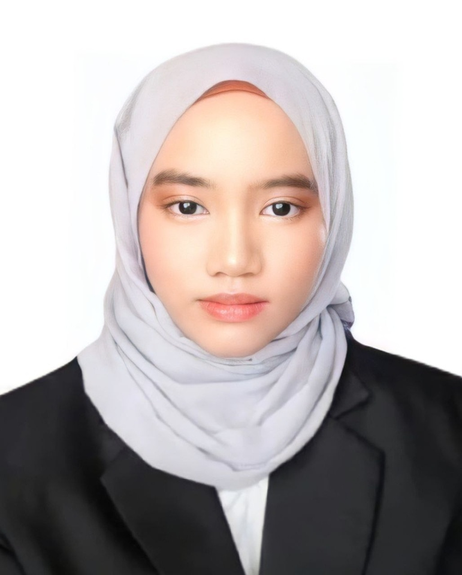

  

<h1 align="center">Alieya Zawanie Zaini</h1>

<h3 align="center">I'm currently pursuing degree in Computer Science (Data Engineering)</h3>

## About Me
I'm Alieya Zawanie, a student at UTM, residing in Perak, with a strong passion for data science and software development. I enjoy solving real-world problems and creating software solutions. This portfolio showcases my journey and the projects I've worked on.

## 🚀 Projects
- http://intellectps.com/

## 💼 Skills
#### Web Development: HTML5, CSS3, JavaScript, Bootstrap

#### Programming: C, C++, Java, Python, PHP, Anaconda

#### Databases: MySQL, MariaDB, SQL,Oracle

#### Cloud Services: AWS

#### Data Analysis: R, Power BI

#### Design: Canva

## 🎓 Education

- **CURRENTLY A THIRD YEAR STUDENT AT UTM SKUDAI**
  - KOLEJ MARA KUALA NERANG with a CGPA of 3.88
  - MRSM PARIT

## 🏆 Certifications
- [AWS Academy Graduate - AWS Cloud Foundations]([https://www.credly.com/badges/37bd6fde-ef9c-4bb8-b641-4cc16a2b28a3/public_url](https://www.credly.com/badges/df4e3719-21ac-44b7-adca-97baa71ceb1a/public_url)) 

## 📫 Contact Me

   &nbsp;&nbsp;

   &nbsp;&nbsp;

