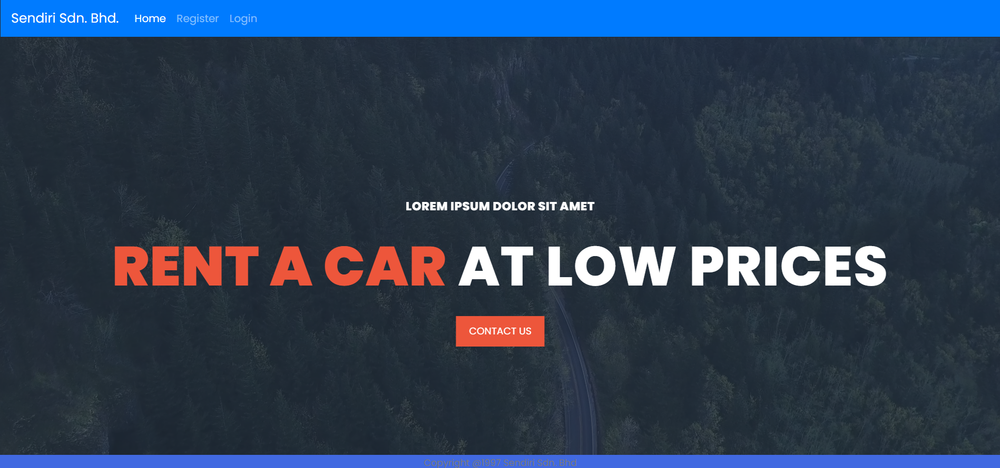
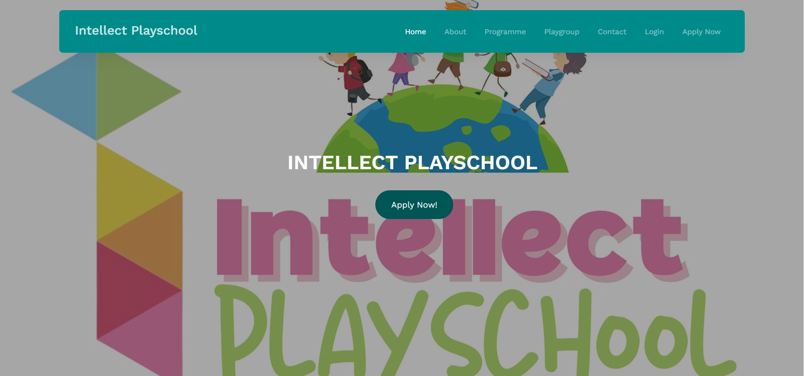
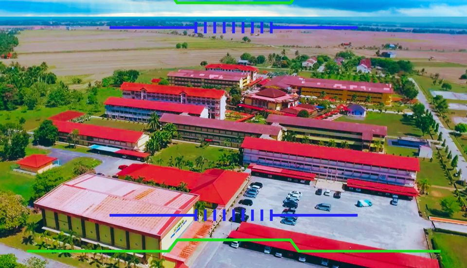
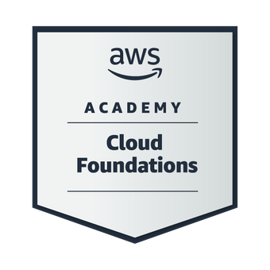

  <h1>Welcome to My Portfolio</h1>

  <h3 style="font-family: Arial, Helvetica, sans-serif;">MUHAMMAD ASHRAAF BIN SALEH</h3>

## About Me

  I am a dedicated and ambitious student currently pursuing a Bachelor's degree in Data Engineering at Universiti Teknologi Malaysia. My educational journey within the realm of data engineering has not only furnished me with robust technical expertise and knowledge but has also ignited a profound enthusiasm for software development. As a diligent scholar, I derive immense satisfaction from the craft of coding, and I persistently delve into emerging programming languages, methodologies, and cutting-edge technologies. This passion emanates from the profound realization that, as a data engineer, I possess the capacity to shape and revolutionize the world by harnessing the full potential of data. My journey in the field of data engineering aligns with my unwavering commitment to achieving excellence and making a meaningful impact in this ever-evolving domain.

## 🛠️ Languages and Tools

### Data Science

### Languages

## My Projects

### Project 1: [Car Booking System](https://hazimutm.000webhostapp.com/cbs/)

 

- **Description:** A car booking system is a software solution that enables customers to easily reserve and rent vehicles for a specified period. It provides a user-friendly interface for browsing available cars, checking their availability, and making bookings. Users can typically create accounts, input personal and payment details, and receive pricing information. These systems are commonly used by car rental agencies and car-sharing services, streamlining the process of vehicle rental for both providers and customers.
- **Technologies Used:** 
  - ⚙️ Programming Language: html, css, Javascript, MySql and PHP 
  - 🌐 Web Framework: Xampp
  - 🛢️ Database: Mariadb

### [Intellect Playschool]([https://intellectps.com/](https://intellectplayschool.com/))

**Description:** The website for Intellect Playschool serves as a vital bridge between our school and the parents, offering a convenient and informative platform to keep parents closely involved in their child's early education. It provides a window into our classroom activities, events, and curriculum, enabling parents to stay up-to-date with their child's progress. Additionally, the website offers a valuable resource for educational materials, ideas, and tips, helping parents continue their child's learning journey at home. With easy access to communication tools, event calendars, and relevant information, our website strengthens the partnership between our school and parents, creating a supportive and nurturing environment for our young learners.
  
- **Technologies Used:** 
  - ⚙️ Programming Language: html, css, Javascript, MySql and PHP 
  - 🌐 Web Framework: Xampp
  - 🛢️ Database: Mariadb

## Skills

List your technical and soft skills here:

- 💻 Programming
- 🌐 Web Development
- 📊 Data Analysis
  
## Education

### Universiti Teknologi Malaysia

- 🎓 **Degree:** Data Engineering
- 🖥️ **Faculty:** Faculty of Computing

### SMKA YAN 

- 🎓 **Course:** Science Islamic
- 🗞️ **Results:** 9A

## Contact

- ✉️ **Email:** mashraafsaleh@gmail.com
- 🔗 **LinkedIn:** [MuhammadAshraaf](https://www.linkedin.com/in/muhammadashraafsaleh)
- 🐱 **GitHub:** [MuhammadAshraaf](https://github.com/AshraafSaleh)

## Certifications

 
