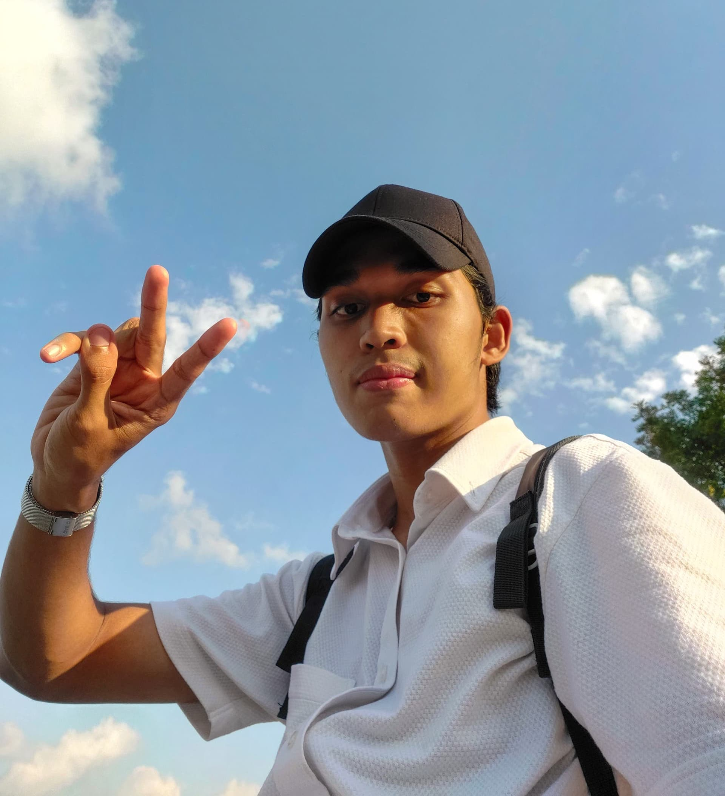

# 👨🏻‍💻 [Muhammad Hasan](https://github.com/Hasan-Che) [@Hasan-Che](https://github.com/Hasan-Che)

[](https://github.com/hasan-che/?tab=follow)
[](mailto:email@muhdhasan.chea@gmail.com)
[](https://t.me/muhdhasanchea)
[](https://www.linkedin.com/in/hasan-che-abdullah-811262218/)

<!-- Selfie -->
<div align="center">
  
</div>

<div align="center">
  <h4><samp>I'm a data engineering student trying to make cool stuff and get hired 😐.
  Hopefully by the time you read this, this page will look ❤️‍🔥 & I'll have finally mastered the way of the 🐍 </samp></h4>
</div>

 ## Who am I?
 ```python
 class WhoAmI:
 	user = 'Muhammad Hasan Bin Che Abdullah' #long name, I know...
         code = [Javascript, HTML, CSS, Python, Java]
         tools = [React, Vue, Node, Jupyter, Styled-Components]
		current_work = 'Planting Grapes'
         pronouns = 'He/Him'
		hobbies = [
				'Collecting Books',
				'Watching YouTube',
				'Taking pictures with my potato camera'
				'Ruining my sleep schedule...'
			]
	
	def getCity():
		return KotaBharu_Kelantan()
	
	def Ambitions():
		LearnMandarin()
		CreateSkyNet()
		RetireNextYear()
		# Assume 10 more awesome ambitions here  ;)
 ```

<details>
<summary>⚡️ What GitHub has to say about me </summary>
<br />

<div align="center">
  
  
  
  <br>
  🏆's
  <br><br>
  
  
</div>
</details>
