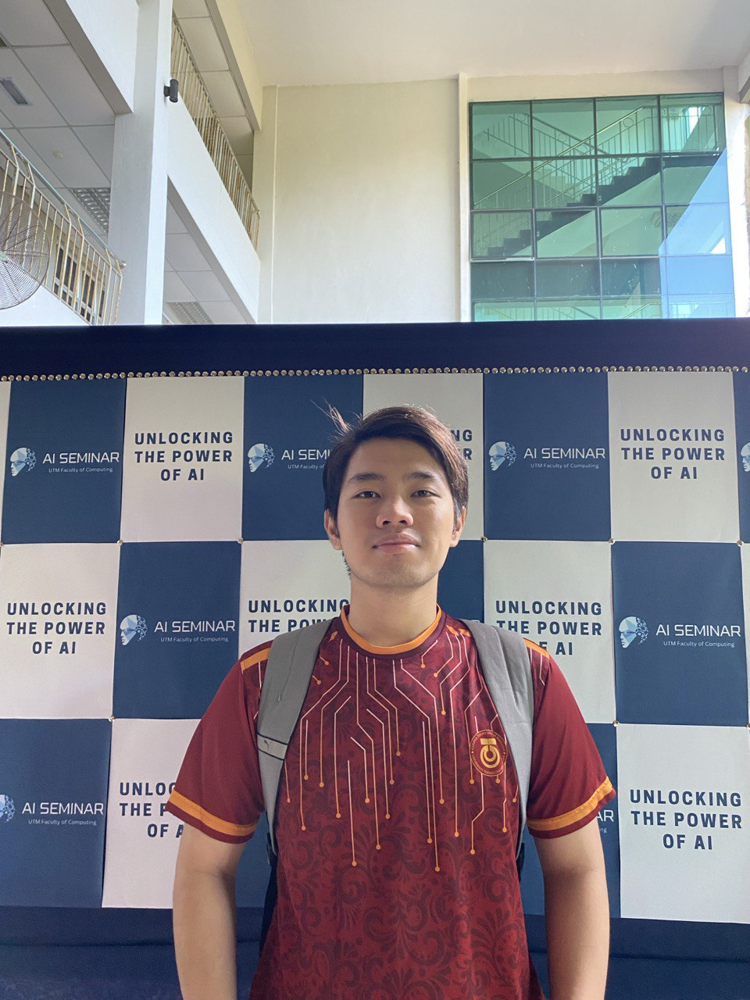

# Ikmal Bin Khairulezuan
Introduction about Myself

  
  
  
  

    
  <h1>
  Hey there, I'm Ikmal. Nice to meet you! 👋
  
</h1>
  <h4 align="center">Committed to life long learning</h4>

#### :woman_technologist: About Me
Assalamualaikum and hello everyone!

My name is Ikmal Bin Khairulezuan and I'm 21 years old. I live in Taman Peringgit Permai, Melaka. I'm a third-year student at Universiti Teknologi Malaysia taking a Bachelor of Computer Science (Data Engineering) With Honours. Before entering UTM to continue my degree, I studied at UTMSPACE taking a foundation in social science for 1 year. My previous secondary school was MRSM Alor Gajah and my primary school was SK Peringgit, Melaka.

My achievements are I obtained 5A in UPSR, 6A 2B 1C in PT3 and SPM, and obtained a CGPA of 3.55 in my foundation.

My motto in life is "There is nothing impossible without effort". I believe in my motto because the person who has effort works hard, and is willing to sacrifice to achieve something I am pretty sure the person will succeed and live happily in their life.

---

#### :computer: Projects
- [Intellect Playschool Website (WBL Project)](https://github.com/Ikkha02/Intellect-Playschool-Website)
- [Mini Project PKU UTM System](https://github.com/Ikkha02/Mini-Project-PKU-UTM-System/tree/main)
- [Car Booking System](https://github.com/Ikkha02/Car-Booking-System)

---

#### 🏆Licences & Certifications
- 🎖[AWS Academy Graduate - AWS Academy Cloud Foundations](https://www.credly.com/badges/5bfd9e7a-97a0-4b69-b8b6-76452250edde/public_url)
- 🎖[Microsoft Certified: Azure Data Fundamentals](https://www.credly.com/badges/2ebc5303-2180-4e2d-b655-d05df8c85762/public_url)

---

#### 🛠 Languages and Tools

### Data Science

### Languages

---

#### 📊 My GitHub Statistics

<h3 align="center">A passionate frontend developer from India</h3>

<h3 align="left">Connect with me:</h3>

<h3 align="left">Languages and Tools:</h3>

          

&nbsp;

