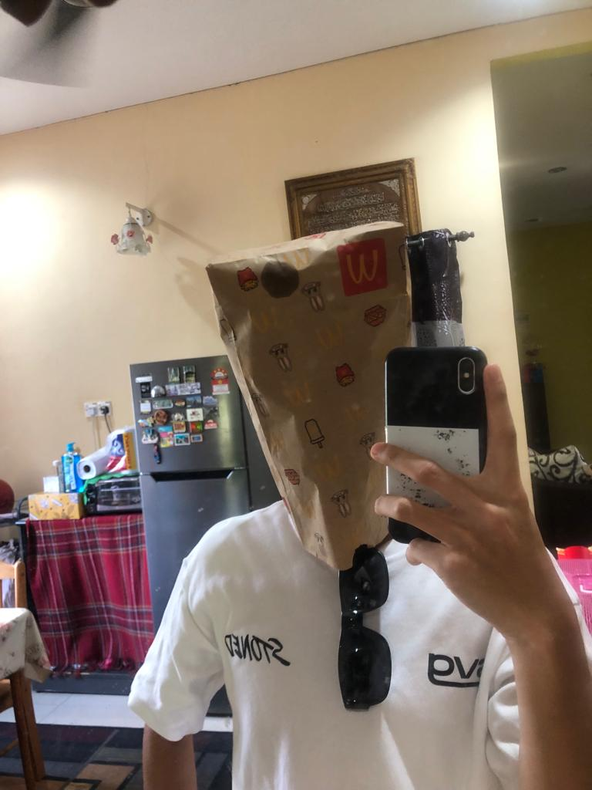

<!-- Intro -->

  

<h3 align="center">
        <samp>&gt; Hey There!, I am
                <b>Farhan Ibrahim</a></b>
        </samp>
</h3>

<!-- social medias -->

 
  

 

<!-- About Section -->
 # About me

 
  
 ✌️ &emsp; Love to writing code and learning new features   
 ❤️ &emsp;Enjoy being around people who are always striving to improve themselves. I like to treat people with respect   
 📧 &emsp;Reach me anytime: farhanibrhim02@gmail.com  

# Use To Code
<h4>Languages</h4>

 

<h4>Front End</h4>

<h4>Databases</h4>

# Projects
<!---->

  

