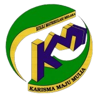

  
  <h1>MUHAMMAD FIKRI BIN SHARUNAZIM</h1>

Data Engineering Enthusiast

---

## 
About Me

I am a third-year student of Universiti Teknologi Malaysia, UTM, Bachelor of Computer Science (Data Engineering). I am very interested in studying and do research about the field of data especially in Big Data. As a university student, I am capable of fast adapt to adjustments and advantage a broader perspective. I am very responsible as a practicum monitor in my previous college and able to manage time wisely. Mostly, I excel in every exams during my school years and college. 

In sports, I am a strong team worker and very good working under pressure and I am really active in hockey and volleyball. Also, I have a vast experience in RnD. I am a detail-orientated individual and I maintain my desires and obligations prepared to preserve productivity.

During free time, I would be enjoy listening to music, jogging, playing badminton and volleyball. My career goal is to become a leader in my organization, helping transform it into an organization that respects all its stakeholders while at the same time being the best son I can be.

  &nbsp;
  &nbsp;
  &nbsp;

---

## 
Education

  

### 
Sekolah Menengah Sains Muzaffar Syah, Melaka

- Cyber Brigade in 2017 until 2019.
- Achieved 8A, 1B+ in SPM.

  

### 
Kolej Matruikulasi Melaka

- Held the position as the Practicum Monitor.
- Become a leader in Computer Science peer study.
- Managed to achieved CGPA 4.0 in both semester.

  

### 
Universiti Teknologi Malaysia, Johor

- Entrepreneurship Exco of Sekretariat Rakan Muda UTMJB in session 2021/2022.
- Technical Exco of Sekretariat Rakan Muda UTMJB in session 2022/2023.
- 3rd year student of Bachelor of Computer Science (Data Engineering).
- Current CGPA 3.92.
---

## 
Skills and Passions

As a well-rounded individual, I believe in the importance of balancing work and play. When I'm not immersed in the world of data science, you can find me pursuing my hobbies, which include listening to music, hiking, and jogging. Not only do these activities help me to manage stress and maintain a healthy lifestyle, but they also allow me to develop valuable skills, such as problem-solving and perseverance.

I am proficient in :
  
 <b> C++</b>
 
 <b> Java</b>
 
 <b> HTML</b>
 
 <b> CSS</b>
 
 <b> BootStrap</b>
 
 <b> MySQL</b>
 
 <b> PHP</b>
 
 <b> AWS</b>
 
 <b> Python</b> 
  

Not only that, I am also capable of using some editing software such as :
  
 <b> Adobe Photoshop</b>
 
 <b> Adobe Illustrator</b>
 
 <b> Adobe Premiere Pro</b>
 
 <b> Canva</b>
 

---

## 
Certifications

- [AWS Academy Graduate - AWS Cloud Foundations](https://www.credly.com/badges/d19f4fed-c43e-4bbd-8c82-122aebb459a0/public_url) 
- [Microsoft Certified - Azure Data Fundamentals](https://www.credly.com/badges/f05dd396-31b0-4674-83f4-b754d4151a4c/public_url)

---

## 
Languages

- English (Proficient)
- Malay (Fluent)

---

## 
Personal Projects

- [Car Booking System](https://fkrshrnzm.000webhostapp.com/index.php)
- [Intellect Playschool Pulai Mutiara, JB](https://intellectplayschool.000webhostapp.com/)

---

## 
References

Available upon request but you can contact via email to:
[MUHAMMAD ADAM FAHMI BIN MOHD TAUFIQ](mailto:adamfahmi.taufiq02@gmail.com)

