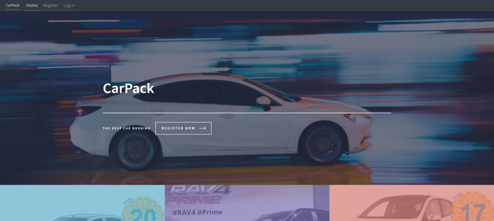

# Your Name
MUHAMMAD HAZIM BIN SALMAN
## About Me

I am a dedicated and driven student currently pursuing a degree in data engineering at Universiti Teknologi Malaysia. My journey in the field of data engineering has not only equipped me with the technical skills and knowledge but has also ignited a deep passion for programming. As a student, I have found great joy in the art of coding, and I am continually exploring new programming languages, 
techniques, and technologies. This enthusiasm stems from the realization that as a data engineer, I have the power to shape and transform the world by harnessing the potential of data

## Skills
# Programming Languages

Feel free to customize this list by adding or removing languages as needed. You can also adjust the icons to better represent the languages or technologies you want to showcase.

## Projects

### Project 1: Car booking System

 

- **Description:** A car booking system is a software solution that enables customers to easily reserve and rent vehicles for a specified period. It provides a user-friendly interface for browsing available cars, checking their availability, and making bookings. Users can typically create accounts, input personal and payment details, and receive pricing information. These systems are commonly used by car rental agencies and car-sharing services, streamlining the process of vehicle rental for both providers and customers.
- **Technologies Used:** 
  - ⚙️ Programming Language: html, css, Javascript, MySql and PHP 
  - 🌐 Web Framework: Xampp
  - 🛢️ Database: Mariadb

### Project 2: Project Name

- **Description:** Briefly describe your project.
- **Technologies Used:** 
  - ⚙️ Programming Language: JavaScript
  - 🌐 Frontend: React
  - 🌐 Backend: Node.js
- **Links:** Provide links to the project, such as GitHub repository or live demo.

## Skills

List your technical and soft skills here:

- 💻 Programming
- 🌐 Web Development
- 📊 Data Analysis
  
## Education

### Universiti Teknologi Malaysia

- 🎓 **Degree:** Data Engineering
- 🖥️ **Faculty:** Faculty of Computing

## Contact

- ✉️ **Email:** hazimsalman123@gmail.com
- 🔗 **LinkedIn:** [Your LinkedIn Profile](https://www.linkedin.com/in/yourprofile)
- 🐱 **GitHub:** [Your GitHub Profile](https://github.com/yourusername)
- 🌐 **Website:** [Your Portfolio Website](https://www.yourportfolio.com)

## Certifications

- 📜 Certification 1
- 📜 Certification 2
- 📜 Certification 3
