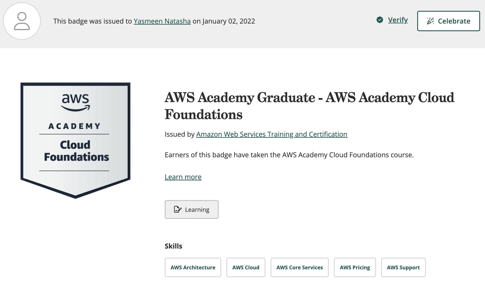

  

 

<h2 align="center">Yasmeen Natasha Hafiz Shahrel</h2>

Greetings, and welcome to my professional portfolio! My name is Yasmeen Natasha Hafiz Shahrel. I am currently a third-year student at Universiti Teknologi Malaysia, pursuing a degree in Bachelor of Computer Science with a specialization in Data Engineering.

 

As an INFJ, I approach my studies and career aspirations with a unique blend of intuition and analytical thinking. My journey into the world of technology began in high school, where I took my first steps in a Computer Science class, and from that moment, I was captivated by the transformative power of these fields. Since then, my passion for this field has grown exponentially, and I aspire to become a Data Scientist, using data-driven insights to bring positive change to the world. 
 

Throughout this portfolio, I invite you to delve into my academic and professional journey, which is fueled by the belief that computer science and data science hold the potential to transform and improve our world. 
 

## Education
- Bachelor of Computer Science (Data Engineering) with Honours, Universiti Teknologi Malaysia
- Kolej Matrikulasi Selangor
- SMK Bukit Jelutong

## Projects
- [Car Booking System](https://yasmeennatashautm.000webhostapp.com/cbs/)
- [Intellect Playschool Management System](https://www.intellectplayschool.com)

## Skills
### Languages and Tools

## Certifications
- AWS Academy Graduate - AWS Academy Cloud Foundations
  
- Microsoft Certified: Azure Data Fundamentals
  

 ## Connect with Me
    
